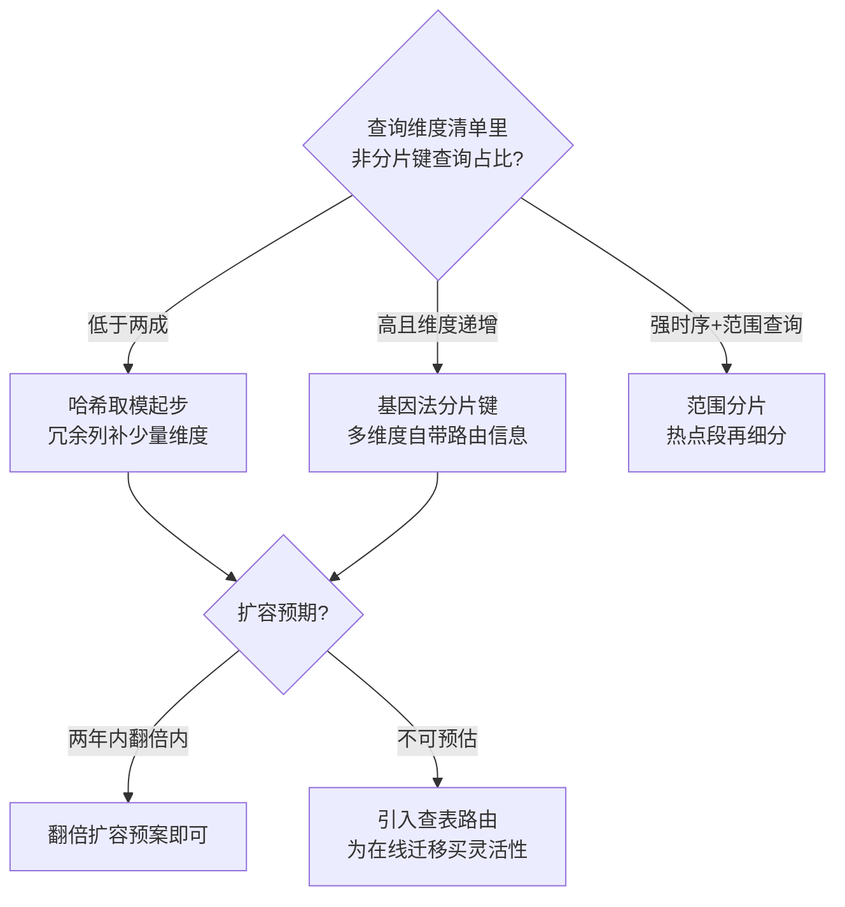
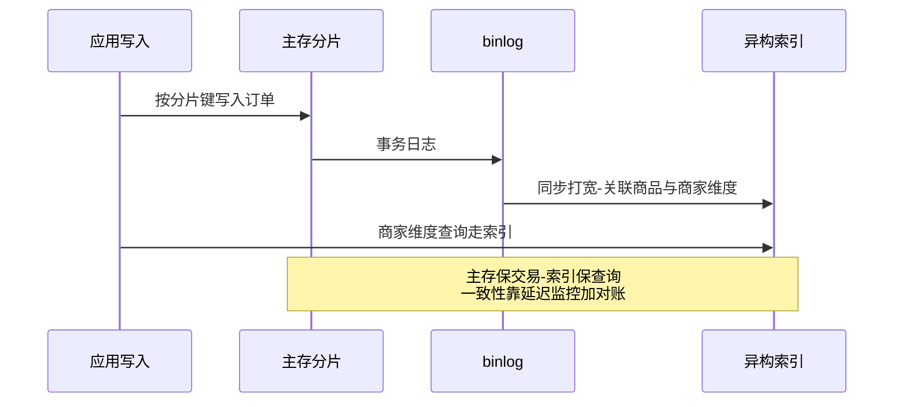

# 分库分表策略深读：分片键、路由算法与扩容路径的定价

> **本文核心**：分库分表的本质不是「把表拆小」，而是一次**数据访问维度的押注**——分片键选定的那一刻，系统就永久地把「按这个维度访问很便宜、按其他维度访问很贵」写进了架构基因。本文拆解分片键的三条判定标准（基数、均匀、业务内聚）、三种路由算法（哈希取模、范围、查表）的实现原理与失效边界、二级查询维度的三种归宿（冗余列、基因法、异构索引），以及翻倍扩容为什么是哈希取模的唯一体面退出路径。**机制链**：数据画像（容量预估/读写比/查询维度清单）→ 分片键押注 → 路由算法分派写路径 → 二级维度查询旁路化（异构同步）→ 扩容预案（翻倍迁移+双写切换）→ 一致性兜底（对账）。

## 一句话摘要

「要不要分库分表」是容量问题，「分片键选什么」是架构问题——前者算得出来，后者押注进去就改不动。十个库以内大多数团队真正的瓶颈是写 IOPS 与连接数而不是存储；分片键押错维度后，每一个新查询维度都要用一次异构同步链路来赎回。**分片方案的全部难度不在拆，而在拆完之后的「非分片键查询」与「扩容」两件事**——本篇把这两件事的机制拆到参数与时间线级。

## 前置阅读

- 入门层篇 4《数据层设计：分库分表与缓存》（心智模型）
- 本仓库分布式 ID 系列（分片基因与全局 ID 的关系）
- 本仓库中间件域 Redis 系列（缓存与分片的分工边界）

## 目标导向

本文是什么：分库分表从策略到落地路径的机制深读。功能：掌握分片键判定、路由算法选型、二级查询维度处理、扩容迁移的完整决策链。收益：在容量评审与数据架构设计里给出可辩护的方案，预判拆完之后每个季度的痛点。必看场景：单库水位告警后的扩容评审、新业务线数据架构设计、分库分表迁移方案评审。

## 一、先把问题定准：分库分表解决什么、不解决什么

抽象谈「数据量大所以要拆」容易拆错方向。分库分表精确解决三个瓶颈：**写瓶颈**（单库写 IOPS 与事务排队，通常在每秒数万写入量级先到顶，行业认知）、**连接瓶颈**（应用实例数 × 连接池超过数据库 max_connections）、**存储瓶颈**（单表行数过大导致 B+ 树层高上升、DDL 变更超时、备份恢复窗口失控——单表 5000 万行上下是常见的经验红线，行业认知）。它**不解决**三件事：复杂 JOIN（拆完更糟）、跨片事务（需要另外的机制，互指本仓库 distributed-transaction 系列）、非分片键查询（需要异构索引或冗余）。

**动手前先做一个检查**：很多「该不该拆」的争论，本质是读写分离、缓存、归档这三件更便宜的事没做干净。10 万级日订单量的系统，一主两从加 Redis 热点缓存通常还能撑很久；约束来源是写 IOPS 与单表 DDL 锁表时间，而不是磁盘容量——磁盘永远是性价比最高的扩容手段。这一档的核心问题是「拆了之后回不来得来」，而不是「怎么拆」——拆分引入的运维复杂度是永久税，收益必须能覆盖。

### 量级三档：约束来源、核心问题与思考方式

- **十万级（日订单或日活量级）**：约束来源是单库连接数与热点行竞争，不是存储。这一档的核心问题是「把便宜的扩展手段用尽」，而不是「选哪种分片算法」——读写分离、缓存、归档三件套通常还有一倍以上余量。思考方式：**水位驱动**——盯连接池使用率、慢查询与 DDL 时长三条水位线，水位不越线不谈拆分。
- **百万级**：约束来源转移为单库写 IOPS 与单表行数（DDL 进小时级、B+ 树层高抬升）。这一档的核心问题是「分片键押在哪个查询维度」，而不是「拆多少片」——押错维度的赎回成本远高于多拆两片的成本。思考方式：**清单驱动**——查询维度清单定分片键，占比数字写进方案评审。
- **千万级到亿级**：约束来源变为变更速度与数据正确性（迁移窗口、跨片一致性、对账覆盖率）。这一档的核心问题是「退出路径与一致性预算」，而不是「单次容量数字」——扩容预案、双写校验、分层对账决定系统能不能安全长大。思考方式：**预算驱动**——一致性预算按数据类别分配（交易强一致、异构秒级、归档最终一致），预算表随架构方案一起评审。

自下而上看，每一档的约束来源都从「资源水位」向「决策正确性」上移：量级越小越靠工具与参数，量级越大越靠押注与预案。触发升级的信号同样是行为性的——连接水位越线升档到清单驱动，DDL 超时升档到预算驱动；跳档硬上（十万级直接上查表路由）是把第三档的复杂度税提前交给了第一档的业务。

## 5W 速记卡

| 维度 | 一句话 |
|---|---|
| What | 按分片键把数据水平拆到多库多表的路由与扩容机制 |
| Why | 单库写 IOPS、连接数、单表行数三瓶颈先于磁盘容量到达 |
| When | 写入量级与单表行数越过经验红线、DDL 已开始超时 |
| Where | 数据访问层（路由引擎）+ 存储层（多实例）+ 同步链路（异构索引） |
| How | 分片键押注 → 路由算法 → 二级维度旁路 → 翻倍扩容 → 对账兜底 |

## 二、分片键：一次押注，终身负责

分片键的判定标准有三条，优先级从高到低：**业务内聚**（绝大多数高频读写都带这个维度——订单系统的买家 ID、IM 系统的会话 ID）、**均匀性**（取值分布不倾斜，哈希后不产生数据倾斜）、**基数**（取值空间足够大，能支撑未来分片数——按「性别」分片这种玩笑背后是真实的基数教训）。三条全满足的分片键很少见，工程上几乎总在「业务内聚但轻度倾斜」与「绝对均匀但业务无关」之间做权衡。

**生产实践里最有效的工具是查询维度清单**：把系统所有 SQL 按「WHERE 条件里有没有候选分片键」分组统计频次。没有分片键的查询频次决定了你未来要建多少条异构同步链路——这个清单在方案评审时的说服力远超任何架构图。业内惯例是把「分片键查询占比」作为一个明确数字写进方案（通常要求 80% 以上，行业认知），剩下的 20% 逐条给出归宿：冗余列、基因法或异构索引。

### 路由算法三种：哈希、范围、查表

| 维度 | 哈希取模 | 范围分片 | 查表路由 |
|---|---|---|---|
| 均匀性 | 好（键分布均匀时） | 差（热点时间段倾斜） | 取决于映射表设计 |
| 范围查询 | 不支持（全片散列） | 天然支持 | 看映射粒度 |
| 扩容 | 需重哈希（翻倍法缓解） | 加段即可，不迁移历史 | 改映射即可，可细粒度迁移 |
| 依赖 | 无 | 无 | 映射服务/缓存自身的高可用 |

哈希取模是默认起点：实现零依赖、路由 O(1)、数据天然均匀，代价是**范围查询全片散射**与**扩容必须重哈希**。范围分片适合时序特征强、查询带时间范围的数据（日志、账单），代价是写入热点永远打在最新分片上——需要靠「热点分片单独拆细」来对冲。查表路由（映射表/路由服务）灵活性最高，可以做到细粒度迁移与灰度，代价是路由查询自身成为关键路径——生产中通常用「本地缓存映射+变更广播」把路由查询成本摊薄到近零，但映射缓存的一致性成为新的排障维度。

### 基因法：把多个查询维度烧进 ID

基因法是生产实践中处理「多查询维度」最优雅的一招：生成全局 ID 时，把买家 ID 的哈希低位「烧进」订单 ID 的固定位段——订单 ID 本身既是全局唯一 ID（互指分布式 ID 系列雪花算法），又自带分片路由信息。按订单 ID 查询直接路由；按买家 ID 查询时，提取买家 ID 哈希的同一位段路由到同一分片——**前提是下单时把买家维度数据落在同一个分片**（一单两记录或冗余买家 ID 列）。它的边界也要说清：基因只能烧进**有限个维度**（位段就那么多），且事后不可追加——「下单时哪些维度查询频率最高」的预判错误，基因法救不回来。

二级查询维度的归宿里，异构索引（binlog → 搜索引擎/宽表）是终局形态：主存只服务交易路径，所有复杂维度查询走异构副本——一致性预算从「强一致」降级为「秒级窗口 + 对账兜底」，互指本仓库 MySQL 域 binlog 与数据同步主题。冗余列（订单表冗余商家 ID 分片键）适合「多对一」且维度少的场景，成本是写放大与更新一致性问题。

## 三、扩容：从第一天就要想好的退出路径

哈希取模的扩容是所有方案里最痛的——`hash(key) % N` 变成 `% 2N` 后，恰好一半数据要迁移。**翻倍扩容**是它的体面解法：每次扩容把分片数翻倍，每个老分片的数据恰好一半留在原地、一半迁去新分片，迁移可以按「老分片」为单位串行进行，不需要全量重哈希。业内惯例是初期就按「翻倍友好」的形态部署（4 库起跳而不是 3 库），并让分片数保持 2 的幂。

在线迁移的完整步骤（前置：磁盘与带宽余量确认、迁移工具演练、回退脚本就绪）：第一步开双写（老分片为主、新分片为辅，写失败只告警不阻断）；第二步存量迁移按分片为单位推进，每片迁完做行数与抽样字段校验；第三步数据校验通过后读流量切新配置（配置中心灰度推送，互指服务治理配置中心系列）；第四步观察期后下线老写入。**每一步都有回退**：双写期回退=关掉新写，读切后回退=读切回老配置——回退窗口在读切换后的观察期内仍然开着，这是迁移方案的安全垫。命令级细节与对账脚本属于专题层《数据迁移与不停机切换》的范畴（同目录互指），本篇聚焦机制。

翻倍扩容之外的路线也值得对比：查表路由方案可以「按用户粒度在线迁移」（逐 key 搬迁+路由表原子切换），迁移对业务完全透明，代价是路由层的前期建设——**这是灵活性期权，用前期复杂度买后期迁移的从容**。云厂商托管分片方案（分布式数据库）把扩容做成产品能力，代价是引擎锁定与成本模型变化，选型对比在整合层展开（互指整合层）。

## 四、典型场景与误区

**典型场景**：订单与交易类流水表（买家 ID 哈希分片+商家维度异构索引）；用户与账号体系（user_id 分片，天然内聚）；消息与 IM 记录（会话 ID 分片，会话内时序用 ID 单调性保证）；账单与日志（时间范围分片+冷热分层归档）。

**常见误区**：① **「先拆表后拆库」**——拆表只解决单表行数，写 IOPS 与连接数瓶颈原样保留，二次改造成本翻倍；② **「分片键用自增 ID 取模」**——全局自增在分布式下不存在（互指分布式 ID 系列），且自增天然时序集中，写入热点打在最新分片；③ **「跨片查询以后再说」**——没有查询维度清单就拍板分片键，上线后每个新报表需求都变成一次全片扫描，慢查询在几十个分片上同时发生；④ **「扩容到时候再说」**——哈希取模下非翻倍扩容意味着全量重哈希+停写，第一次扩容就把团队逼到墙角；⑤ **「分库分表=高可用」**——分片是性能手段不是可用性手段，任何一片宕机该片数据不可写，容灾要另外设计（互指 stability 系列容灾主题）。

## 五、事故与实践叙事

**事故一：骑跨查询拖垮全部分片**。某团队订单表按订单 ID 哈希分片十六库，上线三个月后运营侧一个「按商品维度导出」的报表需求直接打到主存——没有分片键的查询在十六个库上同时全表扫描，数据库 CPU 集体打满，交易主链路 P99 从 20ms 抬到 2 秒，持续近半小时。复盘的动作不是「禁止报表」而是**建查询准入机制**：任何上库的 SQL 必须带分片键或走异构索引，数据库网关侧加 no-index 扫描告警。教训：分片后的主存是「单车道高速公路」，任何无分片键查询都是逆行——**准入机制必须比自觉可靠**。

**事故二：翻倍扩容时双写撕开了延迟缺口**。某团队执行四库翻八库，双写阶段新分片写入偶发超时被静默重试，导致部分订单在新库缺失；读切换后部分用户「订单不见了」——实际是读到了只有部分数据的新库。复盘发现双写的从侧失败没有补偿队列，且读切换前的校验只对了行数没对抽样字段。修复：双写从侧失败进补偿队列重放、校验升级为「行数+金额聚合+随机千条字段级抽样」三层。教训：**双写的语义是「最终一致」而不是「同步成功」——从侧失败路径必须设计，校验必须覆盖内容而不仅是数量**。

## 六、设计思想：数据架构是查询维度的经济学

把分库分表还原到本质，是一次**查询维度的经济学决策**：每个查询维度都有一个「访问成本」，分片键维度的成本被压到最低，其余维度要么用冗余（写时多付一次）、要么用异构（读时多等一秒）、要么全片散射（每次都付全价）。架构师真正在做的，是给每个维度「定价格」并让业务方签字确认——这份「价格表」（查询维度清单+各自归宿）比任何架构图都更能预测系统未来的痛苦分布。这一思想与缓存体系同构（互指本系列篇 2）：热 key 的访问成本被缓存摊薄，冷数据的成本由主存承担——**整个数据架构就是一张不断重定价的成本表**。

## 七、追问链

**质疑者第一层**：既然分片这么麻烦，为什么不直接用分布式数据库/云托管方案？——答案是「代价形态不同」：中间件分片方案（ShardingSphere 一类）的代价是**应用侧复杂度**（路由配置、跨片查询治理、扩容自建），分布式数据库的代价是**引擎锁定与单位成本**（行业认知：同等容量下通常高于自建 MySQL）。10 万到千万级写入区间，自建分片的总拥有成本通常占优；亿级以上或团队运维力量不足时，托管方案的定价开始合理——这不是技术优劣问题，是成本曲线交点问题。

**质疑者第二层**：为什么翻倍扩容是「一半迁移」而不是更多？——数学根源在模运算：`hash(k) % 2N` 的结果恰好由 `hash(k) % N` 与哈希值的第 log2(N) 位共同决定，老分片 i 的数据只会去新分片 i 或 i+N——**每个老分片恰好一分为二**，迁移可以按片并行、可断点续传。非 2 倍扩容（比如 4 库变 6 库）打破这个性质，全部数据重新洗牌。这也是「分片数保持 2 的幂」这条惯例的数学出处。

**质疑者第三层**：分片基因烧进 ID 后，如果未来要换分片键或调整位段怎么办？——基因法的位段是「编译期决定」的，改位段=新旧 ID 路由规则共存期，需要路由层兼容双规则（按 ID 生成时间戳分段判定规则版本）。这正是查表路由复兴的原因之一：**基因法省下的路由查询成本，要在「规则变更灵活性」上部分还回去**。大规模长生命周期系统倾向于「基因法+轻量查表兜底」的混合形态。

## 八、你们可能会问

**Q1：单表多少行该拆？**
经验红线在 5000 万行上下（行业认知），但更准的信号是行为信号：DDL 变更时长是否已进小时级、B+ 树是否已到四层（点查延迟开始抬升）、备份恢复窗口是否不可接受。行数只是代理指标，**行为信号才是决策依据**。

**Q2：分库和分表要一起做吗？**
分表解决单表行数（DDL、B+ 树层高），分库解决写 IOPS 与连接数。写入瓶颈未到的系统可以先分表缓解放大；但规划分片键时必须按「最终库数」设计，避免二次路由改造——**一步规划、分步实施**。

**Q3：跨片分页怎么处理？**
按分片键切片的分页天然高效；非分片键维度的分页走异构索引。禁止的形态是「各片 LIMIT N 内存归并」——深页码时每个分片都要扫描 offset+N 行，页码越深成本越爆炸，业内惯例是禁用深跳页、改游标翻页（上次末尾 ID 定位）。

**Q4：对账怎么做才不流于形式？**
分层对账：实时层对关键聚合（每分钟订单数与金额哈希比对）、日切层对全量行数与金额汇总、抽样层对随机明细字段。**对账的价值在差错的根因分类**——是同步延迟（可自愈）还是丢数据（要修复），把两类分开告警，否则告警疲劳后真差错被淹没。

## 💡 实战提示

- 💡 决策口径：写 IOPS/连接数/DDL 时长任一越线才启动拆分——磁盘容量永远不是理由
- 💡 查询维度清单是分片方案的第一交付物，占比 80% 以上走分片键是行业认知的及格线
- 💡 分片数保持 2 的幂、初期 4 库起跳——为翻倍扩容预留数学性质
- 💡 每个非分片键查询维度都要有明码标价的归宿：冗余列（写放大）/基因法（预判风险）/异构索引（秒级延迟）

## 九、自测三问

1. 分片键三条判定标准的优先级？（答：业务内聚 > 均匀性 > 基数——内聚决定查询成本，均匀决定数据分布，基数决定可扩展上限）
2. 翻倍扩容为什么每片只迁一半？（答：模运算性质，`hash(k) % 2N` 只能落在老分片 i 或 i+N，数学上恰好一分为二，可按片并行迁移）
3. 双写迁移期从侧写失败怎么办？（答：进补偿队列重放而非静默丢弃，读切换前做行数+聚合+抽样三层校验——双写语义是最终一致）

## 十、开放问题

- HTAP 引擎（同一引擎内行列混合存储）会不会让「主存+异构索引」的形态过时——检索与分析回到主存的路径仍在演进，公开报道显示多家引擎在推进，落地成本与规模上限尚无定论。
- 分片键的「自动推荐」——基于查询日志自动挖掘分片键候选与代价模拟，工具化程度仍处于早期。

## 📎 核心带走

- **核心一句话**：分库分表是查询维度的经济学押注——分片键选定即定价完成，非分片键维度按冗余/基因/异构三档明码标价，扩容靠翻倍性质保住数学体面
- **机制链**：数据画像 → 查询维度清单 → 分片键押注 → 路由算法（哈希/范围/查表）→ 二级维度旁路化 → 双写迁移翻倍扩容 → 分层对账兜底
- **失效点/边界**：分片键押错维度只能靠异构链路赎回；跨片事务与跨片查询是拆分的固有税；双写迁移的从侧失败路径必须设计；分片是性能手段不是可用性手段

## 📌 数据与事实声明

- 写于 2026-09-23，容量红线与占比数字为行业认知量级（如单表 5000 万行、分片键查询占比 80%），落地以实测与压测为准
- 免责：中间件与分布式数据库的行为细节以官方文档与所用版本为准

## 📚 参考资料

| 类型 | 标题 | 来源 |
|---|---|---|
| 原理书 | 《数据密集型应用系统设计》DDIA 第 6 章（分区） | 公开出版 |
| 官方文档 | ShardingSphere 内核剖析（路由引擎） | shardingsphere.apache.org |
| 关联文章 | 本仓库分布式 ID 系列、MySQL 域 binlog 主题、distributed-transaction 系列、同系列篇 2 缓存架构 | 本仓库 |
