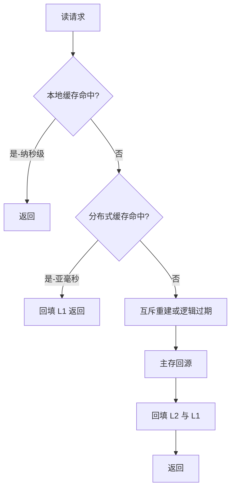
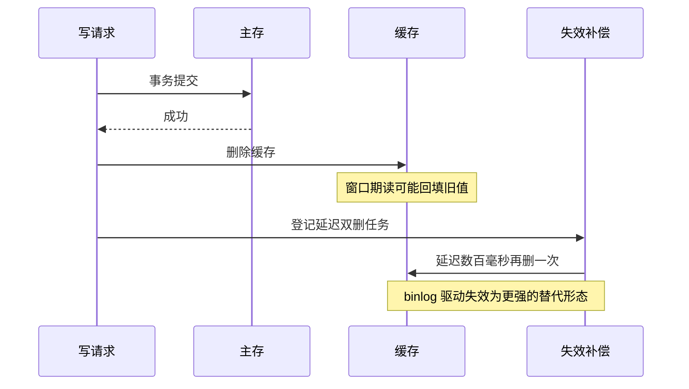
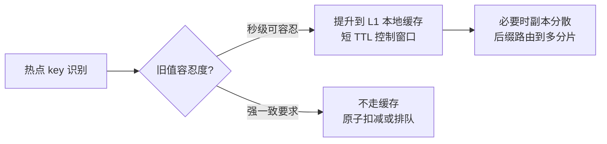

# 缓存架构深读：多级层次、一致性与热点击穿的实现原理

> **本文核心**：缓存架构的本质是给「每单位读流量的成本」重新定价——本地缓存把价格压到纳秒但受容量与一致性约束，分布式缓存把价格压到亚毫秒但引入网络与击穿风险，主存是全价但保证正确。本文拆解多级缓存的层次分派（进程内/分布式/只读视图）、缓存一致性的失效语义（先更库后删缓存为什么是行业收敛点、延迟双删的适用边界）、三大击穿问题（缓存穿透/击穿/雪崩）的机制差异与防御组合，以及热点 key 的本地化路径。**机制链**：读请求 → 多级命中判定（本地/分布式/主存）→ 未命中回源与回填 → 写路径失效（更库+删缓存+补偿）→ 异常流防御（穿透/击穿/雪崩分型防御）→ 热点识别与本地化 → 命中率与一致性监控闭环。

## 一句话摘要

缓存三问的正确打开顺序是「先问缓存什么（数据画像定层级）、再问失效怎么办（一致性语义定写路径）、最后问坏了怎么办（击穿分型定防御）」——大多数缓存事故的根因不是参数不对，而是把三类不同活性的数据塞进了同一层缓存、用同一套 TTL 管理。**命中率是收益指标，一致性窗口是风险指标，两者必须分别记账**：10 万级读量一把分布式缓存通常够用，百万级起本地缓存与热点治理成为必选项，亿级读流量的缓存架构就是一层独立的数据访问系统。

## 前置阅读

- 入门层篇 4《数据层设计：分库分表与缓存》（心智模型）
- 本仓库中间件域 Redis 系列（数据结构与集群机制）
- 同系列篇 1《分库分表策略》（一致性预算分派）

## 目标导向

本文是什么：从层次设计到失效语义的缓存机制深读。功能：掌握多级缓存分派、一致性写路径、击穿三型防御、热点治理的完整决策链。收益：缓存方案评审中给出可辩护的层次与参数，事故复盘时把现象映射回机制。必看场景：缓存层设计评审、大促前缓存容量与热点演练、命中率异常与一致性投诉排查。

## 一、先定层次：缓存放哪一层不是性能偏好，是数据画像

缓存的层次分派由三个画像维度决定：**活性**（数据多久变一次——商品详情小时级、库存秒级、余额实时）、**共享度**（全站共享的热点还是用户维度的私有数据）、**容量**（工作集多大，能不能塞进进程内存）。三个维度的组合直接给出分派结论：高共享+低活性+小工作集 → 进程内本地缓存的理想候选；高共享+中活性 → 分布式缓存；私有数据 → 按容量决定本地化或分布式。

这一档的分析要先做——**约束来源是网络 RTT 与序列化成本，而不是 Redis 不够快**：一次分布式缓存读的成本（网络往返+序列化，亚毫秒到毫秒级）与一次进程内读（纳秒到微秒级）差两到三个数量级，量级上去了这个差值就是真实的成本线。这一档的核心问题是「哪些数据值得多付一次网络往返也要拿旧值的风险」，而不是「缓存服务器配多大」——把活性数据排除出缓存候选清单，比任何调参都有效。思考方式：**画像驱动**——活性×共享度×容量三维打分，分数决定层级。

## 5W 速记卡

| 维度 | 一句话 |
|---|---|
| What | 本地/分布式/主存三层缓存的分派、失效与防御机制 |
| Why | 每层缓存在延迟、容量、一致性上各有定价，混用不分层是事故之源 |
| When | 读多写少、主存读压力先行越线、热点查询延迟需压进毫秒内 |
| Where | 数据访问层（多级读路径）+ 写路径（失效语义）+ 同步链路（只读视图） |
| How | 画像分派 → 多级命中 → 回源回填 → 失效补偿 → 击穿分型防御 → 热点本地化 |

## 二、多级缓存的读路径与写路径

读路径的关键路径在「逐级命中判定 + 未命中防击穿」：进程内缓存（L1，容量小、延迟纳秒级、带短 TTL 或版本号防陈旧）→ 分布式缓存（L2，Redis 一类，容量大、亚毫秒）→ 主存回源（DB，全价）。L1 与 L2 的分工不是重复而是**兜底分工**：L1 挡热点（同一 key 每秒上万次的读不必每次走网络），L2 挡全量（工作集放不下进程内存）。业内惯例是 L1 用极短 TTL（秒级）或订阅失效广播，把陈旧窗口压到业务可接受——**L1 的每一纳秒收益，都要拿一致性窗口来换**。

写路径的一致性语义是缓存架构的争议核心，收敛到一句机制描述：**先更新主存、再删除缓存**（Cache Aside 的标准形态）。为什么是「删」而不是「更」——并发写时两个更新乱序到达缓存，后写覆盖先写会让缓存停留在旧值；删除则把缓存状态收敛为「下次读时重建」，重建取的是主存当时的值，天然幂等。为什么「先库后缓存」——先删缓存的话，删除与主存提交之间夹进的读请求会把旧值重新填回缓存。这条路径留下的**不一致窗口 = 主存提交到缓存删除之间的延迟 + 并发读的回填竞态**，通常毫秒到百毫秒级，多数业务可接受。

竞态残留窗口的处理有两档手段：**延迟双删**（写后异步延迟再删一次，覆盖「读请求在旧值时代拿到锁、写完成后才回填」的竞态），适合读多写少且对窗口敏感的数据；**订阅 binlog 的缓存失效**（缓存删除由 binlog 订阅驱动，把删除与主存变更强关联，互指 MySQL 域 binlog 主题），适合一致性要求更高或写路径分散的系统。两档的取舍是「补偿的及时性」与「链路复杂度」——延迟双删自包含但延迟值靠经验拍（几百毫秒起），binlog 驱动精准但引入订阅链路的运维成本。

## 三、击穿三型：穿透、击穿、雪崩的机制分型

三个词常被混用，机制上是三种不同的故障：**穿透**（查询的数据在主存也不存在，每次都打穿到 DB——恶意扫描或脏数据）、**击穿**（单个热 key 过期瞬间，并发读同时回源）、**雪崩**（大批 key 同时过期或缓存集群故障，读流量整体砸向主存）。分型的意义在于防御手段完全不同：

| 类型 | 机制根源 | 防御组合 | 参数要点（行业认知量级） |
|---|---|---|---|
| 穿透 | 空结果不缓存 | 空值缓存（短 TTL）/布隆过滤器前置 | 空 TTL 数十秒；布隆误判率 1% 级 |
| 击穿 | 热 key 过期瞬间并发回源 | 互斥重建（单飞）/逻辑过期不删除 | 单飞超时百毫秒级；逻辑过期异步刷新 |
| 雪崩 | 批量同时失效/集群故障 | TTL 加随机抖动/多级兜底/集群高可用 | 抖动幅度为 TTL 的一成上下 |

穿透的深层防御是**布隆过滤器**：把「存在的 key」预先装入位数组，查询先过过滤器，判定不存在就直接返回——代价是误判率与重建成本（删除不支持，需定期重建或用计数变体）。击穿的「逻辑过期」变体值得展开：key 物理上不过期，值里带逻辑过期时间，读到逻辑过期数据的第一个线程负责异步重建、其余线程继续用旧值——**用「短暂的旧值」换「零回源并发」，一致性窗口换可用性的一笔标准交易**。雪崩的随机抖动是给批量预热的 key 错峰，集群级雪崩则靠「主存侧限流+降级读」兜底（互指 stability 系列限流降级主题）——缓存集群不是可用性依据，是延迟优化手段，这句话在容量评审时要重复。

## 四、热点 key：识别与本地化

热点是分布式缓存的特有风险：容量按 key 均匀分片，但访问不均匀——单个超级热点可以把一个分片的网卡或 CPU 打满，整个分片上的其他 key 连带遭殃（分片级邻座故障）。热点的完整治理链是「识别 → 本地化 → 分散」：识别靠客户端埋点与 Redis 的热点探测（公开方案含客户端统计上报与代理层采样两类）；本地化是把热点 key 提升到 L1 进程内缓存（短 TTL 控制陈旧窗口）；分散是把热点 key 加随机后缀复制成多个副本摊到不同分片（写时双写全部副本，读时随机选一）。

这一档的约束来源是**单分片网卡与 CPU 的物理上限**——横向扩容集群对超级热点无效，因为热点不因集群变大而分散。这一档的核心问题是「这个热点能容忍多旧的值」，而不是「再加多少节点」——商品详情容忍秒级旧值就能本地化，秒杀库存不能容忍就必须走另一条路（库存扣减前置到本地原子计数或排队，互指专题层大流量治理与 Redis 系列）。思考方式：**活性定价驱动**——热点的旧值容忍度决定它是缓存问题还是一致性协议问题。

把量级轴补全：**百万级读量**的约束来源是回源放大比（未命中一次的代价乘以回源并发），这一档的核心问题是「失效瞬间的并发控制」，而不是「再加缓存节点」；**千万级到亿级读量**的约束来源是一致性窗口与热点的叠加——失效补偿、热点本地化、降级预案三件事共同决定上限。这一档的核心问题是「缓存层作为独立系统的自治能力」，而不是「命中率数字」——监控、预案、演练成为一等公民。思考方式随之从**参数驱动**升级为**预案驱动**。

## 五、典型场景与误区

**典型场景**：商品与配置类读多写少数据（L1+L2 两级，短 TTL）；用户维度私有数据（会话、画像，按容量选本地或分布式）；计数与榜单（Redis 原生计数结构，定时落库）；只读视图类（搜索索引前置、结果页缓存，互指同系列篇 1 异构索引）。

**常见误区**：① **「缓存命中率越高越好」**——为压命中率把低活性判断漏掉，把频繁变更的数据也缓存，一致性投诉来了才回改；② **「先删缓存再更库更安全」**——回填竞态窗口更大，旧值存活时间不可控；③ **「TTL 统一配一个值方便管理」**——批量加载的 key 同时到期，雪崩参数自己配出来的；④ **「Redis 集群抗得住热点」**——集群扩容不分散热点，邻座 key 连带遭殃；⑤ **「缓存挂了主存能扛」**——缓存是延迟优化不是容量手段，缓存全灭时主存往往只有一成余量（行业认知），**缓存降级预案必须提前演练**而不是出事时指望主存硬扛。

## 六、事故与实践叙事

**事故一：统一 TTL 的定时批量预热引发雪崩**。某团队每晚定时全量预热次日商品缓存，TTL 统一配 24 小时——某晚预热任务延迟两小时后照常执行，次日同两小时窗口内全量 key 同时到期，凌晨读流量整体回源，主存连接池打满，商品页批量超时。复盘三动作：TTL 加随机抖动打散到期、预热改分批错峰、主存侧加读限流兜底。教训：**雪崩参数常常是「整齐划一的管理美学」配出来的——到期时间分布是容量参数，不是整洁参数**。

**事故二：延迟双删的延迟值拍小了**。某团队对商品价格数据用延迟双删，延迟配 200ms——大促期间读并发抬升后，回填竞态窗口被拉长（读请求在旧值时代进入、主存提交后才完成回填），部分用户看到旧价格下单，资损口径的客诉出现。复盘把价格类数据的缓存策略降级处理：价格不进 L1、L2 改为 binlog 驱动失效、下单时主存二次校验。教训：**一致性手段要按数据活性分档——双删是统计意义上的补偿，不是承诺；资损敏感数据要么出缓存要么加主存终审**。

## 七、设计思想：缓存是一致性的期权市场

把多级缓存抽象到底，是一致性的期权交易：每次命中都在兑现「用旧值的权利」，TTL 是期权期限，失效删除是行权——**命中率与一致性窗口是同一笔交易的两端，永远一起报价**。多级结构不过是把这份交易按「活性容忍度」分层：L1 卖短期期权（纳秒换秒级旧值），L2 卖中期期权（亚毫秒换分钟级窗口），主存不卖期权（全价买强一致）。架构师的工作是把数据按活性分档，让每一档数据在正确的市场交易——把秒杀库存放进期权市场（缓存），或者把商品详情按实时价格交易（直连主存），都是定价错误。这套视角同样解释了为什么「缓存挂了系统必须还能活着」：期权的对手方（主存）必须保有独立履约能力，哪怕履约得很慢。

## 八、追问链

**质疑者第一层**：为什么不用「更新缓存」代替「删除缓存」省一次回源？——除了并发乱序问题，还有**写路径分离**的深层原因：更新缓存的值需要应用层「算出」完整缓存值，而缓存值往往是多表聚合的结果——写路径被迫知道读路径的组装逻辑，两套代码互相锁死；删除把组装逻辑留在读路径单侧，读写彻底解耦。省下的一次回源，代价是读写耦合的永久税。

**质疑者第二层**：逻辑过期让所有读都拿旧值，什么时候不能接受？——判据是「旧值的最坏伤害 × 发生概率」：商品详情展示旧一分钟伤害近零（可接受）；库存余量展示旧一分钟导致超卖（不可接受）。灰区数据（价格）的做法不是调参数而是**改变数据身份**——展示价走缓存、成交价走主存校验，同一份数据按用途拆成两个一致性档位。这比「给缓存加更强的失效」便宜得多。

**质疑者第三层**：多级缓存的一致性广播（L1 失效订阅）在大规模下还撑得住吗？——广播的扇出成本随应用实例数线性增长（万级实例 × 每秒变更数），公开报道的实践是把广播从「精确失效」降级为「版本号推送」（实例收到版本变更后本地批量刷新或直接清空），或者干脆依赖 L1 短 TTL 的自然收敛、不做主动广播——万级实例规模下，「短 TTL 被动过期」的简单性往往赢过「精确广播」的工程复杂度。

## 九、你们可能会问

**Q1：命中率多少算正常？**
没有普适数字，按读模式分：热点集中的场景（商品、配置）95% 以上是合理预期（行业认知）；长尾分布的场景（个性化推荐）八成上下也正常。更该盯的是**命中率突变**——掉五个点就是一次真实的流量结构变化或失效配置事故。

**Q2：L1 本地缓存的容量给多大？**
按进程内存预算的一成上下起步（行业认知），只放「识别出的热点 + 小工作集高共享数据」，配淘汰算法（LRU 一类）兜底。L1 超过百 MB 级通常说明数据分派出了问题——工作集大的数据属于 L2。

**Q3：缓存和数据库的一致性要不要监控？**
要，且是缓存架构的标配监控：抽样比对（缓存值与主存值哈希比对）、失效延迟观测（binlog 时间戳与缓存删除时间差）。一致性窗口的 P99 是缓存系统的第一风险指标——命中率掉了丢的是性能，一致性窗口失控丢的是正确性。

**Q4：多级缓存的回填要不要防重？**
L2 回填用互斥重建（单飞）防击穿；L1 回填本身是进程内行为无需防重，但要防止「回填旧版本覆盖新版本」——值里带版本号或时间戳，旧版本回填被丢弃。

## 💡 实战提示

- 💡 决策口径：数据先进画像三维打分（活性×共享度×容量），分数定层级——不许「感觉这个也能缓存」
- 💡 写路径收敛为「先更库后删缓存」+ 按数据活性选补偿档（无补偿/延迟双删/binlog 驱动）
- 💡 击穿三型分型记忆：穿透防「不存在」、击穿防「过期瞬间」、雪崩防「集体失效」——手段不可互换
- 💡 热点治理先问旧值容忍度再动手：能容忍秒级就本地化，不能容忍就别让它进缓存

## 十、自测三问

1. 为什么是「删缓存」而不是「更新缓存」？（答：并发写乱序会让缓存停留旧值，删除收敛为读时重建且幂等；更新还迫使写路径知道读路径的组装逻辑，读写耦合）
2. 穿透、击穿、雪崩的防御分别是什么？（答：穿透——空值缓存/布隆过滤器；击穿——互斥重建/逻辑过期；雪崩——TTL 随机抖动/多级兜底/主存限流）
3. 超级热点为什么集群扩容无效？（答：热点访问集中在一个分片，扩容不改变访问分布——先问旧值容忍度，可容忍则 L1 本地化，不可容忍则出缓存走原子扣减）

## 十一、开放问题

- 客户端缓存标准化（HTTP 缓存语义、gRPC 等的客户端缓存扩展）与服务端多级缓存的统一治理——失效语义跨层传递的标准化仍在演进。
- 存算分离架构下缓存层的位置（独立缓存服务 vs 计算节点本地缓存）尚无收敛定论，公开报道的各家实现取向不一。

## 📎 核心带走

- **核心一句话**：缓存架构 = 一致性的期权市场——画像三维（活性/共享度/容量）定层级，写路径「先更库后删缓存」保收敛，击穿三型分型防御，热点按旧值容忍度决定本地化还是出缓存
- **机制链**：数据画像 → 多级命中（L1/L2/主存）→ 回源回填防击穿 → 失效语义与补偿（双删/binlog）→ 穿透/击穿/雪崩分型 → 热点识别与本地化 → 命中率+一致性窗口双指标监控
- **失效点/边界**：删除不是承诺是收敛，竞态窗口靠补偿压缩；缓存集群不是可用性依据；热点扩容无效；低活性判断漏掉时一致性事故必然出现

## 📌 数据与事实声明

- 写于 2026-09-23，命中率、容量占比、延迟等数字为行业认知量级，落地以实测为准
- 免责：Redis 等实现的行为细节以官方文档与所用版本为准

## 📚 参考资料

| 类型 | 标题 | 来源 |
|---|---|---|
| 原理书 | 《数据密集型应用系统设计》DDIA 第 3 章存储与检索 | 公开出版 |
| 官方文档 | Redis 官方文档（缓存模式/集群/热点探测） | redis.io |
| 关联文章 | 本仓库中间件域 Redis 系列、MySQL 域 binlog 主题、stability 系列限流降级、同系列篇 1 分库分表 | 本仓库 |
