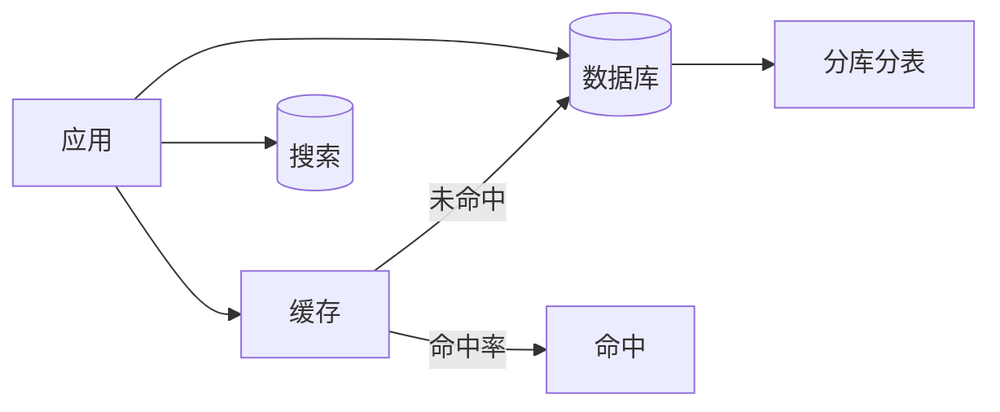
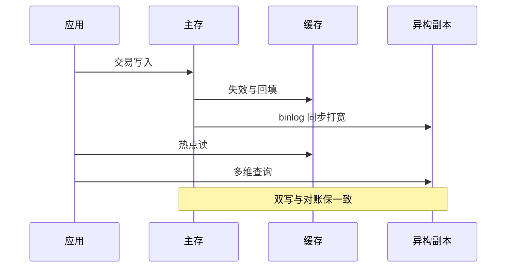
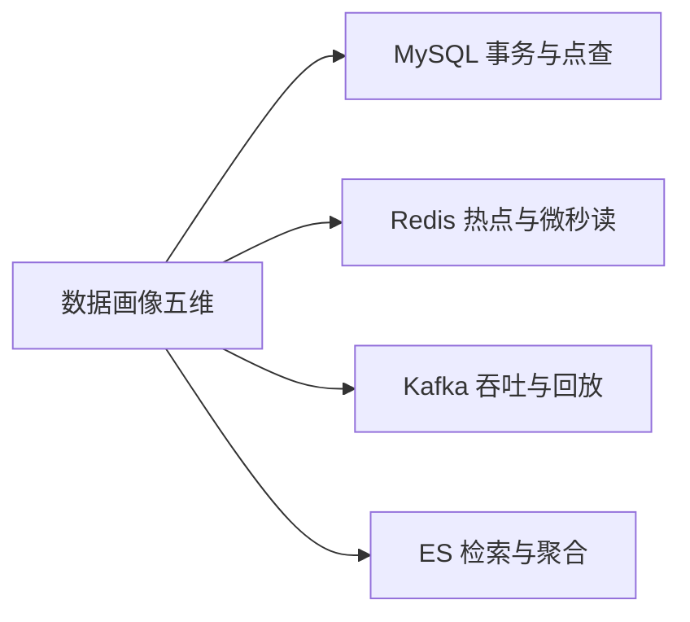

# 深入理解数据架构系列

> 数据架构的核心：分库分表 + 缓存 + 搜索——数据层的水平扩展与读写分离。

## 一句话摘要

本系列拆解大规模数据架构的四个支柱：分库分表、缓存体系、异构同步、数仓分层——每篇从机制穿透到参数级配置，回答「数据在引擎间怎么流动、一致性谁来兜底、量级变了怎么演进」。

## 一、为什么需要这个系列

数据层是大规模架构的瓶颈核心：
- 分库分表：水平扩展
- 缓存：减少 DB 压力
- 搜索：复杂查询优化

## 二、全局心智模型

## 三、系列篇目规划

| 序号 | 篇目 | 核心内容 |
|---|---|---|
| 1 | 深入理解分库分表策略 | 水平拆分/垂直拆分/分片键 |
| 2 | 深入理解缓存架构 | 多级缓存/一致性/淘汰策略 |
| 3 | 深入理解搜索架构 | ES选型/索引设计/查询优化 |
| 4 | 深入理解数据一致性 | 最终一致/强一致/对账 |
| 5 | 深入理解数据迁移 | 不停机迁移/双写/回滚 |

## 四、量级三档

| 量级 | 数据方案 | 缓存策略 | 搜索方案 |
|---|---|---|---|
| 10w | 单库+读写分离 | 本地缓存 | MySQL LIKE |
| 千万 | 分库分表 | Redis 集群 | ES 集群 |
| 亿级 | 分库分表+异构 | 多级缓存 | ES+ClickHouse |

## 四层进阶路径

- L1 入门：大规模架构 - 数据层设计
- L2 特性：本系列
- L3 专题：数据迁移与不停机切换
- L4 整合：数据架构 Demo

## 五、核心问题链

1. 怎么选分片键？（基数 + 均匀 + 业务）
2. 缓存一致性怎么做？（TTL + 主动失效）
3. 分库分表后怎么 JOIN？（冗余 + 异构）

### 数据在引擎间的旅程（预览）

### 一致性的分级预算

数据架构的核心取舍是「一致性预算怎么分配」：交易主存强一致，缓存容忍秒级窗口，异构副本接受分钟级延迟加对账兜底。每篇都会回到这条主线——机制的选择空间往往不大，选错的多半是「把某类数据的一致性级别配错了」。10 万级单库能扛就不用异构，千万级起同步链路成为必选项，量级红线是本系列的演进坐标。

## 自测三问

1. 你的体系里，同一份数据存在于几个引擎？各自的一致性级别是什么？
2. 分库分表的分片键选型，业务方参与了吗？
3. 缓存与主存的不一致窗口，对哪些数据是不可接受的？

数据架构导读v2

### 引擎舒适区速查

五维画像对到引擎舒适区，是这个系列的选型心智图——每篇都会回到这张表展开一层：

## 📌 数据与事实声明

- 量级与参数数字为行业认知量级，落篇时以实测替换。

## 📚 参考资料

- 本仓库数据域 / distributed-transaction 系列