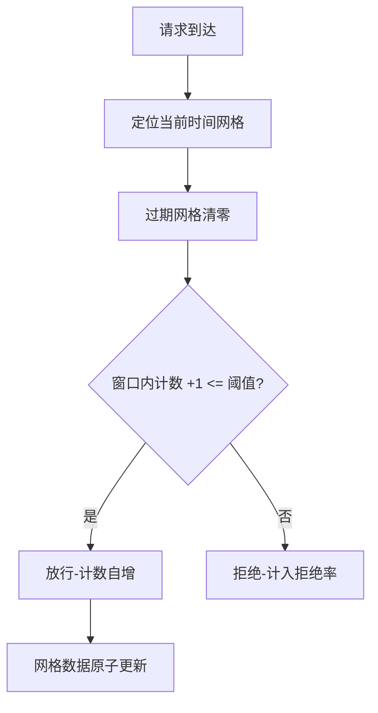
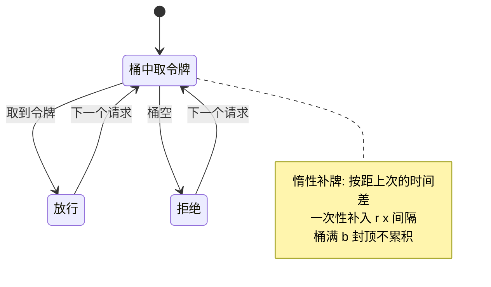
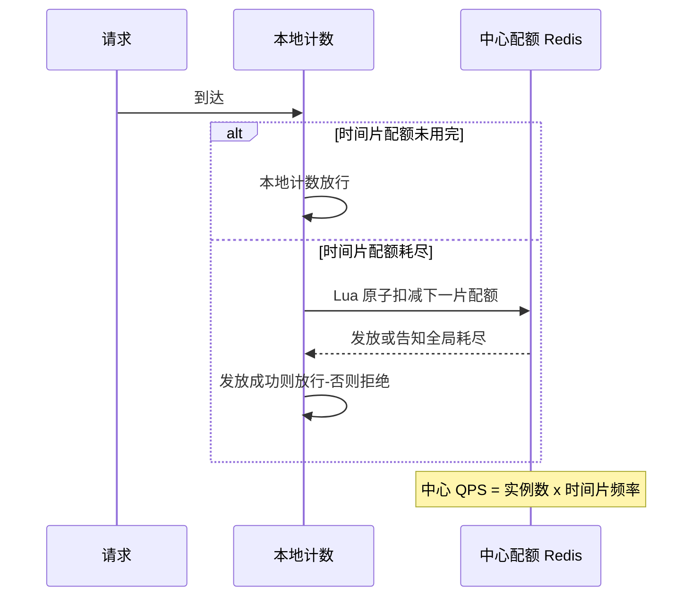

# 限流算法深读：计数、令牌桶、滑动窗口与分布式限流的实现原理

> **本文核心**：限流的本质不是「把流量挡住」，而是**给容量一个明确的失效语义**——超过容量的请求按什么规则被拒绝、被谁拒绝、拒绝时体验什么。算法层面只有两族机制：**计数器族**（固定窗口、滑动窗口——按时间切片数数）与**令牌族**（令牌桶、漏桶——按速率生成通行凭证），两族的差异落在三个可观察行为上：突发容忍（能不能放行短时脉冲）、边界精度（窗口切换处的双倍流量）、速率形状（平均限还是整形限）。本文拆解单机算法的实现细节与参数来源、单机到分布式的惰性同步设计（为什么分布式限流不用每次都问中心节点）、以及阈值怎么从压测数据里长出来。**机制链**：容量摸底（压测拐点）→ 阈值分派（接口/用户/实例三维）→ 算法选择（计数族/令牌族）→ 单机执行（原子计数）→ 分布式协调（惰性同步/中心配额）→ 拒绝语义（降级内容）→ 监控闭环（拒绝率与容量对账）。

## 一句话摘要

「限流阈值设多少」是个伪问题——真问题是「容量是多少、由哪个约束决定、超了以后谁先被拒绝」。算法选择的自由度其实很小：单机默认令牌桶（允许突发、平滑平均）、精确控频用滑动窗口、全局配额用惰性同步的分布式计数；**真正决定限流成败的是阈值来源（压测拐点还是拍脑袋）与拒绝语义（被拒用户看到什么）**。10 万级流量单机令牌桶一把就够，千万级起分布式配额与热点隔离成为必选项，亿级流量的限流是分层体系而不是一个注解。

## 前置阅读

- 入门层篇 7《稳定性保障：限流降级与容灾》（心智模型）
- 本仓库 stability 系列（限流在四阶段闭环中的位置）
- 本仓库中间件域 Redis 系列（Lua 原子计数的实现底座）

## 目标导向

本文是什么：限流从算法机制到工程落地的深读。功能：掌握两族算法的行为差异、参数推导、分布式同步设计与阈值方法论。收益：限流方案评审中给出可辩护的算法与参数，事故复盘时把「该限没限住/限太狠」映射回机制。必看场景：大促前限流预案配置、突发流量事故复盘、限流规则治理与准入评审。

## 一、先回答三个前置问题，再谈算法

限流方案的第一交付物不是算法选型，是三个前置答案：**容量由什么决定**（单实例并发上限、下游依赖的配额、数据库连接池——木桶的短板板）、**拒绝对象是谁**（按接口、按用户、按租户还是按调用方维度）、**拒绝语义是什么**（裸错误、排队页、降级内容——这是产品决策不是技术参数，互指 stability 系列降级主题）。三个答案没定就写代码，产出的只是「看起来在限流」的装饰品。

这一档的约束来源是**容量摸底的真实性**——阈值必须来自压测拐点（吞吐不再随并发上升、延迟开始拐头的那一点），拍脑袋的阈值要么形同虚设要么误伤正常流量。这一档的核心问题是「我们对自己容量的认知有多准」，而不是「用哪个算法」——算法差异最多影响边界的几个百分点，容量认知错误是数量级错误。思考方式：**容量驱动**——先压测、再定阈、后上线，阈值随容量变更同步修订。

## 5W 速记卡

| 维度 | 一句话 |
|---|---|
| What | 计数族与令牌族算法的机制、参数与分布式协调 |
| Why | 容量有限时必须有明确的失效语义，否则过载变成雪崩 |
| When | 容量摸底完成后、大促与突发预案配置、依赖配额受限时 |
| Where | 接入层网关/服务层注解/数据访问层，多层各管一段 |
| How | 容量摸底 → 阈值分派 → 算法选择 → 原子执行 → 惰性同步 → 拒绝语义 |

## 二、计数器族：固定窗口与滑动窗口

**固定窗口**是最朴素的实现：每分钟一个计数器，原子自增、超阈值拒绝。它的致命缺陷在**窗口边界**：窗口切换前后的两个半窗内各放满额度，边界处的瞬时速率可达阈值的两倍——限流 6000/分钟的系统可能在两秒内涌入 400 个请求（行业认知量级的示意）。缺陷的根源是「计数窗口与滑动时间轴错位」，修复就是**滑动窗口**：把统计粒度切细（网格化，如每秒一个网格，60 个网格组成一分钟窗口），任意时刻的窗口都是「过去 60 秒的网格求和」——边界双倍问题消失，代价是内存里要维护 N 个网格与求和开销。

滑动窗口的工程变体也值得认识：**环形数组实现**（固定长度的网格数组+时间戳定位，无锁或细粒度锁即可支撑高并发）；**多窗口叠加**（如「10 秒窗口限 X + 1 分钟窗口限 10X」防单窗口内脉冲）。业内惯例是 Sentinel 一类框架把「快速失败/排队等待/预热」做成同一套计数底座上的不同行为模式——机制同源，行为模式只是「被拒请求的后续处理」不同。

## 三、令牌族：令牌桶与漏桶的速率形状

**令牌桶**的机制：以恒定速率 r 往桶里放令牌，桶容量 b（b 即突发容忍额度），请求取到令牌才放行。它天然提供两个参数的独立控制——**平均速率 r 与突发上限 b**，这是它成为默认选择的原因：真实流量有脉冲（页面加载并发拉取多个接口），完全平滑的拒绝会误伤正常脉冲。令牌桶的边界行为要读细：桶满时令牌不再累积（突发上限锁死在 b），桶空时拒绝瞬间发生（没有排队）——**它限的是「平均速率+瞬时上限」，不承诺任何请求的等待时间**。

**漏桶**是另一族语义：请求进桶排队，以恒定速率流出处理，桶满拒绝新请求——它做的是**流量整形**（强制恒定速率），不是速率限制。两者的区别一句话：令牌桶允许突发、漏桶消灭突发。适合漏桶的是「下游只能以恒定速率消费」的场景（调用外部计费接口、消息投递限速），适合令牌桶的是「保护自己不被打挂但接受脉冲」的场景（绝大多数在线服务）。**用错方向的症状很典型**：给在线服务配漏桶，正常的页面脉冲被强制排队，延迟全面上升——限流还没保护系统，先把用户体验限没了。

| 维度 | 固定窗口 | 滑动窗口 | 令牌桶 | 漏桶 |
|---|---|---|---|---|
| 突发容忍 | 窗口内全放 | 同左（网格内） | 有（上限 b） | 无（强制匀速） |
| 边界精度 | 差（双倍流量） | 好 | 好 | 好 |
| 语义 | 计数 | 计数 | 速率+突发 | 整形排队 |
| 实现代价 | 最低 | 网格数组 | 惰性计算 | 显式队列 |
| 适用 | 粗粒度兜底 | 精确控频 | 在线服务默认 | 下游匀速消费 |

## 四、从单机到分布式：惰性同步的设计思想

单机限流的天然缺陷：N 个实例各限 Q，全局就是 N×Q——流量倾斜时实际容量与配置对不上。分布式限流的朴素解法是「每个请求都问中心节点（Redis 一类）」——中心节点每秒承载全站请求量的读写，自己先被打挂，这是**分布式限流的中心瓶颈悖论**。

工程上的收敛解是**惰性同步**：中心节点按「时间片」发放配额而不是按「每个请求」记账。典型实现（Redis+Lua）：每个实例按固定窗口（如每 100 毫秒）到中心原子扣减一批配额（本实例在该时间片内的份额），时间片内本地计数自行判断——中心节点的 QPS 从「全站请求量」降为「实例数 × 时间片频率」（百实例 × 十次/秒 = 千级 QPS，行业认知量级），压力下降两到三个数量级。代价是**配额粒度粗化**：时间片内实例间可能轻微不均，且中心不可用时的策略要预设（fail-open 放行还是 fail-close 拒绝——多数在线系统选 fail-open+本地兜底阈值，可用性优先）。

热点与倾斜场景还有一个轻量替代：**按实例权重分配静态配额**（中心只做配额计算与推送，不做实时记账），牺牲全局精确性换零运行时依赖——配额分配是分钟级离线计算，中心挂了限流照常工作。业内惯例是「精确性要求高的场景上惰性同步、一般场景静态分配+定期校准」，与成本曲线吻合。

## 五、阈值从哪来：压测拐点与三维分派

阈值的推导链：**压测摸出单实例容量拐点 → 集群容量 = 拐点 × 实例数 × 冗余系数 → 按维度分派到接口/用户/调用方**。冗余系数是给流量波动留的缓冲（八成上下是常见取值，行业认知）；维度分派的优先级是「先保护再公平」——核心接口的配额优先于长尾接口、老用户的体验权重高于爬虫与刷子。参数清单（名称/默认/分档推荐/为什么）：

| 参数 | 默认量级 | 推荐口径 | 为什么 |
|---|---|---|---|
| 单机阈值 | 压测拐点 | 拐点的八成 | 留波动缓冲防抖动误拒 |
| 突发容量 b | 1-2 秒均量 | 按脉冲形态定 | 页面脉冲约 1-2 秒集中拉取 |
| 时间片 | 100ms 级 | 百毫秒档 | 中心 QPS 与粒度的平衡点 |
| 冗余系数 | 0.8 上下 | 按波动率定 | 流量波动大取更低 |
| fail 策略 | fail-open | 核心链路例外 | 中心故障不能放大为全站拒绝 |

### 量级三档：限流形态的演进

- **十万级**：约束来源是单实例的并发处理能力，配额维度用「接口+实例」就够。这一档的核心问题是「容量认知有没有压测来源」，而不是「选哪个分布式方案」——单机令牌桶加网关粗粒度兜底即可覆盖。思考方式：**拐点驱动**——压出拐点、配到注解、完事。
- **百万级**：约束来源变为实例间流量倾斜与依赖配额（下游给的不是全量是配额）。这一档的核心问题是「全局配额怎么在实例间公平且不压垮协调点」，而不是「阈值数字」——惰性同步或静态权重分配进入必选项。思考方式：**配额驱动**——把「谁拥有多少处理权」当成资源分配问题管理。
- **千万级到亿级**：约束来源是拒绝语义的产品化与多层限流的协同（入口削峰、核心保障、依赖保护三层阈值联动）。这一档的核心问题是「被拒流量体验什么、预案能不能演练」，而不是「算法精度」——限流成为分层体系，剧本与演练是一等公民。思考方式：**预案驱动**——每次大促前全链路演练拒绝路径。

自下而上看，量级每上一个台阶，约束来源就从「单点资源」移向「协同复杂度」：十万级管好自己、百万级管好分配、亿级管好体验与演练。触发升级的行为信号同样清晰——出现倾斜性拒绝升档到配额驱动，出现拒绝语义客诉升档到预案驱动。

## 六、典型场景与误区

**典型场景**：网关层全局限流（南北向入口，按 IP/用户/接口三维）；服务层注解限流（保护自身实例，单机令牌桶）；下游配额保护（调外部接口，漏桶整形或分布式计数）；大促分层限流（入口削峰+核心链路保障，互指专题层大流量治理）。

**常见误区**：① **「限流阈值拍一个整数」**——阈值没有压测来源，等于没有限流，事故复盘中「阈值怎么来的」答不上来的团队不在少数；② **「分布式限流每请求问中心」**——中心瓶颈悖论，必须惰性同步或静态分配；③ **「只配了阈值没配拒绝语义」**——被拒用户看到 500 裸错误，客诉比故障本身伤害大；④ **「限流规则常年不改」**——容量随架构演进变了，阈值还在三年前的数字，形同虚设或常年误伤；⑤ **「fail-open 就一定对」**——扣款等资损敏感接口 fail-open 意味着过载时超卖超扣，**资损敏感场景要 fail-close 加排队**。

## 七、事故与实践叙事

**事故一：压测拐点没算依赖链，阈值形同虚设**。某团队对下单接口压测出单实例 800 QPS 的拐点，按十实例配了 6400 的全局限流；上线后大促流量 5000 QPS 就崩了——压测时下游缓存命中正常，大促时一个商品爆热，缓存命中率掉到六成，主存连接池先于接口容量到顶。复盘把「容量拐点」重新定义为**短板容量**：对链路上最弱依赖（当天的主存）单独压测，阈值按短板校准。教训：**容量是链路属性不是接口属性——拐点跟着依赖状态漂移，阈值要按最坏依赖状态取**。

**事故二：时间片配额的倾斜打穿了一个实例**。某团队惰性同步的时间片配额按实例均分，但网关的负载均衡是加权轮询——大实例权重高承接了三倍流量，配额却只有一份，先于全局阈值开始拒绝；同时小实例配额闲置。复盘改为**配额按权重分配+实例侧回报校准**，全局拒绝率曲线恢复平滑。教训：**惰性同步的「均分」假设与负载不均天然冲突——配额分配必须跟流量分配对齐**，否则全局容量正确、局部体验崩坏。

## 八、设计思想：限流是把「过载」翻译成「可预期」

限流的深层设计思想是**把不可预期的失败翻译成可预期的拒绝**：没有限流的系统过载时表现为延迟飙升、连接耗尽、级联雪崩——失败形态随机且互相放大；有限流的系统过载时表现为「明确比例的请求收到明确的拒绝」——失败被约束在容量边界上，系统其余部分保持健康。这套思想与熔断（互指本系列篇 2）互补：限流管「入口的量」，熔断管「出口的坏」——一个是进气阀一个是泄压阀，共同把系统从「脆弱的精密仪器」变成「有明确失效边界的工程结构」。**失效语义的明确性，本身就是一种可用性**——这句话是流量治理全部机制的哲学底座。

## 九、追问链

**质疑者第一层**：为什么不直接用队列把超量请求排着而不是拒绝？——排队只对「峰值短于容量恢复时间」的脉冲有效：排队的请求占着连接与内存等待，队列本身就是资源——脉冲两秒内消化掉，排队是体验优化；过载持续存在，队列只是把拒绝延迟化并加倍消耗资源（排队请求全部超时）。**判据是排队时长与超时预算的对比**：预计等待 < 客户端超时的脉冲可排，否则直接拒绝。

**质疑者第二层**：惰性同步的时间片内，实例间不均最坏会差多少？——最坏情况是「快实例在时间片开始瞬间扣完全部共享配额」——把时间片内的全局额度吃光，慢实例的请求全部被拒。缓解手段是把共享配额改成「预分配+回收」（各实例先分固定份额，临期回收闲置份额重新分配），或者直接用静态权重分配——**时间片越粗越要预分配，时间片越细越可以共享池**，这是一对可以互换的参数。

**质疑者第三层**：自适应限流（按负载指标动态调阈值）能不能取代压测定阈？——自适应解决的是「阈值静态与负载动态」的矛盾，但它的依据（CPU、延迟、并发数）是**滞后指标**——过载已经发生后才反应，兜的是「容量认知漂移」的底，替代不了压测的**先验认知**。生产中两者是分层关系：静态阈值是主防线（可预期、可演练），自适应是修正层（吸收容量漂移与突发形态变化）——全自适应系统的拒绝行为难以预期，大促演练没法写剧本。

## 十、你们可能会问

**Q1：限流配在哪一层最合适？**
分层各管一段是惯例：网关层管全局与维度公平（IP/用户），服务层管自身实例保护（单机令牌桶），数据访问层管依赖配额（漏桶/计数）。单层限流的盲区是「层内健康、跨层叠加过载」——大促预案通常三层都配，各有各的阈值来源。

**Q2：怎么观测限流自身的健康度？**
三个指标：拒绝率（与流量曲线对照——流量涨拒绝涨是正常，流量平拒绝涨是配置事故）、阈值利用率（峰值/阈值，长期低于五成说明阈值过时）、中心节点健康（惰性同步的扣减延迟与失败率）。限流配置变更要审计留痕——「谁在什么时候改了什么阈值」是事故复盘的第一问。

**Q3：被拒绝的请求要重试吗？**
客户端不要自动重试被限流响应（429/自定义码）——重试会把拒绝流量再打回来，放大过载。正确形态是带退避的有限重试或引导用户手动重试；服务端对重试流量可以按「重试标记」维度单独限额。

**Q4：灰度发布的实例阈值怎么处理？**
新实例预热期容量不足（缓存冷、JIT 未热），按全量阈值接流量会被打挂——预热限流（阈值随在线时间爬升到目标值）是框架标配能力（Sentinel 预热模式一类），互指 graceful-shutdown 系列预热主题。

## 💡 实战提示

- 💡 决策口径：阈值必须有压测来源（短板容量口径），「谁拍的阈值」答不出来就是事故隐患
- 💡 在线服务默认令牌桶（突发+b 值给足），下游匀速消费用漏桶——方向配反的症状是正常脉冲被排队
- 💡 分布式限流不每请求问中心：惰性同步（时间片扣减）或静态权重分配，中心故障 fail-open 但资损接口例外
- 💡 拒绝语义是产品决策：排队页/降级内容/引导重试要在预案里写明，裸 500 是体验事故

## 十一、自测三问

1. 固定窗口的边界缺陷与修复？（答：窗口切换处两个半窗各放满额度，瞬时速率可达两倍；滑动窗口网格化求和修复）
2. 令牌桶和漏桶的语义差异？（答：令牌桶限「平均速率+突发上限」允许脉冲；漏桶强制匀速是整形——给在线服务配漏桶会误伤正常脉冲）
3. 惰性同步怎么解决中心瓶颈？（答：按时间片批量扣减配额，中心 QPS 从全站请求量降到实例数×时间片频率，代价是片内不均与 fail 策略预设）

## 十二、开放问题

- 服务网格侧的限流下沉（mesh 层统一执行 vs 应用层注解执行）——执行点统一与业务语义表达之间的取舍仍在演进。
- 基于强化学习的自适应限流（公开论文与云厂商试点）——拒绝策略与容量预测的自动化程度尚无生产级定论。

## 📎 核心带走

- **核心一句话**：限流 = 给容量一个明确失效语义——阈值来自短板压测拐点，算法按「突发容忍/边界精度/速率形状」三行为选型，分布式用惰性同步避开中心瓶颈，拒绝语义是产品决策
- **机制链**：容量摸底 → 三维阈值分派 → 计数族/令牌族选型 → 本地原子执行 → 时间片惰性同步 → fail-open/close 分场景 → 拒绝率与阈值利用率监控
- **失效点/边界**：容量认知漂移让静态阈值过时；负载不均打穿均分配额；排队只救短脉冲；资损接口的 fail 策略要反着选

## 📌 数据与事实声明

- 写于 2026-09-23，阈值量级、系数取值、QPS 数字均为行业认知量级（如冗余系数八成、时间片百毫秒），落地以压测实测为准
- 免责：Sentinel/Redis 等实现细节以官方文档与所用版本为准

## 📚 参考资料

| 类型 | 标题 | 来源 |
|---|---|---|
| 开源文档 | Sentinel 流量控制文档 | sentinelguard.io |
| 官方文档 | Redis Lua 脚本与原子性说明 | redis.io |
| 原理书 | 《数据密集型应用系统设计》DDIA（负载与过载章） | 公开出版 |
| 关联文章 | 本仓库 stability 系列、同系列篇 2 熔断器、专题层大流量治理 | 本仓库 |
