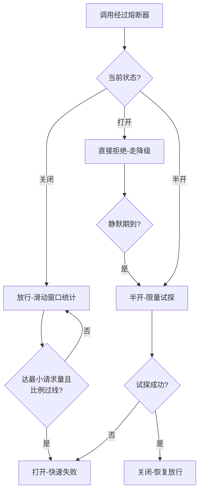
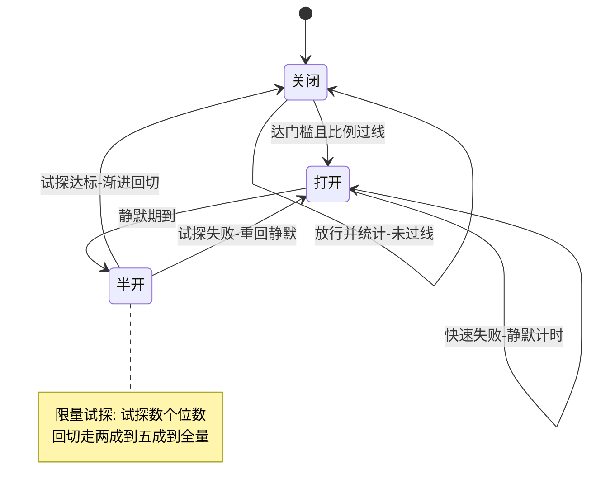
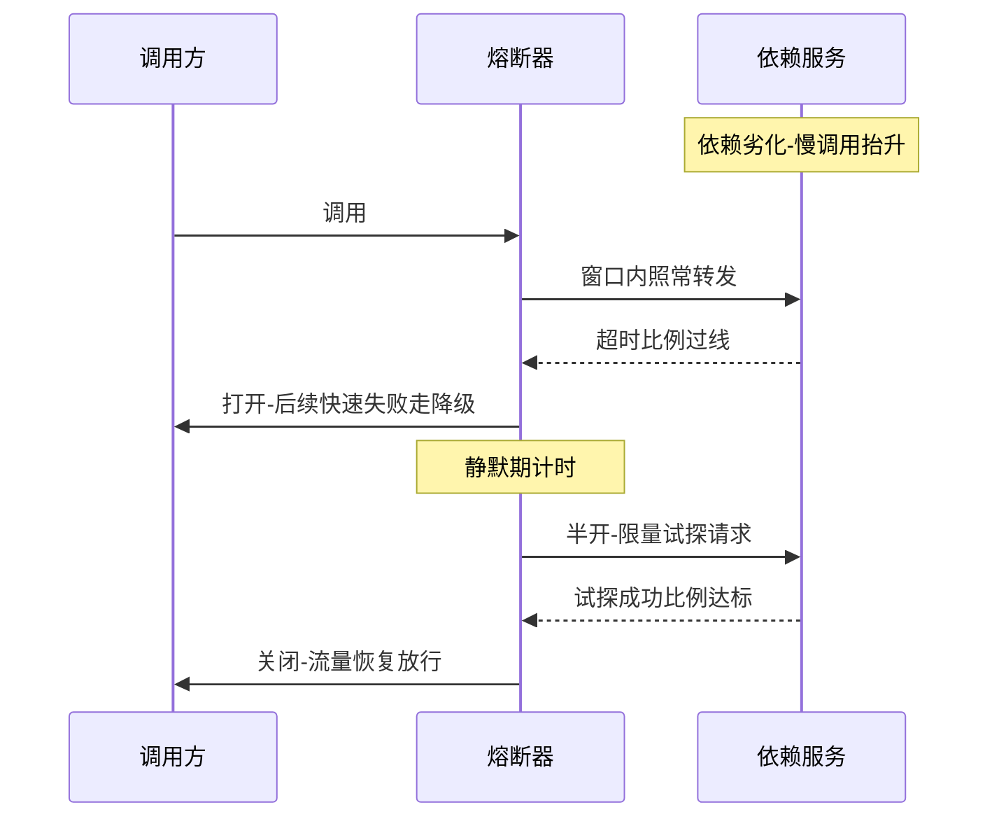

# 熔断器深读：状态机、统计窗口与半开恢复的实现原理

> **本文核心**：熔断器的本质是把「依赖的健康状态」从隐式感知（等请求超时才发现坏）升级为**调用方的一等状态变量**（显式记录、快速失败、主动试探恢复）。它的全部机制收敛在一个三态状态机上：**关闭态**（放行+统计）、**打开态**（快速失败，让依赖喘息）、**半开态**（限量试探，验证恢复），加上驱动状态迁移的**滑动统计窗口**与**触发判定**（异常比例/慢调用比例/异常数）。本文拆解统计窗口的实现细节（网格化计数与最小请求量门槛）、触发维度的选择逻辑、半开态的恢复风暴问题（试探成功后流量瞬间回切），以及熔断与重试、隔离、降级的协同关系。**机制链**：调用经过熔断器 → 滑动窗口统计（成败/耗时）→ 判定规则评估（比例过线且请求量达门槛）→ 状态迁移（关闭→打开→半开→关闭）→ 打开期快速失败 → 半开限量试探 → 恢复或重回打开 → 与降级兜底衔接。

## 一句话摘要

熔断器回答的问题不是「怎么防止依赖挂」，而是「**依赖已经坏了，调用方接下来怎么活**」——快速失败保护自己的资源不被拖死，半开试探保证依赖恢复后能自动回来。工程上最容易翻车的不是状态机本身（框架都实现好了），而是三件事：**触发维度选错**（对慢依赖用异常比例，永远触发不了）、**统计窗口与流量不匹配**（低峰期请求量不够，判定永远不生效）、**恢复期没有预热**（半开转关闭瞬间全量回切，二次打挂）。10 万级流量一个注解式熔断器够用，千万级起按依赖分级配置触发维度，亿级流量的熔断是治理体系——谁有权开、开了谁兜底、恢复怎么演练都有剧本。

## 前置阅读

- 入门层篇 7《稳定性保障：限流降级与容灾》（心智模型）
- 同系列篇 1《限流算法》（进气阀与泄压阀的分工）
- 本仓库 stability 系列（熔断在四阶段闭环中的位置）

## 目标导向

本文是什么：熔断器从状态机机制到协同治理的深读。功能：掌握统计窗口实现、触发维度选择、半开恢复设计与跨机制协同。收益：熔断配置从「框架默认值」升级为「按依赖特性定制」，故障复盘中能判断熔断为什么没触发或为什么误触发。必看场景：依赖劣化事故复盘、大促前熔断预案评审、慢依赖治理与线程池排障。

## 一、先划清分工：熔断管什么、不管什么

熔断与限流的分工一句话：**限流管入口的量，熔断管出口的坏**——限流在流量进入前拒绝超额，熔断在依赖劣化后切断调用。熔断**不防止依赖故障**（故障发生了它才动作），**不解决单次调用失败**（那是重试与容错的事，互指 RPC 系列集群容错主题），它的全部价值是两件事：**止损**（打开后快速失败，调用方的线程与连接不再被慢依赖占用）与**自愈**（半开试探，依赖恢复后无需人工介入）。

这一档的约束来源是**调用方自身的资源上限**（线程池、连接池、超时预算）——慢依赖的危害机制是「资源被占用后的级联耗尽」，熔断保护的是占用过程。这一档的核心问题是「哪个依赖坏了会让我的资源池见底」，而不是「要不要上熔断框架」——把依赖按「资源占用传导性」分级（强依赖会传导、弱依赖可丢弃），分级结果决定熔断配置的粒度。思考方式：**传导分级驱动**——按故障传导路径配置防护，不对所有依赖一视同仁。

## 5W 速记卡

| 维度 | 一句话 |
|---|---|
| What | 三态状态机+滑动统计+触发判定的依赖隔离机制 |
| Why | 慢依赖通过资源占用传导故障，快速失败是调用方的自保 |
| When | 依赖劣化频繁超时、线程池堆积、大促预案与依赖分级治理 |
| Where | 调用方侧（RPC 客户端/HTTP 客户端/数据访问层） |
| How | 统计窗口 → 判定评估 → 状态迁移 → 快速失败 → 限量试探 → 恢复回切 |

## 二、统计窗口：判定的数据底座

熔断判定的全部依据来自滑动统计窗口，实现与限流的滑动窗口同源（互指本系列篇 1）：把时间切成网格，每网格记录请求数、失败数、慢调用数，判定时对窗口求和。两个容易被忽略的实现细节决定了熔断在真实流量下的行为：

**最小请求量门槛**。判定规则形如「失败比例超过 50% 则打开」，但如果窗口内只有 2 个请求且失败 1 个，50% 的比例毫无统计意义——框架用「最小请求数」（如窗口内至少 20 个请求才评估判定，行业认知量级）防止低峰期误触发。这带来一个反直觉的生产现象：**低峰期依赖已劣化但熔断不触发**（请求量够不着门槛）——这正是低峰期故障容易被放大的原因之一，监控要对「比例高但未达门槛」的状态单独告警。

**慢调用定义**。慢调用比例是比异常比例更早的触发信号——依赖劣化通常先表现为变慢（GC 停顿、慢查询）再表现为报错。慢调用的「慢」是显式阈值（如超过 500ms 计为慢，行业认知量级示意），**这个阈值必须按依赖的 P99 正常水位推**：P99 是 80ms 的依赖配 500ms 慢阈值，劣化到 300ms 时熔断毫无反应，线程池却已经堆积。慢阈值取正常 P99 的数倍是常见口径，且随依赖性能演进定期校准。

## 三、触发维度的选择：异常比例、异常数、慢调用比例

三个触发维度对应三种依赖劣化形态，选错维度等于没配熔断：

| 触发维度 | 适配形态 | 失效场景 |
|---|---|---|
| 异常比例 | 依赖报错型故障（宕机/5xx） | 慢而不死的依赖（不报错只变慢） |
| 异常数 | 低流量依赖（比例失真时用绝对数） | 高流量依赖（绝对数轻易到线） |
| 慢调用比例 | 劣化先变慢的依赖（GC/慢查询） | 阈值配得远超 P99 水位 |

生产实践的最稳口径是**双维度并行**：慢调用比例（早触发、防线程池堆积）+异常比例（兜报错型故障），窗口与门槛按依赖流量分档配置。单一维度只适合形态极端明确的依赖——外部支付接口用异常比例、内部慢查询重灾区用慢调用比例。

三态迁移的完整状态机——每个迁移边都有明确的触发条件与对应的执行行为：

**打开后的静默期**（open duration）是第二组关键参数：静默期太短，依赖还没恢复就被试探，反复开合（熔断抖动）反而放大故障；太长则依赖已恢复却迟迟不回流量。常见口径是秒级到分钟级之间（行业认知），并随故障平均持续时间（MTTR）校准——**静默期是给依赖的恢复时间预算，不是给调用方的心理安慰**。

## 四、半开的恢复风暴与协同机制

半开态的设计意图是「少量试探验证恢复」，但**从半开转关闭的瞬间存在恢复风暴**：试探成功后全量流量瞬间回切，而依赖通常刚恢复、容量未满（缓存冷、连接池刚回血、JIT 未热）——二次打挂的案例在生产中屡见不鲜。缓解手段有二：**渐进回切**（半开到关闭之间加一个「按比例放量」的过渡态，框架不内置时用权重路由手工实现，互指服务路由系列）；**预热限流**（恢复流量的实例按时间爬升阈值，互指本系列篇 1 预热主题与 graceful-shutdown 系列）。

熔断的完整防护闭环还需要三个机制的协同：**重试预算**——重试放大故障（坏依赖上一个重试 = 三倍流量），熔断器上游的重试必须设预算（重试比例上限，如不超过正常流量的 10%，行业认知口径）；**舱壁隔离**——按依赖划分线程池/信号量配额，单依赖熔断时不殃及其他依赖的调用资源，熔断从「全局开关」细化为「分仓开关」；**降级兜底**——打开态的快速失败必须接降级逻辑（缓存快照、默认值、裁剪响应），**熔断只负责快速失败，失败之后用户看到什么由降级决定**（互指 stability 系列降级主题）。三件事缺任何一件，熔断都是「断了但没兜住」。

## 五、参数清单与量级三档

| 参数 | 默认量级 | 推荐口径 | 为什么 |
|---|---|---|---|
| 滑动窗口 | 秒级-分钟级 | 按依赖 MTTR 定 | 窗口太短易抖动、太长反应慢 |
| 最小请求量 | 20 上下 | 按低峰 QPS 定 | 低于它判定无统计意义 |
| 断路阈值 | 五成上下 | 按正常错误基线定 | 正常错误率之上的裕量 |
| 慢调用阈值 | P99 的数倍 | 随水位校准 | 远超 P99 等于不设防 |
| 静默期 | 秒级-分钟级 | 按 MTTR 校准 | 恢复时间预算 |
| 半开试探数 | 个位数 | 按依赖容量定 | 太多等于没熔断 |

量级三档的形态分野——**十万级**：约束来源是单依赖故障的处置速度，这一档的核心问题是「关键依赖有没有配熔断」，而不是「参数精调」——注解式熔断加默认参数先跑起来，思考方式是**覆盖驱动**（先查裸奔的强依赖）。**百万级**：约束来源变为依赖数量与配置治理（上百个依赖点各配一套参数），这一档的核心问题是「配置有没有按依赖分级统一治理」，而不是「单个参数对不对」——依赖清单+分级模板取代逐个手配，思考方式是**模板驱动**。**千万级到亿级**：约束来源是恢复路径的协同（渐进回切、预热、降级演练的联动），这一档的核心问题是「熔断动作之后的链路有没有演练过」，而不是「触发准不准」——熔断预案进大促剧本，思考方式是**演练驱动**。自下而上看，约束从「配不配」移向「治不治」再移向「练不练」，触发升级的信号是：裸奔强依赖出现升档到模板驱动，二次打挂出现升档到演练驱动。

## 六、典型场景与误区

**典型场景**：RPC 调用强依赖隔离（舱壁+熔断组合，单依赖故障不传导）；外部服务调用（第三方接口异常比例熔断+降级兜底）；数据访问层（慢查询熔断，防主存连接池被拖垮）；大促核心链路（非核心依赖预熔断，预案开关直接置打开态）。

**常见误区**：① **「配了熔断就万事大吉」**——快速失败没有接降级，打开态=用户直接报错，熔断变成故障放大器；② **「慢阈值拍一个统一值」**——P99 水位差十倍的依赖用同一个慢阈值，快的误触发、慢的永不触发；③ **「低峰期熔断不触发是好事」**——请求量够不着门槛的裸奔期，恰恰是故障静默扩大的窗口；④ **「恢复即全量回切」**——半开试探通过后瞬间回满流量，二次打挂刚恢复的依赖；⑤ **「熔断粒度到方法级越细越好」**——粒度过细统计窗口永远凑不够请求量，粒度选择跟着「资源池边界」走而不是跟着代码结构走。

## 七、事故与实践叙事

**事故一：慢而不死的依赖拖垮线程池**。某团队对下游推荐服务配了异常比例熔断，一次推荐服务 GC 劣化——不报错、只变慢（响应从 50ms 涨到 3 秒），熔断纹丝不动，调用方线程池被慢慢占满，三十分钟后连接耗尽，整个 App 首页不可用——**故障从「推荐慢」传导成「全站挂」**。复盘三动作：补慢调用比例触发维度（慢阈值按推荐服务 P99 的五倍）、调用方改舱壁隔离（推荐调用独立线程池）、加线程池水位告警。教训：**异常比例熔断对「慢而不死」形同虚设——触发维度必须匹配劣化形态**。

**事故二：恢复风暴二次打挂**。某团队依赖故障恢复后熔断半开试探成功，全量流量瞬间回切——依赖的本地缓存全冷，回切流量直接打到主存，刚活过来的服务在十秒内再次过载熔断，如此开合三轮，故障时长翻了三倍。复盘加入恢复节奏：半开试探通过后按两成、五成、全量三档渐进放量（网关权重调整实现），并给依赖实例预热时间。教训：**熔断打开期的故障时间线要向后延伸到「恢复完成」——回切不是终点，回切后的稳定性才是**。

## 八、设计思想：把故障当成系统的常态参数

熔断器的深层设计思想是**承认故障是常态并为它设计状态**：传统思维把「依赖故障」当异常事件（报警、人上、手切），熔断器把它变成系统的**常态参数**——状态机持续跟踪、自动切换、自动恢复，人的角色从「故障处置者」退到「预案设计者」。这与限流的「明确失效语义」同构：限流把过载变成可预期的拒绝，熔断把依赖故障变成可预期的隔离——**两者的共同哲学是把「系统的坏日子」预先建模进系统本身**。半开态是这个哲学的精髓：它同时编码了「怀疑」（不信任依赖已恢复，只给少量试探）与「信任」（试探通过即恢复关系）——工程化的不信任机制，比信任或怀疑的单向姿态都更持久。

## 九、追问链

**质疑者第一层**：为什么不靠超时就够，非要熔断器？——超时只保护**单次调用**的资源占用上限（一个线程最多等 500ms），但过载期每次调用都「等满超时再失败」，吞吐被超时时间锁死：单线程 2 QPS 的无效等待 × 200 线程 = 持续的无效负载。熔断打开后同样的负载一次内存判断即返回，**超时给单次调用画上限，熔断给整条调用路径画开关**——两者是单次与聚合的关系，不可互替。

**质疑者第二层**：统计窗口按时间切网格，突发流量在网格内集中时判定会失真吗？——会。网格内 1000 个请求集中失败会瞬间把比例推过线，这是特性不是缺陷（快速打开正是要的）；真正的失真在**切换网格的边界**（与限流滑动窗口同源），框架用「窗口对齐+多网格求和」缓解。更值得注意的是时间窗口与**并发窗口**的取舍：并发数判定（在途请求超限即触发）反应更快但不区分成功失败，时间窗口更准但滞后一个网格——Sentinel 一类框架两者并存，按「要快还是要准」选。

**质疑者第三层**：服务网格把熔断下沉到 sidecar 后，应用层还要不要配？——sidecar 的熔断在**网络层**（连接失败率、请求时延），应用层的熔断在**业务语义层**（哪些异常算失败、慢的定义、降级怎么给）——两者不重叠而是互补。下沉解决的是「统一执行点与策略分发」，业务语义的判定永远在应用侧——**执行点可以下沉，失败的定义权不能外包**。

## 十、你们可能会问

**Q1：熔断误触发（依赖没坏但熔断打开了）怎么排查？**
三步：查统计窗口原始数据（比例怎么算出来的——真失败还是慢调用误判）、查慢阈值与依赖当前 P99 的关系（水位漂移是最常见误判源）、查请求量与门槛的关系（低峰期的偶发错误凑比例）。误触发的根因多数是「参数与依赖现状脱节」，修复靠定期校准而非临时调参。

**Q2：熔断和重试的先后关系怎么排？**
重试在熔断器的判断之内：重试的失败计入统计（否则坏依赖的重试流量不计失败，熔断永远不触发）。顺序是「先重试预算判定 → 再过熔断器 → 最后超时兜底」——重试预算防放大，熔断防占用，超时防单次无限等待。

**Q3：多级依赖（A 调 B 调 C）都配熔断，会冲突吗？**
不冲突但会传导：C 坏则 B 对 C 熔断（快速失败），B 的失败比例上升可能触发 A 对 B 熔断——**上游熔断把下游的局部故障升级为整链熔断**。缓解是 B 对 C 的降级要尽量「成功」（返回兜底数据而非抛错），把故障消化在最近一层，这就是「故障消化在下游、不要上传给上游」的原则。

**Q4：怎么验证熔断配置真的有效？**
故障演练：在预发或大促前的低峰窗口，人为制造依赖劣化（注入延迟/错误，公开工具如混沌工程框架），观察熔断打开时间、降级内容、恢复回切三个节点是否符合剧本——没演练过的熔断配置，等于没配。

## 💡 实战提示

- 💡 决策口径：按「故障传导性」给依赖分级，强依赖配「慢调用比例+异常比例」双维度，弱依赖直接降级不熔断
- 💡 慢阈值按依赖 P99 的数倍定并定期校准——统一慢阈值是误触发与不触发的共同根源
- 💡 打开态必须接降级兜底，恢复回切必须渐进——「断了没兜住、好了又打挂」是熔断两大收尾事故
- 💡 熔断配置进大促剧本与故障演练——没演练过的熔断等于没配

## 十一、自测三问

1. 熔断与限流的分工？（答：限流管入口的量——拒绝超额流量；熔断管出口的坏——依赖劣化后快速失败并自动恢复）
2. 为什么低峰期熔断可能不触发？危险在哪？（答：最小请求量门槛未达，判定不评估；危险在依赖已劣化但熔断静默，故障窗口被拉长——要对「比例高未达门槛」单独告警）
3. 半开转关闭的风险与缓解？（答：恢复风暴——全量回切打挂刚恢复的依赖；缓解为渐进回切（按比例放量）与实例预热）

## 十二、开放问题

- 熔断策略的自适应化（按依赖历史行为自动调阈值与静默期）——公开报道的 AIOps 实践仍在试点，误调风险未收敛。
- 跨语言统一熔断语义（mesh 下沉后各语言 SDK 与 sidecar 的判定边界）尚无标准化定论。

## 📎 核心带走

- **核心一句话**：熔断器 = 把依赖健康变成调用方的一等状态变量——三态状态机自动止损与自愈，触发维度匹配劣化形态（慢而不死用慢调用比例），恢复靠渐进回切防风暴，打开态必须有降级兜底
- **机制链**：滑动窗口统计 → 最小请求量门槛 → 判定评估（慢调用/异常比例）→ 打开快速失败+降级 → 静默期 → 半开限量试探 → 渐进回切 → 演练验证
- **失效点/边界**：低峰期门槛未达是静默裸奔期；异常比例对慢依赖失明；恢复风暴二次打挂；上游熔断会把下游局部故障升级为整链熔断——故障要消化在最近一层

## 📌 数据与事实声明

- 写于 2026-09-23，参数量级（最小请求量、慢阈值倍数、静默期长度）为行业认知口径，落地以依赖实测水位为准
- 免责：Sentinel/Resilience4j 等框架行为细节以官方文档与所用版本为准

## 📚 参考资料

| 类型 | 标题 | 来源 |
|---|---|---|
| 开源文档 | Sentinel 熔断降级文档 | sentinelguard.io |
| 开源文档 | Resilience4j CircuitBreaker 文档 | resilience4j.readme.io |
| 经典文章 | Martin Fowler - CircuitBreaker 模式 | martinfowler.com |
| 关联文章 | 本仓库 stability 系列、RPC 系列集群容错、同系列篇 1 限流算法 | 本仓库 |
