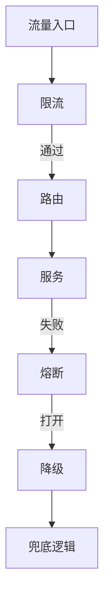
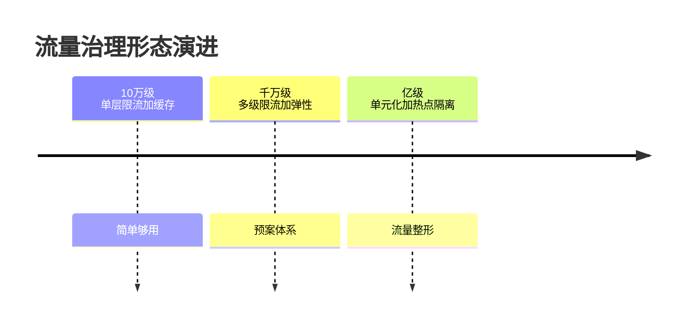
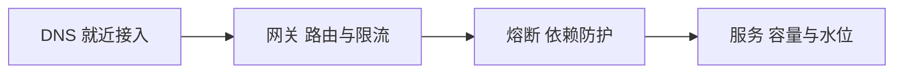

# 深入理解流量治理系列

> 流量治理的核心：限流 + 熔断 + 降级 + 路由——高并发与稳定性的工程防线。

## 一句话摘要

本系列沿流量路径逐层拆解：DNS 与接入、网关路由、限流熔断、突发与弹性——每篇给参数级配置与失败语义，回答「流量从哪进来、在哪一层被挡住、被挡住的流量体验到什么」。

## 一、为什么需要这个系列

大规模架构中，流量治理是保障系统稳定的核心机制：
- 限流：防止过载
- 熔断：快速失败
- 降级：保核心
- 路由：流量调度

## 二、全局心智模型

## 三、系列篇目规划

| 序号 | 篇目 | 核心内容 |
|---|---|---|
| 1 | 深入理解限流算法 | 令牌桶/滑动窗口/漏桶 |
| 2 | 深入理解熔断器 | 状态机/半开/异常比例 |
| 3 | 深入理解降级策略 | 开关降级/配置降级/自动降级 |
| 4 | 深入理解服务路由 | 条件路由/标签路由/灰度 |
| 5 | 深入理解热点治理 | 热点检测/热点分散/本地缓存 |

## 四、量级三档

| 量级 | 限流方案 | 熔断方案 | 降级方案 |
|---|---|---|---|
| 10w | 单机限流 | 简单异常检测 | 开关降级 |
| 千万 | 分布式限流 | 多维度熔断 | 配置降级 |
| 亿级 | 自适应限流 | 智能熔断 | 自动降级 |

## 四层进阶路径

- L1 入门：大规模架构 - 稳定性保障
- L2 特性：本系列
- L3 专题：流量突发治理实战
- L4 整合：流量治理平台 Demo

## 五、核心问题链

1. 什么时候需要限流？（水位 > 70%）
2. 限流丢不丢？（核心链路不丢）
3. 熔断要不要手动？（自动 + 人工）
4. 降级策略怎么定？（业务优先级）

### 流量等级的演进（预览）

### 被挡住的流量去哪里

流量治理最容易忽略的问题不是「怎么挡」而是「挡住之后给用户看什么」：裸错误、排队页还是降级内容——拒绝策略是产品决策不是技术参数。每篇的追问线都围绕「参数背后的业务语义」：限流阈值怎么和容量曲线对齐、熔断恢复怎么避免二次雪崩、弹性的生效时间怎么追上流量爬坡——10 万级两件套够用，亿级的流量整形是明码标价的取舍。

## 自测三问

1. 你的限流阈值是容量拐点推出来的还是拍的？
2. 被限流的用户此刻看到什么页面？
3. 上一次真实突发流量，从预警到扩容生效用了多久？

流量治理导读v2

### 逐层防护的心智图

流量从入口到服务的每一跳都有自己的治理工具——这张分层图是全系列的导航：

回看过去 5 年（行业认知），流量治理的演进方向是「拒绝策略产品化」——挡住流量之后给用户看什么，正在成为与限流算法同等重要的问题。

## 📌 数据与事实声明

- 量级与参数数字为行业认知量级，落篇时以实测替换。

## 📚 参考资料

- 本仓库稳定性系列 / distributed-theory 系列