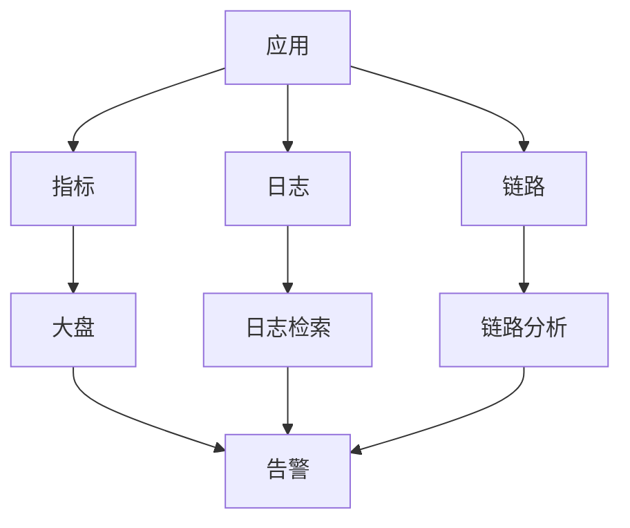
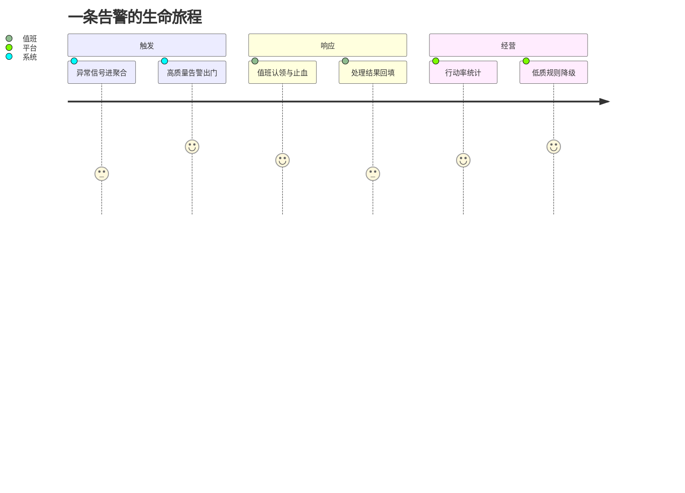
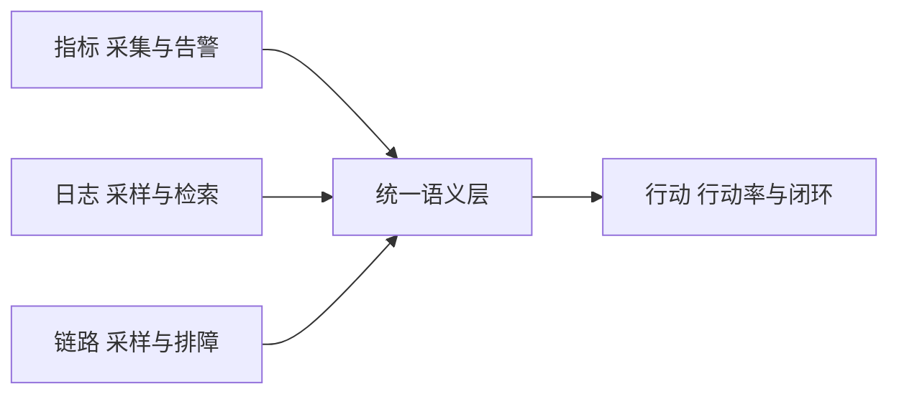

# 深入理解观测体系系列

> 观测体系的核心：指标 + 日志 + 链路——三大信号构建可观测性。

## 一句话摘要

本系列拆解观测三大支柱（指标、日志、链路）的机制与运营：数据怎么采集、告警怎么治理、观测自身怎么保值——从「建成」到「持续有用」，中间隔着运营这道工序。

## 一、为什么需要这个系列

大规模架构的可观测性是稳定性基石：
- 指标：系统健康度
- 日志：问题定位
- 链路：调用追踪

## 二、全局心智模型

## 三、系列篇目规划

| 序号 | 篇目 | 核心内容 |
|---|---|---|
| 1 | 深入理解指标体系 | RED/USE/四种黄金指标 |
| 2 | 深入理解日志架构 | 采集/存储/检索/告警 |
| 3 | 深入理解链路追踪 | TraceId/Span/采样 |
| 4 | 深入理解监控大盘 | 分层大盘/值班体系 |
| 5 | 深入理解告警治理 | 告警降噪/分级/值班 |

## 四、量级三档

| 量级 | 指标方案 | 日志方案 | 链路方案 |
|---|---|---|---|
| 10w | Prometheus | ELK | Zipkin |
| 千万 | Prometheus+Thanos | ELK+热温冷 | Jaeger |
| 亿级 | 自研指标平台 | Kafka+ClickHouse | 自研链路 |

## 四层进阶路径

- L1 入门：大规模架构 - 可观测体系
- L2 特性：本系列
- L3 专题：观测体系运营实战
- L4 整合：监控平台 Demo

## 五、核心问题链

1. 指标怎么选？（黄金指标 + 业务指标）
2. 日志存多久？（合规 + 成本）
3. 链路采样率多少？（1% ~ 100%）

### 观测数据的闭环（预览）

### 观测的运营视角

本系列与工具文档的区别在「经营」二字：指标会腐化、告警会噪音化、日志成本会失控——运营机制（行动率、季度审计、成本月报）才是观测体系持续有用的保证。每篇给出量级分档的最小动作：10 万级季度清理加值班群，千万级质量指标化，亿级观测自身 SLO 化——先建闭环再加维度，是本系列的取舍基调。

## 自测三问

1. 你的告警行动率是多少？多少规则半年没触发过？
2. 观测链路自己挂了，多久能被发现？
3. 观测数据的存储成本，最近一次核算是什么时候？

观测体系导读v2

### 三支柱的演进坐标

观测三支柱的成熟度各有坐标：指标看「有没有北极星口径」，日志看「采样与成本平衡」，链路看「排障回答速度」——过去 5 年（行业认知）的演进主线是三大支柱从割裂工具走向统一的语义层：

## 📌 数据与事实声明

- 量级与参数数字为行业认知量级，落篇时以实测替换。

## 📚 参考资料

- 本仓库稳定性系列 / OpenTelemetry 官方文档