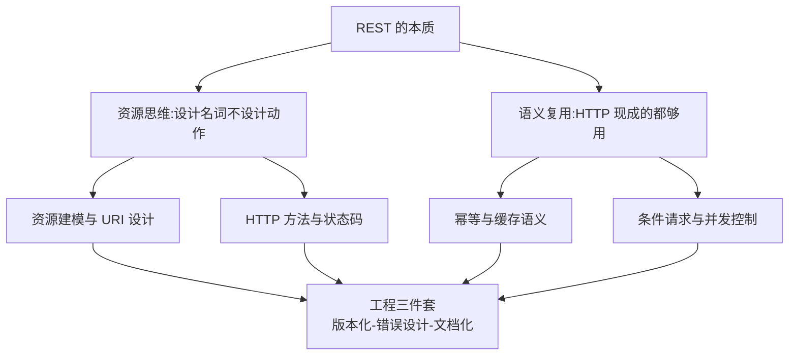

# REST 设计系列导读 · 把 HTTP 用对

> 📖 本系列共 7 篇（0_导读 + 6 正文），覆盖 REST 设计整个知识面：风格与约束、HTTP 语义、资源建模、幂等安全、版本化、错误设计与文档化。
> 本篇是第 0 篇导读：先建立「复用 HTTP 既有语义」的心智模型，再决定读哪条路。

## 一、为什么需要这套系列

REST 是 API 设计的「通用语法」：微服务对外接口、开放平台、前后端契约，几乎全是 RESTful 风格。但学 REST 常见两种极端：

- **形式化照抄**：「POST /getUserList」套上 200 状态码的壳，动作全是动词、语义全靠文档解释——只是长得像 REST
- **原教旨争论**：纠结 HATEOAS 要不要做、资源建模是不是纯粹，却回答不了「这个接口的版本怎么升级、错误码怎么定」

这套系列的设计思路：**先建立「资源思维 + 语义复用」的心智模型，再逐个工程主题铺开**。主线是「把 HTTP 的既有语义用对」，支线是每个工程环节的具体约定。先会「用对方法与状态码」，再会「建模资源与设计 URI」，最后会「版本化、错误设计、文档化」三件工程必修。

## 二、全局心智模型：资源思维 + 语义复用

理解这个模型的三个要点：

1. **资源思维是分水岭**：RPC 风格想「调什么方法」（getUserList），REST 想「操作什么资源」（GET /users）。动作由 HTTP 方法表达（GET/POST/PUT/DELETE），资源由 URI 表达——这一步想通了，URI 设计就不需要背「最佳实践」。
2. **语义复用是 REST 的经济学**：HTTP 自带状态码体系（404/409/422）、缓存机制（ETag/Cache-Control）、并发控制（If-Match 乐观锁）——重造这些约定（自定义错误码体系、自己发明缓存头）就是在为「不知道 HTTP 有什么」付费。
3. **API 是长期承诺**：发布的接口就是契约，版本化策略和废弃流程必须在第一个版本就想清楚，不是出了不兼容才补。

> tips：(风格 vs 协议) REST 是「架构风格」（Fielding 论文里的约束集合），HTTP 是「协议」——REST 说的是「怎么用好 HTTP」，不是「HTTP 的替代品」。所以「RESTful 接口报错返回 200 + error 字段」是把 HTTP 语义架空的反模式：协议语义还在，你却视而不见。

## 三、系列导航表（7 篇）

| 序号 | 篇目 | 深度 | 一句话定位 | 对标参考 |
|---|---|---|---|---|
| 0 | 系列导读 | 全景 | 资源思维 + 语义复用心智模型 + 阅读路径 | - |
| 1 | REST 是什么：风格与约束 | 入门 | Fielding 六约束：资源/统一接口/无状态/缓存/分层 | Fielding 论文 |
| 2 | HTTP 语义用对 | 入门 | 方法语义/状态码体系/头字段的正确使用 | RFC 9110 |
| 3 | 资源建模与 URI 设计 | 入门 | 名词化资源/层级关系/过滤分页排序约定 | RESTful Web APIs |
| 4 | 幂等与安全语义 | 入门 | 方法幂等矩阵/重试安全/If-Match 乐观锁 | RFC 9110 |
| 5 | 版本化与演进 | 入门 | URL vs 头版本/兼容性原则/废弃流程 | GitHub/Stripe 实践 |
| 6 | 错误设计与 OpenAPI 规范 | 入门 | RFC 9457 问题细节/错误码体系/文档化 | RFC 9457 |

## 四、进阶定位

本系列按主题粒度分层规则定「小」（约定为主、机制少），只铺入门层：

| 层级 | 定位 |
|---|---|
| 入门层 | 7 篇铺全 REST 设计知识面（本系列全部） |
| 特性层/专题层 | 暂不建——深度内容并入入门层各篇 + tips |
| 整合层 | 不建（demo 价值低） |

联动说明：幂等机制本身 → 分布式理论系列（tips 互指）；gRPC/GraphQL 等其他 API 风格只在篇 1 选型视角点出。

## 五、入门读者最容易踩的 3 个认知误区

### 误区 1：以为 URI 里不能有动词就是 REST

「把 /getUserList 改成 /user/list」不是资源思维，只是给动词挪了个位置。资源思维的关键是**问「操作的是什么东西」**：用户列表是资源（/users），「获取列表」这个动作由 GET 表达，根本不需要出现在 URI 里。判断标准：同一个资源，换不同方法应该代表不同操作（GET /users 列表 vs POST /users 创建），如果你的 URI 换方法没有意义，说明还是动作思维。

### 误区 2：以为状态码只有 200 和 500

把所有业务错误都包成 200 + 自定义 code 字段，是「协议架空」的典型。HTTP 状态码是给「中间层」看的：网关的重试策略、监控的告警分类、客户端 SDK 的错误处理，全部依赖状态码语义（4xx 客户端别重试 / 5xx 可以重试 / 429 限流退避）。架空它们 = 这些基础设施全部失明。正确姿势：传输层语义用状态码，业务错误细节用响应体（RFC 9457 problem details）表达——两层各司其职。

### 误区 3：以为版本化就是「URL 里加个 v2」

URL 加 /v2/ 只是最显眼的一种手段，不是策略本身。版本化的核心是**兼容性管理**：哪些变更是兼容的（加可选字段）不用升版本，哪些是不兼容的（删字段/改语义）必须升版本、旧版本保留多久、怎么通知迁移。没有兼容性原则的版本号只是装饰——第 5 篇专门讲这套演进纪律。

> tips：(契约思维) 从接口发布那一刻起，API 就是「合同」：调用方按合同写代码，你改合同要给过渡期。REST 的工程三件套（版本化/错误设计/文档化）全都是合同管理的不同侧面。

## 六、怎么读这套系列

- **零基础/刚入行**：从 0 顺序读到 6，每天 2 篇，三天建立完整 REST 认知
- **日常写接口**：重点读 2（HTTP 语义）、3（资源建模）、6（错误设计）——直接对应「定义一个新接口」的日常动作
- **平台/开放接口负责人**：5（版本化）+ 6（文档化）是必修——接口多了之后，演进纪律比单个接口的设计更值钱

---

下一篇将讲 **1_REST 是什么：风格与约束**：从 Fielding 论文的六个约束说起，「像 Web 一样设计 API」到底指什么——待正文落盘后补链接。
