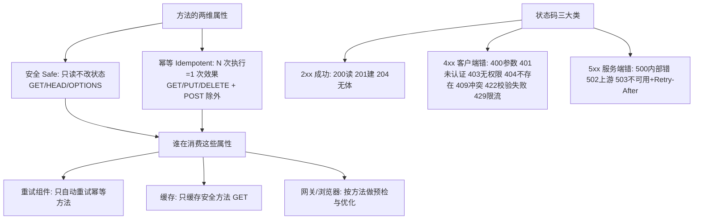
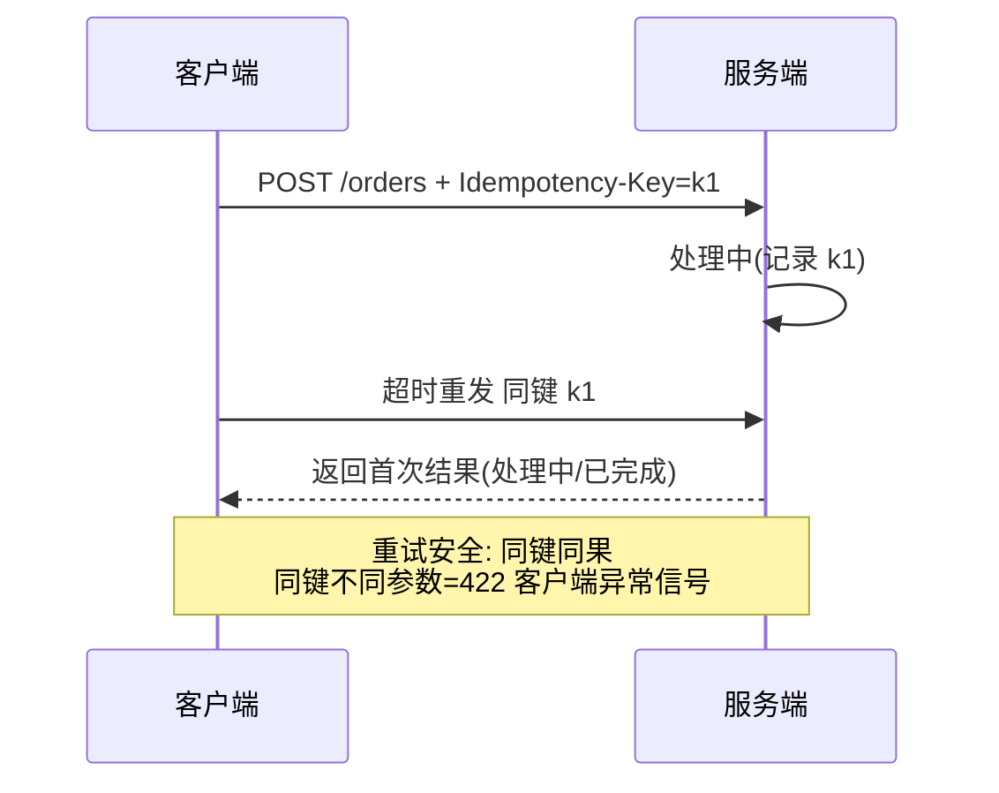

# HTTP 语义用对

> **一句话摘要**：HTTP 二十年标准化攒下了一整套「免费语义」——方法的幂等/安全属性、状态码的机器可读含义、缓存的头部契约、条件请求的并发防护——**全部 POST + 200 一把梭，等于把这套语义红利全部退回**；本篇讲怎么把方法、状态码、缓存头三件套吃满。

> **本文核心**：机制链 = **方法自带属性（安全/幂等）→ 属性决定网关/重试/缓存能不能帮你 → 状态码让机器免开包判结果 → 缓存头与条件请求让中间层替你干活**——语义是「给整个 HTTP 生态看的契约」，不只给前端。

前置阅读：[REST 是什么](./1_REST是什么-风格与约束-入门.md)。幂等的完整防线见[幂等与去重](../../../distributed-theory/入门层/从零开始认识分布式理论系列/10_幂等与去重-入门.md)。

## 1. 背景：语义是写给谁的

一个接口的消费者不只是前端——**网关（限流/路由）、CDN/代理（缓存）、重试组件（超时重发）、监控（状态码统计）、浏览器（预检/缓存）**都在按 HTTP 语义解读你的接口。`POST /createOrder` 返回 200 一把梭时：CDN 不敢缓存（POST 不可缓存）、重试组件不敢重发（POST 不幂等，重复下单谁负责？）、监控只能数 200（所有业务错误都藏进响应体）——**语义退回，生态服务全部失效**。

## 2. 核心机制：方法属性与状态码体系

- **方法属性表（必背的免费契约）**：GET 安全且幂等（只读）、PUT 幂等（全量替换，N 次同结果）、DELETE 幂等（删一次与删 N 次同效果）、PATCH 非幂等保证（增量修改，两次相同 patch 可能不同效果）、POST 全不保证。**属性是方法的定义不是实现的承诺**——你把 DELETE 写出副作用叠加，是在打破整个生态的假设。
- **状态码的机器价值**：429 让调用方自动退避；409 让客户端感知冲突重读；401/403 让认证层区分「没登录」与「没权限」；503+Retry-After 是限流与停机的标准握手。**把业务错误全塞 200 + 错误码字段，调用方只能开包解析**——通用组件（网关重试、熔断器、监控大盘）全部失明。
- **条件请求与并发防护**：`If-Match: ETag` 让更新带上「我基于的版本」——服务器版本不符返回 412，**乐观锁免建自制版本字段**（并发写冲突的标准 HTTP 解法）。
- **缓存头三件**：`Cache-Control`（谁能缓存多久）、`ETag/Last-Modified`（校验器）、`Expires`（旧式过期）——GET 资源声明了可缓存性，CDN/网关自动卸载重复流量（REST 缓存约束的落地机制）。

## 3. 落地实践：语义检查清单

1. **方法对位**：读用 GET、全量替换用 PUT、增量改用 PATCH、创建用 POST、删除用 DELETE；动作类操作用「子资源 POST」折中（`POST /orders/123/cancellation`——保留 POST 语义又不破坏资源式 URL）。
2. **状态码分层**：传输层问题（4xx 客户端/5xx 服务端）与业务错误码（响应体 business_code）双层共存——**HTTP 层告诉「调用发生了什么」，业务层告诉「业务结果是什么」**。
3. **幂等显式声明**：POST 创建类接口配套幂等键（Header 幂等键字段 + 服务端防重，机制见幂等篇）；PUT/DELETE 依赖幂等属性放心重试。
4. **条件更新**：资源带 ETag，更新带 If-Match——412 冲突是标准并发错误码。
5. **缓存声明**：可缓存 GET 显式 `Cache-Control: max-age`；不可缓存的写明 no-store——「默认不声明」= 中间层按保守策略处理（多半等于不缓存）。

## 4. 生产视角：语义误用的形态

- **超时重试引发的重复下单**：POST 下单接口无幂等键，客户端超时重发——两单。若团队约定「POST 不自动重试」，又丢失了瞬时故障的自愈能力。正解：POST + 幂等键（重试安全与自愈兼得）。
- **200 掩盖故障的监控盲区**：全接口 200 + code 字段——错误率监控永远是绿的，故障靠用户投诉发现。状态码回归语义后，5xx 突刺在监控上一目了然。
- **GET 带副作用的事故**：`GET /deleteUser?id=1`——预取/爬虫/浏览器预加载触发删除。安全方法属性被破坏的典型事故，教训写进 RFC 9110 的原因。
- **缓存了不该缓存的**：个人数据接口没声明 no-cache，CDN 把 A 用户的响应给了 B 用户——缓存头不是可选项，是安全边界。
- **404 滥用**：资源不存在返回 404、参数错误也 404、权限不足也 404——调用方无法区分「改参数」还是「改权限」还是「别调了」，404 的信息量归零。

## 5. 主流系统怎么做：语义的行业惯例

| 场景 | 行业惯例 | 机制要点 |
|---|---|---|
| 分页 | `page/size` 或 cursor + `Link` 头 | RFC 8288 的 Link 头是标准分页引导 |
| 批量操作 | 子资源 POST（`POST /orders/batch-ops`）或批量端点 | 保留 POST 语义 + 部分成功结果集 |
| 限流反馈 | 429 + `Retry-After` + `X-RateLimit-*` | 让调用方自调节奏而非盲试 |
| 幂等键 | `Idempotency-Key` 头（Stripe 惯例） | 服务端按键防重 + 返回首次结果 |
| 错误结构 | RFC 9457（Problem Details） | 错误体的标准化格式（type/title/detail），机器可解析 |

规律：**语义红利都在标准里写好了**——行业惯例只是把 RFC 的既有机制用起来；自创约定前先查标准，多半有人解决过。

## 6. 典型场景

- **开放 API**（对外级）：语义标准 = 第三方接入成本——状态码/幂等键/Problem Details 全套对齐标准。
- **网关后端服务**（内部级）：网关按方法语义自动重试（GET 幂等重试、POST 带 key 重试）——语义规范是网关自动化的前提。
- **CDN 分发**（缓存级）：商品详情 GET + max-age——缓存命中率即流量卸载率。

## 7. 与相邻概念的区别

- **安全 vs 幂等**：安全=不改服务器状态（GET）；幂等=重复执行同效果（PUT/DELETE）——DELETE 幂等但不安全，POST 既不安全也不幂等；两维四象限，方法各居其位。
- **状态码 vs 业务错误码**：传输语义 vs 业务语义双层——层级混用（业务错也 500）或单层化（全 200）都让某一层生态失明。
- **ETag vs 版本号字段**：机制同构（乐观锁）——ETag 是 HTTP 标准化封装（配合 If-Match/412 免自制协议）。
- **本篇 vs 幂等篇（理论系列）**：理论篇讲幂等的三层防线体系，本篇讲 HTTP 方法自带的幂等语义如何接入该体系——组件级与协议级。

## 8. 常见误区与不适用

- **「GET 不能带 body 所以没法传复杂条件」**：复杂查询用查询参数 + 约定（或 POST 查询端点显式声明非缓存）——规范里写清楚，别默默违反 GET 语义。
- **「PATCH 幂等所以随便重试」**：PATCH 不保证幂等（`/inc` 类增量操作重发会重复累加）——增量操作配幂等键或改设计为 PUT 全量。
- **「4xx 是前端的事」**：429/412/409 是服务端给调用方的**协作信号**（退避/刷新重读/冲突处理）——4xx 设计是 API 体验的核心部分。
- **「缓存头是性能优化，以后再加」**：缓存头是安全声明（个人数据 no-store 是隐私边界）——上线第一天就该有，事后补是风险敞口期。
- **不适用**：流式/推送交互（WebSocket/SSE 另有语义）；二进制高频 RPC（语义红利被性能需求压过——REST 篇的场景边界）。

## 9. 你们可能会问

- **POST 幂等键的时序细节？** 客户端生成唯一键（UUID）→ 重发带同键 → 服务端按键查首次结果：处理中返回 425/等待、完成返回原结果、失败返回可重试错误——Stripe 惯例的完整闭环。
- **PUT 和 PATCH 的实际分界？** 全量替换（客户端拥有完整资源表示）用 PUT；部分更新用 PATCH——PUT 的幂等性来自「全量」，部分更新用 PUT 反而会丢字段（未传字段被清空）。
- **状态码到底要用多细？** 原则：调用方能据此行动的才细分——401/403/404/409/429 各触发不同客户端行为，值得分；430 这种自定义码信息量为零不值得。
- **内部服务也要这么讲究？** 网关与重试组件同样在内部生效——语义规范是「网关自动化」的前提；内部可以放宽粒度，不建议反向（全 200）。
- **GraphQL/gRPC 场景这些语义怎么办？** 它们自带各自语义体系（gRPC 状态码/GraphQL errors）——HTTP 语义红利是 REST 风格的专属资产，选了别的风格就按各自的来。

## 10. 一句话总结 + 5W 速记卡 + 自测三问

**🎯 核心带走**：

- **核心一句话**：HTTP 语义 = 方法属性（安全/幂等）+ 状态码（机器可读结果）+ 缓存与条件头（中间层协作契约）——用满是免费红利，不用则生态服务全失明。
- **链条复述**：方法定属性 → 属性决定重试/缓存/网关行为 → 状态码分层（HTTP 层传输语义 + 业务码）→ 条件请求管并发 → 缓存头管中间层。
- **失效点与边界**：流式/RPC 场景另论；语义规范没有「以后再加」——缓存头是安全边界。

**5W 速记卡**：

| 维度 | 内容 |
|---|---|
| What | 方法两维属性 + 状态码体系 + 条件请求 + 缓存头 |
| Why | 语义是写给网关/CDN/重试组件/监控的契约 |
| When | 每个接口的定义、网关策略配置、限流对接 |
| Where | HTTP 层（方法/码/头）与业务层（错误码）双层 |
| How | 方法对位 → 状态码分层 → 幂等键 → ETag → 缓存声明 |

💡 **实战提示**：POST 配幂等键（重试安全+自愈兼得）；错误结构用 RFC 9457；个人数据 no-store 是隐私边界；429+Retry-After 是限流握手。

**开放问题**：HTTP/2 与 HTTP/3 改了传输层（多路复用/QUIC），方法与状态码语义层二十年未变——语义层的稳定是 Web 生态最大的复利资产吗？

**决策（何时用）**：一切 HTTP 接口推荐语义检查清单过堂；推荐 RFC 9457 + Idempotency-Key 两个标准直接引入团队规范。

**Trade-off（代价与反方案）**：语义纪律用「设计约束（方法对位/资源建模）」换「生态自动化（重试/缓存/监控/网关）」；反方案——全 POST 自由格式（零约束，代价是组件失明与自制协议）、二进制 RPC（性能，代价是 HTTP 生态出局）。

**演进视角**：从 HTTP/1.0 的简单方法到 RFC 9110（2022 方法语义权威化）、RFC 9457（错误标准化）——三十年间语义层只增不改，「契约复利」是 HTTP 生态最深的时间护城河。

---

**下篇预告**：统一接口的第一块基石——下一篇[资源建模与 URI 设计](./3_资源建模与URI设计-入门.md)讲资源怎么切、URI 怎么排、集合与成员的关系怎么表达。

---

## 📌 数据与事实声明

方法属性（安全/幂等）与状态码语义出自 RFC 9110「HTTP Semantics」（2022）；Problem Details 出自 RFC 9457；Idempotency-Key 惯例出自 Stripe API 公开文档；Link 分页出自 RFC 8288。以 RFC 原文为准。

## 📚 参考资料

| 类型 | 标题 | 来源 |
|---|---|---|
| 标准 | RFC 9110（HTTP Semantics） | ietf.org |
| 标准 | RFC 9457（Problem Details for HTTP APIs） | ietf.org |
| 文档 | Stripe API: Idempotency | docs.stripe.com |
| 系列文章 | REST 是什么（上一篇） | 本仓库同系列 |
