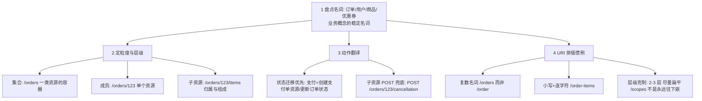

# 资源建模与 URI 设计

> **一句话摘要**：资源建模是 REST 设计的主战场——**把业务名词切成资源（名词化）、用层级表达归属（/users/123/orders）、把动作翻译成子资源或状态迁移**；URI 是「资源的名字」不是「接口的路径」，命名质量的判据是「不认识你系统的人能否猜出结构」。

> **本文核心**：机制链 = **识别资源（业务名词盘点）→ 定粒度（粗到细的层级：集合→成员→子资源）→ 动作翻译（状态迁移优先、子资源 POST 兜底）→ URI 排版惯例（复数/小写/层级≤2-3）**——建模错误的根源是「按页面/按数据库表建模」而不是「按业务概念建模」。

前置阅读：[REST 是什么](./1_REST是什么-风格与约束-入门.md)。方法语义配合见[HTTP 语义用对](./2_HTTP语义用对-入门.md)。

## 1. 背景：为什么「建模」比「写接口」难

写接口是体力活，切资源是脑力活——同一个订单系统，按页面建模（`/orderListPage`、`/orderDetailPanel`）会切出一堆与前端绑死的碎资源；按数据库建模（`/t_order`）把存储结构裸奔给调用方；按业务概念建模（`/users/{id}/orders`）才获得演进能力——**页面会改版、表会重构，业务概念（订单/用户/商品）相对稳定**。资源建模的本质：找到业务里的「稳定名词」。

## 2. 核心机制：四步建模法与 URI 惯例



四步的关键判断（追问链）：

- **名词从哪来？** 业务术语表 + 领域模型的实体——不是页面、不是表。判定法：这个词在业务方嘴里存在吗？（业务方说「订单」「退款单」，不说「订单列表页」）。
- **层级多深？** 归属关系用嵌套（`/users/123/orders` 表达「123 的订单」）——但超过 2-3 层就该「扁平化」：深层资源直接挂根（`/order-items/456`）并用查询参数过滤（`?userId=123`）。**嵌套表达归属，扁平表达高效**；`/users/123/orders/456/items/789/reviews` 这类五层嵌套是维护噩梦（任何上级 ID 变更全链作废）。
- **动作怎么翻译？** 优先级三档：① 状态迁移（「取消订单」= PATCH 订单状态到 cancelled）；② 子资源化（「取消」作为资源：`POST /cancellation`，有独立的生命周期与可追溯性——金融场景偏爱，冲正有迹可循）；③ 控制器式折中（`POST /orders/123/cancel`——业界常见，显式承认偏离纯资源式）。
- **过滤/分页/排序怎么表达？** 查询参数（`?status=paid&page=2&sort=-createdAt`）——参数是「同一资源的视图切换」，不动 URI 结构。

## 3. 落地实践：一次建模实战

需求：「用户查看自己的订单列表、取消订单、给订单开发票」：

```text
GET   /users/123/orders?status=paid&page=2     列表(过滤+分页)
GET   /orders/456                               单个订单(扁平化, 不嵌在 users 下)
POST  /orders                                   创建
PATCH /orders/456                                更新(含状态迁移 cancelled)
POST  /orders/456/cancellation                  取消(子资源: 可追溯的动作记录)
POST  /orders/456/invoice                       开发票(动作子资源)
```

设计决策的记录：订单成员从 `/users/123/orders/456` 扁平化为 `/orders/456`——因为订单会被客服/财务/风控多场景访问，挂在 user 之下让非属主访问路径尴尬（权限校验与路径耦合）；归属查询用 `?userId=` 表达。**每个扁平化/嵌套决策都要有理由并写进 API 设计文档**。

## 4. 生产视角：建模失误的形态

- **按表建模的存储耦合**：`/t_order_main_v2/selectByMap`——表重构 = 所有调用方重构。资源式命名的价值在存储演进时兑现。
- **动词 URL 的矩阵爆炸**：`/getOrderById`、`/getOrdersByUserId`、`/getOrdersByStatus`——组合维度 × 动词 = 接口数爆炸；资源+查询参数一个端点覆盖 N 种组合。
- **深嵌套的路径脆弱**：`/users/123/orders/456/items/789`——用户合并/订单迁移后旧路径全死。层级克制是稳定性投资。
- **单复数混用与大小写混乱**：`/Order` 与 `/orders` 并存、驼峰 URI——工具链（SDK 生成/文档/缓存键）按字符串处理 URI，不一致即事故源；惯例用 linter 强制。
- **动作资源泛滥**：什么操作都 `POST /xxx-operations`——回到 RPC 只是换了马甲；子资源化只用于「真有生命周期需要记录」的动作。

## 5. 主流系统怎么做：公开 API 的建模惯例

| 惯例 | 代表 | 机制要点 |
|---|---|---|
| 版本入路径 | `/v1/orders`（GitHub/Stripe） | 显式版本路由；配合版本化策略（篇 5 展开） |
| 动作子资源 | Stripe `POST /payment_intents/:id/capture` | 金融动作的子资源化范本 |
| 扁平 + 过滤 | GitHub `GET /repos/{owner}/{repo}/issues?creator=x` | 深层归属扁平化 + 查询参数表达 |
| 分页链接头 | RFC 8288 Link 头 | 分页导航标准化（HTTP 语义篇） |

规律：**公开 API 的建模高度趋同**（复数/小写/v1/扁平化/动作子资源）——趋同处即是惯例，自创前先对齐行业默认。

## 6. 典型场景

- **资源清晰的领域**（订单/商品/账户）：四步建模法直接适用，名词天然。
- **流程/计算型操作**（报表生成/风控审批）：名词化困难——「计算结果也是资源」（`POST /risk-assessments` 创建一次评估，返回评估资源），把动作产物资源化。
- **多租户/多层级归属**：租户位放路径（`/tenants/7/orders`）还是放 Header/Token——路径显式（缓存友好）vs 隐式（安全由令牌定，路径简洁）；按缓存与审计需求定。

## 7. 与相邻概念的区别

- **资源 vs 表 vs 页面**：三种建模锚点的稳定性排序——业务名词 > 数据表 > 页面；资源建模选最稳的锚。
- **子资源 vs 查询参数**：归属与组成用子资源（结构性）；视图切换用参数（非结构性）——「订单的明细」是子资源，「已支付的订单」是参数。
- **URI vs 资源**：资源是抽象概念，URI 是它的名字之一（同一资源可有多个 URI/表述）——URI 设计是「起名字」，资源建模是「想清楚是什么」。
- **本篇 vs DDD 领域建模**：资源建模是 API 层的名词盘点；DDD 是领域层的深度建模——后者是前者的上游输入（聚合根常对应顶级资源）。

## 8. 常见误区与不适用

- **「URI 即接口文档」**：URI 只承载资源身份，语义细节（参数/错误/分页）在文档（OpenAPI）——把一切塞进 URI 造出超长路径；URI 是名字，不是说明书。
- **「一律嵌套表达归属」**：归属有多个视角时（订单属于用户也属于商户）嵌套只能选一个视角——扁平 + 过滤对多视角更公平。
- **「动词绝对不能用」**：现实是动作子资源的折中被广泛接受——教条式禁动词的收益边际极低；判据是「资源化后是否有真实生命周期」。
- **「URI 设计一次定终身」**：资源是稳定的，URI 会因扁平化/版本化调整——设计文档记录决策理由，配合版本化策略（篇 5）管理变更。
- **不适用**：BFF 聚合层（按前端页面裁剪是 BFF 的天职——建模锚点不同）；内部调试端点（不必对外规范全量执行）。

## 9. 你们可能会问

- **复合资源怎么建模（订单+明细+支付信息一起返回）？** 资源表示可以聚合（GET /orders/456 返回含明细的完整表示）——资源粒度按「客户端常用获取单元」定；细粒度子资源并存（/orders/456/items）供按需访问。
- **过滤参数的命名规范？** 与资源字段同名（`?status=`、`?userId=`）——参数名与资源字段一致降低认知成本；时间范围用 `createdFrom/createdTo` 惯例。
- **URI 里用 ID 还是业务号？** 对外用业务单号（可读/防枚举，见[订单号实战](../../../distributed-id/入门层/从零开始认识分布式ID系列/8_订单号流水号设计实战-入门.md)）——内部主键不外泄的又一落点。
- **资源之间「关联」怎么表达（下单时关联优惠券）？** 创建请求体里带关联 ID（`{"couponId": "..."}`）；复杂关联关系本身可资源化（`/users/123/coupons`）——关系有多重要就多资源化。
- **怎么评审一份 URI 设计？** 四查：名词是否业务术语、层级是否 ≤3、动作是否已尝试资源化、参数是否与字段同名——四查过则结构合格，语义细节看文档。

## 10. 一句话总结 + 5W 速记卡 + 自测三问

**🎯 核心带走**：

- **核心一句话**：资源建模 = 盘点业务稳定名词 → 集合/成员/子资源定层级 → 动作翻译（状态迁移优先、子资源兜底）→ URI 惯例排版。
- **链条复述**：名词盘点（不按页面/表）→ 粒度决策（嵌套表归属、扁平保高效）→ 动作三档翻译 → 排版惯例（复数/小写/层级克制）→ 决策留文档。
- **失效点与边界**：BFF 例外；动作资源泛滥=换马甲 RPC；URI 是名字不是文档。

**5W 速记卡**：

| 维度 | 内容 |
|---|---|
| What | 四步建模法 + URI 排版惯例 + 动作翻译三档 |
| Why | 按「稳定业务名词」建模才获得演进能力 |
| When | 新 API 域设计、旧接口重构、API 规范制定 |
| Where | URI 路径与查询参数 |
| How | 盘名词 → 定层级 → 译动作 → 排版 → 文档留痕 |

💡 **实战提示**：层级 ≤2-3 层；过滤参数与字段同名；每个扁平化/嵌套决策写理由；对外 URI 用业务单号。

**开放问题**：GraphQL 的「schema 即文档」反过来质疑 URI 建模的价值——资源建模的判据会不会从「URI 可猜」迁移到「schema 可查」？

**决策（何时用）**：对外与跨团队 API 推荐四步建模全流程；BFF 与内部端点按各自锚点简化；推荐「API 设计文档 + 四查评审」固化为流程。

**Trade-off（代价与反方案）**：资源建模用「设计投入 + 建模共识成本」换「演进能力与工具链红利」；反方案——页面式建模（最快交付，代价是前端改版即重构）、RPC 自由命名（直白，代价是矩阵爆炸）；嵌套与扁平的权衡：表达力 vs 路径稳定性。

**演进视角**：URI 设计惯例十年高度稳定（复数/小写/v1）——稳定到「像HTML标签一样被默认接受」；演进发生在参数约定（分页/过滤/游标）与版本化策略上，命名本体已成行业公理。

---

**下篇预告**：方法的两个最重要属性专篇——下一篇[幂等与安全语义](./4_幂等与安全语义-入门.md)讲重试安全与只读语义的完整工程配合。

---

```mermaid
flowchart LR
    subgraph BAD ["反面锚点: 不稳定"]
        A1[页面式: /orderListPage] --> A2[改版即重构]
        B1[表式: /t_order_v2] --> B2[存储耦合裸奔]
    end
    subgraph GOOD ["正面锚点: 业务名词"]
        C1[/orders] --> C2[页面改版 表重构 均不受影响]
    end
    style A1 fill:#ffcdd2
    style B1 fill:#ffcdd2
    style C1 fill:#c8e6c9
```

## 📌 数据与事实声明

资源建模方法论与 URI 惯例综合自 REST 领域公开文献（Fielding 论文、HTTP API 设计指南类公开资料）与主流开放平台文档（GitHub/Stripe）的机制级观察；扁平化阈值（2-3 层）为行业惯例值。以各家 API 文档为准。

## 📚 参考资料

| 类型 | 标题 | 来源 |
|---|---|---|
| 文档 | GitHub REST API / Stripe API（建模惯例参照） | docs.github.com · docs.stripe.com |
| 论文 | Architectural Styles...（Fielding, 2000） | ics.uci.edu |
| 系列文章 | HTTP 语义用对（上一篇） | 本仓库同系列 |
