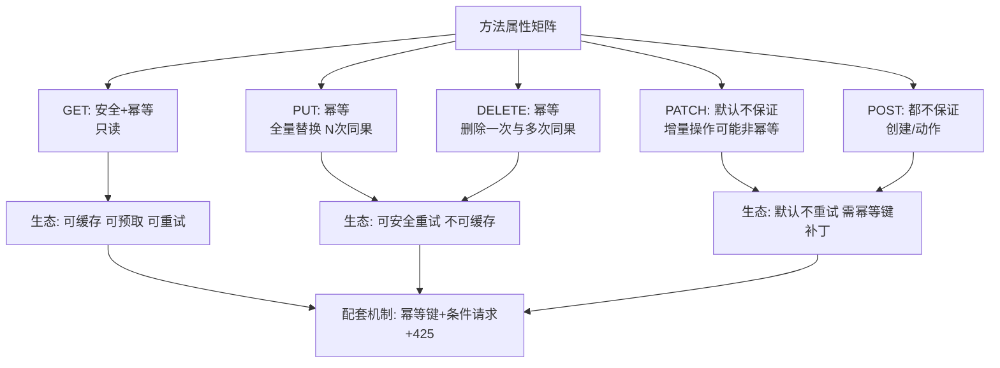
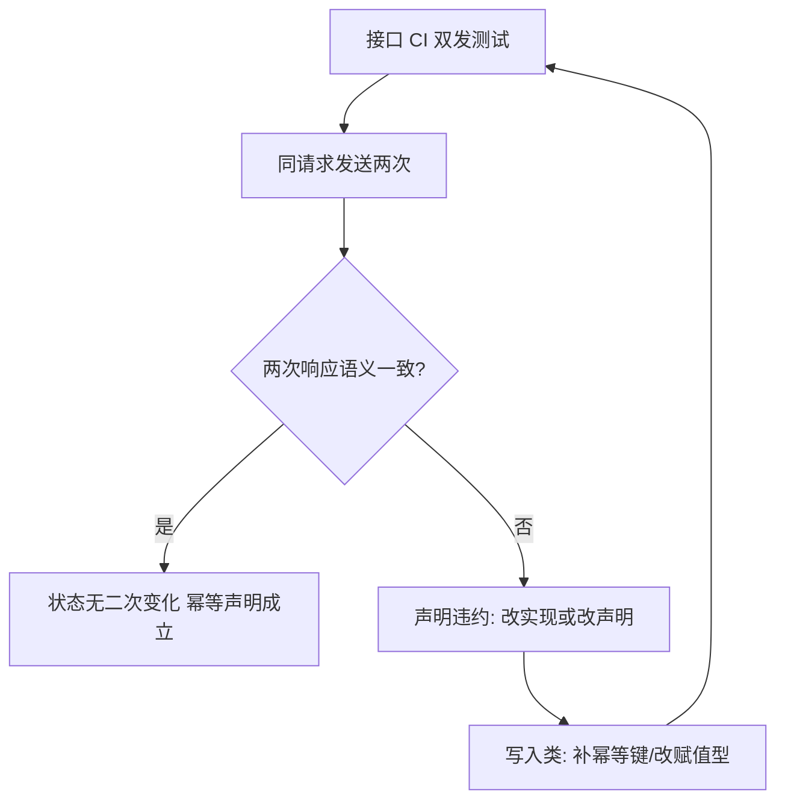

# 幂等与安全语义

> **一句话摘要**：幂等（重复执行 = 执行一次）与安全（只读不改状态）是 HTTP 方法的两大元属性——它们决定「重试组件敢不敢重发、缓存敢不敢存、负载均衡敢不敢转发」；方法声明只是契约的一半，**实现必须兑现声明**（GET 里藏副作用、PUT 做增量是双倍违规）；POST 的幂等缺口用幂等键补齐。

> **本文核心**：机制链 = **方法属性声明 → 生态组件按声明自动行为（重试/缓存/去重）→ 实现必须兑现否则契约崩塌 → POST 缺口用幂等键（HTTP 层补丁）+ 条件请求（并发防护）收口**——幂等是「给整个调用链的通行证」。

前置阅读：[HTTP 语义用对](./2_HTTP语义用对-入门.md)。幂等三层防线体系见[幂等与去重](../../../distributed-theory/入门层/从零开始认识分布式理论系列/10_幂等与去重-入门.md)。

## 1. 背景：属性为什么值钱

网络不可靠（理论系列第一公理）→ 请求会超时 → 客户端只有两个选择：不重试（可用性自弃）或重试（重复风险）。**幂等声明就是打破僵局的契约**：「放心重试，重复无害」。HTTP 把这个契约内建到方法里（GET/PUT/DELETE 幂等），于是整条调用链的组件都能据此自动化——重试器按方法自动决定重发策略、缓存按安全方法自动存储、网关按幂等性做请求去重。

这份契约的价值与脆弱性同源：**它基于诚实**——声明 GET 就必须真只读；一家撒谎（GET 里改数据），整条链路的组件对该域全部退回保守模式。

## 2. 核心机制：两维属性与工程配合



- **幂等的实现面**：PUT 幂等靠「全量替换语义」（客户端持完整表示，重复提交结果一致）；DELETE 幂等靠「删除语义天然收敛」（不存在也算成功——404 也视为达成）；**PATCH 是灰色区**——绝对增量（`balance += 100`）非幂等，绝对赋值（`balance = 100`）幂等——设计 PATCH 语义时显式选择并文档化。
- **POST 的幂等键补丁**（Stripe 惯例）：客户端生成唯一 `Idempotency-Key` → 重发带同键 → 服务端按键去重（处理中返回等待、完成返回首次结果）——把「创建」类操作改造为「可安全重试」，重试自愈与重复防护兼得（机制细节即幂等篇的三层防线在协议层的落点）。
- **条件请求管并发**：`If-Match: ETag` 更新——版本不符 412 冲突；`If-None-Match` 读——未变 304 省流量。乐观锁的 HTTP 标准化。
- **425（Too Early）**：重放仍处理中时的标准响应——告诉重试组件「再等等，别当失败」。

## 3. 落地实践：幂等语义的接口设计

```text
GET    /orders/456           安全: 不写审计日志以外的任何状态
PUT    /orders/456           幂等: 全量字段提交, 重复提交最终状态一致
PATCH  /orders/456           显式选择: 本接口字段均为「赋值型」=> 幂等(文档声明)
DELETE /orders/456           幂等: 删不存在返回 204(达成) 而非 404 报错
POST   /orders               幂等键: Idempotency-Key 头必填, 缺失 400
PUT    /orders/456           条件: 必带 If-Match, 缺失 428(Precondition Required)
```

五条纪律：① DELETE 的「幂等达成」语义写进文档（重复删除返回 204，让重试组件放心）；② PATCH 逐字段声明赋值型/增量型；③ POST 强制幂等键（开放 API 场景）；④ 更新接口强制 If-Match（并发安全从协议白拿）；⑤ 以上全部进 OpenAPI 文档（契约可见，不靠口口相传）。

## 4. 生产视角：语义违约的事故形态

- **GET 里埋计数的雪崩**：`GET /order/456` 顺带「已浏览次数 +1」——预取器/爬虫/监控探活把计数刷爆，且这些 GET 被缓存后计数随机丢失。副作用迁出 GET（浏览计数走异步上报 POST），是事故后的标准整改。
- **超时重试双扣款**：支付 POST 无幂等键 + 客户端重试——双扣。资损级事故的标配配置「POST 无键 + 超时自动重试」，两层各自「合理」，叠加即事故——**幂等键是把两层「各自的合理」串联安全的唯一粘合剂**。
- **PATCH 增量重发的积分翻倍**：`PATCH /points {"delta": 100}` 重发 = +200——增量语义与重试天然冲突；改赋值型（`{"balance": 300}`）或配幂等键，二选一。
- **If-Match 缺失的并发覆盖**：两个运营同时编辑同一商品，后提交覆盖先提交——乐观锁缺失的经典覆盖事故；If-Match/412 是协议级免费方案。

## 5. 主流系统怎么做：幂等语义的行业惯例

| 惯例 | 载体 | 机制要点 |
|---|---|---|
| Idempotency-Key | Stripe/开放平台 | 头部键 + 服务端结果缓存 + 冲突检测（同键不同参数报错） |
| 条件更新 | ETag + If-Match + 412 | HTTP 原生乐观锁 |
| 重试语义声明 | Retry-After / 425 Too Early | 服务端指挥重试节奏 |
| 删除收敛 | 204 on repeat | 幂等达成的表达惯例 |
| 写入防重 | 数据库唯一索引兜底 | 协议层之下的一致性最后防线（幂等篇） |

规律：**协议层（方法/头/状态码）管「表达与协作」，约束层（唯一索引/状态机）管「最终防线」**——两层都要，缺协议层则生态失明，缺约束层则协议被击穿。

## 6. 典型场景

- **开放 API**（对外级）：第三方网络环境不可控——幂等键 + 条件更新全套标配。
- **支付回调**（资金级）：回调重发是常态——回调处理接口天然按幂等设计（按外部流水号去重）。
- **移动端弱网**（客户端级）：弱网超时重发频繁——所有写接口幂等键全覆盖。

## 7. 与相邻概念的区别

- **HTTP 幂等 vs 业务幂等**：方法属性是「协议层契约」；业务幂等（幂等键/唯一约束/状态机）是「实现层防线」——协议层靠业务层兑现，业务层靠协议层表达。
- **幂等 vs 重试**：重试是动作，幂等是重试安全的前提——「自动重试」配置的正确性完全取决于方法的幂等声明真实。
- **安全方法 vs 只读权限**：安全是「无副作用」的语义声明；只读权限是「授权控制」——有只读权限的用户调用的也未必全是安全方法（PUT 有写权限），两套体系正交。
- **本篇 vs 幂等篇（理论系列）**：理论篇的体系全集（三层防线），本篇聚焦 HTTP 协议层那一层的落地。

## 8. 常见误区与不适用

- **「DELETE 返回 404 才是诚实」**：语义上「删除不存在的资源」目标已达成——返回 404 会让重试组件当失败继续重试；幂等达成的表达是 204。诚实与语义并不冲突：文档写明即可。
- **「PUT 天然幂等，随便实现」**：幂等是方法的定义属性——实现里放自增逻辑（`version+1` 每次递增）就把 PUT 做成了非幂等，属性违约。
- **「幂等键是服务端的事」**：键由客户端生成并跨重试保持——服务端只能「按收到的键去重」，客户端不发键等于没有。
- **「条件请求影响性能」**：ETag 计算的成本远低于一次并发覆盖事故——If-Match 对写接口应是默认而非可选。
- **不适用**：天然只读的纯查询服务（属性自动满足）；内部一次性任务端点（重试策略人工控制，协议层幂等可豁免——但要写明）。

## 9. 你们可能会问

- **幂等键的冲突检测（同键不同参数）为什么必要？** 防客户端 bug（键生成逻辑错误复用）——同键不同请求体 = 客户端异常信号，返回 422 让问题显形，而不是静默返回「上次的参数」。
- **PUT 与 PATCH 的幂等边界怎么向团队解释？** 一句话：「重复发送这个请求体，结果一样吗？」一样 → 可声明幂等；不一样 → 加幂等键或改全量——把判定权交给这一句话。
- **DELETE 404 vs 204 的选择影响什么？** 影响重试组件与客户端的终态判断——404=没删成（可能真没权限/已移路径），204=目标已达成；语义混用会让重试风暴化。
- **If-Match 在无版本概念的资源上怎么用？** 资源表示的哈希即可作 ETag（响应自动带）——不必自建版本字段；强校验（内容变 ETag 变）是默认要求。
- **怎么测试接口的幂等声明是真实的？** 自动化双发测试：同请求连发两次，断言第二次响应与首次语义一致且状态无二次变化——幂等声明进 CI 断言。

## 10. 一句话总结 + 5W 速记卡 + 自测三问

**🎯 核心带走**：

- **核心一句话**：幂等与安全是方法的契约属性——生态按声明自动化，实现必须兑现；POST 缺口用幂等键补、并发缺口用 If-Match 补。
- **链条复述**：方法属性声明 → 组件自动化（重试/缓存/去重）→ 实现兑现（GET 纯读/PUT 全量/DELETE 收敛）→ POST 幂等键 + PATCH 赋值化 → 条件请求与 412 收并发。
- **失效点与边界**：声明与实现违约即契约崩塌；纯查询服务天然满足；一次性任务端点可显式豁免。

**5W 速记卡**：

| 维度 | 内容 |
|---|---|
| What | 两维属性矩阵 + 幂等键 + 条件请求 + 425 |
| Why | 网络不可靠 → 重试必然 → 幂等是重试安全的通行证 |
| When | 写接口设计、重试策略配置、弱网客户端场景 |
| Where | 协议层（方法/头/码）+ 约束层（唯一索引/状态机） |
| How | 声明诚实 → 实现兑现 → POST 补键 → If-Match 收并发 → CI 双发测试 |

💡 **实战提示**：DELETE 重复返回 204；PATCH 字段逐个声明赋值/增量；幂等键同键不同参数返回 422；幂等声明进 CI 自动断言。

**开放问题**：HTTP 的方法属性体系（安全/幂等）会不会被更细的「效果声明」标准扩展（如「可重复但不可并发」）——语义粒度会继续细分吗？

**决策（何时用）**：所有写接口推荐幂等设计评审（五条纪律过堂）；开放/弱网场景推荐幂等键强制；推荐「双发测试」固化为接口 CI 门禁。

**Trade-off（代价与反方案）**：幂等纪律用「接口设计约束 + 键管理成本」换「重试安全与组件自动化」；反方案——禁止自动重试（安全，代价是可用性自弃）、人工处理重复（零设计，代价是运营与客诉）；DELETE 404/204 之争的本质：字面诚实与语义协作的权衡，协议语境下协作优先。

**演进视角**：从 HTTP/1.0 的隐含约定到 RFC 9110 的权威定义再到 Idempotency-Key 的行业标准化（2010s Stripe 推广）——幂等语义三十年从「方法自带」走向「方法 + 键」双轨，协议与业务两层的合流仍在继续。

---

**下篇预告**：接口活着就会变——下一篇[版本化与演进](./5_版本化与演进-入门.md)讲变更怎么不破坏既有调用方。

---



## 📌 数据与事实声明

方法属性权威定义出自 RFC 9110；425/428 状态码出自 RFC 8470/6585；Idempotency-Key 与冲突检测惯例出自 Stripe 公开文档；事故形态为公开工程实践归纳。以 RFC 与官方文档为准。

## 📚 参考资料

| 类型 | 标题 | 来源 |
|---|---|---|
| 标准 | RFC 9110（方法语义）/ RFC 6585 / RFC 8470 | ietf.org |
| 文档 | Stripe API: Idempotency | docs.stripe.com |
| 系列文章 | 幂等与去重（理论系列全集） | 本仓库 distributed-theory/ |
