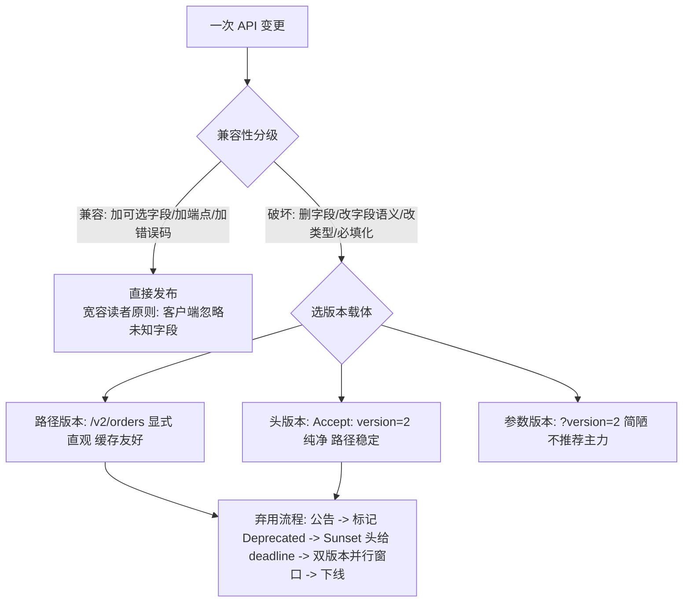
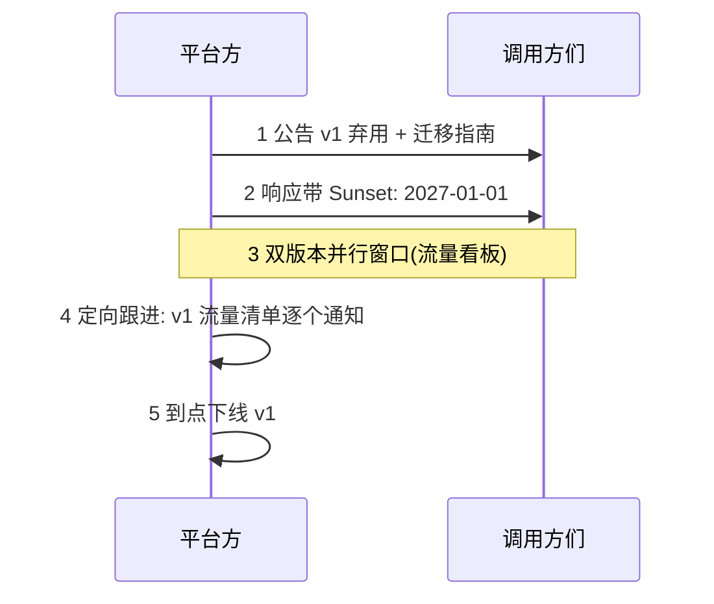

# 版本化与演进

> **一句话摘要**：API 一旦有人调用就不再属于你——**兼容性变更（加字段/加端点）直接做，破坏性变更（删字段/改语义）必须版本化**；版本化的三选一（路径 `/v1`、头部、参数）与「宽容读者/严谨写者」原则、弃用流程（公告→标记→下线窗口）共同构成演进体系——版本是演进的管理手段，兼容性设计才是演进的主体。

> **本文核心**：机制链 = **变更分级（兼容/破坏）→ 兼容变更走「宽容读者」（客户端容忍多余字段）→ 破坏变更走版本化（路径/头/参数三载体）→ 弃用流程（Sunset 头+公告+双版本窗口）→ 长期靠「加法演进 + 能力协商」推迟版本爆炸**——版本号是最后的手段，不是演进的第一反应。

前置阅读：[REST 是什么](./1_REST是什么-风格与约束-入门.md)（统一接口的演进价值）、[资源建模](./3_资源建模与URI设计-入门.md)。本文的「宽容读者」思想与分布式系统演进一脉（[架构演进篇](../../../distributed-system-design/入门层/从零开始认识分布式系统设计系列/2_系统架构演进全景-入门.md)）。

## 1. 背景：为什么 API 会「不再属于你」

上线那一刻起，你不知道谁在调用、用什么语言、多久才升级——移动端老版本可能在线两年，第三方集成商可能从不升级。任何「顺手改一下」都可能砸掉未知数量的调用方。于是 API 演进的核心问题：**怎么在「必须变化」与「不能破坏」之间长期共存？** 答案分两层：多数变更设计成兼容（根本不用版本化），少数破坏性变更用版本机制隔离（下策但必要）。

## 2. 核心机制：变更分级与版本三载体

- **兼容变更清单**（加法演进）：响应加新字段（宽容读者自动忽略）、请求加可选参数、新增端点、新增错误码、放宽校验。**每次设计变更先问「能做成加法吗」**——加法演进让 90% 的变更无需版本化。
- **破坏变更清单**：删/改字段名与类型、字段语义变化（同名字段含义变了）、必填化、错误码语义变化、默认值变化。这些必须进新版本。
- **版本三载体的取舍**：路径版本（`/v1/`）直观、调试友好、缓存键天然区分——行业主流（GitHub/Stripe）；头版本（`Accept: application/vnd.api+json; version=2`）路径稳定但调试与路由不直观——理念派选择；参数版本最弱（可被丢弃/缓存混淆），只配做临时灰度手段。**主流答案：路径版本 + 宽容读者**。
- **弃用流程的行业标准**：响应带 `Deprecation` 与 `Sunset` 头（RFC 8594）声明弃用与下线时间 + 文档公告 + 双版本并行窗口（老版本至少覆盖一个升级周期）+ 流量观测（老版本调用方清单，定向通知）——「直接下线」是对调用方的违约。

追问链：**为什么「宽容读者」这么重要？**——它是加法演进的基石：客户端忽略未知字段 → 服务端永远可以加字段；反之「严谨读者」（遇未知字段报错）把每次加字段都变成破坏变更。**版本粒度怎么定（大版本 or 小版本）？**——API 版本只按破坏性变更开大版本（v1→v2）；小修小补靠兼容加法，否则版本爆炸（v37）等于没有版本。**并行双版本的成本？**——双份维护与测试；所以版本频率要克制，版本化是下策的证据就在这个成本上。

## 3. 落地实践：一套可执行的演进规范

1. **变更分级评审**：每次 API 变更先打标签（兼容/破坏）——破坏变更触发版本流程，兼容变更直接发布。
2. **宽容读者写进客户端规范**：解析响应忽略未知字段（各语言 JSON 反序列化默认配置核对一遍——某些严格模式会炸）。
3. **弃用四件套**：Deprecation/Sunset 头 + 变更公告（含迁移指南）+ 双版本窗口（如 6 个月量级，按调用方类型定）+ 老版本流量看板。
4. **版本化范围纪律**：版本覆盖整个 API 面（v1/v2 是两个 API），不做「单端点版本化」——细粒度版本的管理成本指数上升。
5. **OpenAPI 多版本并存**：每版本独立 spec 文件，diff 工具做变更审查（破坏变更在 CI 被自动识别）。

## 4. 生产视角：演进失控的形态

- **「V2 地狱」**：每个需求都开新版本（v37）——版本管理成本吞掉团队；根因是「不敢做兼容变更」（客户端严谨读者炸了 v1）或「把兼容变更也版本化」。修法：宽容读者补课 + 变更分级纪律。
- **静默破坏**：响应字段类型从数字变字符串（JSON 序列化配置变更顺手改的）——老客户端解析炸了。防线：OpenAPI 契约测试（CI 中 diff 检测破坏变更）。
- **弃用永远下不了线**：老版本双轨三年下不去——总有「还没升级」的长尾调用方。机制：Sunset 硬时点 + 流量清单定向跟进 + 到点真下线（宽松的下线纪律 = 永久的双轨成本）。
- **内部 API 无版本化裸奔**：「内部系统一起发版就行」——直到微服务独立部署节奏分化，隐式耦合爆雷。内部 API 同样要变更分级（内部可简化版本化，但分级与契约测试不能省）。

## 5. 主流系统怎么做：版本化惯例对照

| 惯例 | 代表 | 机制要点 |
|---|---|---|
| 路径大版本 + 长窗口 | Stripe/GitHub（v1 存活十年+） | 版本克制 + 兼容加法为主 + 弃用公告体系 |
| 日期版本 | Stripe `2024-06-20` 版本 | 按接入日锁定版本——每个调用方冻结在自己接入日的语义 |
| Sunset 头 | RFC 8594 | 弃用下线时点的机器可读声明 |
| 契约 diff 门禁 | OpenAPI Diff in CI | 破坏变更自动拦截 |

规律：**头部玩家的共同点是「版本极少 + 兼容纪律极严」**——版本化的最高境界是很少需要版本化。

## 6. 典型场景

- **开放平台**（对外级）：调用方不可控——宽容读者 + 路径大版本 + Sunset 全套。
- **移动端配套 API**（碎片级）：App 版本碎片化严重——版本窗口按「最慢升级周期」定，或日期版本锁定语义。
- **内部微服务**（内部级）：变更分级 + 契约测试为主，路径版本可选——重点是独立部署下的契约可见。

## 7. 与相邻概念的区别

- **版本化 vs 兼容设计**：版本化处理破坏变更（下策），兼容设计避免破坏变更（上策）——把版本化当演进主体是本末倒置。
- **API 版本 vs 系统版本**：API 版本对调用方承诺语义；系统版本是内部交付节奏——两者解耦（内部每天发版，API 语义可以一年不变）。
- **宽容读者 vs 严格读者**：两种客户端解析哲学——宽容读者的生态才能加法演进；严格读者的世界每字段都是契约。前者是 Web 的现实选择。
- **本篇 vs 架构演进篇**：架构演进看「系统形态」的升级路径，本篇看「接口契约」的升级路径——同一演进思想在不同层的应用。

## 8. 常见误区与不适用

- **「开个 v2 就安全了」**：v2 只是隔离了破坏，v1 的维护、双轨成本、迁移引导全在后面——版本化的成本在「之后」，不是开关一按就完。
- **「兼容变更也要发版本，让调用方知情」**：知情靠变更公告与 changelog，不靠版本——版本泛滥稀释版本号的信息量（v19 和 v20 有啥区别？没人知道）。
- **「宽容读者是服务端的事」**：宽容读者是**客户端**的解析纪律——服务端能做的是「只做加法」；纪律落地要进客户端模板与 SDK 生成配置。
- **「内部接口不用管这些」**：独立部署的微服务间，接口契约就是唯一的同步机制——内部裸奔的爆雷只是时间问题（形态：联调互相等、发布互相卡）。
- **不适用**：纯内部一次性接口（同仓同发版，契约测试即可）；探索期原型（变更成本 < 版本化成本——但要设定「转正时补规范」的时点）。

## 9. 你们可能会问

- **双版本并行窗口设多长？** 按「最慢调用方的升级周期」：内部服务 1-2 个发布周期；移动端生态 6-12 个月；开放平台 12 个月起步 + 定向跟进——窗口是调用方现实决定的，不是团队意愿。
- **字段改名的兼容做法？** 加新字段 + 老字段标记 Deprecated 继续返回（双写窗口）→ 调用方迁移 → 下线老字段——「改名」本质是「加法 + 删法」两步兼容操作。
- **怎么发现「谁还在调 v1」？** 按调用方维度记版本流量（网关日志/SDK 上报）——弃用通知要有清单才不是广播噪响。
- **OpenAPI 契约测试测什么？** 三层：结构 diff（字段增删改类型）、语义快照（示例响应对比）、破坏规则断言（删字段/改类型直接 CI 红）——契约的 CI 化是演进纪律的技术兜底。
- **RESTful 的演进思想和数据库 schema 演进冲突吗？** 常冲突（API 加字段容易、DB 加列也要兼容旧行）——两端同时用加法演进 + 中间映射层适配；「一边改一边等另一边」是分布式协同的常态（事务系列的最终一致思想在此重演）。

## 10. 一句话总结 + 5W 速记卡 + 自测三问

**🎯 核心带走**：

- **核心一句话**：演进 = 兼容变更加法化（宽容读者）× 破坏变更版本化（路径大版本）× 弃用流程化（Sunset+窗口）——版本是下策，克制是美德。
- **链条复述**：变更分级 → 兼容直接发布 → 破坏进新版本 → 弃用四件套 → 契约测试兜底 → 流量看板驱动下线。
- **失效点与边界**：版本泛滥=没有版本；下线纪律宽松=永久双轨；内部接口同受约束。

**5W 速记卡**：

| 维度 | 内容 |
|---|---|
| What | 变更分级 + 三载体 + 弃用流程 + 契约测试 |
| Why | API 上线后不属于你——破坏的代价由未知调用方承担 |
| When | 每次 API 变更评审、版本规划、老版本治理 |
| Where | 路径/头/弃用头/CI 契约测试 |
| How | 分级 → 加法优先 → 版本克制 → Sunset 窗口 → diff 门禁 |

💡 **实战提示**：宽容读者进客户端模板；OpenAPI diff 进 CI；弃用带流量清单定向通知；版本号只按破坏性变更递增。

**开放问题**：如果「客户端自动适配」成熟（运行时协商字段），版本化会不会退化为历史——语义协商会取代版本契约吗？

**决策（何时用）**：有外部调用方的 API 全套适用；内部微服务至少做「变更分级 + 契约测试」；推荐「破坏变更必须走版本流程」写进团队 API 规范红线。

**Trade-off（代价与反方案）**：版本克制用「兼容设计的持续投入」换「低维护成本与调用方信任」；反方案——频繁开版本（短期省事，长期版本地狱）、永不破坏（过度克制，产品演进被 API 僵化拖死）；窗口长度的权衡：调用方友好 vs 双轨成本——窗口是商务与工程的共同决策。

**演进视角**：版本化实践从「URL 加 /v1」（2000s）到语义化版本（semver）到日期版本与 Sunset 标准化（RFC 8594, 2019）——工具越来越标准，但「兼容优先、版本克制」的价值观从未变过；API 的长期主义在这里具象化。

---

**下篇预告**：契约的最后一环——下一篇[错误设计与 OpenAPI 规范](./6_错误设计与OpenAPI规范-入门.md)讲错误体怎么结构化、文档怎么成为可执行的契约。

---

## 📌 数据与事实声明

Sunset 头出自 RFC 8594（2019）；Deprecation 头为 IETF 草案推进中的标准惯例；Stripe 日期版本与 GitHub 路径版本为各家公开文档惯例；OpenAPI Diff 工具为开源生态（openapi-diff 等）。以 RFC 与官方文档为准。

## 📚 参考资料

| 类型 | 标题 | 来源 |
|---|---|---|
| 标准 | RFC 8594（The Sunset HTTP Header Field） | ietf.org |
| 文档 | Stripe API versions / GitHub REST versioning | docs.stripe.com · docs.github.com |
| 工具 | OpenAPI Diff（契约测试） | github.com/OpenAPITools/openapi-diff |
| 系列文章 | 资源建模（本系列） | 本仓库同系列 |
