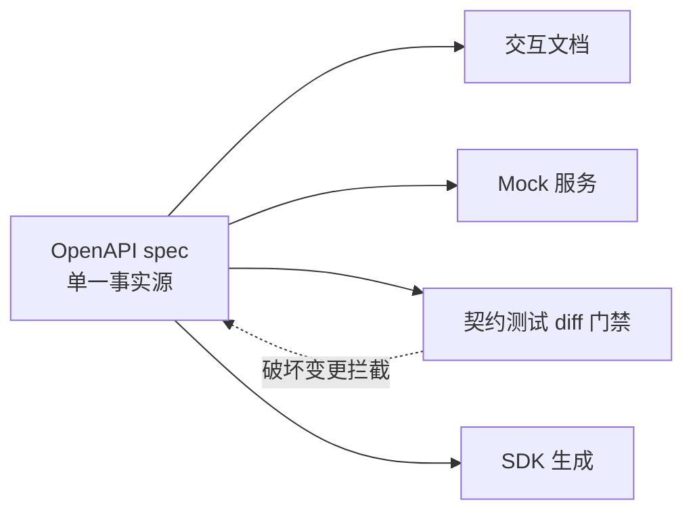

# 错误设计与 OpenAPI 规范

> **一句话摘要**：API 的质量一半在成功路径、一半在失败路径——**错误设计 = 机器可解析（RFC 9457 标准错误体）+ 人类可行动（原因/建议/单号）+ 安全不泄露（内部细节不外泄）**；OpenAPI 把成功与失败的全部契约机器化（文档即测试即 SDK），让「文档过期」这个经典谎言失效。

> **本文核心**：机制链 = **错误体结构化（type/title/status/detail/instance 五件套）→ 错误分级（调用方能行动的才细分）→ 全错误路径进契约（OpenAPI 的 errors 与 2xx 同级定义）→ 契约三用（文档/ mock / 契约测试）→ 治理闭环（spec review 进 CI）**——错误路径设计是 API 体验与排障效率的分水岭。

前置阅读：[HTTP 语义用对](./2_HTTP语义用对-入门.md)（状态码双层）、[版本化与演进](./5_版本化与演进-入门.md)（契约测试）。本篇是系列收束：契约的最后一环。

## 1. 背景：为什么错误路径是 API 的「第二张脸」

成功路径人人用心，失败路径决定排障效率与调用方体验——排障时真正高频阅读的是错误信息。三个常见失败路径的反面形态：

- **`{"code": 500, "msg": "error"}`**——调用方拿到后能做什么？什么都不能（不知道是重试、改参数还是找客服）；
- **异常堆栈直接外泄**——内部包名/SQL/路径裸奔（信息泄露 + 攻击面）；
- **文档只写 200 的样子**——错误响应全靠调用方踩出来。

错误设计的目标一句话：**让调用方在失败时获得「下一步该做什么」的明确指引**——机器可解析（自动重试/告警分流）与人可行动（带错误单号找客服）同时满足。

## 2. 核心机制：RFC 9457 错误体与 OpenAPI 契约

```mermaid
flowchart TD
    ERR[错误发生] --> B[标准错误体 RFC 9457]
    B --> F1[type: 错误类型 URI(机器可识别的错误种类)]
    B --> F2[title: 简短人类描述]
    B --> F3[status: HTTP 状态码]
    B --> F4[detail: 本实例的具体原因(人可读)]
    B --> F5[instance: 出错的请求标识(排障单号)]
    B --> EXT[扩展字段: 业务错误码/建议动作/文档链接]
    ERR --> O[OpenAPI 契约]
    O --> U1[用途1: 交互文档(Stoplight/Swagger UI)]
    O --> U2[用途2: Mock 服务(前后端并行)]
    O --> U3[用途3: 契约测试(CI diff 拦破坏变更)]
    O --> U4[用途4: SDK 自动生成]
```

- **RFC 9457 五件套的分工**：`type` 是错误的「种类标识」（调用方按 type 编程分流——如同业务错误码的标准化形态）；`detail` 是「这一次的具体原因」（人读）；`instance` 是请求标识（客服/排障的锚点——把「查无此错误」变成「按单号秒查」）。扩展字段放业务码与建议动作。
- **错误分级原则**（承接 HTTP 语义篇）：**调用方能据此行动的才细分**——400（改参数）、401（去登录）、403（找管理员）、404（查路径）、409（刷新重试）、429（退避）各触发不同行为，值得分；再往下用 type 扩展承载业务细分，状态码本身不再膨胀。
- **安全红线**：错误体里禁堆栈/SQL/内部路径/包版本——这些进服务端日志（带 instance 关联），不进响应。信息泄露是错误设计的第一红线。
- **OpenAPI 的契约三用**：同一份 spec 驱动文档（交互式）、Mock（前后端并行开发）、契约测试（CI diff 拦截破坏变更——版本化篇的门禁）——**spec 是单一事实源**，三者不同步的经典谎言（文档过期）从机制上消灭。

## 3. 落地实践：错误目录与 spec 治理

1. **建错误目录（Error Catalog）**：全 API 的错误码登记表——业务码、HTTP 映射、type、用户话术、建议动作、责任团队。错误码从「各接口随手定」变成「全局目录分配」——排障与国际化（错误话术独立于代码）的地基。
2. **spec-first 流程**：先写 OpenAPI spec → 评审 → Mock 交付 → 实现 → 契约测试——「实现完补文档」的顺序必然过期。
3. **spec 进 CI 三道门**：lint（规范检查：Spectral 规则集）、diff（破坏变更拦截）、示例校验（实现响应与 spec 示例一致性）。
4. **错误响应的一致性抽查**：契约测试覆盖「每个端点的每个错误码」——错误路径的测试覆盖率常是零，要显式补。

## 4. 生产视角：错误设计缺失的形态

- **排障的「三无」现场**：无请求标识（instance）、无错误种类（type 全是 "error"）、无建议动作——调用方工单只能截图，客服只能「帮您反馈」。错误设计的投入产出比在排障环节集中兑现。
- **错误码失控的字典爆炸**：10086 个业务码、同一语义五个码（各团队自建）——调用方映射表比代码还长。错误目录 + 全局分配是治理解。
- **敏感信息泄露**：异常直接 `e.toString()` 返回——内部结构、依赖版本、甚至数据片段外泄。全局异常处理器 + 白名单字段是强制项。
- **spec 与实现双源漂移**：文档手写、代码真身——半年后无人敢信文档。spec-first + CI diff 是机制解，靠自觉的「记得更新文档」从未成功过。

## 5. 主流系统怎么做：错误与契约的生态

| 环节 | 主流工具/惯例 | 机制要点 |
|---|---|---|
| 错误体 | RFC 9457（原 RFC 7807） | type/title/status/detail/instance + 扩展 |
| Spec | OpenAPI 3.1（含 JSON Schema 全量表达） | 单一事实源 |
| Lint | Spectral（规则集可定制） | 命名/安全/一致性规则自动化 |
| 文档 | Swagger UI / Stoplight / Redoc | spec 驱动的交互文档 |
| Mock | Prism | spec 驱动的假服务 |
| SDK | openapi-generator | spec 生成多语言客户端 |

规律：**「spec 单一事实源」的工具链已全齐**——文档/Mock/测试/SDK 四用的每一环都有成熟开源件；缺的不是工具是流程（spec-first 的执行纪律）。

## 6. 典型场景

- **开放平台**（对外级）：错误目录 + RFC 9457 + 多语言 SDK——第三方排障自助率是平台成本线。
- **前后端分离**（协作级）：spec-first + Mock——联调周期减半的来源。
- **内部微服务**（治理级）：spec 仓库 + 契约 diff 门禁——独立部署的契约可见性。

## 7. 与相邻概念的区别

- **错误体 vs 日志**：错误体给调用方（可行动指引，脱敏）；日志给自己（全量细节，含敏感）——instance 是两者的关联键。
- **RFC 9457 vs 自定义错误体**：机制同构——标准体的价值在「跨团队/跨平台的机器共识」（通用工具默认解析）；自定义体的存在理由只有历史包袱。
- **OpenAPI vs JSON Schema**：OpenAPI 3.1 内嵌 JSON Schema（表达力全集）——OpenAPI 管「HTTP API 的全貌」，JSON Schema 管「数据结构本身」。
- **本篇 vs 全系列**：错误与契约是 REST 六约束落地后的「质检与表达层」——系列闭环：约束（1）→ 语义（2-4）→ 演进（5）→ 契约（本篇）。

## 8. 常见误区与不适用

- **「错误码越多越专业」**：调用方能行动的才有价值——「分不清行动差别的细分」是字典污染；错误目录的分配评审就是防这个。
- **「OpenAPI 是给前端看的文档」**：它是机器契约（测试/Mock/SDK 都吃它）——只当文档用 = 买了算盘当装饰。
- **「错误信息越详细越友好」**：对内详细（日志）对外克制（安全）——「友好」的边界是不泄露；instance 单号让「克制」与「可排障」兼得。
- **「spec 先行太重，小团队玩不起」**：最小闭环（一个 spec 文件 + CI diff + Swagger UI）半天搭完——重量感来自「全量工具链一步到位」的误解；按团队规模渐进。
- **不适用**：纯内部一次性工具接口（spec 成本可豁免，但错误脱敏红线不豁免）；探索期原型（同版本化的「转正补规范」逻辑）。

## 9. 你们可能会问

- **错误目录怎么起步？** 从现有代码反扫全部错误返回 → 合并同义 → 登记成表 → 新错误走分配——起步是一次清理，持续是分配纪律。
- **instance 放什么内容？** 全链路请求 ID（traceId/请求 UUID）——它能串起日志、链路追踪与客服工单；不要放内部主键或用户敏感信息。
- **国际化（i18n）怎么做？** 错误体放 code/type（机器），话术由调用方按 code 渲染（或带 Accept-Language 协商 detail）——错误话术与代码解耦是国际化的前提。
- **OpenAPI 怎么描述「同一端点多形态响应」？** responses 按状态码 + media type 多分支定义（oneOf 组合）——3.1 的 JSON Schema 表达力足够描述联合结构与条件字段。
- **怎么推动团队接受 spec-first？** 从痛点切入而非从规范切入——把「联调等待」量化（Mock 能省的天数）、把「文档过期事故」复盘展示；工具链先搭好（半天），阻力自然消解。

## 10. 一句话总结 + 5W 速记卡 + 自测三问

**🎯 核心带走**：

- **核心一句话**：错误设计 = RFC 9457 结构化 + 分级可行动 + 安全脱敏 + 错误目录治理；OpenAPI 让成功与失败的全部契约单一事实源化（文档/Mock/测试/SDK 四用）。
- **链条复述**：错误发生 → 五件套错误体（type 指引行动、instance 锚排障）→ 错误目录全局治理 → spec-first 流程 → CI 三道门（lint/diff/示例）。
- **失效点与边界**：内部一次性接口可豁免 spec；脱敏红线全场景不豁免；「文档手写」的路线必然漂移。

**5W 速记卡**：

| 维度 | 内容 |
|---|---|
| What | RFC 9457 五件套 + 错误目录 + OpenAPI 契约三用 |
| Why | 失败路径决定排障效率与调用方体验；契约漂移是经典事故源 |
| When | API 设计期（spec-first）、排障、错误码治理 |
| Where | 响应体、错误目录、CI 门禁、文档与 SDK |
| How | 定错误体 → 建目录 → spec 先行 → 三道门 → 演练错误路径 |

💡 **实战提示**：instance 放全链路请求 ID；异常堆栈永不外泄；错误码走目录分配；spec diff 进 CI 三道门。

**开放问题**：AI 辅助的「从实现反向生成 spec」如果足够可靠，spec-first 与 code-first 之争会终结吗——契约的权威源该是文档还是代码？

**决策（何时用）**：对外与多团队 API 推荐 spec-first 全流程；最小起步推荐「spec + CI diff + Swagger UI」三件；推荐错误目录作为错误码治理的唯一入口。

**Trade-off（代价与反方案）**：错误与契约的体系化用「目录治理 + spec 纪律」换「排障效率 + 契约可信 + 工具链全链复用」；反方案——随手错误码（快，代价是字典爆炸）、手写文档（灵活，代价是必然过期）、code-first 生成（省事，代价是设计被实现牵着走）；脱敏与详细的权衡：外部克制内部全量，instance 是两界的桥。

**演进视角**：错误设计从自由文本（2000s）到 RFC 7807（2016）到 RFC 9457 增强与 OpenAPI 3.1（2021）——错误表达十年内完成了标准化，契约从「人读文档」完成「机器契约」转型；REST 系列的终点恰是工具链自动化的起点。

---

## 本系列全 6 篇收官

风格约束（1）→ 语义（2/4）→ 建模（3）→ 演进（5）→ 契约（6）——REST 的知识面闭环；工程联动：幂等体系见[理论系列幂等篇](../../../distributed-theory/入门层/从零开始认识分布式理论系列/10_幂等与去重-入门.md)，对外单号见[订单号实战](../../../distributed-id/入门层/从零开始认识分布式ID系列/8_订单号流水号设计实战-入门.md)。

---



## 📌 数据与事实声明

RFC 9457（Problem Details，替代 RFC 7807）、OpenAPI 3.1 规范、Spectral/Prism/openapi-generator 为各官方文档与开源项目公开资料；排障形态为公开工程实践归纳。以官方文档为准。

## 📚 参考资料

| 类型 | 标题 | 来源 |
|---|---|---|
| 标准 | RFC 9457（Problem Details for HTTP APIs） | ietf.org |
| 规范 | OpenAPI Specification 3.1 | spec.openapis.org |
| 工具 | Spectral / Prism / openapi-generator | github.com/stoplight-io 等 |
| 系列文章 | 本系列 1-5 篇 | 本仓库同系列 |
