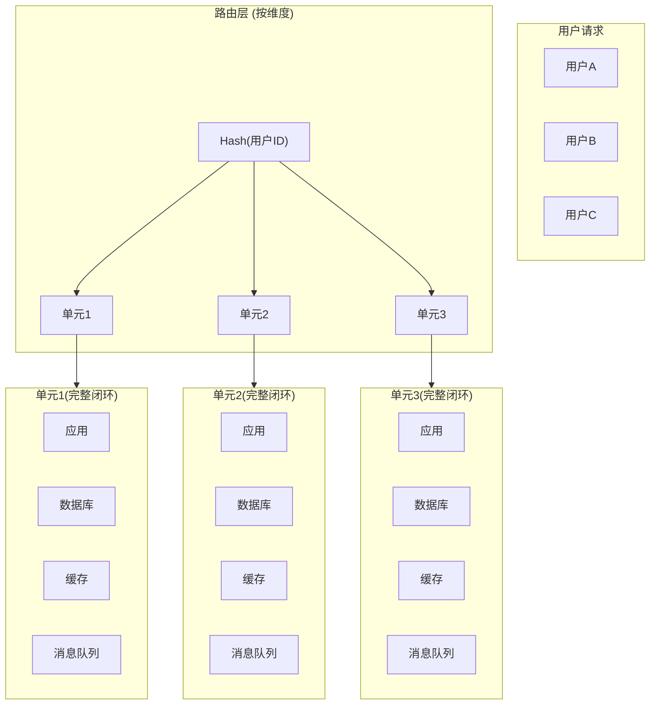
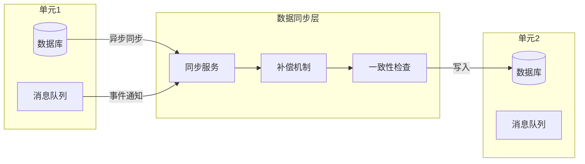

# 单元化多活架构（专题层）

> 入门层讲了「隔离是什么」，特性层讲了「线程池/集群怎么隔离」，本篇讲「如何按业务单元切分完整闭环——单元化和多活架构」。

## 一句话摘要

单元化多活 = **按用户维度或业务维度切分完整闭环**，让每个单元独立运行、故障不扩散到其他单元，核心是把「爆炸半径」从集群级别缩小到单元级别——一个单元挂了，其他单元继续服务。

## 🎯 本文核心

**核心机制一句话**：单元化 = 按维度切分完整业务闭环 + 多活 = 多个单元同时在线互为备份。

**机制链（4 个节点）**：

维度切分（怎么分）→ 单元闭环（独立什么）→ 数据同步（怎么一致）→ 多活切换（怎么容灾）

## 二、架构演进：从单机到多活

```
架构演进路径:
├── 阶段1: 单机部署
│   └── 一个应用 + 一个数据库
│   └── 故障 = 全站不可用
│
├── 阶段2: 集群部署
│   └── 多台机器 + 负载均衡
│   └── 机器故障 = 单点恢复，但数据库仍是单点
│
├── 阶段3: 读写分离 + 主从
│   └── 主库写 + 从库读
│   └── 主库故障 = 读写分离，但有数据延迟
│
├── 阶段4: 单元化
│   └── 按用户/地域切分，每个单元有完整闭环
│   └── 单元故障 = 只影响该单元用户
│
└── 阶段5: 多活
    └── 多个单元同时在线，互为备份
    └── 机房故障 = 自动切换到其他机房单元
```

### 单元化架构全景




## 三、单元化设计

### 切分维度

| 维度 | 切分方式 | 适用场景 | 挑战 |
|------|----------|----------|------|
| **用户ID** | Hash 取模/范围 | 用户量大、无地域属性 | 重新切分代价大 |
| **地域** | 按省市/国家 | 有地域属性、合规要求 | 跨地域数据同步 |
| **业务类型** | 按业务线 | 多业务线独立演进 | 资源利用率低 |
| **租户** | 按客户 | SaaS 多租户 | 租户间资源争抢 |

### 单元闭环要求

每个单元必须独立完成：
- ✅ 应用服务（无跨单元依赖）
- ✅ 数据库（单元有自己的数据源）
- ✅ 缓存（单元有自己的 Redis 集群）
- ✅ 消息队列（单元有自己的 MQ）
- ✅ 配置中心（单元级配置）

### 单元间通信

```
单元内:  直接调用（进程内/同机房）
跨单元:  路由层 + 异步同步
  ├── 同步: 单元间 RPC（用于必要数据查询）
  └── 异步: 消息队列（用于数据同步/事件通知）
```

## 四、数据同步与一致性

| 方案 | 一致性 | 延迟 | 适用 |
|------|--------|------|------|
| **强一致** | 分布式事务 | 高 | 金融交易 |
| **最终一致** | 异步复制 | 秒级 | 大部分业务 |
| **读写分离** | 主从同步 | 毫秒-秒 | 读多写少 |

**单元化数据一致性挑战**：
- 跨单元数据查询：需要路由层 + 聚合
- 数据同步延迟：可能导致用户看到不一致
- 故障切换数据：切换后数据可能不完全一致





## 五、多活切换

### 多活模式

| 模式 | 描述 | 故障影响 |
|------|------|----------|
| **同城双活** | 同城市两个机房互备 | 机房故障自动切换 |
| **异地多活** | 不同城市机房同时在线 | 异地机房故障自动切换 |
| **全局多活** | 多地域同时在线 | 任何单地域故障不影响 |

### 切换流程

```
故障检测 → 判定故障范围 → 流量切换 → 数据补同步 → 恢复验证
    │              │              │              │              │
    ▼              ▼              ▼              ▼              ▼
 DNS/LB       单元健康检查    路由层切换     异步补数据     监控验证
 10秒         30秒           30秒          分钟级         确认
```

### 切换注意事项

- **数据延迟**：切换后可能有无同步的数据，需补偿
- **会话状态**：用户 Session 需要重新登录或跨机房同步
- **脑裂问题**：两个单元同时认为自己活着，需要仲裁机制

## 六、单元化 vs 微服务 vs 多租户

| 维度 | 单元化 | 微服务 | 多租户 |
|------|--------|--------|--------|
| **切分依据** | 用户/地域/业务 | 业务能力 | 客户 |
| **目标** | 故障隔离+容灾 | 独立部署+扩展 | 资源隔离+多客户 |
| **数据** | 单元独立数据库 | 服务独立数据库 | 共享或独立库 |
| **通信** | 路由层+异步 | 服务间RPC | API网关 |
| **复杂度** | 高（全栈切分） | 中（服务拆分） | 中（数据隔离） |

## 七、单元化实战 checklist

```
单元化落地检查:
1. ✅ 切分维度确定（用户ID/地域/业务）
2. ✅ 每个单元有完整闭环（应用+DB+缓存+MQ）
3. ✅ 单元间通信方案确定（同步/异步）
4. ✅ 数据同步方案确定（强一致/最终一致）
5. ✅ 多活切换方案验证（故障注入测试）
6. ✅ 路由层就绪（流量可按维度路由）
7. ✅ 监控覆盖每个单元（独立指标）
8. ✅ 应急预案包含单元切换流程
```

## 核心带走卡

- **一句话**: 单元化 = 按维度切完整闭环 + 多活 = 多单元同时在线互为备份
- **关键决策**: 切什么维度、单元内闭环到什么程度、怎么处理跨单元数据
- **常见坑**: 拆服务没拆资源 = 假单元化、跨单元数据同步延迟、脑裂问题
- **30 秒复述**: 单元化按用户/地域切分 → 每个单元有完整闭环 → 故障隔离到单元级 → 多活互为备份 → 自动切换

## 你们可能会问

### Q1: 单元化和微服务什么区别？

> 微服务是架构风格（按业务能力拆分），单元化是部署策略（按维度切分完整闭环）。微服务不一定单元化，单元化可以不用微服务。单元化核心是「故障不扩散到其他单元」。

### Q2: 单元化的成本是什么？

> 资源和运维成本翻倍（每个单元都需要完整基础设施），开发复杂度增加（跨单元数据一致性），适合核心链路和高可用要求场景。

### Q3: 什么时候该做单元化？

> 当单机房故障影响面太大（SLA 不满足），或业务规模要求按地域部署（合规/低延迟），或需要容灾备份时。

### Q4: 单元化后跨单元查询怎么处理？

> 通过路由层 + 聚合服务。同步查询走 RPC，异步数据同步走消息队列。非核心查询可以接受最终一致。

---

## 数据与事实声明

- 单元化方法论参考阿里巴巴、字节跳动等大厂公开实践
- 多活架构参考 Netflix、Uber 等全球多活案例
- 1-5-10 为行业认知量级
- 免责: 具体技术方案（单元化框架/中间件）以官方文档为准

## 💡 决策

**单元化方案选型**：

| 决策点 | 选择 | 理由 |
|--------|------|------|
| **切分维度** | 用户ID Hash | 用户量大、无地域属性时首选 |
| **数据库** | 每个单元独立库 | 数据隔离彻底，单元故障不影响其他 |
| **缓存** | 单元内独立 Redis | 避免跨单元缓存竞争 |
| **消息队列** | 单元内独立 MQ | 事件消费隔离 |
| **多活模式** | 同城双活起步 | 成本可控，逐步扩展到异地多活 |

**推荐**: 用户ID Hash 切分 + 单元独立闭环 + 同城双活 → 逐步扩展异地多活。

## 💡 Trade-off

| 维度 | 单元化 | 非单元化（集群） | 取舍 |
|------|--------|-----------------|------|
| **故障隔离** | 单元级 | 集群级 | 单元化隔离更好但成本高 |
| **资源利用率** | 低（每个单元独立） | 高（共享资源） | 共享利用率高但风险集中 |
| **运维复杂度** | 高（多套基础设施） | 低（一套） | 单元化运维复杂但可靠 |
| **数据一致性** | 跨单元最终一致 | 单库强一致 | 最终一致可接受大多数场景 |
| **切换成本** | 高（需路由层） | 低 | 路由层成本是一次性的 |

## 💡 tips

- **先切分后隔离**: 先确定切分维度，再确保单元内闭环，别先拆服务再想数据
- **单元大小**: 单个单元 500-2000 QPS 为宜，太大隔离效果差，太小运维成本高
- **数据同步**: 用消息队列异步同步，不要强一致（性能代价太大）
- **路由层**: 路由层是单元化的核心——流量必须能按维度正确路由到单元

## 💡 思考

**反思**：单元化后跨单元查询的性能损耗能否接受？哪些场景必须跨单元？
- 单元故障时，用户数据如何快速迁移到其他单元？
- 单元化是否适合所有业务？轻量级业务是否过度设计？
- 如何在单元化和微服务之间找到平衡点？

## 参考资料

| 类型 | 标题 | 来源 |
|---|---|---|
| 行业实践 | 阿里巴巴单元化架构实践 | 公开报道 |
| 行业实践 | 字节跳动单元化实践 | 公开报道 |
| 案例 | Netflix 多活架构 | 公开报道 |
| 案例 | Uber 全球多活实践 | 公开报道 |
| 书 | 《Designing Data-Intensive Applications》 | 公开出版 |

## 📌 数据与事实声明

- 写于 2026-09-11；单元化方法论参考阿里巴巴、字节跳动等大厂公开实践
- 多活架构参考 Netflix、Uber 等全球多活案例
- 1-5-10 为行业认知量级
- 免责: 具体技术方案以官方文档为准
