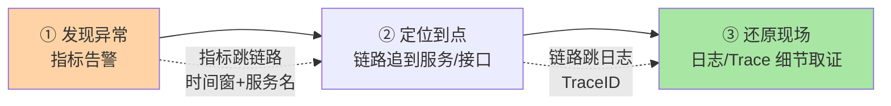
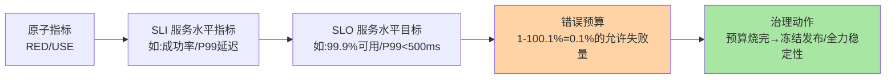

# 可观测性三支柱与指标体系：大盘的原料学

> 服务大盘不是「把图表摆上屏幕」，是**把系统状态翻译成人能看懂的信号**——原料不对，大盘就是仪表盘装饰。这篇讲透 Metrics/Logging/Tracing 三支柱的分工边界、黄金指标（RED/USE）的选型逻辑、SLI/SLO/错误预算的度量闭环——这是建盘之前必须补的「原料学」。

## 一句话摘要

可观测性回答「系统正在发生什么、为什么发生」：**Metrics**（指标——低成本的持续脉搏，管趋势与告警）、**Logging**（日志——事件现场的详细记录，管取证）、**Tracing**（链路——请求视角的跨服务还原，管定位）三支柱各管一段、互相索引。指标体系的骨架是**黄金指标**（服务的 RED：Rate/Errors/Duration；资源的 USE：Utilization/Saturation/Errors）向上聚合为 **SLI/SLO 与错误预算**——大盘的每一张图、每一条告警，最终都要挂在这套度量体系上，否则就是「有数据没有信号」。

## 🎯 本文核心

**核心一句话：可观测性 = 三支柱（指标管趋势、日志管取证、链路管定位）按「发现→定位→取证」的排障链路分工 + 黄金指标（RED/USE）作为指标体系的原子层 + SLI/SLO/错误预算作为业务层的度量闭环——大盘是这套体系的前端呈现，原料体系不对，大盘做得再漂亮也没有信号价值。**

机制链：排障链路（发现→定位→取证）→ 三支柱的分工与索引关系 → 黄金指标两张卡片（RED/USE）→ 指标分级（原子指标→聚合指标→SLI）→ SLO 与错误预算的治理闭环。全文一句话可重构：「指标发现异常、链路定位到点、日志还原现场——三支柱按排障链路分工，黄金指标是原子，SLO 是北极星」。

## 前置阅读

- 入门层篇 7《监控与告警》：监控体系的用法层与本系列的位置
- 入门层篇 9《应急响应与故障复盘》：三支柱服务的下游场景

## 一、排障链路：三支柱分工的总纲

一次线上故障的完整处理链路，决定了三支柱的分工边界：

- **Metrics（指标）**：时序数值（QPS、P99、错误率、GC 次数）——采集成本低、可长期存储、适合趋势与告警，但**没有上下文**（只知道「错了 5%」，不知道哪笔请求错、为什么错）
- **Logging（日志）**：离散事件文本——上下文最丰富（参数、堆栈、业务单号），但**采集与存储成本高**、无聚合视角（海量日志里找线索要靠索引）
- **Tracing（链路）**：请求维度的跨服务路径（一个 Trace 由多个 Span 组成）——天然回答「这次请求经过了谁、卡在哪一跳」，但**只能覆盖被采样的请求**

三者的索引关系是设计出来的：指标告警带时间窗与服务名 → 跳链路列表 → Trace 详情带 TraceID → 跳该请求的全部日志——**排障在三个系统间跳转的成本，决定了三支柱整合（统一查询/统一时间轴）的价值**。

## 二、黄金指标：指标体系的原子层

指标不是越多越好——海量指标里找不到信号是「仪表盘装饰」的根源。Google SRE 的两张卡片给出原子集：

**服务的 RED（每个服务/接口三件套）**：

| 指标 | 含义 | 回答的问题 |
|---|---|---|
| **R**ate | 请求速率（QPS） | 流量形态正常吗（突增/突降） |
| **E**rrors | 错误率（含显式错误+隐性失败） | 用户正在受害吗 |
| **D**uration | 耗时分布（P50/P95/P99，不是平均值） | 体验劣化了吗 |

**资源的 USE（每个资源三件套）**：Utilization（使用率，如 CPU%）、Saturation（饱和度，如队列长度/等待线程——「排队了没有」比「用了多少」更早预警）、Errors（资源错误，如 IO error）。USE 管「下游资源会不会拖垮服务」，RED 管「服务对用户的呈现」——**服务层用 RED、依赖的资源层用 USE，两张卡片拼出一个服务的完整健康画像**。

**为什么是分位数不是平均值**：平均值把长尾摊平——P99 从 100ms 恶化到 2s 时平均值可能只从 50ms 变 60ms，「平均正常」掩盖「1% 用户极慢」。分位数才是用户体感的真实口径（1 万 QPS 下 P99 = 每 100 秒就有 1 个用户等 2 秒）。

> 💡 **实战提示**
> - 建服务第一天的指标清单就是 RED+USE 六件套——先有原子指标再谈大盘，跳过原子层直接堆业务指标是「空中楼阁」
> - 隐性错误要显式化：HTTP 200 但业务失败（余额不足下单失败）、HTTP 200 但超时降级——错误率只数 5xx 会漏掉一半的「用户受害」
> - 指标 label 维度按「排障会按什么切」设计：服务/接口/机器三维度起步，label 每加一个都要问「告警时会按它切吗」
> - 日志成本分级存储：ERROR 全量存、INFO 采样或短存——日志账单失控是砍可观测性预算的第一原因

## 三、SLI/SLO/错误预算：从指标到治理

三支柱与黄金指标是「技术层度量」，业务层要再往上聚合一层：

**SLI** 是「用户视角的健康度量」（成功率、P99 延迟——不是 CPU 这种内部指标）；**SLO** 是给 SLI 定的目标；**错误预算**是 SLO 反推出的「允许失败的额度」——它的价值是把「稳不稳定」从争论变成算术：预算没烧完，团队可以激进发布；预算烧完，发布冻结全力修稳定性。**可观测性体系的最顶层信号是错误预算的燃烧速率**——大盘的 C 位应该是它，而不是 CPU。

## 四、你们可能会问

**Q1：有了 Metrics 为什么还要 Tracing？指标不是也能按服务拆吗？**
指标按服务聚合后看不到「一次请求」——A 慢导致 B 超时的传导链，在各自服务的 P99 曲线里是两座孤峰，在 Trace 里是一条因果路径。跨服务定位是链路的独占能力，指标替代不了。

**Q2：日志、链路、指标必须三套系统吗？**
中小规模可用一体化方案（OpenTelemetry 统一采集 + 一套后端分储）；大规模通常分库（指标走时序库、日志走 ES/数仓、链路走 Jaeger/Tempo 类）——**采集协议统一（OTel）比后端统一更重要**，避免三套 SDK 各自侵入。

**Q3：采样率怎么定（链路/日志）？**
链路常见「头部采样 1%-10% + 错误/慢请求 100% 保留（尾部采样）」——正常请求看分布、异常请求看细节；日志按级别分级（ERROR 全量、INFO 采样）。原则：**异常的必须全，正常的够统计就行**。

## 五、三支柱的成本取舍：信号、成本、覆盖三角

三支柱没有免费午餐，每根支柱都是「信号价值 vs 采集成本」的取舍：**指标**成本最低但无上下文（取舍：损失细节换取全局覆盖与长期趋势）；**日志**细节最全但存储成本随流量线性膨胀（取舍：ERROR 全量 + INFO 采样的分级策略，本质是用「正常细节的损失」换「异常细节的完整」）；**链路**请求视角独占但采样意味着只看切片（取舍：尾部采样保证异常全留，代价是全量处理开销）。量级演进下的典型路径：日均亿级请求的系统，「全量日志 + 全量链路」的存储成本不可承受——演进方向是「指标全量、异常全量、正常抽样」的金字塔结构，塔尖（异常信号）永远最完整，塔基（正常流量）按统计需要压缩。

## 六、什么时候建什么：体系落地顺序

- **第一天**（服务上线）：RED 六件套 + 结构化日志（带 TraceID）+ 基础告警——原子层不齐不接流量
- **第一周**：链路接入（SDK/代理注入 TraceID 透传）+ 指标-链路-日志的跳转打通
- **第一个月**：SLI/SLO 定义 + 错误预算上大盘 + 告警分级治理
- **持续**：三支柱的留存与采样策略随量级演进（成本与信号的平衡是动态的）

## 七、开放问题

- OpenTelemetry 成为三支柱统一采集的事实标准后，「厂商锁定」在减弱，但三支柱后端的融合查询（一个时间轴看三条证据链）仍是产品化难点
- eBPF 无侵入采集正在改写「必须埋点」的前提，可观测性的接入成本在结构性下降——「无侵入能覆盖多深」值得跟踪

## 八、自测三问

1. 三支柱各自回答排障链路的哪一段？它们的索引关系怎么设计？
2. RED 与 USE 分别面向什么对象？为什么用分位数不用平均值？
3. 错误预算怎么把「稳定性」从争论变成算术？它的治理动作是什么？

## 🎯 核心带走

- **核心一句话**：可观测性 = 指标（发现）+ 链路（定位）+ 日志（取证）按排障链路分工，RED/USE 是指标原子层，SLI/SLO/错误预算是治理闭环——大盘是呈现，原料体系才是本体
- **机制链**：排障链路 → 三支柱分工与索引 → 黄金指标 → SLI/SLO → 错误预算治理
- **哪里会坏**：只数 5xx 漏隐性错误、平均值掩盖长尾、海量指标无信号、日志成本失控
- **边界**：本篇管「原料体系」；大盘的分层设计与告警组织在下一篇，全链路追踪机制在第三篇

## 📌 数据与事实声明

- 写于 2026-09-11；RED/USE/SLI/SLO/错误预算出自 Google SRE《SRE 书》公开方法论；OpenTelemetry 为 CNCF 开源项目公开口径
- 采样率区间（链路 1%-10% 头部采样）为业内常见实践，按流量与预算调整
- 免责：工具选型以各官方文档为准

## 📚 参考资料

| 类型 | 标题 | 来源 |
|---|---|---|
| 公开书 | 《SRE：Google 运维解密》监控章节 | 公开出版 |
| 开源标准 | OpenTelemetry（三支柱统一采集） | opentelemetry.io |
| 系列关联 | 本目录篇 2《服务大盘分层设计》 | docs/architecture/system-design/stability/ |
