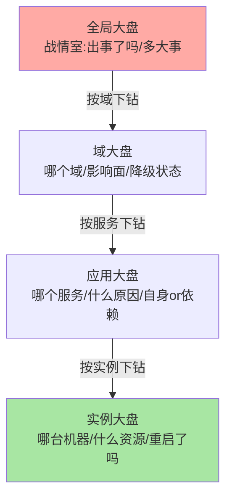
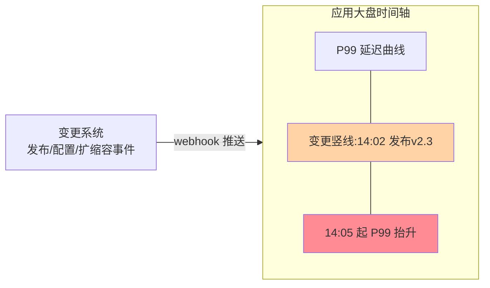

# 服务大盘分层设计：从全局战情到实例指纹的四层体系

> 大盘不是图表的堆砌，是**排障动线的可视化**：值班同学从哪看起、往哪下钻、在哪止血——盘的分层决定动线的效率。这篇讲透四层大盘体系（全局/域/应用/实例）、每层看什么与怎么设计、大盘与告警 SOP 的绑定——「大盘即 SOP」是建盘的最高标准。

## 一句话摘要

服务大盘按**下钻动线**分四层：**全局大盘**（战情室视角——错误预算燃烧率、核心链路可用性、全局流量形态，回答「出事了吗、多大事」）、**域大盘**（业务域视角——域内服务依赖图、域级 SLI、弱依赖降级状态）、**应用大盘**（单服务视角——RED 全量、依赖的 USE、发布与变更事件叠加）、**实例大盘**（机器/POD 视角——资源指纹、单实例健康度）。每层回答固定的问题、配固定的告警动作——**大盘的每个面板都应该绑定「看到什么→做什么」的 SOP，没有动作绑定的大盘是装饰**。

## 🎯 本文核心

**核心一句话：大盘分层 = 排障下钻动线的可视化——全局（出事了吗）→ 域（哪个域、什么影响面）→ 应用（哪个服务、什么原因类别）→ 实例（哪台机器、什么资源），每层固定问题、固定指标、固定动作；变更事件（发布/配置/扩缩容）必须以时间轴标注叠加在所有层——「指标异常处必有变更线」是排障第一直觉的盘面支撑。**

设计链：四层大盘的问题-指标-动作三要素 → 变更事件叠加 → 大盘即 SOP（面板绑定动作）→ 建盘流程与验收 → 常见退化形态。全文一句话可重构：「分层即动线，面板即问题，看到即动作，变更必标注」。

## 前置阅读

- 本目录篇 1《可观测性三支柱与指标体系》：大盘的原料层（RED/USE/SLI）
- 入门层篇 7《监控与告警》：告警体系的用法层

## 一、四层大盘：每层一个视角一组问题



**第一层 全局大盘（战情室）**——给值班与老板看：核心链路可用性（下单/支付等 SLO 达成态）、错误预算燃烧速率、全局 QPS 与错误率形态（环比/同比）、当前生效的降级与熔断清单。设计纪律：**一屏以内、红绿灯语义（正常时几乎全是绿的）**——全局盘的价值是「没事时 10 秒确认没事，有事时 30 秒知道多大的事」。

**第二层 域大盘（业务域）**——给域 owner 看：域内服务依赖图（节点染色健康度）、域级 SLI、上下游域的边界流量、弱依赖的降级开关状态。**依赖图是域盘的灵魂**——故障影响面（哪些下游被传导）靠它一眼看出。

**第三层 应用大盘（单服务）**——给服务 owner 与值班看：RED 全量（按接口分维）、依赖资源的 USE（DB/缓存/MQ）、GC/线程/连接池、**变更事件时间轴**（发布/配置/扩缩容以竖线叠加在指标上）。应用盘是排障主战场——「指标拐点与变更线重合」在这里完成第一裁决。

**第四层 实例大盘（机器/POD）**——给深入排查看：单实例 CPU/内存/网络/磁盘、进程重启与 OOM 事件、与集群均值的偏离（「这台机器和别人不一样」的指纹对比）。定位「个别实例拖垮 P99」的最后一跳。

## 二、变更事件叠加：大盘的第一生产力



「80% 的故障与变更相关」是排障领域的高频共识——所以**变更事件必须作为一等公民叠进大盘**：发布系统、配置中心、扩缩容事件通过 webhook 推送到监控平台的 annotation 通道，在所有层的曲线上以竖线呈现。指标拐点与变更线的时间相关性，是「先查变更还是先查资源」的裁决依据——没有变更叠加的大盘，等于让值班同学背变更时间表排障。

> 💡 **实战提示**
> - 全局盘「一屏红绿灯」验收法：把大盘投影到会议室大屏，站在三米外看——看不清红绿的盘要重做
> - 变更接入三通道齐备才叫齐：应用发布、配置变更、扩缩容事件——漏任何一类，那类变更引发的故障都会变成「无因故障」
> - 域盘的依赖图要「故障时自动染色」：依赖图染色数据来自实时指标，而不是静态架构图——静态图没人看
> - 大盘 URL 进告警文案：每条告警带上对应大盘的深链——值班从告警一键到盘面，而不是从收藏夹翻

## 三、大盘即 SOP：面板与动作的绑定

大盘的最高标准不是好看，是**「看到即知道做什么」**——每个面板要在设计时回答三问：这个指标异常说明什么（语义）、大概率什么原因（归因方向）、第一步做什么（动作）。例如应用盘的错误率面板：「错误率突增 → 先看变更线（发布？配置？）→ 无变更看依赖（下游错误同步？）→ 都没有看实例分布（单实例 or 全量）」——这条动线写在面板描述或 wiki，与告警分级联动。**大盘+告警+预案三位一体**：盘面发现问题、告警定级通知、预案给处置动作——缺任何一角，值班都在现场发明流程。

## 四、大盘形态的演进与取舍

跨周期视角：大盘形态随组织规模演进——十人级团队「一张应用盘走天下」（演进起点，无分层负担）；百人级出现域的分层（域盘应运而生，回答跨团队影响面）；千人级必须有战情室全局盘（大促与重大故障的指挥中枢）。每一次分层都是「信息密度与认知负荷」的取舍：分层越细信息越全，但跨层跳转的认知成本上升——四层不是教条，是「值班动线最短」这个目标在不同规模下的形态。另一个长期取舍是「自助 vs 统一」：统一模板（稳定性团队强制四层规范）保证下限但压抑个性化，自助建盘（各域自由）激活灵活但质量参差——业内主流是「骨架统一、血肉自助」：四层结构与变更叠加不可协商，面板内容各域按问题定制。

## 五、建盘流程与验收

什么时候建哪层、怎么选起点：新服务上线先建应用盘（自己的 RED 都看不清谈不上别的）、域内服务超过 3 个建域盘（依赖传导开始复杂）、组织有战情室诉求（大促/重大故障指挥）建全局盘——**明确推荐从应用盘起步逐层向上**，跳过应用盘直接建全局盘是「楼没盖先装修」。

```text
① 定动线:排障从哪到哪(全局→域→应用→实例的下钻路径)
② 定问题:每层固定回答的问题清单(不超过5个)
③ 选指标:问题反推指标(篇1的RED/USE/SLI原子层)
④ 绑动作:每个异常面板绑定SOP与预案链接
⑤ 叠变更:三通道变更事件接入
⑥ 验收演练:新人拿一盘陌生故障,10分钟内走到正确层
```

验收标准用「新人测试」：让没参与建盘的同学模拟值班，10 分钟内从全局盘走到正确的应用盘并说出归因方向——走不通的动线就是设计缺陷。**大盘是给值班用的工具，不是给汇报做的 PPT**——汇报导向的大盘堆 Uptime 与成功率，值班导向的大盘堆异常与下钻。

## 六、你们可能会问

**Q1：小团队没有域的概念，四层会不会过度？**
缩成两层：全局盘（所有服务的红绿灯矩阵）+ 应用盘（每服务一张）——层级可以少，「下钻动线 + 变更叠加 + 面板绑动作」三个原则不能少，它们与规模无关。

**Q2：大盘和告警是什么关系？大盘会不会被告警取代？**
告警是「被动的推送」（异常找到你），大盘是「主动的巡视」（你去看全貌）——告警覆盖已知模式（阈值/突变），大盘覆盖未知模式（形态异常、组合异常）。只有告警没有大盘，遇到「告警没配过的故障形态」就失明。

**Q3：大盘谁维护、多久迭代？**
服务 owner 建应用盘、域 owner 建域盘、稳定性团队建全局盘；每次故障复盘后强制迭代一轮（「这次故障哪层没看到信号」就是迭代清单）——**大盘的迭代频率与故障学习强绑定**，从不迭代的大盘说明组织没在从故障里学习。

## 七、开放问题

- 大盘的「自动生成」（从服务注册与依赖数据自动生成四层骨架）在云产品中逐步可用，人工建盘的价值向「问题定义与动作绑定」收拢
- AIOps 的异常形态识别（人眼看不出的组合异常）正在补充「红绿灯」的二元语义，「盘面信号」从人读走向人机共读——值班动线的形态可能被重塑

## 八、自测三问

1. 四层大盘各自回答什么问题？下钻动线怎么设计？
2. 变更事件为什么是大盘的一等公民？三通道指什么？
3. 「大盘即 SOP」的三问是什么？新人测试验收怎么执行？

## 🎯 核心带走

- **核心一句话**：大盘 = 排障动线的可视化——四层（全局/域/应用/实例）固定问题固定动作，变更事件三通道叠加，面板绑定 SOP；给值班用不给汇报用
- **设计链**：四层三要素 → 变更叠加 → 大盘即 SOP → 建盘六步 → 新人验收
- **哪里会坏**：汇报型大盘无下钻、变更无标注、面板无动作、从不迭代
- **边界**：本篇管「盘的组织」；指标原料在篇 1，全链路机制与全链路盘在篇 3

## 📌 数据与事实声明

- 写于 2026-09-11；四层大盘与「大盘即 SOP」为业内通用实践的归纳；「变更相关故障占比高」为排障领域高频共识口径（各厂复盘数据口径不一，方向一致）
- 新人验收（10 分钟下钻）为团队可自定的工程纪律示例
- 免责：大盘产品能力以所选监控平台文档为准

## 📚 参考资料

| 类型 | 标题 | 来源 |
|---|---|---|
| 公开书 | 《SRE：Google 运维解密》告警与排障章节 | 公开出版 |
| 公开实践 | 各大厂监控大盘建设与故障复盘的公开分享 | 技术社区公开文章 |
| 系列关联 | 本目录篇 1（原料）/ 篇 3（全链路盘） | docs/architecture/system-design/stability/ |
