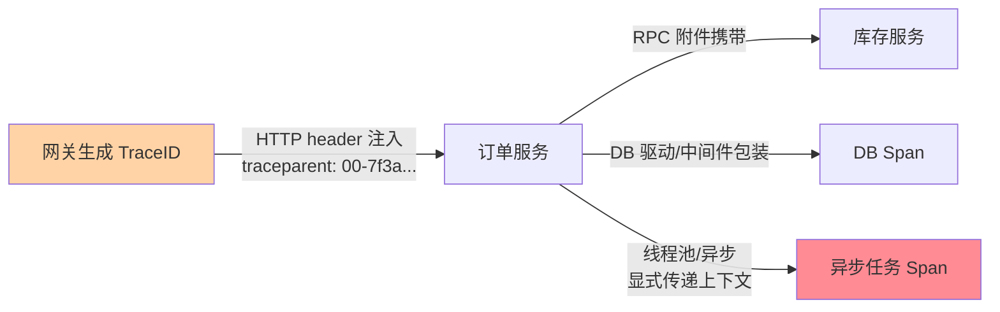
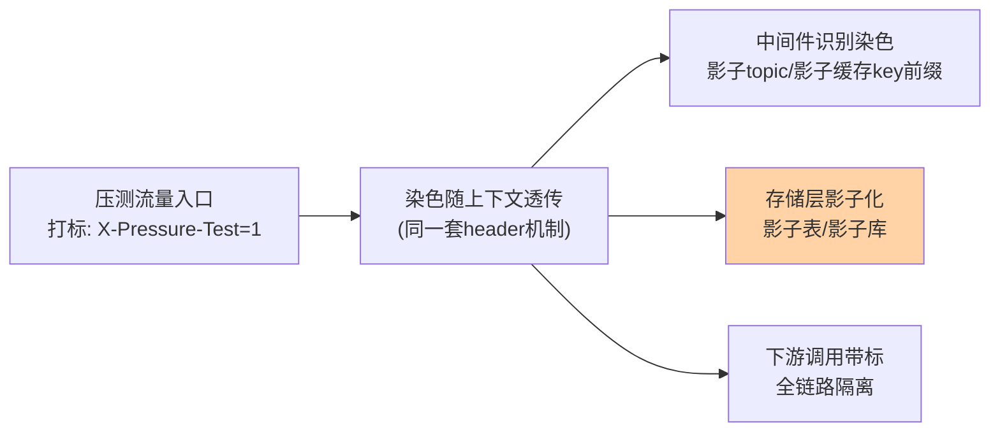

# 全链路追踪机制与全链路大盘：请求视角的完整还原

> 指标告诉你「P99 高了」，链路告诉你「这 1% 的请求在网关→订单→库存的哪一跳、哪个方法上卡了 800ms」——**全链路是微服务时代的排障主战场**。这篇讲透 TraceID/SpanID 的数据模型、跨进程透传机制、采样策略，以及全链路压测与全链路大盘的工程组织。

## 一句话摘要

分布式链路追踪的标准模型：**一次请求 = 一个 Trace（全局 TraceID）= 一棵 Span 树（每段处理一个 Span，记录起止/标签/错误）**——跨进程靠**上下文透传**（HTTP header / RPC 附件注入 W3C Trace Context 标准头）把 Span 串成树。工程三难：**透传全覆盖**（漏一个中间件链路就断）、**采样平衡**（全量存不起、采样怕漏异常——头部/尾部采样组合）、**时钟对齐**（跨机器 Span 排序依赖 NTP 精度）。全链路的进阶形态是**全链路压测**（流量染色透传到所有存储层影子化）与**全链路大盘**（按链路聚合的耗时分解视图——网关/服务/DB 各占多少）。

## 🎯 本文核心

**核心一句话：链路追踪 = TraceID 全局唯一 + Span 树还原请求路径 + 跨进程透传（标准 header 注入）——「一次请求穿过 N 个服务」被还原成一棵可视化的树；全链路压测复用同一套染色透传机制把压测流量隔离到影子资源，全链路大盘按链路聚合出「耗时都花在哪个环节」的分解视图。**

机制链：Trace/Span 数据模型 → 透传机制（header 注入与异步传递）→ Span 树的还原（时钟与因果）→ 采样策略（头部/尾部组合）→ 全链路压测（染色+影子库）→ 全链路大盘（环节分解）。全文一句话可重构：「一个 ID 串全程，一棵树还原路径，染色透传双肩挑（追踪与压测共用）」。

## 前置阅读

- 本目录篇 1/2：三支柱的原料层与大盘的组织层
- 入门层篇 6《容量规划与压测》：全链路压测的容量目标层

## 一、数据模型：Trace、Span 与上下文

```text
TraceID: 7f3a...（全局唯一，一次请求一个）
Span: 一次处理段（RPC 调用/DB 查询/本地方法）
  ├─ 字段: 起止时间、服务名、spanName、tags(k=v)、logs(事件)、status
  └─ 关系: parent_span_id → 串成树
```

一次下单请求的 Span 树：`网关(1200ms) → 订单服务(950ms) → [库存RPC(400ms), 优惠RPC(300ms), DB写入(180ms)]`——树形展开后，**耗时的大头与并行的分支一眼可见**。Span 的 tags 携带业务语义（订单号、用户 ID、是否命中缓存），logs 记录关键事件（重试了一次、降级了）——链路不只有时间，还有「这次请求的遭遇」。

## 二、透传机制：链路不断的三条规则

链路追踪的第一工程难题是**上下文跨进程不丢**：



**规则一 出站注入**：每次跨进程调用（HTTP/RPC/MQ）把 TraceContext 写入协议头——W3C Trace Context（`traceparent` header）是通用标准，各框架（OpenTelemetry/SkyWalking/Jaeger）自动完成。**规则二 入站提取**：服务端中间件（filter/interceptor）从请求头提取上下文，作为本次处理所有 Span 的祖先。**规则三 进程内传递**：ThreadLocal 存上下文——**线程池与异步是断链重灾区**（提交任务时上下文没跟着走），需要显式 wrap（如 `Runnable` 包装）或框架支持（reactor 的 context）。MQ 场景上下文随消息体存储属性传递，消费端提取续链——**异步链路的覆盖度是接入验收的必查项**。

## 三、采样：全量存不起、采样怕漏

```text
头部采样: 入口决定采不采(如 10%)——省采集与传输,但错误请求可能被漏
尾部采样: 请求完成后按结果决定(错误/慢请求 100% 保留,正常 1%)——信号完整但全量处理
组合策略: 头部粗筛(如50%) + 尾部精采(异常全留,正常抽样)——成本与信号的主流平衡
```

采样的原则一句话：**异常的必须全，正常的够统计**。头部采样的漏采风险（采样的那次请求恰好出错但没进样本）用尾部采样兜底；高价值链路（支付）可以全量；成本敏感链路用低头部采样率 + 高异常保留率。

> 💡 **实战提示**
> - 接入验收用「链路完整性清单」：HTTP/RPC/MQ/线程池/定时任务五类入口逐个验证 TraceID 是否贯穿——任何一类断链，那类故障就回到「盲排」时代
> - TraceID 打进日志 MDC：每行业务日志带 TraceID——链路跳日志的索引全靠它，漏打就是断桥
> - 采样率按链路等级分级：核心链路全量或高采样、边缘链路低采样——一刀切的采样率在成本与信号间两头不讨好
> - 时钟偏差要监控：跨机器 Span 排序依赖 NTP（偏差大于 Span 时长时因果错乱）——时钟偏移指标进巡检

## 四、全链路压测：染色透传的第二个乘客

全链路压测复用链路追踪的透传管道，多加一层**流量染色**语义：



压测流量与真实流量共跑一套代码、按染色分离数据：**消息走影子 topic、缓存加影子前缀、DB 路由到影子表（或同表带压测标字段）**——染色透传的覆盖度 = 压测数据隔离的可靠度。全链路压测的价值：在生产拓扑（而非仿真环境）验证容量水位、发现「单服务压测好好的、串起来就雪崩」的传导问题——**瓶颈从来不在单点，在链路的串行与放大**。压测结果的产出直接进容量规划（篇 6 的水位线）与限流阈值校准。

## 五、全链路大盘：按链路聚合的第三视角

篇 2 的四层大盘是「服务视角」，全链路大盘补「**链路视角**」：核心链路（下单/支付）的**环节耗时分解**（网关/服务/DB 各占百分比）、**链路 P99 的趋势与劣化归因**（哪一环占比涨了）、**链路成功率**（端到端而非单服务）。它与 SLI 的关系：**用户视角的 SLI 本质是链路级指标**（「下单成功且 3 秒内完成」）——全链路大盘把 SLI 的「分子出了什么问题」分解到环节。三块大盘（服务/资源/链路）拼出排障的完整象限：服务盘看单点、链路盘看传导、全局盘看影响面。

## 六、量级演进、成本取舍与一次断链事故

什么时候选什么方案：接入初期**明确推荐 OpenTelemetry**（开放标准、三支柱统一协议、后端可换——避免 SDK 锁定）；已深度的存量（SkyWalking/Jaeger）不必迁移、以 OTel collector 桥接；全链路压测什么时候上——单服务压测通过但串联后仍出容量事故时（传导瓶颈只有全链路形态能暴露）。选型口径：**采集端标准化优先于后端品牌**，这是链路体系最重要的一个决策。

**量级演进**：链路体系的形态随请求量级演进——日均千万级请求可以全量采集（存储尚可承受）；日均亿级 QPS 规模必须引入采样金字塔（指标全量、链路异常全留正常抽样、日志分级）；再往上（十亿级）演进方向是「采集端预聚合」（Span 在 agent 侧先聚合成指标，只传异常明细）。**成本取舍**：采样率每提高一个档，存储与传输成本线性上涨——取舍的标尺是「漏一次价值 100 万的故障排查」与「多付一档存储费」孰轻，核心链路永远选信号、边缘链路永远选成本。

**事故推演：一次断链引发的排查灾难**。某支付系统 P99 突增告警，值班打开链路大盘发现支付链路的 Trace 树在「营销服务」一跳全部中断——排查 40 分钟无果（树断了看不到下游），最终定位是营销服务升级时线程池改造未 wrap 上下文，链路断在中间件层，而真正的慢点（营销下游的 DB）被断链掩盖。复盘沉淀两条：**① 异步断链是接入验收的 P0 检查项**（本篇的链路完整性清单）；**② 断链故障要能被「链路的链路」发现**——用「链路完整率」自身作为监控指标（某跳 Span 缺失率突增 = 接入层出了问题），元监控兜底。

## 七、你们可能会问

**Q1：链路追踪和日志的 TraceID 是一回事吗？**
是同一条索引链——链路系统的 TraceID 通过 MDC 注入日志框架，每行日志可反查所属 Trace。工程上「链路没有日志配合」等于只有骨架没有细节，两者是标配组合。

**Q2：异步场景（MQ/线程池）的链路怎么保不断？**
消息：上下文写入消息属性，消费端提取；线程池：任务提交时 wrap 上下文。两类的共同验收方法：制造一次跨异步边界的慢请求，看 Trace 树是否完整跨越——断在哪补哪。

**Q3：全链路压测的影子数据怎么清理？**
影子表/影子 topic 按演练周期清理（演练结束批量删除）；常驻影子（持续压测）按 TTL 自动回收——**影子的生命周期管理是压测平台的自净能力**，不清影子=慢性污染存储。

## 八、开放问题

- OpenTelemetry 的 Trace 标准与 eBPF 的无侵入采集结合后，「接入成本」趋近于零，链路覆盖率的竞争转向「语义丰富度」（Span 的业务标签质量）
- 全链路压测的「仿真度」永远有残差（真实用户的分布长尾、缓存的真实命中率）——压测数据与真实水位的关系校准是长期功课

## 九、自测三问

1. Trace/Span 的数据模型是什么？Span 树怎么还原一次请求？
2. 透传的三条规则是什么？异步断链为什么是重灾区、怎么防？
3. 全链路压测怎么复用染色透传？影子化的三层隔离指什么？

## 🎯 核心带走

- **核心一句话**：链路追踪 = TraceID 串全程 + Span 树还原路径 + 三条透传规则——染色透传管道双肩挑（追踪与压测共用），全链路大盘补上「链路视角」的第三块排障象限
- **机制链**：数据模型 → 透传三规则 → 采样组合 → 全链路压测影子化 → 链路大盘环节分解
- **哪里会坏**：异步断链、TraceID 未进日志、采样漏异常、影子数据不清理
- **边界**：本篇管「链路机制与全链路」；指标原料在篇 1、大盘分层在篇 2、容量水位在入门层篇 6

## 📌 数据与事实声明

- 写于 2026-09-11；Trace/Span 模型与 W3C Trace Context 为开放标准公开口径；OpenTelemetry/SkyWalking 为开源项目公开文档；采样策略与影子化方案为业内通用实践归纳
- 采样率区间与影子清理周期为经验口径，按流量与预算调整
- 免责：各框架接入细节以官方文档为准

## 📚 参考资料

| 类型 | 标题 | 来源 |
|---|---|---|
| 开放标准 | W3C Trace Context | w3.org/TR/trace-context |
| 开源项目 | OpenTelemetry / SkyWalking / Jaeger | 官方文档 |
| 公开实践 | 全链路压测的公开技术分享（各厂） | 技术社区公开文章 |
| 系列关联 | 本目录篇 1/2 | docs/architecture/system-design/stability/ |
