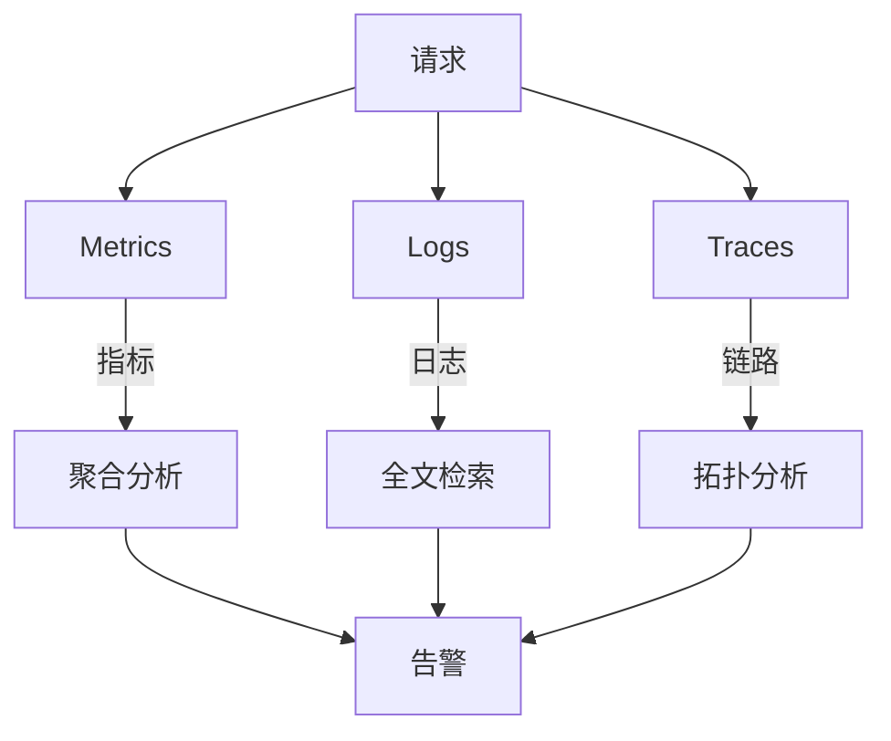
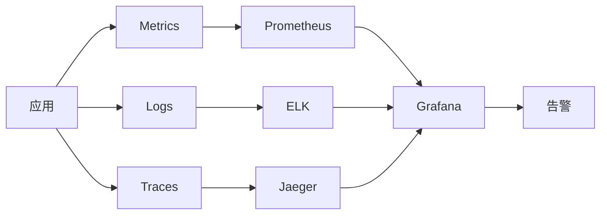

# 可观测性三支柱整合：Metrics + Logs + Traces 统一监控体系

## 一句话摘要

可观测性 = **Metrics 指标 + Logs 日志 + Traces 链路** 三支柱整合。本文讲透三支柱的统一监控体系 + 选型 + 实战。

## 三支柱关系

## Metrics（指标）

### 核心指标
- 系统指标：CPU/内存/磁盘/网络
- 应用指标：QPS/RT/错误率
- 业务指标：订单量/支付成功率

### 工具选型

| 工具 | 类型 | 优势 | 劣势 |
|---|---|---|---|
| Prometheus | 监控 | 生态强 | 存储有限 |
| Grafana | 可视化 | 生态强 | 依赖数据源 |
| ELK | 日志 | 全文检索 | 成本高 |
| Jaeger | 链路 | 分布式追踪 | 部署复杂 |

## Logs（日志）

### 核心要求
- 结构化日志（JSON）
- TraceID 贯穿
- 日志级别清晰

### 工具选型

| 工具 | 类型 | 优势 | 劣势 |
|---|---|---|---|
| ELK | 日志 | 全文检索 | 成本高 |
| Loki | 日志 | 轻量 | 功能少 |
| Fluentd | 采集 | 灵活 | 配置复杂 |

## Traces（链路追踪）

### 核心要求
- TraceID 贯穿全链路
- Span 串联跨服务调用
- 耗时定位

### 工具选型

| 工具 | 类型 | 优势 | 劣势 |
|---|---|---|---|
| Jaeger | 链路 | CNCF 标准 | 部署复杂 |
| Zipkin | 链路 | 简单 | 功能少 |
| SkyWalking | 链路 | 功能强 | Java 为主 |

## 统一监控体系

## 三支柱对比

| 维度 | Metrics | Logs | Traces |
|---|---|---|---|
| 数据类型 | 数值 | 文本 | 调用链 |
| 存储 | 时序 | 全文 | 图 |
| 查询 | 聚合 | 全文 | 拓扑 |
| 适用 | 容量规划 | 故障排查 | 性能分析 |
| 成本 | 低 | 高 | 中 |

## 踩坑记录

1. **TraceID 不贯穿**：跨服务排查靠猜
2. **日志格式不统一**：无法聚合分析
3. **指标粒度太粗**：只看平均值，忽略长尾
4. **三支柱割裂**：无法关联分析

## 统一监控 Checklist

- [ ] TraceID 贯穿全链路
- [ ] 日志结构化
- [ ] 指标聚合
- [ ] 告警规则
- [ ] 关联分析

## 量级考量

| 量级 | 监控方案 |
|---|---|
| < 10 服务 | Prometheus + Grafana |
| 10-50 服务 | Prometheus + ELK + Jaeger |
| > 50 服务 | 全套 + 统一平台 |

## 📌 数据与事实声明

- 三支柱基于 Google SRE 实践
- 踩坑来自生产环境经验
