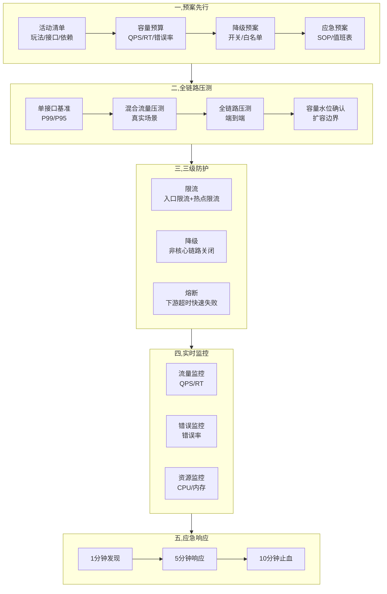
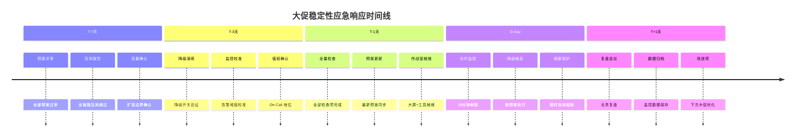

# 大促稳定性保障全景（专题层）

> 入门层讲了「每个环节是什么」，特性层讲了「机制怎么实现」，本篇讲「大促场景下怎么组合拳」——从预案到压测到限流到降级到应急的全链路编排。

## 一句话摘要

大促稳定性 = **预案先行 + 全链路压测定水位 + 限流/降级/熔断三级防护 + 实时监控 + 应急 SOP**，核心是把「不确定性」变成「可计算的预案」——大促不是考验系统上限，而是考验预案是否经过验证。

## 🎯 本文核心

**核心机制一句话**：大促稳定性 = 预案 + 压测 + 防护 + 监控 + 应急五位一体。

**机制链（5 个节点）**：

预案（做什么）→ 压测（验证什么）→ 防护（怎么守）→ 监控（怎么看）→ 应急（怎么救）

## 二、大促稳定性全景图




### 大促防护策略


## 三、预案先行：大促前的 checklist

| 类别 | 检查项 | 状态 | 负责人 |
|------|--------|------|--------|
| **活动清单** | 玩法/接口/依赖梳理完毕 | ☐ | 产品+技术 |
| **容量预算** | 核心接口 QPS 预估已确认 | ☐ | 架构 |
| **降级预案** | 降级开关已配置+演练过 | ☐ | 开发 |
| **应急预案** | SOP 文档+值班表已确认 | ☐ | SRE |
| **压测报告** | 全链路压测通过 | ☐ | 测试 |
| **监控覆盖** | 核心指标告警已配置 | ☐ | SRE |
| **回滚方案** | 每个变更都有回滚方案 | ☐ | 开发 |

## 四、全链路压测：从单点到端到端

```
压测三级迭代:
├── Level 1: 单接口基准压测
│   └── 每个核心接口压到 P99 目标值
│
├── Level 2: 混合流量压测
│   └── 按真实比例混合调用（读:写 = 80:20）
│   └── 缓存命中率不同 → RT 差异大
│
└── Level 3: 全链路压测
    └── 影子库 + 流量染色
    └── 端到端定位瓶颈（第三方/DB/缓存/下游）
    └── 容量水位确认（扩容边界）
```

**常见坑**：
- 只压单接口 → 混合流量下缓存命中率暴跌
- 压测环境与生产不一致 → 连接池/锁竞争非线性
- 压测一次就结束 → 容量需要保鲜（每周校准）

## 五、三级防护：大促期间怎么守

| 层级 | 机制 | 触发条件 | 效果 |
|------|------|----------|------|
| **第一层: 限流** | 令牌桶/滑动窗口 | 请求到达入口 | 拒绝超额请求 |
| **第二层: 降级** | 主动关闭非核心 | 流量超阈值/错误率飙升 | 保核心链路 |
| **第三层: 熔断** | 三态状态机 | 下游超时/错误率超标 | 快速失败防级联 |

**降级策略示例**：
```
正常:     全链路开放
预警:     关闭推荐/搜索（延迟敏感）
紧急:     关闭排行榜/个性化（可接受降级）
极限:     只保留下单+支付（核心交易）
```

## 六、实时监控：大促期间的作战室

| 监控维度 | 指标 | 告警阈值 | 响应 |
|----------|------|----------|------|
| **流量** | QPS | > 目标 80% | 触发降级 |
| **延迟** | P99 RT | > SLO | 检查瓶颈 |
| **错误** | 错误率 | > 0.1% | 定位根因 |
| **资源** | CPU/内存 | > 70% | 扩容 |
| **预案** | 降级开关状态 | 非预期关闭 | 确认操作 |

**作战室要求**：
- 15 分钟刷新一次大屏
- 开发 + SRE + 产品现场待命
- 降级/熔断操作有二次确认

## 七、应急响应：1-5-10 实战化

| 阶段 | 动作 | 大促特殊处理 |
|------|------|-------------|
| **1分钟发现** | 告警触发 | 大促期间告警阈值临时放宽 20% |
| **5分钟响应** | On-Call 到位 | 值班表升级链确认 |
| **10分钟止血** | 执行预案 | 降级/回滚一键触发 |
| **24小时复盘** | 无责复盘 | 大促后 48 小时内完成 |

## 八、大促复盘 checklist

```
复盘必须回答:
1. 预案执行了吗? 哪些降级/熔断触发了?
2. 压测和实际差距多大? 哪里没压到?
3. 监控有没有漏报/误报?
4. 告警阈值是否需要调整?
5. 容量水位是否需要更新?
6. 下次大促改进什么?
```



## 历史案例

| 时间 | 事件 | 教训 |
|------|------|------|
| 2019年双11 | 某大厂核心链路超时 | 预案未覆盖第三方依赖 |
| 2021年618 | 限流阈值设置不当 | 压测环境与生产不一致导致误判 |
| 2023年双11 | 熔断误触发 | 降级开关未做灰度 |
| 2024年春晚 | 流量突增300% | 容量水位未考虑突发场景 |

> 跨周期经验：每次大促都有新的故障模式，预案必须持续更新。压测环境与生产不一致是反复出现的问题。


## 核心带走卡

- **一句话**: 大促稳定性 = 预案先行 + 全链路压测定水位 + 三级防护 + 实时监控 + 应急 SOP
- **关键数字**: 压测通过才上线、降级预案演练过、告警阈值提前校准
- **常见坑**: 只压单接口、预案没演练、告警风暴导致值班疲劳
- **30 秒复述**: 大促前做全链路压测 → 定容量水位 → 配置三级防护 → 演练预案 → 作战室实时监控 → 按 SOP 应急


## 历史案例

| 时间 | 事件 | 教训 |
|------|------|------|
| 2019年双11 | 某大厂核心链路超时 | 预案未覆盖第三方依赖 |
| 2021年618 | 限流阈值设置不当 | 压测环境与生产不一致导致误判 |
| 2023年双11 | 熔断误触发 | 降级开关未做灰度，直接全量 |
| 2024年春晚 | 流量突增300% | 容量水位未考虑突发场景 |

> 跨周期经验：每次大促都有新的故障模式，预案必须持续更新。压测环境与生产不一致是反复出现的问题。

## 你们可能会问

### Q1: 大促限流阈值怎么定？

> 基于全链路压测的 P99 表现。公式: 限流阈值 = P99 QPS × 安全系数（0.8-0.9）。安全系数根据降级预案的覆盖度调整。

### Q2: 大促期间需要做什么降级？

> 提前配置好降级开关列表：推荐/搜索/排行榜/个性化等非核心链路。大促期间按流量逐步关闭，从「关闭推荐」到「只保留交易」。

### Q3: 全链路压测和平时压测什么区别？

> 全链路压测用影子库+流量染色，模拟真实调用链。平时压测单接口居多，全链路压测能暴露跨服务的级联瓶颈。

### Q4: 大促预案多久更新一次？

> 每次大促后必须复盘更新。日常有变更（新接口/新依赖）时随时更新预案清单。

## 💡 决策

**大促稳定性保障方案选型**：

| 决策点 | 选择 | 理由 |
|--------|------|------|
| **压测工具** | 自建压测平台 + 开源（LoadRunner/Gatling） | 自建可控 + 开源灵活 |
| **限流组件** | Sentinel | 阿里开源，生产验证充分，Dashboard 完善 |
| **降级策略** | 开关化 + 白名单 | 可灰度降级，快速验证 |
| **监控方案** | Prometheus + Grafana | 开源生态完善，告警灵活 |
| **应急预案** | 自动化 SOP + 人工确认 | 自动化执行 + 人工把关安全 |

**推荐组合**：Sentinel（限流/熔断）+ Prometheus（监控）+ 自建压测平台（验证）+ 自动化 SOP（应急）。

## 💡 Trade-off

| 维度 | 方案 A | 方案 B | 取舍 |
|------|--------|--------|------|
| **压测范围** | 全链路压测（准确） | 单接口压测（省时） | 全链路耗时但数据可靠 |
| **降级粒度** | 细粒度（多个开关） | 粗粒度（一键降级） | 细粒度灵活但维护成本高 |
| **告警阈值** | 严格（低阈值） | 宽松（高阈值） | 严格误报多但发现早 |
| **实验频率** | 高（每周） | 低（每月） | 高频发现弱点但风险大 |

## 💡 tips

- **压测数据保鲜**: 容量水位每周校准一次，业务增长后必须重新压测
- **降级开关演练**: 大促前 1 个月开始每周演练降级开关，确保关键时刻可用
- **告警疲劳**: 大促期间告警阈值临时放宽 20%，避免值班疲劳导致漏看
- **预案可执行**: 预案不是文档，是操作手册——每个步骤都要能一键执行

## 💡 思考

**开放问题**：大促压测的「影子库」方案是否能覆盖所有数据不一致场景？
- 自动化降级和人工降级如何平衡？完全自动化可能误判，完全人工可能太慢
- 大促结束后，降级预案是否需要恢复？如何防止「降级了忘记恢复」？

## 参考资料

| 类型 | 标题 | 来源 |
|---|---|---|
| 行业复盘 | 各大厂大促稳定性保障复盘报告 | 公开报道 |
| 开源 | Sentinel（限流/熔断） | github.com/alibaba/Sentinel |
| 开源 | Prometheus + Grafana | prometheus.io / grafana.com |
| 书 | 《Site Reliability Engineering》 | Google SRE |
| 实践 | 阿里巴巴全链路压测实践 | 公开报道 |
| 实践 | 字节跳动大促稳定性实践 | 公开报道 |

## 📌 数据与事实声明

- 写于 2026-09-11；全链路压测方法论源自阿里巴巴、字节跳动等大厂公开实践
- 1-5-10 量化承诺为行业认知量级，国内大厂公开复盘报告共性
- 行业认知: 变更占线上故障 40%+（公开复盘报告共性）
- 免责: 具体工具（Sentinel/Hystrix 等）版本与用法以官方文档为准
