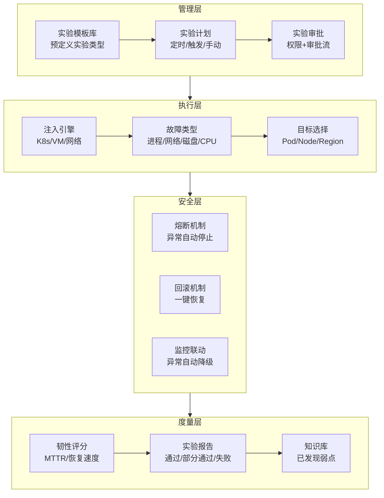
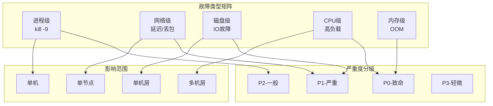

# 混沌工程平台建设（专题层）

> 入门层讲了「混沌工程是什么」，特性层讲了「实验设计四步法」，本篇讲「如何搭建一个自动化混沌工程平台」——从人工实验到平台化、自动化、可回滚。

## 一句话摘要

混沌工程平台 = **实验管理 + 故障注入 + 安全管控 + 结果分析**四位一体的自动化平台，核心是把「人工做实验」变成「平台化执行」——让混沌工程从「偶尔做一次」变成「常态化运行」。

## 🎯 本文核心

**核心机制一句话**：混沌工程平台 = 实验工厂（模板化） + 安全闸（审批/回滚） + 结果度量（韧性评分）。

**机制链（4 个节点）**：

实验模板（怎么定义）→ 执行引擎（怎么注入）→ 安全管控（怎么防止出事）→ 结果度量（怎么度量韧性）

## 二、平台架构


## 三、实验模板设计

### 标准实验类型

| 实验类型 | 注入内容 | 验证目标 | 风险等级 |
|----------|----------|----------|----------|
| **Pod 杀死** | 删除随机 Pod | 副本自动恢复 | 低 |
| **网络延迟** | 注入 100-500ms | 超时/重试有效性 | 低 |
| **网络丢包** | 丢包率 10-30% | 降级/熔断触发 | 中 |
| **CPU 压力** | 占满 80% CPU | 资源隔离有效性 | 中 |
| **内存泄漏** | 持续消耗内存 | OOM 恢复 | 中 |
| **主库故障** | 主库不可访问 | 从库接管 | 高 |
| **配置变更** | 修改关键配置 | 动态刷新 | 中 |
| **机房故障** | 模拟断网/断电 | 多活切换 | 极高 |

### 实验模板结构

```yaml
apiVersion: chaos-mesh/v1alpha1
kind: ChaosExperiment
metadata:
  name: pod-kill-template
spec:
  action: pod-kill
  mode: one
  scheduler:
    cron: "@every 1h"  # 常态化执行
  selector:
    labelSelectors:
      app: target-service
  duration: "30s"  # 注入时长
  recovery: 60s    # 恢复观察期
  safety:
    maxRetries: 3
    timeout: 5m
    autoStop: true  # 异常自动停止
```

## 四、安全管控体系

### 三重安全闸

```
安全管控:
├── 第一重: 实验审批
│   ├── 生产环境实验需审批
│   ├── 审批人: SRE + 开发负责人
│   └── 审批内容: 影响范围 + 回滚方案
│
├── 第二重: 自动熔断
│   ├── 错误率超阈值自动停止实验
│   ├── 延迟超 P99 自动停止实验
│   └── 监控异常自动回滚
│
└── 第三重: 时间窗口
    ├── 非高峰期执行（凌晨 2-4 点）
    ├── 大促期间暂停
    └── 发布窗口禁止
```

### 回滚机制

| 故障类型 | 回滚方式 | 恢复时间 |
|----------|----------|----------|
| Pod 杀死 | 自动重建（K8s） | 秒级 |
| 网络延迟 | 移除 Network Chaos | 秒级 |
| CPU 压力 | 移除 Stress Chaos | 秒级 |
| 主库故障 | 主库恢复/切换 | 分钟级 |
| 机房故障 | 多活切换 | 分钟级 |

## 五、常态化运行与实验平台架构





### 实验频率

| 环境 | 频率 | 类型 | 审批 |
|------|------|------|------|
| **开发环境** | 每日 | 全类型 | 自动 |
| **预发环境** | 每周 | 中高风险 | 人工 |
| **生产环境** | 每月 | 低风险 | 审批 |
| **大促前** | 专项 | 全类型 | 专项审批 |

### 韧性度量指标

| 指标 | 定义 | 目标 |
|------|------|------|
| **MTTR** | 故障恢复时间 | 持续下降 |
| **恢复成功率** | 自动恢复比例 | > 95% |
| **实验通过率** | 达到预期比例 | > 90% |



| **新发现弱点** | 每次实验发现 | 持续积累 |
|---|---|---|
| **同类故障复发率** | 已知弱点再次触发 | 趋近 0 |

## 六、实验结果分析

> 跨周期经验：实验报告模板需随平台演进持续迭代，而非一成不变。

### 实验报告模板

```
实验报告:
├── 基本信息
│   ├── 实验名称/类型/目标
│   ├── 执行时间/环境/范围
│   └── 执行人/审批人
│
├── 执行过程
│   ├── 注入内容/参数
│   ├── 系统表现（预期 vs 实际）
│   └── 异常事件
│
├── 结果评估
│   ├── 韧性评分（0-100）
│   ├── 是否达到预期
│   └── 发现的弱点列表
│
└── 改进 Action
    ├── 需修复的弱点
    ├── 需更新的预案
    └── 需优化的阈值
```

### 知识库积累

```
弱点分类:
├── 设计缺陷: 架构层面需要修改
├── 配置问题: 阈值/超时/重试需调整
├── 预案缺失: 没有覆盖的故障场景
├── 监控盲区: 发现不了的问题
└── 恢复能力不足: 自动恢复机制缺失
```

## 七、平台选型对比

| 维度 | Chaos Mesh | LitmusChaos | 自建 |
|------|------------|-------------|------|
| **部署** | K8s 原生 | K8s 原生 | 自研 |
| **故障类型** | 丰富 | 丰富 | 自定义 |
| **可视化** | Web UI | Web UI | 需自建 |
| **扩展性** | CRD 扩展 | CRD 扩展 | 全自定义 |
| **社区活跃** | 高 | 中 | 依赖团队 |
| **适合规模** | 中大型 | 中型 | 大型 |

## 核心带走卡

- **一句话**: 混沌工程平台 = 实验模板化 + 执行自动化 + 安全三重闸 + 结果度量化
- **关键决策**: 用开源还是自建？实验频率和安全策略怎么平衡？
- **常见坑**: 实验影响生产、缺少审批流程、实验结果没人看、平台建了没人用
- **30 秒复述**: 平台管理实验模板 → 自动化执行注入 → 安全三重闸防事故 → 结果度量韧性 → 知识库积累弱点 → 常态化运行

## 你们可能会问

### Q1: 混沌工程平台怎么和现有 CI/CD 集成？

> 在 CI/CD 流程中加一个混沌阶段：部署后自动执行低风险实验（如 Pod 杀死），通过后才允许上线。类似金丝雀发布的思路。

### Q2: 如何防止实验影响生产用户？

> 三重保护：1) 只能选非核心服务 2) 时间窗口限制（非高峰期）3) 自动熔断（错误率超阈值立即停止）。

### Q3: 混沌工程平台的 ROI 怎么算？

> 不能直接算 ROI。应该用「已发现弱点数量 × 每个弱点的潜在故障成本」vs「平台建设成本」。更重要的是：预防成本 < 故障成本。

### Q4: 小团队需要混沌工程平台吗？

> 不需要完整平台。可以用 Chaos Mesh + 手动脚本 + 值班表实现基础能力。等团队规模到 20+ 再考虑平台化。

## 💡 决策

**混沌工程平台选型**：

| 决策点 | 选择 | 理由 |
|--------|------|------|
| **平台方案** | Chaos Mesh | K8s 原生、社区活跃、CRD 扩展 |
| **实验编排** | 自建调度 + Chaos Mesh CRD | 灵活可控 |
| **审批流程** | 自建审批 + 集成现有 OA | 不重复造轮子 |
| **度量体系** | 自建韧性评分 + Prometheus | 贴合现有监控 |
| **小团队方案** | Chaos Mesh CLI + 脚本 | 够用就好 |

**推荐**: Chaos Mesh + 自建审批 + 自建调度。小团队先用 CLI 脚本，大团队再平台化。

## 💡 Trade-off

| 维度 | 平台化 | 脚本化 | 取舍 |
|------|--------|--------|------|
| **实验效率** | 高（一键执行） | 低（手动操作） | 平台化效率高但建设慢 |
| **安全管控** | 强（审批/熔断） | 弱（依赖人工） | 平台化安全但复杂 |
| **灵活性** | 中（受平台约束） | 高（完全自定义） | 脚本灵活但不可复用 |
| **成本** | 高（建设+维护） | 低（脚本即可） | 小团队不需要平台 |
| **可度量** | 强（自动报告） | 弱（手动记录） | 平台化度量自动 |

## 💡 tips

- **从低风险开始**: 先做 Pod 杀死，再做网络延迟，最后做机房级故障
- **审批流程不可省**: 生产环境实验必须审批，不能绕过
- **实验频率要常态化**: 每月至少 1 次，不能「建了平台忘了用」
- **结果要闭环**: 每次实验的弱点必须落实到 Action，否则等于没做
- **小团队方案**: Chaos Mesh + 手动脚本 + 值班表 = 最小可行混沌工程

## 💡 思考

**值得讨论**：混沌工程平台和 CI/CD 如何更好集成？能否做到「部署即实验」？
- 实验结果如何量化成韧性评分？是否有行业标准？
- 跨周期经验：韧性评分标准需随业务规模演进而调整，初期指标与成熟期指标不可混用。
- 平台化后，会不会出现「为了实验而实验」的过度工程化？
- 自动化实验和人工判断如何平衡？机器执行+人工决策是否更好？


## 历史案例

| 时间 | 事件 | 教训 |
|------|------|------|
| 2021年 | 某云服务商区域故障 | 混沌工程缺失导致故障扩散 |
| 2022年 | 某大厂发布故障 | 未做变更混沌测试 |
| 2023年 | 某支付系统超时 | 依赖服务未做故障注入 |
| 2024年 | 某电商平台宕机 | 恢复时间超预期，无自动熔断 |

> 跨周期经验：每次重大故障都证明了混沌工程的价值。预防成本远低于故障成本。

## 💡 Trade-off

| 维度 | 混沌工程 | 不做混沌工程 | 取舍 |
|------|----------|--------------|------|
| **故障预防** | 主动发现弱点 | 被动响应 | 预防成本 < 故障成本 |
| **建设成本** | 高（平台+维护） | 低（无） | 小团队可简化 |
| **风险** | 可控（实验环境） | 不可控（生产） | 混沌工程把风险变可控 |
| **团队成长** | 强（SRE能力） | 弱 | 混沌工程培养韧性文化 |

## 参考资料

| 类型 | 标题 | 来源 |
|---|---|---|
| 开源 | Chaos Mesh | github.com/chaos-mesh/chaos-mesh (7,885 stars) |
| 开源 | LitmusChaos | github.com/litmuschaos/litmus (5,609 stars) |
| 书 | 《Chaos Engineering》 | 公开出版 |
| 实践 | Google SRE 混沌工程实践 | 公开报道 |
| 实践 | 阿里巴巴混沌工程实践 | 公开报道 |

## 📌 数据与事实声明

- 写于 2026-09-11；Chaos Mesh 7,885 stars / LitmusChaos 5,609 stars 为 gh CLI 实测
- 方法论参考 Google SRE、阿里巴巴混沌工程实践
- 行业认知: 变更占线上故障 40%+
- 免责: 具体工具版本与用法以官方文档为准
