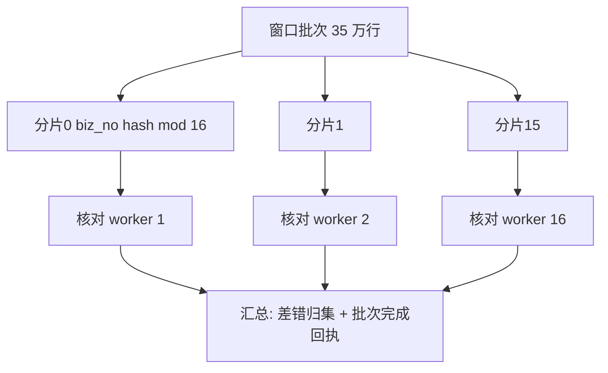
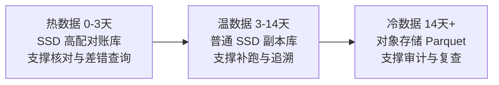
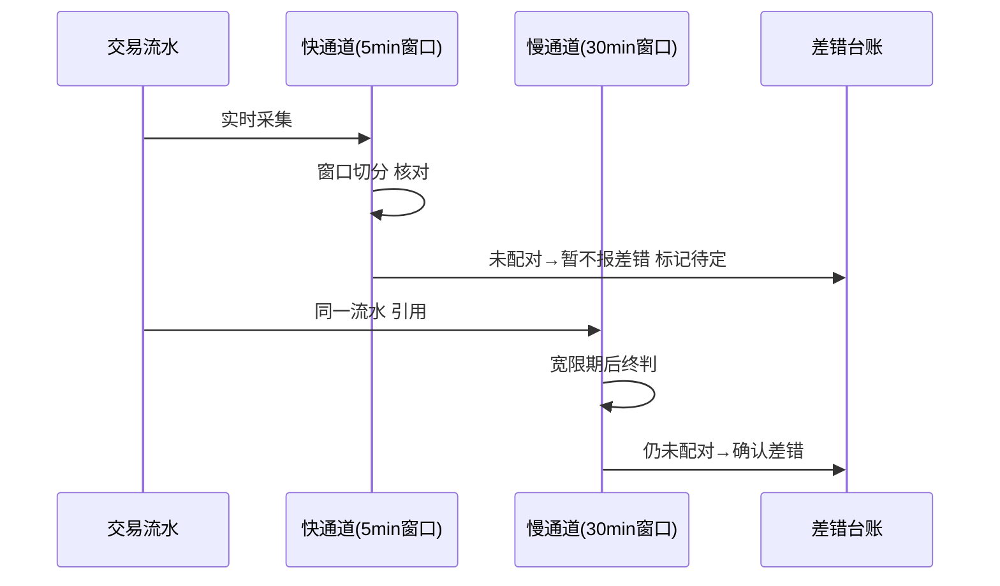
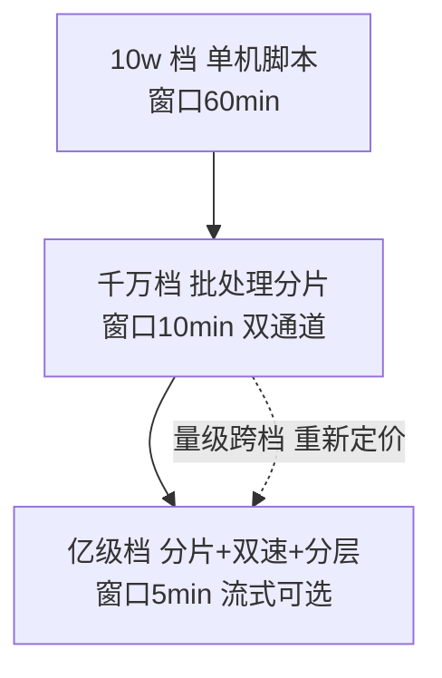

# 亿级交易对账性能：窗口、分片与存储的三档工程账

> 日流水一亿笔的对账，不是「把千万级的引擎调大点」——窗口再短数据就绪率就崩、分片再细调度就散、存储再省核对就慢。这一篇把亿级对账的工程账算透：每个瓶颈给量化推演，每个参数给三档实测逻辑，每次取舍给数字支撑。

## 一句话摘要

亿级对账的三大瓶颈与解法：**吞吐**（单批 5 分钟窗口内跑不完 → 分片并行 + 流式化）、**存储**（对账库日增 TB 级 → 冷热分层 + 滚动保留）、**时效**（就绪率与窗口的物理矛盾 → 双速对账：快通道抓单边 + 慢通道兜延迟）。三档形态（脚本/批处理/流式）的分界点由「就绪率-时效-成本」三角决定，本文给出每档的推导与参数。

## 前置阅读

- 特性层篇 1《准实时对账引擎》（五段流水线与核心参数）
- 入门层篇 6《对账体系入门》（三层结构与切日容错）

## 🎯 本文核心

**核心机制一句话**：亿级对账 = 把「发现时效、数据就绪率、资源成本」的三角在每个设计点重新定价——窗口、分片、存储、形态四组参数是这个三角的四次定价。

**机制链**：量级增长 → 单批耗时超时效预算 → 分片化（水平扩展核对）→ 分片引发数据倾斜与调度复杂度 → 存储分层对冲成本 → 快慢双速对冲就绪率与时效矛盾。上下游：上游是特性层引擎机制（本篇是其量级极限的工程展开），下游是整合层 Demo（本篇参数的落地验证）。

## 上下游一分钟

本篇在防资损体系的位置：它是特性层对账引擎在**量级压力下的变形记**——引擎机制不变（采集/窗口/配对/核对/路由），但每个环节的参数与形态在三档量级下完全不同。向上它回答架构师「亿级了怎么办」，向下它给 SRE「容量怎么规划」——量级跨档的每一步都是本篇的一个章节。

## 一、瓶颈推演：亿级到底难在哪（数字支撑）

基准假设（行业认知量级，推导逻辑比数字重要）：日流水 1 亿笔 → 峰值小时 8%（互联网流量形态）≈ **830 万笔/小时 ≈ 2312 笔/秒/侧**，两侧 4600+ 流/秒入对账库。

| 环节 | 千万档（1000 万/日） | 亿级档（1 亿/日） | 压力倍数 |
|---|---|---|---|
| 采集写入 | ~230 行/秒/侧 | ~2300 行/秒/侧 | 10x |
| 对账库日增 | ~20GB | ~200GB（含索引） | 10x |
| 5 分钟窗口批大小 | ~3.5 万行/侧 | ~35 万行/侧 | 10x |
| 单批核对耗时（串行 0.1ms/行） | 3.5s | 35s | 时效预算内的比例恶化 |

**三个结论**：① 千万档串行都能跑（3.5s ≪ 预算），亿级档必须并行（35s 单批 × 多批超预算）；② 存储日增 200GB → 保留 7 天 1.4TB，不分层一年几十 TB；③ 就绪率在亿级峰值时段恶化（上游本身延迟升高）——**窗口与就绪率的矛盾在亿级档从「参数问题」升级为「架构问题」**。

## 💡 实战提示

- 💡 分片数宁可一次配到下一档（千万档直接配 16 片），扩容只加 worker 不改分片函数——改分片 = 全量数据重分布，是亿级档最贵的「参数调整」。
- 💡 差错率突增时先看「就绪率曲线」再怀疑业务——就绪率下跌期的「差错」多是延迟假象，这一条能省掉一半的深夜误排查。

## 二、分片并行：把窗口切开跑



**分片键选择**：`hash(biz_no) % N`——为什么不用场景分片：场景分片会导致热点场景（放款）分片独大（倾斜，链回分片机制系列篇 2）；biz_no hash 均匀且两侧同键同片（配对在片内完成，无跨片 join）。**分片数取 2^n**（16/32）——扩容翻倍只调 worker 映射（链回分片机制系列的 2^n 纪律）。

**参数表（分片与并行，三档推荐）**：

| 参数 | 默认值 | 千万档推荐 | 亿级档推荐 | 为什么 |
|---|---|---|---|---|
| 分片数 | 16 | 8 | 64 | 2^n；分片数 ≥ 2×worker 数（均衡余量） |
| worker 并行度 | 4 | 8 | 32-64 | 按 Little's Law 推导（特性层篇 1 公式）加抖动余量 |
| 单 worker 批大小 | 1000 | 5000 | 10000 | 内存与事务长度的平衡 |
| 分片倾斜告警 | 无 | max/avg 耗时 > 3 | > 2 | 倾斜分片拖尾 = 窗口超时的第一原因 |
| 核对库连接池 | 20 | 50 | 按 worker × 2 | 避免 worker 间连接争抢 |

**倾斜治理步骤**（亿级档实操，步骤级）：① 监控每分片单批耗时（过程指标）；② max/avg > 2 触发倾斜告警；③ 定位倾斜键（`SELECT biz_no, COUNT(*) GROUP BY 分片 ORDER BY 耗时`——通常是同一大商户/大活动的海量流水）；④ 热点分片二次拆分（片内按子键再 hash）；⑤ 演练验证新分片函数的均匀性（离线全量回放）。

## 三、存储工程：分层、保留与查询隔离



**三档存储参数**：

| 参数 | 千万档 | 亿级档 | 为什么 |
|---|---|---|---|
| 热数据保留 | 7 天全热 | 3 天热 | 核对与差错处理集中在近 72h |
| 滚动清理 | DROP 分区 | 分区 DROP + 归档任务 | 分区表按天切，清理 O(1) |
| 查询隔离 | 同库 | 查证走温/冷层 + 限流 | 查询抢 IO = 窗口超时（特性层篇 1 铁律） |
| 归档格式 | — | Parquet（列存压缩比 5-10x） | 审计查询按列扫描，对象存储成本 1/10 |

**为什么归档选 Parquet 不选 SQL 导出**——归档数据的访问模式是「审计时按场景/日期扫描」，列存压缩在对象存储上的成本是关系库的十分之一量级（行业认知），且不对账库产生任何回压。

## 四、双速对账：快通道与慢通道

亿级峰值时段就绪率下降（上游延迟），单一窗口进退两难——**双速对账**是正解：



- **快通道**（5 分钟窗口）：只报「高置信差错」（单边且已过宽限），目标是最快发现；
- **慢通道**（30 分钟窗口 + 3 次重试）：吸收延迟型流水，对快通道的「待定」做终判——**为什么分两速**：把「延迟」与「差错」的判别从单窗口的时间压力里解放出来，快通道保时效、慢通道保准确，两者的误报/漏报责任分清；
- **参数**：快慢通道窗口比 1:6（5min/30min）、慢通道重试 3 次退避 10min、快通道「待定」不进告警（只有慢通道确认才告警）——为什么待定不告警：待定多数是延迟（特性层篇 1 的数据），报出来就是噪音。

## 五、代码级：分片核对调度骨架

```python
# 分片核对调度器（简化可运行骨架）
import hashlib

def shard_of(biz_no: str, shards: int) -> int:
    return int(hashlib.md5(biz_no.encode()).hexdigest(), 16) % shards

def run_window(window_start, window_end, shards=64, workers=32):
    batch_no = f"{window_start:%Y%m%d%H%M}-{window_end:%H%M}"
    pending = [s for s in range(shards) if not is_done(batch_no, s)]   # 幂等: 已完成分片跳过
    results = parallel_map(                                            # worker 池执行
        lambda s: reconcile_shard(batch_no, s, window_start, window_end),
        pending, workers=workers)
    done, diffs = summarize(results)
    if done < len(pending):                                            # 部分失败 → 只补失败分片
        schedule_retry(batch_no, shards=[s for s, r in zip(pending, results) if not r.ok])
    report_metrics(batch_no, done, diffs)                              # 及时率/差错率上报
    return diffs
```

**为什么「部分失败只补失败分片」**——全批重跑会把已成功分片的核对时间浪费一遍（亿级档单批分钟级 × 64 分片，全量重跑是分钟级浪费）；分片级幂等（`is_done` 标记）让重跑代价与失败面成正比。



对账形态的演变与未来：从财务电算化的日终批处理，到支付平台的准实时流水核对，再到云原生弹性核对——每一代形态更替都由「发现时效要求」驱动；未来五年的演变方向是对账能力的平台化与 Serverless 化（按窗口弹性伸缩），这一脉络在整合层 Demo 里继续落地。

## 六、业内惯例与生产实践

- **惯例一**：峰值预案——大促前对账引擎容量按峰值流量的 1.5 倍压测（大促也是资损高发期，对账不能在需要它的时候掉链子）；
- **惯例二**：快慢通道的「待定差错」单独台账状态（不与确认差错混算 KPI）；
- **惯例三**：存储成本月报——对账库与归档的成本是资损体系的显性成本项，进季度评审（可观测的成本才是被管理的成本）。

## 与稳定性对账（MySQL 主从一致性校验）的区别（跨域辨析）

两者都是「两边比对」，分治三处：**对象**（主从比数据页/行，资损比业务流水）、**触发**（主从周期巡检，资损按窗口常驻）、**差错处置**（主从差异修复数据，资损差错走追回闭环）——技术同源（hash 比对/分块校验思路互通），业务域完全不同。工具可互相借鉴（pt-table-checksum 的分块思路就适合对账分片），但系统不合并。

## 你们可能会问

**Q1：就绪率到多少该扩容采集而不是加窗口？**
就绪率 < 99% 且重试 3 次仍不达 → 瓶颈在采集端（上游延迟或采集中积压），加窗口只是掩盖；判断口径：窗口超时批次的「未达侧延迟分布」——延迟集中在采集链路就扩采集，分散在业务高峰就调窗口/双速。

**Q2（追问）：流式方案（Flink）与批处理在亿级怎么选？**
判据三问：需要人工介入差错排查吗（批处理友好）？窗口下限能 ≥ 5 分钟吗（流式优势在 <1min）？团队有流式运维能力吗？——三问两否选批处理分片，亿级 + 强时效 + 有能力才上流式；**流式不是高级，是时效压到分钟内的必然代价**。

**Q3（再追问）：大促期间对账要不要降级？**
反向——大促是资损高发期，对账要**扩容**而不是降级；可降级的是「非核心场景」的核对频率（P3 类差错场景窗口放宽），核心资金场景永不降级。降级清单要预先评审，不能临时拍。

## 开放问题

- 对账计算的 Serverless 化（按窗口弹性伸缩核对 worker）在云原生环境的成本模型——固定容量 vs 弹性伸缩的成本交叉点随云厂商定价浮动，值得每半年重算。

## 决策

**决策**：何时从单库核对升级分片并行——单批耗时超窗口时效预算的 50%；何时上双速对账——峰值时段就绪率跌破 99% 且延迟型误报占比过半；何时归档分层——对账库超 500GB 或保留期存储成本进月报 Top10。怎么选分片数：2^n 且 ≥ 2×worker，预留下一档扩容空间（翻倍而非重构）。

## 自测三问

1. 亿级档三大瓶颈的量化结论？（写入 10x / 存储 200GB 日增 / 单批 35s 超预算——分片+分层+双速对症）
2. 快慢通道各保什么？（快通道保时效报高置信差错 / 慢通道保准确吸收延迟）
3. 分片键为什么选 biz_no hash？（均匀防倾斜 + 两侧同键同片免跨片 join）

## 5W 速记卡

| 问题 | 答案 |
|---|---|
| What | 亿级对账的瓶颈推演与分片/存储/双速三解法 |
| Why | 量级跨档后窗口-就绪率-成本三角重新定价 |
| 关键参数 | 分片 2^n≥2×worker / 热 3 天 / 快慢比 1:6 |
| 演练 | 大促前 1.5 倍峰值压测 |
| 边界 | 就绪率 <99% 先查采集不加窗口 |

## 🎯 核心带走

**30 秒复述**：亿级对账 = 分片并行解吞吐（2^n + biz_no hash + 倾斜治理）+ 存储分层解成本（热 3 天/温/冷 Parquet）+ 双速对账解时效（快通道报高置信、慢通道兜延迟）；每次扩容前先看「未达侧延迟分布」定位真瓶颈。**失效点**——加窗口掩盖采集瓶颈、查询不隔离、倾斜无告警、大促对账降级。金句带走：

> **量级跨档不是调参数，是重新定价「时效-就绪率-成本」的三角——每个设计点都是一次新的取舍。**

> **大促是对账最忙的时候，不是最闲的时候——资损高发期的发现能力，是压测出来的不是承诺出来的。**

## 📌 数据与事实声明

- 流量形态（峰值小时 8%）、单行耗时（0.1ms）、存储量级为行业认知与推导示例，实际按实测替换；Parquet 压缩比为公开格式特性；外部文件对账与主从校验的差异为公开实践归纳。

## 📚 参考资料

- 特性层篇 1《准实时对账引擎》（机制正源）
- 本仓库分片机制系列（分片与倾斜治理的方法论迁移）
- pt-table-checksum（分块校验思路的对照参考）
