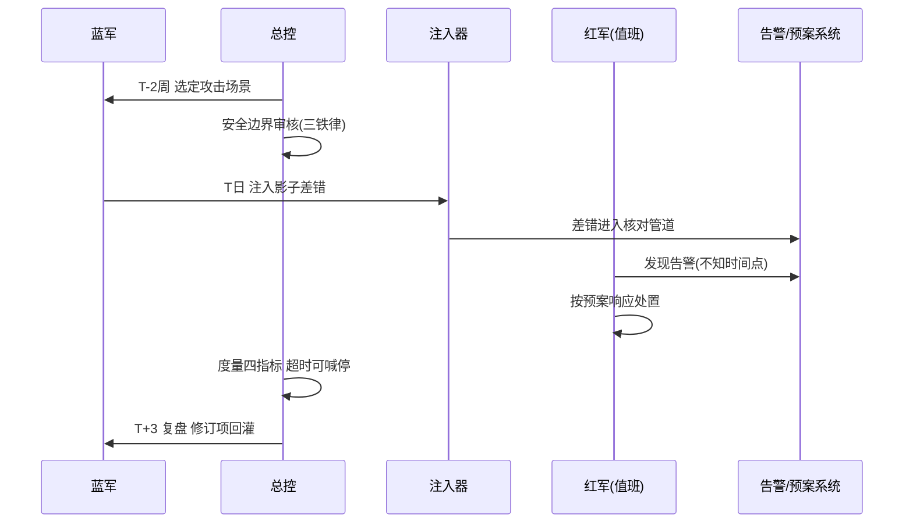
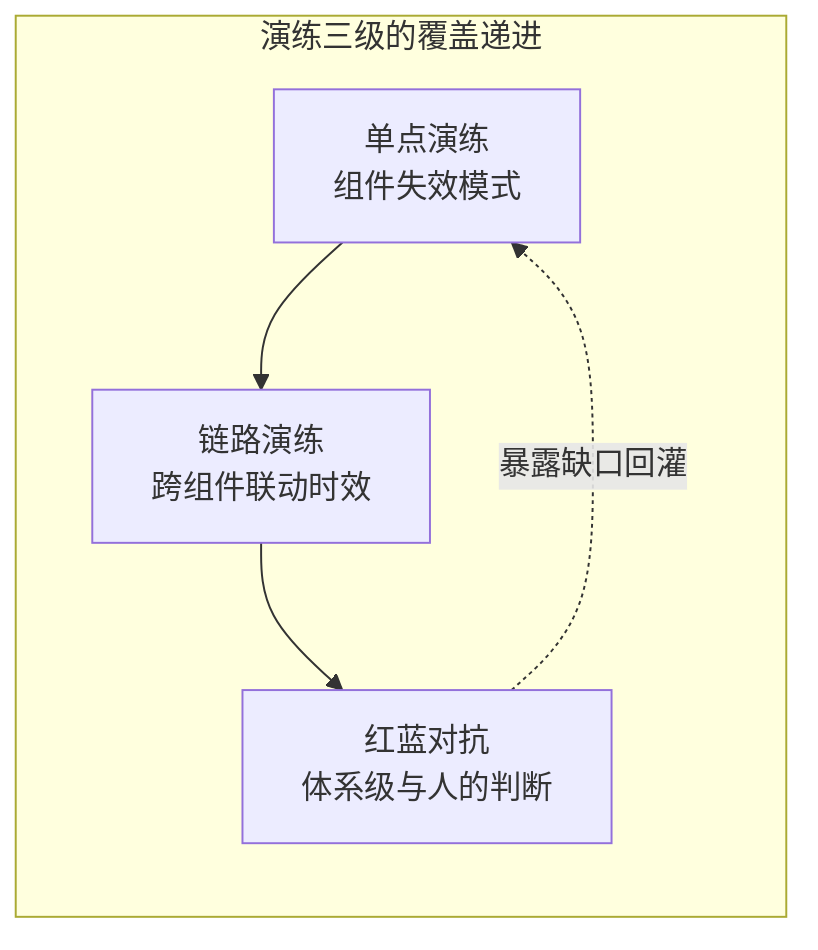
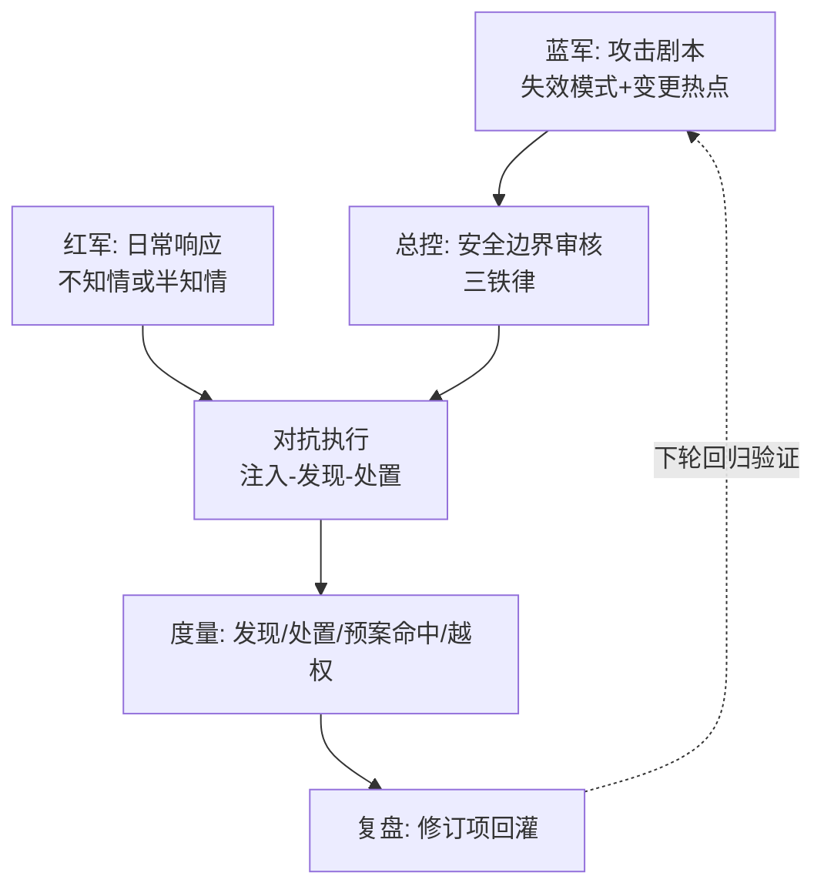
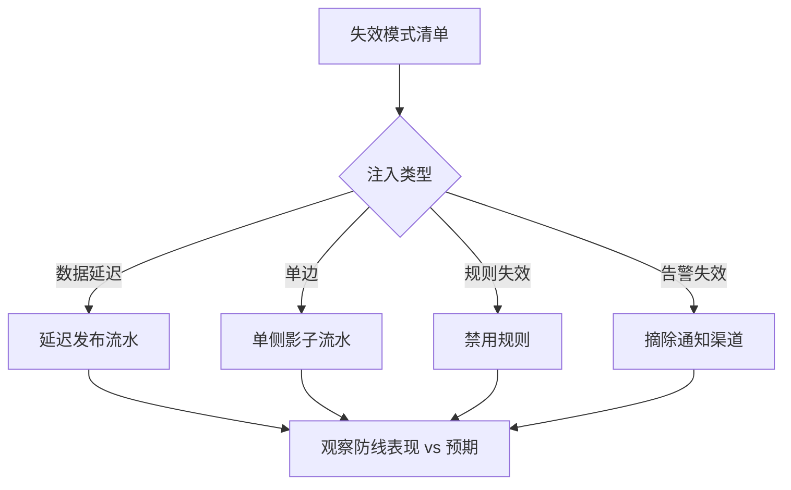

# 资损预案演练与红蓝对抗：防线有效性的验证方法

> 防线上线不等于防线有效——规则配置错了、对账断流了、止损开关失灵了，这些「防线失效」在真实资损发生前完全不可见。演练是唯一的验证手段：**注入一次受控的假差错，检验整条防资损链路是否真的接得住**。这一篇讲演练的分级体系、红蓝对抗的组织方法与安全边界。

## 一句话摘要

资损演练三级体系：**单点演练**（验证单一防线组件：注入偏差验证对账发现）、**链路演练**（验证跨组件联动：偏差 → 告警 → 止损全链路）、**红蓝对抗**（蓝军模拟真实资损场景攻击，红军按预案防御，检验体系级响应）。安全铁律：**资金故障注入只在影子流量/灰度环境打真数据，生产环境只打「可完美回收的标志物」**——演练本身造成资损是防资损最大的讽刺。

## 前置阅读

- 特性层篇 1-4（被演练的四个防线组件）
- 本仓库稳定性系列（混沌工程方法论的同源基础）

## 🎯 本文核心

**核心机制一句话**：资损演练 = 把「防线的失效模式」变成「可注入的故障场景」，用受控实验验证「发现时效、拦截有效、止损可用」三件事——演练通过率是防线有效性的唯一证据。

**机制链**：失效模式清单（从演练视角重读每个组件）→ 场景化注入设计（怎么造一个安全的假差错）→ 分级执行（单点 → 链路 → 对抗）→ 度量与复盘（时效数字与预案修订）。上下游：上游是特性层的四个组件（演练对象），下游是预案的修订与告警阈值的校准（演练产出直接回灌机制配置）。

## 上下游一分钟

演练在防资损体系的位置：它是「体系的质检环节」——特性层建的每个组件都自带「设计时假设」，演练验证假设。向上它给管理层面防线有效性的证据（不是 PPT 的「我们有防线」，是注入实验的通过记录），向下它给组件团队暴露真实失效模式。与稳定性混沌工程的关系：方法论同源（故障注入/爆炸半径/稳态假设），注入对象不同（资金数据流 vs 系统依赖）。

## 一、失效模式清单：演练的靶子

从演练视角重新审视特性层组件的失效模式（每一行都是可注入的场景）：

| 组件 | 失效模式 | 注入方式 | 预期防线表现 |
|---|---|---|---|
| 对账引擎 | 采集断流（一侧停采） | 停采集器实例 | 两侧笔数差率告警 P1，5 分钟内 |
| 对账引擎 | 窗口积压 | 注入超量流水 | 积压告警 + 自动扩容/降级预案 |
| 对账引擎 | 引擎宕机 | kill 核对实例 | 恢复后积压补跑，无差错丢失 |
| 规则中心 | 规则误杀 | 影子环境注入合法请求 | 误杀率统计正确，申诉流程可用 |
| 告警链路 | P0 通知失效 | 摘除电话渠道 | 升级机制自动触发（IM→电话备援） |
| 止损执行 | 开关未生效 | 摘除一台实例的开关回执 | 生效确认报 P1 + 探测验证拦截失败告警 |
| 止损执行 | 忘记恢复 | 冻结超 TTL | 自动过期恢复 + 恢复告警 |

**为什么清单化**——演练的覆盖度要可度量：失效模式清单的演练覆盖率（已演练 / 全部）是体系健康的元指标，与稳定性混沌的「稳态假设清单」同构。

## 二、注入器设计：安全的假差错怎么造（代码级）

```python
# 资损演练注入器（影子流水注入，简化骨架）
import uuid

def inject_shadow_mismatch(scene: str, biz_no: str, mode: str) -> dict:
    """向对账库注入一侧影子流水，制造可控的单边偏差"""
    assert mode in ("SINGLE_A", "SINGLE_B", "AMOUNT")
    assert biz_no.startswith("DRILL-"), "演练流水必须带 DRILL 前缀"   # 安全铁律1: 前缀隔离
    flow = {
        "biz_no": biz_no,
        "side": 1 if mode == "SINGLE_A" else 2,
        "amount_cent": 100,                    # 安全铁律2: 固定小额
        "status": "SUCCESS",
        "drill": True,                         # 安全铁律3: 演练标记贯穿全链
    }
    recon_db.insert("recon_flow", flow)
    return {"drill_id": str(uuid.uuid4()), "expect_detect_within": "2x_window"}
```

**三条安全铁律**（演练事故的全部预防）：

1. **前缀隔离**：演练流水的对账键带 `DRILL-` 前缀——差错台账、告警、追回全链路可识别（误入追回也能拦截）；
2. **固定小额**：演练流水金额恒定小额——万一漏出防线，损失可控可解释；
3. **演练标记贯穿**：`drill=True` 字段从注入流到差错台账——复盘时能区分「演练差错」与「真实差错」。

**为什么不用「真交易打真环境」**——真实资金操作 + 演练不确定性 = 演练本身可能资损；影子流水与真实流水在同一核对管道里过（验证管道真实性），但源头可控可回收——这是「打真数据、注假流水」的折中设计。

## 三、参数表（演练体系三档配置）

| 参数 | 默认值 | 10w 档 | 千万档 | 亿级档 | 为什么 |
|---|---|---|---|---|---|
| 演练频率 | 半年 | 年度 1 次 | 半年 1 次 | 季度 + 大促前必演 | 防线组件变更越频繁演练越密 |
| 单点演练覆盖 | — | 全部失效模式 | 全部 | 全部 + 新增模式当季补 | 覆盖率是元指标 |
| 链路演练时效目标 | 2×窗口 | 宽松 | < 10 分钟 | < 5 分钟 | 与告警 SLA 对齐 |
| 红蓝对抗频率 | — | 不做 | 年度 | 半年度 | 对抗需要专职蓝军，小团队成本不匹配 |
| 演练流量占比 | — | 影子固定小额 | < 0.001% | < 0.0005% | 演练流水不能污染业务统计基线 |





## 💡 实战提示

- 💡 演练注入的差错金额用「对账零容差阈值 +1」——刚好越过告警线的注入能同时验证阈值配置的正确性，一举两得。
- 💡 红军响应过程的每一步操作录屏/留痕——「越权动作清单」的 evidence 要靠过程留痕，复盘时凭记忆说不清。

## 四、红蓝对抗的组织方法（步骤级）

1. **前置（T-2 周）**：蓝军选定攻击场景（从失效模式清单 + 近期变更热点选 2-3 个）；红军不知情（只有演练总控知道时间窗口）；
2. **场景设计（T-1 周）**：蓝军编写攻击剧本（注入方式/预期防线突破点/判定标准），总控审核安全边界（三铁律检查）；
3. **执行（T 日）**：蓝军按剧本注入（如「模拟规则配置错误 + 同时摘除一条告警通道」），红军按日常流程响应（不告知是演练则最真实，告知则聚焦流程走查——两种模式交替）；
4. **度量**：发现时效（注入 → 告警）、处置时效（告警 → 止损生效）、预案命中率（红军动作与预案的吻合度）、越权动作（未经授权的临场操作清单）；
5. **复盘（T+3 日）**：每个未命中点产出修订项（阈值/预案/流程），修订进下轮演练的回归验证项；
6. **回退**：演练注入的流水与配置全量回收（DRILL 前缀清理 + 配置回滚），回收完整性进复盘检查单。



## 五、度量：演练通过率的定义

链路演练的通过标准（缺一即不通过）：

- **发现时效**：注入 → P0/P1 告警 ≤ 2×窗口（对应 SLA）；
- **处置有效**：止损动作生效确认 + 探测验证通过；
- **闭环完整**：差错进台账 → 状态流转 → （演练标记）关单；
- **无越权**：响应过程无未预注册的操作（临场发明的处置 = 预案缺口证据）。

**通过率的目标曲线**：首轮演练通过率通常 50-70%（暴露真实缺口）——这是**健康信号**（演练就是为了暴露）；连续两轮 100% 后演练价值递减，应提高注入复杂度或轮换盲演场景。**演练的 KPI 不是通过率而是「每轮暴露并修复的缺口数」**——零缺口的演练是走过场。

## 六、与稳定性混沌工程的区别（跨域辨析）

同源方法论（故障注入/稳态假设/爆炸半径），三个分治点：**注入对象**（稳定性打依赖与服务，资损打资金数据流与防线组件）、**稳态定义**（稳定性稳态 = SLO 达标，资损稳态 = 零偏差与防线时效）、**安全边界**（稳定性可打生产服务，资损资金故障几乎不可打生产——影子流水是折中产物）。为什么不能直接复用混沌平台：注入器的安全铁律（前缀/小额/标记）是资损域特有的，但演练调度、度量、复盘的平台能力应共用——**平台共用、注入器分治**。

## 常见误区

- ❌ 「演练=走一遍操作手册」——照本宣科的演练验证不了告警链路与人的判断，盲演（部分知情）与突袭（总控知情）才是真检验；
- ❌ 「演练环境用测试库」——测试库的流水规模与真实环境差数量级，防线组件的性能失效（窗口积压）在测试库永远暴露不了；
- ❌ 「红蓝对抗年年搞一次就是重视」——低频对抗的仪式价值大于实战价值；对抗频率要与防线变更频率匹配（变更多则对抗密）；
- ❌ 「演练通过就一劳永逸」——防线的配置、依赖、上游都在变，上季度的通过证明不了本季度——**有效性证明有时效**。

## 代价与边界

演练的成本：总控与蓝军人力（亿级档需要专职或轮值）、影子环境维护、业务方配合（演练窗口避开业务高峰）。边界：演练验证「已知的失效模式」，未知模式（新业务形态的新错法）只有真实事故能暴露——**演练降低事故概率但不归零事故**，这个预期要向管理层讲清（演练的价值曲线是边际递减的）。



## 演进视角

资损演练的演变：无演练（防线上线即裸奔）→ 事故后复盘式验证（疼了才查）→ 常规注入演练 → 红蓝对抗 + 常态化自动化注入（资损领域的 Chaos 平台化）。演进的驱动与稳定性混沌一致：**体系复杂度超过人脑可推理的范围后，实验成为唯一的认知手段**——亿级档的防资损体系已经远超人脑可推演的边界，这就是演练从可选项变成必选项的逻辑。

## 你们可能会问

**Q1：演练注水的流水会污染业务报表吗？**
会——所以铁律三是标记贯穿 + 演练流量占比上限（参数表 < 0.0005%）；下游报表以 DRILL 前缀过滤，过滤逻辑要进报表部门的接入文档（漏过滤是演练对数据团队的一次性协调成本）。

**Q2（追问）：红军「不知情」会不会演变成真事故？**
总控的安全边界审核（第 2 步）就是防这个：注入上限、熔断条件（红军响应超时 N 分钟总控强制终止并回收）、应急通信通道（总控随时喊停）——**不知情的是时间点，不是安全网**。

**Q3（再追问）：演练暴露的缺口修复后怎么确认「修好了」？**
修订项进「回归验证清单」，下一轮演练**优先复测**上轮失败项——缺口修复的验证权在下一轮演练，不在修复团队自己的汇报里。

## 开放问题

- 自动化资损注入平台（把失效模式清单变成常驻的定时注入任务）与人工红蓝的配比——自动化覆盖已知模式、人工探索未知模式，自动化的安全护栏（前缀/小额/熔断）如何标准化是工程开放题。

## 决策

**决策**：何时启动单点演练——特性层第一个组件上线时（上线即验）；何时升级链路演练——三个组件齐备且告警 SLA 定义后；何时做红蓝对抗——亿级档或多团队共建防线时。怎么选注入场景：从「近期变更热点 + 上轮演练失败项」选，不选最熟悉的场景（演练要打软肋）。

## 自测三问

1. 演练的三条安全铁律？（DRILL 前缀隔离 / 固定小额 / 标记贯穿全链）
2. 演练 KPI 为什么不是通过率？（通过率 100% = 走过场；每轮暴露并修复的缺口数才是价值）
3. 链路演练的通过标准四条？（发现时效 / 处置有效 / 闭环完整 / 无越权）

## 5W 速记卡

| 问题 | 答案 |
|---|---|
| What | 单点/链路/对抗三级演练 + 安全注入器 |
| Why | 防线上线≠有效——演练是唯一验证手段 |
| 铁律 | 前缀隔离 / 固定小额 / 标记贯穿 |
| 频率 | 季度（亿级档）+ 大促前必演 |
| 边界 | 验证已知模式；未知模式只有真实事故能暴露 |

## 🎯 核心带走

**30 秒复述**：资损演练三级（单点验组件、链路验联动、对抗验体系），注入器三铁律保安全，度量四指标（发现/处置/预案命中/越权），KPI 是每轮暴露的缺口数。**失效点**——走本宣科、测试库演练、低频仪式化、通过即一劳永逸。金句带走：

> **防线有效性不是评审出来的，是注入实验打出来的——没有演练记录的防线，只是 PPT 上的防线。**

> **演练的价值曲线边际递减：连续满分的演练该加难度了—— comfort 是防线的腐蚀剂。**

## 📌 数据与事实声明

- 三级演练体系、注入器设计、安全铁律为业界混沌工程方法在资损域的应用归纳（公开方法论）；频率/占比参数为行业认知量级；首轮通过率 50-70% 为经验认知。

## 📚 参考资料

- 《Chaos Engineering》（O'Reilly）——稳态假设与故障注入的方法论正源
- 特性层篇 1-4（被演练组件的机制）
- 本仓库稳定性系列混沌工程篇（同源方法论）
