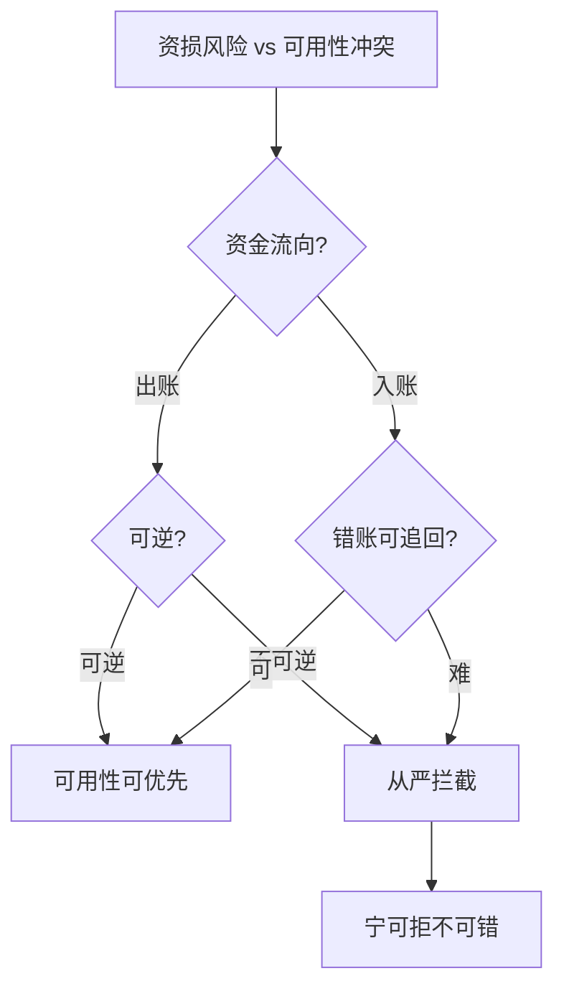
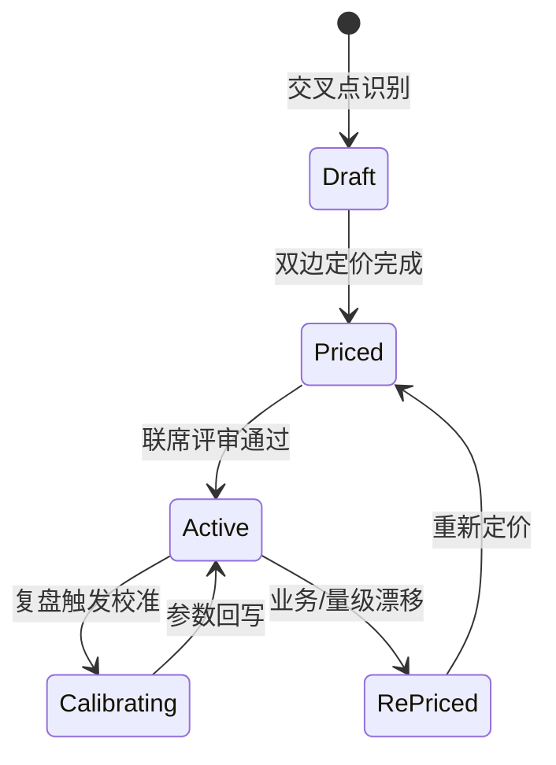

# 资损防控与可用性的取舍：当「拦住」与「跑通」打架

> 防资损的每一个组件都在消耗可用性：规则拦截可能误杀（可用性损失）、对账旁路要资源（容量挤占）、止损冻结直接停交易（可用性重锤）。资损防控与可用性不是两个目标，是**同一条链路上的两根拉力方向相反的弹簧**——这一篇把所有交叉点的取舍定价。

## 一句话摘要

资损-可用性取舍发生在五个交叉点：**拦截误杀 vs 资损敞口**（事前规则的阈值定价）、**校验深度 vs 交易 RT**（事前校验的延迟预算）、**对账资源 vs 容量**（旁路的资源占用）、**止损速度 vs 波及面**（冻结粒度的爆炸半径）、**可用性优先还是资金优先的兜底原则**（资金密集系统「宁可拒不可错」的行业铁律及其例外）。每个交叉点给出定价公式与三档决策表。

## 前置阅读

- 入门层篇 1（三道防线与敞口概念）、特性层篇 2/4（规则中心与止损）

## 🎯 本文核心

**核心机制一句话**：资损-可用性取舍 = 对每个交叉点回答「防错的机会成本 vs 出错的损失期望」，谁大听谁的——公式很简单，难在参数诚实。

**机制链**：识别交叉点（本篇五处）→ 定价两边（误杀损失期望 vs 资损损失期望）→ 决策（阈值/预算/粒度/原则）→ 用演练与复盘校准参数。上下游：上游是敞口与流量数据（定价的输入），下游是规则阈值与预案参数（定价的输出物）。


## 上下游一分钟

取舍决策在防资损架构的位置：特性层建机制（怎么拦/怎么核/怎么停），本篇管机制「拧多紧」——所有阈值的最终依据。向上它连接业务（误杀=收入损失、资损=赔付与监管），向下它落到规则中心的阈值表与预案的授权参数。模块边界：取舍决策是**业务与工程的联席产出**，工程单方面定阈值 = 把商业判断藏进技术配置（复盘高频发现）。

## 一、交叉点一：拦截误杀 vs 资损敞口（事前规则的阈值定价）

**定价公式**：最优误杀率 ≈ 资损损失期望 ÷ 误杀单位损失。举例推演（行业认知量级）：某放款场景日均 10 万笔，规则拦截的资损期望 = 单笔均损 1 万元 × 漏放率；误杀损失 = 客户流失率提升 × 客单价值。

| 参数 | 10w 档 | 千万档 | 亿级档 | 为什么 |
|---|---|---|---|---|
| 误杀容忍 | 0.1% | 0.05% | 0.01% | 流量大基数下绝对误杀数放大，容忍率收紧 |
| 资损期望容忍 | 单笔均损 × 月频率 | 同左 | 同左且按监管要求加严 | 监管处罚是资损损失的非线性项 |
| 阈值校准周期 | 季度 | 月度 | 双周 + 影子常驻 | 变更频率越高校准越密 |

**设计思想**：这道取舍的本质是给「错误的两边」分别定价——拦截的确定性损失（误杀）对上漏放的概率性损失（资损期望），期望值比较是唯一不掺情绪的裁判。**为什么误杀容忍随量级收紧**——0.1% 的误杀在 10w 档是日 100 笔（客服可消化），在亿级档是日 1 万笔（客诉灾难）——**绝对量是容忍度的真实标尺**，比例只是表述。

## 二、交叉点二：校验深度 vs 交易 RT（事前的延迟预算）

每加一道事前校验（幂等查重 2ms + 规则决策 20ms + 风控 50ms + 黑名单 5ms），交易 RT 同步增长——RT 每涨 100ms，转化率下降的行业认知区间是 1-3%（电商经典结论）。

| 校验 | RT 代价 | 资损价值 | 取舍决策 |
|---|---|---|---|
| DB 唯一索引（幂等） | ~1ms | 防重复放款（高） | 永不省 |
| 规则决策（本地） | 5-20ms | 拦越界（高） | 预算内全保 |
| 风控外部调用 | 30-80ms | 防欺诈（中高） | 异步化或并行预取 |
| 历史行为聚合 | 100ms+ | 低频场景才有价值 | 移到异步复核（防线二化） |

**取舍原则**：RT 预算内保「资损价值密度」最高的校验；可异步的校验一律后移到防线二（校验从「事前拒绝」变「事中快速发现」——损失发现时效换取 RT）——**哪个损失更贵决定校验放哪**。

## 三、交叉点三：对账资源 vs 容量（旁路的资源税）

对账引擎的资源（特性层篇 1：亿级档核对库 200GB 日增 + 数十核核对集群）是从业务容量里「税」出来的。取舍推演：对账降配省下的成本 vs 发现延迟增大的期望损失——千万档省 10 台核对机的成本约等于一次中小资损的期望损失（行业认知量级），**降配的正确姿势是分层**（热冷存储、查询隔离）而不是砍核对频率。

## 四、交叉点四：止损速度 vs 波及面（冻结粒度的爆炸半径）

特性层篇 4 的授权参数本质是这道取舍的输出：粒度细（单商户）误伤小但预案多（维护成本）、生效覆盖慢（多预案排队）；粒度粗（场景级）一击即中但误伤大。**三档决策表**：

| 档 | 首选粒度 | 依据 |
|---|---|---|
| 10w | 场景级（预案简单优先） | 量小，误伤绝对值可控 |
| 千万 | 渠道级 | 偏差通常渠道聚集 |
| 亿级 | 商户/账户级 + 渠道级组合 | 绝对误伤大，必须细粒度 |

## 五、交叉点五：兜底原则——「宁可拒不可错」及其例外

资金密集系统的行业铁律：**资损风险与可用性冲突时，优先防资损**（宁可拒不可错）——拒了可重试，错账难追回。但两个例外必须识别：

1. **公共基础设施型场景**（水电代扣）：不可用的人道代价 > 单笔资损，策略反转为「先交易后修正」；
2. **错误可完美逆行的场景**：全额保证金内的操作（错误可用保证金池对冲），可用性可优先。

铁律不是教条而是**默认值**——它代表「大多数场景下资损损失期望 > 可用性损失期望」的历史统计结论；例外识别就是检验当前场景是否落在统计外。这就是这道铁律的设计思想：**用统计规律当默认，用决策树做逐场景覆盖**。

**决策树**：资金流向（出账>入账从严）→ 可逆性（可逆放宽）→ 替代方案（有线下渠道可放宽）→ 监管约束（报送类从严）。为什么这么定序——从「错误的不可逆程度」降序排列，不可逆性是取舍的第一权重。






## 五点五、取舍参数登记表与校准流程（ADR-0012 落地）

**登记表字段（参数级）**：交叉点 | 两边定价（误杀损失期望 / 资损损失期望）| 当前决策值 | 依据（数据/模型）| 定价责任人 | 上次校准 | 下次校准触发条件。

| 交叉点 | 当前决策值示例 | 校准触发 |
|---|---|---|
| 拦截阈值 | 误杀率 0.05%（千万档推荐值） | 误杀申诉率环比 > 30% |
| 校验 RT 预算 | 规则决策 ≤ 20ms | 交易转化率异常归因到 RT |
| 止损授权金额 | 日均交易 20% | 误触发率 > 1 次/季 |

**取舍决策的接入步骤**：
1. 前置：交叉点两侧的损失数据可获取（误杀申诉数据 + 资损事件数据）；
2. 定价：两侧按量级估值（不追求精确，量级正确即可）；
3. 联席评审：工程 + 业务 + 风控三方，输出决策值与责任人；
4. 落配置：决策值写入规则阈值/预案参数（附登记表编号）；
5. 验证点：影子期观察决策值的实际效果 vs 预期；
6. 回退：决策值回退 = 登记表回滚上一版本 + 重新评审。

**取舍校准脚本（伪代码，登记表过期的自动巡检）**：

```python
def audit_stale_decisions(registry, today):
    stale = [r for r in registry
             if (today - r["last_calibrated"]).days > 90
             or r["trigger_fired"] and not r["recalibrated"]]
    for r in stale:
        notify_owner(r)          # 通知定价责任人
        if (today - r["last_calibrated"]).days > 180:
            degrade_to_safe_default(r)   # 超半年未校准 → 回落安全默认值
    return stale
```

## 六、事故推演：一次「为可用性让步」的资损

行业化用案例：大促期间规则中心抖动（决策 RT 飙升），值班为保交易成功率**临时关闭了放款限额规则**（未走授权流程）——大促结束发现期间超额放款 2000 余笔。复盘 Action：① 规则禁用纳入授权体系（与止损同级管理，可用性优先的决策必须走「敞口评估」）；② 规则中心增加「禁用期间的补偿性校验」模式（事后快速复核替代事前拦截，可用性与防资损兼得的中间态）；③ 大促预案预演「规则故障时的标准动作」（降级到异步复核，而非直接关规则）——**可用性优先不是关防线，是防线降级到更便宜的形态**。

## 💡 实战提示

- 💡 每个交叉点的取舍参数写进「取舍登记表」：交叉点、两边定价、决策、依据、校准时间——取舍不留痕，下次数值漂移无从察觉。
- 💡 大促/账务日等特殊窗口要预置「取舍模式切换」（如临时收紧出账拦截阈值）——特殊窗口的资损期望与误杀代价都与平日不同，参数不该共用一套。

## 与 SLA 补偿机制的区别（跨域辨析）

SLA 赔付是「可用性损失后的资金补偿」（可用性域的资金流出），防资损是「资金正确性域」——SLA 赔付本身也可能算错（赔付规则 bug）成为资损场景，需入矩阵（篇 2）。两者的预算同池（都是「为异常付的钱」），评审时应合并视角。

## 常见误区

- ❌ 「取舍是一次性决策」——两边定价随量级、业务、监管漂移，阈值半年不校准 = 定价失效；
- ❌ 「误杀率是纯技术指标」——误杀的业务损失（客户流失）只有业务方能定价，工程单方定的阈值默认隐含了商业判断（复盘高频发现）；
- ❌ 「资损优先是铁律所以不用讨论」——铁律的两个例外（公共设施型/可完美逆行）识别不出来就会在关键场景过度拦截；铁律要配决策树用；
- ❌ 「演练只练防线不练取舍」——「规则故障时选什么降级形态」这类取舍决策也要演练（决策演练），事故现场的取舍质量是练出来的。

## 代价与边界

取舍体系的成本：定价数据（误杀损失/资损期望的业务数据采集）+ 联席评审机制 + 登记表维护。边界：定价的精度有天花板（客户流失率难归因到单次误杀）——**取舍追求「量级正确」不追求「精确最优」**，知道这个损失是另一个的 10 倍就足够决策，不必纠结 1.2 倍还是 1.5 倍。

## 演进视角

取舍机制的演变：拍脑袋 → 事故驱动（疼了才调）→ 定价表驱动（本期内容）→ 数据驱动（误杀与资损的在线归因闭环）——**取舍的演进史是定价精度的发展史**；行业头部已开始用实验方法（灰度误杀率 vs 资损率的 A/B）直接测量定价，这个方向值得跟踪。

## 你们可能会问

**Q1：两边定价都拿不准怎么办？**
按「不可逆性」决策（第五节决策树）——定价可糊弄，不可逆性是物理事实；不可逆的出账从严永远不亏大钱。**定价模糊时用可逆性兜底。**

**Q2（追问）：为什么说工程单方定阈值是把商业判断藏进技术配置？**
「拦多少算误杀得起」依赖客户价值与流失模型——工程师对技术参数负责，商业参数必须业务输入；联席评审不是为了流程好看，是为了定价的输入端正确。

**Q3（再追问）：取舍登记表会不会变成形式主义？**
会——如果登记表不与「复盘校准」闭环。表里每个决策都有「校准时间」，复盘触发校准、校准回写表格——没有闭环的登记表就是又一张没人看的 Excel。

## 开放问题

- 误杀损失的归因建模（一次拦截导致多少真实流失）在行业内仍靠业务经验估值，因果推断方法（拦截与否的自然实验）在资损-可用性定价上的应用是数据团队与防资损团队的联合开放题。

## 决策

**决策**：何时建取舍登记表——第一个交叉点出现双部门争议时（争议 = 定价缺失的信号）；何时引入在线实验定价——误杀与资损的量级大到估值误差影响决策时。怎么选兜底原则：按决策树五问（流向/可逆/替代/监管/敞口），不按部门声音大小。

## 自测三问

1. 五个交叉点是什么？（拦截阈值 / 校验 RT / 对账资源 / 止损粒度 / 兜底原则）
2. 兜底铁律的两个例外？（公共设施型 / 可完美逆行）
3. 定价拿不准时的兜底决策依据？（不可逆性——物理事实优先于估值）

## 5W 速记卡

| 问题 | 答案 |
|---|---|
| What | 资损-可用性五个交叉点的定价与决策 |
| Why | 每个防线阈值都是一次商业判断 |
| 公式 | 误杀损失期望 vs 资损损失期望，谁大听谁 |
| 铁律 | 宁可拒不可错——配决策树用，有例外 |
| 边界 | 追求量级正确不追求精确最优 |

## 🎯 核心带走

**30 秒复述**：五交叉点（拦截/RT/资源/粒度/兜底）逐点定价——误杀损失期望 vs 资损损失期望；铁律「宁可拒不可错」配五问决策树用（流向/可逆/替代/监管/敞口），两个例外识别清楚；取舍参数进登记表随复盘校准。**失效点**——工程单方定价、阈值半年不校准、铁律无例外识别、取舍不留痕。金句带走：

> **资损与可用性是同一根弹簧的两端——每拧一次阈值，都要知道自己在松谁紧谁。**

> **定价可以模糊，可逆性不能看错——所有取舍公式失灵时，不可逆性是最后的地心引力。**

## 📌 数据与事实声明

- 「RT 100ms 转化率降 1-3%」为电商行业公开经验结论；五交叉点与定价公式为本系列方法论归纳（基于公开实践）；敞口/阈值示例为行业认知量级；事故叙事为行业化用。

## 📚 参考资料

- 入门层篇 1-7（体系基础）、特性层篇 2/4（被定价的两个组件）
- 本仓库稳定性系列（可用性决策的对照体系）
- 《Site Reliability Engineering》错误预算章节（可用性定价的方法论对照）
