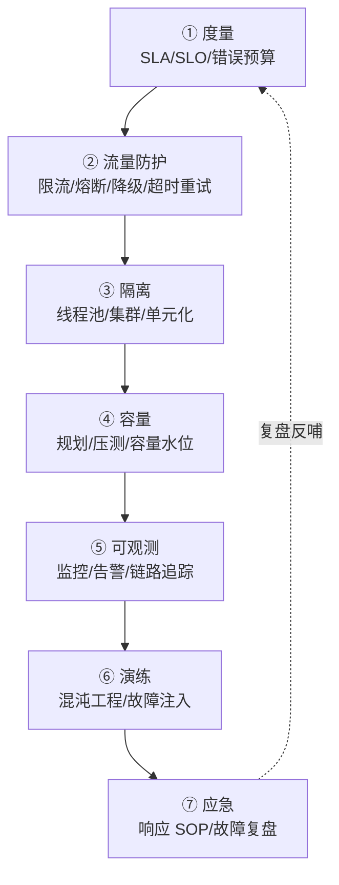

# 稳定性系统性建设系列导读

> 稳定性不是「不出故障」，而是「故障必然发生的前提下，系统仍能提供有损但可用的服务」。这个系列按「度量 → 防护 → 隔离 → 容量 → 可观测 → 演练 → 应急」的建设顺序，从零搭一套系统性稳定性体系。

## 一句话摘要

稳定性建设是一条流水线：先用 SLA/SLO 把「稳定」变成可度量的数字（度量），再用限流/熔断/超时/重试挡住流量异常（防护），用隔离控制爆炸半径（隔离），用容量规划和压测验证上限（容量），用监控告警看见问题（可观测），用混沌工程提前暴露弱点（演练），最后用应急响应和复盘把每次故障变成资产（应急）——**七个环节缺任何一个，稳定性都是纸面文章**。

## 一、为什么稳定性需要「系统性建设」

大多数团队的稳定性建设是被故障驱动的：出一次事故，补一个预案。这种模式的问题：

- **补丁式建设**：每次事故只修「这次的原因」，同类故障换个形态再来一遍
- **没有度量**：「系统稳不稳定」靠体感，没有 SLO 就没有优先级——所有告警都是 P0 等于没有 P0
- **预案没验证过**：限流阈值是拍的、降级开关没按过、故障切换没演练过——真故障时预案自己先挂

系统性建设的思路相反：**先建体系，再等故障来验证**。故障一定会发生（墨菲定律在分布式系统里是物理规律），建设的目的是让每次故障的影响面可控、恢复时间可测、同类问题不再复发。

## 二、系列地图：七环节建设顺序

| 环节 | 回答的问题 | 入门层篇目 |
|---|---|---|
| ① 度量 | 「稳定」的数字定义是什么？ | 1_什么是系统稳定性 |
| ② 流量防护 | 流量异常怎么挡？ | 2_限流 / 3_熔断与降级 / 4_超时与重试 |
| ③ 隔离 | 爆炸半径怎么控制？ | 5_隔离设计 |
| ④ 容量 | 上限在哪里？ | 6_容量规划与压测 |
| ⑤ 可观测 | 问题看得见吗？ | 7_监控与告警 |
| ⑥ 演练 | 预案真的有用吗？ | 8_混沌工程与故障演练 |
| ⑦ 应急 | 故障来了怎么办？ | 9_应急响应与故障复盘 |

## 三、怎么读这个系列

- **从零建体系**（新团队/新系统）：按 1 → 9 顺序读，每个环节先有再优
- **补短板**（已有体系）：直接跳到薄弱环节——自查标准：说不出 SLO 数字 = 从 1 开始；没有压测报告 = 从 6 开始；复盘文档没有 action item 跟踪 = 从 9 开始
- **面试/架构评审**：每篇的「自测三问」与「常见误区」可直接当评审 checklist

**前置知识**：分布式系统设计入门系列（同目录）的高并发/高可用两篇是本系列的前置——本系列不重复讲概念，直接进入「怎么建」。

## 四、分层与演进

- **入门层（本层，10 篇）**：每个环节是什么、为什么、最小实践——读完能落地一套「能用」的稳定性体系
- **特性层（规划）**：每个环节的深挖——限流算法对比（令牌桶/滑动窗口/漏桶源码级）、熔断状态机源码、全链路压测的流量染色架构
- **专题层（规划）**：行业级专题——大促稳定性保障全景、单元化多活架构、混沌工程平台建设

## 维护说明

- **前置阅读**：分布式系统设计系列入门层（尤其 3_高并发设计 / 6_高可用设计）
- **下篇衔接**：1_什么是系统稳定性 → 2_限流 → 3_熔断与降级 → 4_超时与重试 → 5_隔离 → 6_容量规划与压测 → 7_监控与告警 → 8_混沌工程与故障演练 → 9_应急响应与故障复盘 → 10_方法论总结
- **边界**：本系列讲「应用与架构层稳定性」，基础设施层（机房/网络/硬件）只在容量与演练篇涉及

## 📌 数据与事实声明

- 写于 2026-09-09；SLO/错误预算方法论源自 Google SRE 书（公开出版，行业共识口径）
- 行业认知：故障驱动的「补丁式建设」与「预案未验证」是稳定性事故复盘中最常见结论（公开复盘报告共性）
- 免责：具体工具（Prometheus/Sentinel/Hystrix 等）版本与用法以官方文档为准

## 📚 参考资料

| 类型 | 标题 | 来源 |
|---|---|---|
| 书 | 《SRE: Google 运维解密》 | 公开出版 |
| 书 | 《SRE 工作手册》 | 公开出版 |
| 官方文档 | The Twelve-Factor App（吞吐与无状态） | 12factor.net |
| 行业复盘 | 各大厂故障复盘公开报告 | 公开报道 |
