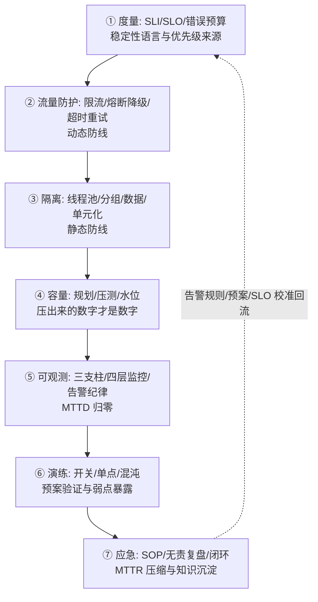

# 稳定性建设方法论总结：从补丁到体系

> 收官篇：把前九篇的七环节串成一张作战地图——先回答「从哪里开始」，再回答「怎么持续」，最后回答「怎么衡量做得好不好」。

## 一句话摘要

稳定性建设的完整方法论：**以 SLO 为纲**（度量先行）、**七环节流水线**（度量→防护→隔离→容量→可观测→演练→应急，复盘回流）、**分级投入**（核心链路重兵、长尾轻装）、**常态化运营**（演练例行化、复盘闭环化、水位定期校准）——判断成熟度的标志不是「有没有上工具」，而是「故障发生率与恢复时长是否在持续改善」。

## 一、全系列知识地图

九篇的分工：1 篇定语言（度量），2/3/4 篇动态防线（流量三件套），5 篇静态防线（隔离），6 篇上限管理（容量），7 篇神经系统（可观测），8 篇主动验证（演练），9 篇最后防线与学习机制（应急复盘），本篇收拢成体系。

## 二、从哪里开始：成熟度自查与起步顺序

**四级成熟度自查**（对号入座）：

| 级别 | 特征 | 下一优先动作 |
|---|---|---|
| L0 无体系 | 故障靠用户发现，处置靠临场发挥 | 定核心接口 SLI + 两级告警；写止血 SOP |
| L1 有监控 | 核心指标有告警，但无 SLO、无预案 | 定 SLO 与错误预算；核心链路预案落文档 |
| L2 有防护 | 限流/熔断/降级上线，但阈值没压测、预案没演练 | 基准压测校准阈值；开关演练全量做一遍 |
| L3 有体系 | 七环节齐备且常态化（演练例行/复盘闭环/水位监控） | 全链路压测常态化；混沌工程进阶；单元化评估 |

**起步顺序建议**（资源有限时的优先级）：

1. 核心链路的监控告警（看见）——第 7 篇
2. 止血 SOP + 分级值班（处置）——第 9 篇
3. 基准压测 + 限流阈值（护住上限）——第 6/2 篇
4. 核心依赖熔断降级（防传染）——第 3/4 篇
5. 隔离与演练（收尾加固）——第 5/8 篇

**核心链路优先原则**贯穿始终：稳定性资源永远向核心链路倾斜——「核心」用两个问题识别：挂了影响资金吗？挂了影响主流程吗？两个都是的核心依赖，重兵把守；都否的长尾功能，轻装简行。

## 三、怎么持续：从项目到运营

稳定性建设最大的失败模式是「运动式」——专项期间热火朝天，三个月后全部回退。持续运营的四个抓手：

- **例行化**：压测季度例行、演练季度例行、告警审计每月、容量水位每周看——进日历的才是制度
- **复盘闭环**：故障 Action Item 周会跟进（第 9 篇纪律），不闭环不结案
- **架构评审卡点**：新服务上线评审必过「稳定性五问」——SLO 定了吗？限流配了吗？降级预案在哪？容量压测了吗？怎么监控？（五问即前九篇的浓缩）
- **沉淀复用**：预案库、故障案例库、告警规则库是团队资产——新人接班、跨团队复制都靠它们

## 四、怎么衡量：稳定性建设的北极星

**不是「上了多少工具」，而是趋势数字**：

- 故障频率（MTBF）与恢复时长（MTTR）的季度趋势——在改善就是对的
- SLO 达成率与错误预算消耗——长期贴线说明容量/架构吃紧
- 演练发现弱点数的变化——先升后降是健康曲线（发现问题能力先提升，问题真被修掉后下降）
- 同类故障复发率——**复盘闭环的最终检验：同类故障是否复发**

这些数字构成稳定性建设的飞轮：度量发现弱点 → 防护/演练修复 → 趋势数字验证 → 再发现新的弱点。

## 常见误区

- **误区一：工具买齐 = 体系建成**。工具是载体制，SLO 纪律、复盘文化、演练习惯才是体系——制度不运转，工具就是摆设
- **误区二：稳定性是 SRE 团队的事**。SRE 建平台与标准，故障却发生在每个业务团队——「谁开发谁负责稳定性」才是可扩展的组织形态
- **误区三：追求一次建成完美体系**。稳定性是随业务量级持续爬坡的旅程：L0 团队先把「看见 + 止血」做好，比照抄大厂全链路压测现实得多

## 自测三问

1. **稳定性建设的第一优先动作是什么？**
   - 核心链路的监控告警与止血 SOP（看见 + 处置）——其余环节在这两者之上加固。

2. **怎么判断稳定性做得好不好？**
   - 看趋势数字：MTBF/MTTR、SLO 达成率、演练弱点数、同类复发率——工具清单不是成绩单。

3. **「运动式稳定性」怎么破？**
   - 例行化（进日历）+ 评审卡点（新服务过稳定性五问）+ 沉淀复用（预案/案例库）——从专项变成运营。

## 5W 速记卡

| W | 一句话 |
|---|---|
| What | 七环节流水线 + 成熟度分级 + 常态化运营 |
| Why | 补丁式建设不可持续——体系化才能让故障递减 |
| Where | 全部在线服务，核心链路优先 |
| When | L0 从监控与止血起步；成熟度每升一级再加固下一层 |
| Who | SRE 建平台立标准，业务团队为自己的稳定性负责 |

## 开放问题

- **稳定性的成本核算**：冗余、压测、演练都是成本，SLO 背后该折算多少业务价值（故障损失模型）——稳定性 ROI 的量化仍是难题
- **AI 运维的边界**：异常检测、根因推荐、自动止血在演进，但「AI 自动止损的决策权限给到多大」跨行业都还没有共识

## 核心带走

**30 秒复述**：稳定性建设 = SLO 为纲 + 七环节流水线（度量→防护→隔离→容量→观测→演练→应急，复盘回流）+ 核心链路优先 + 常态化运营（例行/闭环/卡点/沉淀）。成熟度看趋势数字（MTBF/MTTR/复发率）不看工具清单。**失效边界**：运动式建设必回退；工具买齐不等于体系建成；稳定性是每个开发者的责任，不只是 SRE 的。

## 📌 数据与事实声明

- 写于 2026-09-09，为本系列 0-9 篇的方法论收拢；成熟度分级与「稳定性五问」为教学归纳口径
- 方法论源头：Google SRE（SLO/错误预算）、Release It!（防护模式）、混沌工程原则（公开口径）
- 免责：起步顺序应结合各团队现状裁剪，不必照抄

## 📚 参考资料

| 类型 | 标题 | 来源 |
|---|---|---|
| 书 | 《SRE: Google 运维解密》 + 《SRE 工作手册》 | 公开出版 |
| 书 | 《Release It!》第 2 版 | 公开出版 |
| 原则 | Principles of Chaos Engineering | principlesofchaos.org |
