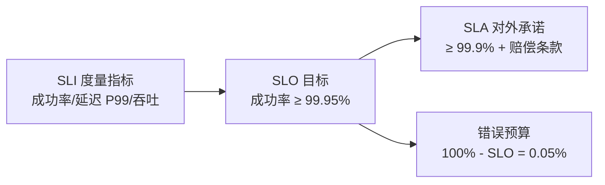
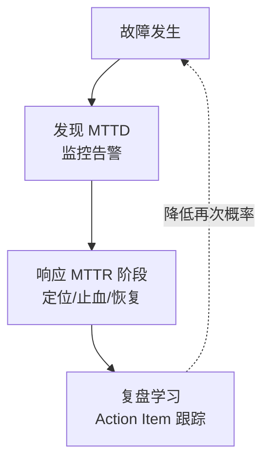

# 什么是系统稳定性：把「稳定」变成可度量的数字

> 「系统稳不稳定？」这个问题没法回答——因为「稳定」没有定义。稳定性建设的第一步不是加机器，是把「稳定」翻译成 SLI/SLO 数字和错误预算。本篇讲清楚稳定性语言的全部基础词汇。

## 一句话摘要

系统稳定性 = 用 SLI（度量指标）→ SLO（内部目标）→ SLA（对外承诺）三层把「稳定」数字化，再用错误预算（100% − SLO）管理「敢冒多大风险」——没有这套度量语言，限流熔断监控全部失去优先级判断的依据；稳定性与高可用、容灾的关系：高可用是架构能力，容灾是极端预案，稳定性是贯穿两者的**度量与管理体系**。

## 本文核心

**核心机制一句话**：稳定性的可管理性来自度量——SLI 定刻度、SLO 定目标、错误预算定「敢冒多大风险」的额度，三层合起来把「稳不稳定」变成可审计的数字决策。

**机制链**：SLI 刻度 → SLO 目标 → 错误预算（预算烧完冻结发布）→ 驱动防护/观测/应急的优先级 → MTBF/MTTR 分解指明建设路径。

**失效点/边界**：SLO 定错（太高烧穿预算、太低失去意义）会让整套语言失效；度量只覆盖已定义的 SLI，未观测的故障仍然隐形。

## 一、背景：「不出故障」是不可能的目标

分布式系统的第一性原理：**任何组件都会故障**——磁盘会坏、网络会抖、依赖服务会超载、发布会引入 Bug、甚至机房会断电。稳定性建设的第一性原理不是消灭故障，而是：

1. **故障必然发生**——设计目标是降低发生概率、缩小影响面、缩短恢复时间
2. **有损服务优于完全不可用**——100% 可用不存在，99.99% 意味着一年仍有 52 分钟不可用
3. **稳定性是经济问题**——每提升一个 9 的成本非线性增长，SLO 的本质是「花多少钱买多少稳定」

把这三条接受为前提，稳定性建设才从「祈祷不出事」变成「工程化管理风险」。

## 二、核心：SLI → SLO → SLA 三层度量语言

**SLI（Service Level Indicator，度量指标）**——「稳定」的具体刻度：

- **可用性**：成功请求数 / 总请求数（排除客户端 4xx 的合理错误后）
- **延迟**：P99 ≤ 200ms（P99 是 99% 请求的延迟上限——均值会骗人，P99 不会）
- **新鲜度**：数据更新后多久可查（对账系统这类异步链路的关键指标）

**SLO（目标）**：内部给自己定的线。99.9%（三个 9）= 年不可用 8.76 小时；99.99%（四个 9）= 52.6 分钟。**每多一个 9，成本非线性上升**——四个 9 需要多活架构、自动切换、全链路压测，三个 9 单机房主备就可能达标。

**SLA（对外承诺）**：SLO 减去安全余量后的对外契约，违约有赔偿。SLO 定 99.95%、SLA 才定 99.9%——中间的差值是给内部留的操作空间。

**错误预算（Error Budget）**：SLO 的另一半。SLO 99.95% = 每月错误预算 0.05% ≈ 21 分钟不可用额度。预算没花完：可以大胆发布、做实验；**预算烧完：冻结发布、全员转向稳定性**——它把「稳定 vs 迭代速度」的争吵变成了数字决策，这是 SRE 方法论最有价值的一件武器。

## 三、机制：MTBF / MTTR 与稳定性公式

可用性有个经典分解：**可用性 = MTBF / (MTBF + MTTR)**（平均无故障时间 / 平均无故障时间 + 平均修复时间）。它揭示了两条完全不同的建设路径：

- **拉长 MTBF**（少出故障）：代码评审、测试覆盖、依赖治理、容量冗余——对应系列的防护/容量环节
- **缩短 MTTR**（快速恢复）：监控告警灵敏度、应急预案、自动化切换、复盘机制——对应可观测/应急环节

行业经验共识：**多数团队 MTTR 的优化空间远大于 MTBF**——从「用户先发现」到「监控先发现」（MTTD 趋零），从「人工定位 2 小时」到「预案一键止血 5 分钟」，这些是流程和预案问题，比架构重构成本低得多。

这套度量语言的演进史值得一看：SLA 概念从电信时代（运营商可用性承诺）演进而来，2003 年前后 Google 把 SLO/错误预算系统化进 SRE 体系，2016 年《SRE》书出版后成为行业通用语言——**二十年的演进方向始终一致：把运维直觉变成可审计的数字**。

## 四、实践：典型场景与起步清单

**典型场景**：新系统上线——SLI 怎么选？从用户视角选：核心接口成功率 + P99 延迟，最多 3-4 个指标（多了没人看）；SLO 怎么定？参考历史数据（过去 3 个月真实成功率）+ 业务容忍度，**第一版宁可定松**（如 99.9%），跑两个月有数据再收紧——SLO 定太高，错误预算天天透支，制度就废了。

**起步清单**（没有稳定性体系的团队按此起步）：

1. 给核心接口定义 SLI 并接监控（成功率/P99）
2. 定第一版 SLO，公开给全团队
3. 建错误预算看板，预算烧 50% 时提醒、烧完时冻结发布
4. 每次故障记 MTTD/MTTR，复盘进文档

> 💡 实战提示：SLO 怎么选——第一版宁松勿严（用历史成功率 + 10% 余量定），跑两个月有真实数据再收紧；一步到位定理想值，错误预算天天透支，制度两周就名存实亡。

## 与高可用、容灾的区别

| 概念 | 层面 | 回答的问题 |
|---|---|---|
| 高可用 | 架构能力 | 冗余/多活/故障切换怎么设计 |
| 容灾 | 极端预案 | 机房/城市级灾难怎么活下来 |
| **稳定性** | **度量与管理体系** | **稳定到什么程度、怎么知道、预算怎么花** |

三者关系：稳定性体系是**驾驶舱**，高可用与容灾是**引擎和安全气囊**——没有驾驶舱，引擎再好也不知道开多快、什么时候该修。边界上：稳定性覆盖「日常运行的全生命周期管理」，容灾只处理极端场景那一层。

## 常见误区

- **误区一：稳定性 = 不出故障**。追求零故障的代价是无限大；正确目标是「故障影响可控 + 恢复可测」——SLO 99.95% 的系统故障是常态，预算内就健康
- **误区二：SLO 定得越高越好**。99.999% 的成本可能是 99.9% 的十倍，而业务感知差异极小；SLO 定超需要的水平 = 把钱烧在不产生价值的地方
- **误区三：均值延迟是好指标**。均值会被大量快请求稀释——1% 的用户等 30 秒，均值可能还是「优秀」；**只用 P95/P99**，让最慢的那批用户被看见
- **误区四：错误预算烧完照常发版**。预算制度的全部价值在「烧完就刹车」；不执行冻结，SLO 就退化成一面谁也不看的仪表盘

## 自测三问

1. **四个 9 意味着什么？成本呢？**
   - 年不可用 52.6 分钟；需要多活、自动切换、全链路压测，成本比三个 9 非线性增长——先问业务值不值。

2. **错误预算烧完了怎么办？**
   - 冻结非稳定性发布，团队转向稳定性改进直到预算恢复。这是制度设计的核心，做不到冻结等于没有预算制度。

3. **为什么用 P99 不用平均延迟？**
   - 均值被快请求稀释，看不到最慢用户的体验；P99 直接刻画「最差的 1% 用户」的体验，才是用户视角的真相。

## 5W 速记卡

| W | 一句话 |
|---|---|
| What | SLI/SLO/SLA + 错误预算的稳定性度量体系 |
| Why | 把「稳定」从体感变成数字，才有优先级和决策依据 |
| Where | 所有在线服务的稳定性管理 |
| When | 建设第一步——先有度量，再做防护 |
| Who | 全团队共用：SRE 定 SLO，业务定 SLA，错误预算管发布节奏 |

## 你们可能会问

**Q1：内部系统也要定 SLO 吗？**
要，但可以松。内部系统的「用户」是其他团队——它的故障会向上游传导，SLO 是协作契约（你的下游依赖你的稳定性承诺）。

**Q2：SLO 和监控告警有什么区别？**
告警是「此刻坏了快来看」，SLO 是「这个月的稳定余额还剩多少」——前者管单次事件，后者管趋势与节奏。没有 SLO 的告警体系，报警再多也不知道什么才算真问题。

## 开放问题

- **SLO 的跨团队归责**：一个用户请求穿过 5 个服务，端到端 SLO 的预算怎么分摊到各团队——按请求份额还是按故障贡献，业界还没有公认答案
- **错误预算与业务节奏的冲突**：大促前烧完预算要不要豁免——豁免破坏制度，不豁免影响业务，这个张力每家公司都在动态平衡

## 下篇预告

下一篇 [2_限流](./2_限流-入门.md)：度量的下一步是防护——流量超过容量时，怎么优雅地拒绝而不是崩溃。

## 核心带走

**30 秒复述**：稳定性 = 把「稳定」翻译成 SLI（成功率/P99）→ SLO（内部目标）→ 错误预算（100%−SLO）——预算烧完冻结发布，这是稳定与迭代速度的取舍机制。建设双路径：拉长 MTBF（少出事）+ 缩短 MTTR（快恢复），多数团队 MTTR 空间更大。**失效边界**：SLO 定错或预算纪律不执行，整套体系退化为装饰。

## 📌 数据与事实声明

- 写于 2026-09-09；SLI/SLO/错误预算方法论源自 Google SRE 书（公开出版，行业共识口径）
- 行业认知：99.9%/99.99% 对应年不可用时长为数学换算；「MTTR 优化空间大于 MTBF」为 SRE 社区公开经验共识
- 免责：SLO 数值示例均为教学口径，实际以业务 SLA 为准

## 📚 参考资料

| 类型 | 标题 | 来源 |
|---|---|---|
| 书 | 《SRE: Google 运维解密》第 3-4 章（SLO 与错误预算） | 公开出版 |
| 书 | 《SRE 工作手册》 implementing SLOs 章 | 公开出版 |
| 官方文档 | The Twelve-Factor App | 12factor.net |
