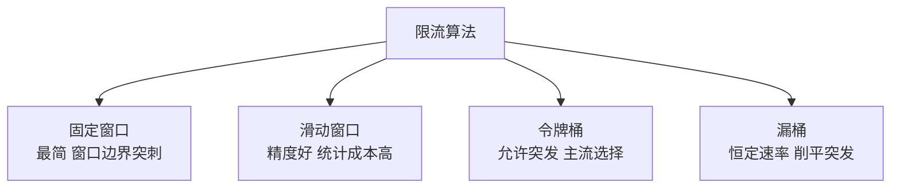

# 限流：流量超容量时的优雅拒绝

> 流量超过系统容量是必然事件——大促、热点、甚至一次爬虫扫过都会让流量翻倍。限流回答的问题是：容量只有 1000 QPS 时来了 5000 请求，怎么拒绝得「优雅」——让该进来的 1000 个正常服务，多出来的 4000 个快速失败，而不是让 5000 个全部超时。

## 一句话摘要

限流的三层：**算法**（固定窗口/滑动窗口/令牌桶/漏桶——精度与平滑度的演进）、**位置**（接入层网关/服务入口/调用下游前，越早拒越省资源）、**阈值**（容量压测得出 + 预发布验证，绝不拍脑袋）；核心取舍是「保护自己」与「拒绝伤害」——限流不是把多余流量丢掉就算完，被拒方怎么感知、怎么退避，决定整个链路的稳定性。

## 本文核心

**核心机制一句话**：限流 = 按算法（令牌桶/漏桶/窗口）在阈值处快速拒绝超额请求，让系统在超载时「有损但可用」而不是雪崩。

**机制链**：压测定阈值（崩溃容量的 80%）→ 分层布置（网关/入口/出口，越早越便宜）→ 算法匹配场景（令牌桶容突发/漏桶保下游）→ 被拒方退避（429 + Retry-After）。

**失效点/边界**：阈值拍脑袋则形同虚设；只限入口不限出口，故障传染照旧；分布式集中计数引入新单点。

## 一、背景：为什么容量会不够

系统容量是按「预期峰值 + 冗余」设计的，但真实世界的流量从不按预期来：

- **可预期峰值**：大促、整点活动——可以提前扩容，但扩多少仍需限流兜底（预估永远有误差）
- **不可预期脉冲**：热点事件把某个普通接口顶上热搜（一次明星出轨让微博扩容十倍还是挂过）
- **异常流量**：爬虫不守 robots、上游 Bug 触发重试风暴（一个 Bug 让重试放大 10 倍）、甚至攻击

没有限流的系统在这些场景下的表现：流量 5 倍 → 线程池满 → 队列堆积 → 响应变慢 → 调用方超时重试 → 流量再翻倍 → **雪崩**。有限流的系统：5000 QPS 进来，1000 个正常处理，4000 个立刻收到 429——**系统只是拒绝了一部分人，没有崩**。

## 二、核心：四种限流算法

**固定窗口**：每分钟计数器清零，超 1000 拒绝。缺陷在窗口边界：上一分钟末来了 1000 个、下一分钟初又来 1000 个——两秒内 2000 请求全部通过，瞬时压力翻倍。这是「计数对了、平滑没了」。

**滑动窗口**：把窗口切成小格（如 1 分钟切 60 格，每格 1 秒），统计最近 60 格的总和。边界突刺消失，代价是统计复杂度。**滑动窗口日志**（记下每个请求的时间戳）最精确但内存最贵，滑动窗口计数是精度与成本的折中。

**令牌桶**：系统以恒定速率往桶里放令牌（如每秒 1000 个），请求拿到令牌才通过。**桶有容量上限——允许一定突发**：桶里囤了 500 个令牌时，瞬时 1500 QPS 也能全过。这个「允许突发」的特性让它成为主流选择（Guava RateLimiter、Nginx burst 都是令牌桶系）。

**漏桶**：请求先进桶，桶以恒定速率流出处理，桶满拒绝。与令牌桶相反，它**强行削平突发**——输出永远恒定。适合「下游处理能力刚性」的场景（如调第三方支付接口，对方就给你 100 QPS）。

**选型一句话**：保护自己用令牌桶（容忍正常突发），保护下游用漏桶（输出恒定），计数精度要求高用滑动窗口。

## 三、机制：限流放在哪里

**越早拒绝越便宜**——这是限流位置设计的第一原则：

1. **网关层**（最外圈）：全局维度限流，挡掉明显异常（单 IP 疯狂请求、爬虫）。此时请求还没进业务系统，拒绝成本≈0
2. **服务入口**：接口级限流，保护本服务的线程池和下游。这一层的阈值来自压测——服务自己能扛多少
3. **调用下游前**（出口限流）：最容易被忽略的一层。你对下游的容量假设是多少，就限到多少——**不限出口的服务，故障时会把自己的超载传染给依赖方**，重试风暴就是这么来的

**分布式限流的额外复杂度**：单机限流每台机器各自 1000 QPS，10 台机器就是 10000——但流量不均时单机先过载。分布式限流要么用 Redis+Lua 集中计数（多一次网络开销，Redis 本身成为风险点），要么接受「单机限流 + 负载均衡均摊」的近似方案。多数场景后者够用——**简单方案的可依赖性高于复杂方案的理论精确**。

## 四、实践：阈值从哪来与被拒方体验

**阈值来源的演进**：拍脑袋（「感觉能扛 2000」）→ 压测（真实压到崩溃点，取 80% 作为限流值）→ 运行时自适应（根据 P99 延迟/负载动态调整，如 BBR 思想）。起步团队做到压测定阈值就够了：**限流值 = 压测崩溃容量的 80%**，留 20% 给抖动。

**被拒方体验是限流设计的一半**。拒绝要「可感知、可行动」：

- 返回 429 状态码 + `Retry-After` 头——告诉调用方「被限了，几秒后再来」，而不是一个含糊的 500
- 被限方要有**退避重试**（指数退避 + 抖动），固定间隔重试等于自组重试风暴
- 降级预案：被限的流量走降级逻辑（缓存数据/默认值/排队页），拒绝 ≠ 甩脸子

> 💡 实战提示：限流一定要**演练**——真实把流量打到限流阈值，看被限方是不是按预期退避、监控是不是能看到限流事件。没演练过的限流，真触发时经常发现阈值配置在错的接口上。

## 五、典型场景

- **大促入口**：网关层按用户/接口维度全局限流，核心接口保容量、长尾接口先让路
- **保护下游刚性资源**：调第三方支付/短信接口（对方按量计费或限速），出口漏桶恒速输出
- **重试风暴止损**：上游故障触发重试放大时，出口限流 + 429 Retry-After 让重试方指数退避
- **多租户共享集群**：一个租户的异常流量不能吃光共享容量——按租户维度限流做隔离

## 六、与熔断降级的区别

| 机制 | 触发条件 | 保护对象 | 类比 |
|---|---|---|---|
| 限流 | 入口流量超阈值 | 保护**自己**的容量 | 景区限流：人满不再售票 |
| 熔断 | **下游**故障率超阈值 | 保护自己不被下游拖死 | 保险丝：短路即断开 |
| 降级 | 主动或被动触发 | 保护**核心体验** | 停掉喷泉保供水 |

三者经常组合出现：限流挡入口流量 → 下游还是挂了就熔断它 → 熔断期间核心功能降级运行。下一篇展开熔断与降级。

## 你们可能会问

**Q1：限流会不会误伤正常用户？**
会，所以阈值取压测容量的 80% 而不是 100%，且限流维度要选对（按接口限而不是全局一刀切）。误伤率与保护效果是一对需要数据校准的取舍。

**Q2：单机限流和分布式限流怎么选？**
先单机（负载均衡自然均摊），不够再上 Redis 集中计数——集中计数的网络开销和 Redis 可用性风险，只有在「流量严重不均」时才值得付。

## 常见误区

- **误区一：限流阈值拍脑袋定**。没压测过的阈值要么形同虚设（太高），要么误伤正常流量（太低）——阈值是压测出来的数字，不是经验估值
- **误区二：只限入口不限出口**。自己被保护了，但故障时把全量流量（含重试）打向已超载的下游，传染性雪崩的典型起点
- **误区三：被拒绝的请求返回 500**。500 会让调用方以为「服务出错」而重试，429 + Retry-After 才是「你被限流了，稍后再来」的准确表达——语义不对会制造重试风暴
- **误区四：分布式限流必须上 Redis 集中计数**。集中计数的 Redis 挂了限流全失效；单机限流 + 负载均衡的近似方案在多数场景更简单可靠

## 自测三问

1. **令牌桶和漏桶的核心区别？**
   - 令牌桶允许突发（桶内囤积的令牌可被瞬间消费），漏桶强制恒速输出。保护自己选令牌桶，保护刚性下游选漏桶。

2. **限流值怎么定？**
   - 压测到系统崩溃容量，取 80% 作为限流阈值；上限随架构演进需重新压测校准，不是一劳永逸。

3. **为什么出口限流最容易缺失又最重要？**
   - 入口限流保护自己，出口限流保护依赖方——故障传染链（超载→重试放大→下游雪崩）的起点就在不限出口的调用方。

## 5W 速记卡

| W | 一句话 |
|---|---|
| What | 按算法与阈值限制并发/速率，超限请求快速拒绝 |
| Why | 容量不足时优雅降级，防止雪崩式崩溃 |
| Where | 网关/服务入口/调用下游前三层，越早越便宜 |
| When | 大促、热点脉冲、重试风暴、爬虫异常——一切流量异常场景 |
| Who | 接入团队管网关层，服务 owner 管入口与出口 |

## 下篇预告

下一篇 [3_熔断与降级](./3_熔断与降级-入门.md)：限流挡住了入口，但如果故障来自下游——熔断器怎么在「依赖挂了」时保护你，降级怎么保住核心体验。

## 开放问题

- **自适应限流**：静态阈值永远追不上负载的动态变化——基于 P99 延迟/负载的自动调阈（BBR 思想进限流）是演进方向，但误调风险与可解释性仍是难点
- **多租户公平性**：共享集群上租户 A 的合法大流量 vs 租户 B 的基本保障，配额怎么分——限流的公平算法（如 DRR）在网关侧落地还很少

## 核心带走

**30 秒复述**：限流 = 压测定阈值（崩溃容量的 80%）→ 分层布置（网关/入口/出口）→ 算法匹配（令牌桶容突发、漏桶保下游、滑动窗口提精度）→ 429+Retry-After 让被拒方退避。**失效边界**：阈值没压测依据、只限入口不限出口、被拒语义返回 500——这三条任一，限流都会变成故障放大器。

## 📌 数据与事实声明

- 写于 2026-09-09；四种算法与「令牌桶允许突发/漏桶恒速」为业界共识口径（Guava/Nginx/Sentinel 实现均公开）
- 行业认知：重试风暴放大故障、429+Retry-After 语义为 HTTP 标准（RFC 6585）与公开复盘共性
- 免责：具体中间件阈值与配置以官方文档为准

## 📚 参考资料

| 类型 | 标题 | 来源 |
|---|---|---|
| 书 | 《SRE: Google 运维解密》Handling Overload 章 | 公开出版 |
| 官方文档 | Guava RateLimiter | github.com/google/guava |
| 官方文档 | Sentinel 流量控制 | sentinelguard.io |
| 标准 | RFC 6585（429 状态码） | ietf.org |
