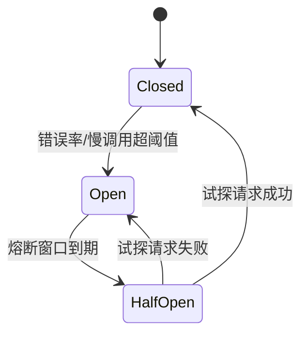
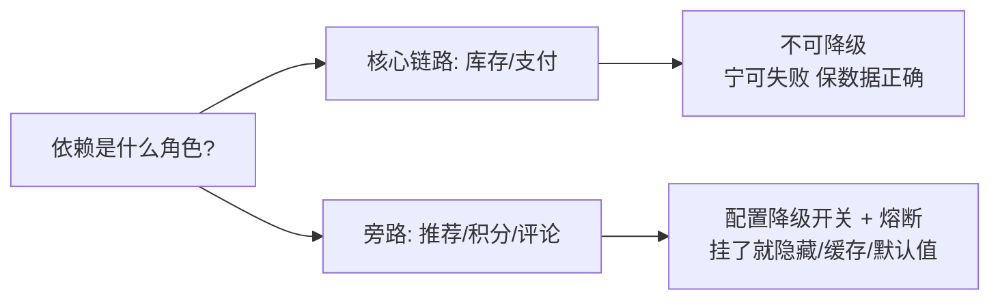

# 熔断与降级：依赖挂了怎么保住核心体验

> 限流挡住了入口流量，但如果故障来自**下游**——推荐服务挂了，商品页还得打开；评论服务超时，订单还要能下。熔断器负责「快速失败，别等超时」，降级负责「坏了之后给个替代品」。这一对是故障传染链的终极断路器。

## 一句话摘要

熔断 = 调用下游前装一个「保险丝」：错误率/慢调用超阈值就跳闸，之后所有请求**直接失败不发起调用**（三态：关闭→打开→半开试探恢复），保护自己的线程池不被拖垮；降级 = 跳闸后**返回准备好的替代品**（缓存/默认值/简化逻辑），核心链路保住、非核心功能有损。两者关系：熔断是检测与切换机制，降级是切换后的内容——没有降级预案的熔断，只是把超时变成快速失败。

## 本文核心

**核心机制一句话**：熔断器用三态状态机（关闭→打开→半开）在下游劣化时快速失败，阻断故障传染；降级在断开后提供替代内容，保住核心体验。

**机制链**：统计滑动窗口错误率 → 超阈值跳 Open（快速失败保护线程池）→ 冷却期后 HalfOpen 少量试探 → 恢复回 Closed；断开期间降级预案接管（缓存/默认值/隐藏功能）。

**失效点/边界**：阈值太灵误熔断、太钝拖垮线程池；只熔断不降级等于快速报错；核心链路（库存/支付）不可降级。

## 一、背景：故障传染与线程池耗尽

没有熔断时，下游故障是怎么拖死上游的：

1. 下游服务变慢（如响应从 20ms 恶化到 5s）
2. 上游调用线程被阻塞 5s——线程池 200 个线程，每秒 100 个请求全在等下游
3. 2 秒内线程池耗尽，**上游对所有请求失去响应**——包括那些不依赖下游的接口
4. 上游的超时才触发，但线程已经占满了；调用方的重试又打过来，彻底压垮

**这就是故障传染：下游的故障沿着调用链向上放大，最终让完全健康的上游也挂掉。** 熔断器的工作原理是在第 2 步就发现「下游不对劲」，第 3 步之前断开调用——用快速失败替代阻塞等待，线程池保住了，不依赖下游的功能照常工作。

## 二、核心：熔断器的三态状态机

- **Closed（关闭）**：正常放行，同时统计「滑动窗口内的错误率/慢调用比例」
- **Open（打开）**：统计超阈值（如 10 秒窗口错误率 > 50%），**所有请求直接失败**（抛熔断异常，走降级逻辑），不发起真实调用。Open 有冷却时间（如 10 秒）——给下游喘息恢复的机会
- **HalfOpen（半开）**：冷却到期后放**少量试探请求**（如 3 个）真实调用下游——成功说明恢复了，回 Closed；失败说明没好，回 Open 继续等

**两个关键参数的取舍**：滑动窗口越长、阈值越高，误判越少但反应越慢；窗口越短阈值越低，反应快但网络抖动就可能误熔断。起步配置建议：10 秒窗口 + 错误率 50% + 最小请求数 20（请求数太少时统计无意义，防止 1 个请求失败就熔断）。

## 三、机制：降级的四个层次

熔断只是「断开」，用户体验由降级决定。按投入成本从低到高：

| 层次 | 做法 | 例子 |
|---|---|---|
| 静默降级 | 功能直接隐藏 | 推荐服务挂了，商品页不显示推荐位 |
| 缓存降级 | 返回上次成功的缓存 | 汇率接口挂了，返回 10 分钟前的汇率 |
| 默认值降级 | 返回预设默认 | 个性化文案挂了，返回通用文案 |
| 简化逻辑降级 | 核心步骤保留，附属步骤跳过 | 下单跳过积分计算，主订单正常创建 |

**降级设计的第一原则：平时就想好「这个依赖挂了怎么办」，写进代码里**——降级逻辑不是故障时现写的，是设计时埋好的。每个外部依赖都应该回答：「它挂了，我的核心功能受多大影响？我的替代品是什么？」

> 💡 实战提示：区分「核心链路」和「旁路依赖」是降级设计的前提——下单链路里，库存是核心（不能降级，宁可失败），积分计算是旁路（降级跳过）。把旁路依赖全部做上「可快速降级」开关（配置中心动态控制），故障时才有牌可打。

## 四、实践：典型场景与配置要点

**典型场景**：

- **推荐/评论/积分等旁路依赖**：默认全降级开关 + 熔断——挂了商品页照常买
- **跨机房调用**：远机房网络抖动时熔断快速失败，切本机房缓存
- **第三方接口**：外部服务的 SLA 不归你控制，必配熔断 + 降级（哪怕降级成「提示稍后再试」）

**配置要点**：熔断参数怎么选——窗口期长短决定「反应速度 vs 误判率」：短窗口（5 秒）反应快但抖动易误熔断，长窗口（30 秒）稳但慢半拍；起步用 10 秒窗口观察误熔断率，再向两侧调。熔断要配**全链路视角**——同一个下游在多个服务里被调用，各自独立熔断没问题，但要有一个全局视图（熔断面板）知道「现在哪些依赖处于 Open 状态」，否则故障排查时不知道「半个系统的下游都被熔断了」。

## 你们可能会问

**Q1：熔断会不会把下游彻底打死？**
不会——熔断反而给下游喘息：Open 期间上游完全不打真实流量，下游得以恢复；半开试探是小流量探路。真正打死下游的是无熔断的超时重试风暴。

**Q2：多个服务共用一个下游，各自熔断不协调怎么办？**
单机各自熔断没问题（都达到保护效果），但要有全局熔断面板看「哪些依赖处于 Open」——否则故障排查时不知道半个系统的下游都被断了。跨集群的协同熔断是进阶话题（特性层展开）。

## 与限流、超时的区别

| 机制 | 触发 | 保护谁 | 一句话 |
|---|---|---|---|
| 限流 | 入口流量超容量 | 自己的容量 | 拒绝多余的人 |
| **熔断** | **下游错误率超阈值** | **自己的线程与体验** | **别等了，他挂了** |
| 降级 | 熔断后/主动开关 | 核心用户体验 | 给个替代品 |
| 超时 | 单次调用限时 | 自己的线程 | 最多等你这么久 |

超时是熔断的「原料」——没有合理的超时设置（下一篇展开），慢调用统计就不准，熔断也就不准。

熔断机制的演进也值得一提：从 Netflix Hystrix（已进入维护模式）到 Resilience4j/Sentinel，实现从线程池隔离演进到信号量隔离——但三态状态机的核心模型十年未变，学一次处处可用。降级的取舍也受调用链架构影响：越靠近核心链路的依赖，可降级空间越小——这正是「识别核心链路」要在设计期完成的原因。

## 常见误区

- **误区一：熔断阈值越灵敏越好**。阈值太低，一次网络抖动就熔断正常服务（误熔断的代价是真实的）；起步用保守配置，观察误熔断率再收紧
- **误区二：熔断打开 = 功能没了**。熔断打开只意味着「快速失败」——快速失败 + 降级预案才是完整设计；只熔断不降级，用户体验反而更差（瞬间全报错）
- **误区三：核心链路也可以降级**。降级是给旁路的——库存、支付这类核心依赖挂了就该让下单失败，降级成「先下单后补库存」是灾难
- **误区四：半开试探放全量流量**。半开只放少量试探——下游还没完全恢复时全量放行，立刻再次熔断，反复震荡

## 自测三问

1. **熔断的三态是怎么循环的？**
   - Closed（统计错误率）→ 超阈值 Open（快速失败，冷却期）→ HalfOpen（少量试探）→ 成功回 Closed / 失败回 Open。

2. **降级的第一原则是什么？**
   - 设计时就想好——每个外部依赖都有「挂了怎么办」的预答案，降级开关平时可验证，而不是故障时现想。

3. **熔断和超时什么关系？**
   - 超时是单次调用的兜底，熔断基于「慢调用/错误统计」；超时设置不合理（太长），熔断的响应就迟钝。

## 5W 速记卡

| W | 一句话 |
|---|---|
| What | 三态熔断器 + 分层降级预案 |
| Why | 阻断故障传染，保住线程池与核心体验 |
| Where | 所有同步外部依赖的调用处 |
| When | 下游持续报错/变慢时自动触发；大促前主动降级旁路 |
| Who | 调用方配置与拥有；降级预案业务方定义 |

## 下篇预告

下一篇 [4_超时与重试](./4_超时与重试-入门.md)：熔断的原料——超时怎么设才合理，重试怎么重试才不会变成重试风暴。

## 开放问题

- **熔断的全局协同**：各服务独立熔断时缺少全局视图，分布式熔断协同（状态共享）还缺少成熟开源方案
- **降级的内容质量**：缓存降级的数据多旧可以接受？降级「新鲜度 SLA」如何定义仍是开放问题

## 核心带走

**30 秒复述**：熔断 = 三态状态机（Closed 统计 → Open 快速失败 → HalfOpen 试探恢复），起步阈值「10 秒窗口 + 错误率 50% + 最小请求数 20」；降级四层次（静默/缓存/默认值/简化逻辑）必须设计期埋好。**失效边界**：只熔断不降级、核心链路乱降级、半开放全量——三条都是公开复盘里的高频反面教材。

## 📌 数据与事实声明

- 写于 2026-09-09；三态熔断模型为 Hystrix/Resilience4j/Sentinel 公开实现的共同抽象
- 行业认知：「只熔断不降级」导致体验劣化、「半开放全量」引发震荡，均为公开复盘常见结论
- 免责：具体框架参数名与默认值以官方文档为准

## 📚 参考资料

| 类型 | 标题 | 来源 |
|---|---|---|
| 书 | 《Release It!》第 2 版（Circuit Breaker 模式源头） | 公开出版 |
| 官方文档 | Resilience4j CircuitBreaker | resilience4j.readme.io |
| 官方文档 | Sentinel 熔断降级 | sentinelguard.io |
