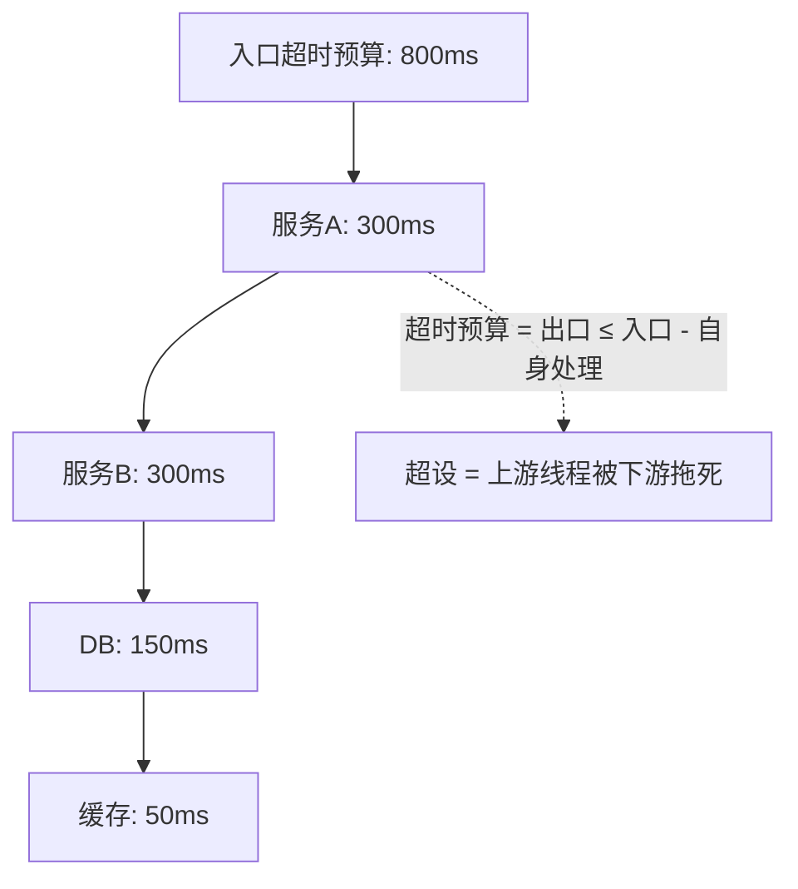

# 超时与重试：最容易被设错的两个参数

> 超时和重试是每个开发者都配过、但最容易配错的两个参数：超时设 30 秒等于没有超时，重试不设退避就是自组雪崩。这两个参数是熔断和限流的「原料」——它们错了，上层防护全部失准。

## 一句话摘要

超时三原则：**全链路预算制**（入口超时 > 各下游超时之和）、**下游超时递减**（越深的依赖超时越短）、**连接与读取分开设**；重试三铁律：**只重试幂等操作**、**指数退避 + 抖动**、**限制重试次数与重试比例**——重试是把双刃剑：正常时它是韧性，故障时它是雪崩放大器。

## 本文核心

**核心机制一句话**：超时防「无限等待拖死线程」，重试防「故障静默丢失」——两者是熔断限流的原料，设错即放大器。

**机制链**：全链路超时预算制（入口 > 各下游之和）→ 越深越短 → 连接/读取分开；重试只做幂等操作 + 指数退避加抖动 + 限次限比例（超 10% 触发熔断）。

**失效边界**：默认值裸奔、非幂等重试、无抖动齐发——任一条都能把 2 秒抖动放大成全站雪崩。

## 一、背景：两个参数如何制造全站故障

一次公开复盘级的经典故障链（多家用同形态的案例）：

1. 下游服务偶发抖动，响应从 50ms 掉到 2s
2. 上游超时设 30s——线程被阻塞 2s 后恢复，看起来没事？不：高并发下 2s 的阻塞让线程池迅速占满
3. 上游的调用方也有 30s 超时 + 自动重试 3 次——重试流量 ×3 打回来
4. 每一层都在「等 + 重试」，流量逐层放大，**最终整个调用链雪崩，而根因只是一次 2 秒的抖动**

**超时不设 = 无限等待**；**重试不设退避 = 放大器**。这两个参数默认值往往是「能跑」，不是「稳定」——稳定性建设要求把每个外部调用的超时和重试**显式审查一遍**。

## 二、核心：超时的三条原则

**原则一：全链路预算制**。入口承诺 800ms 内响应，那它所有下游的超时之和必须 < 800ms 减去自身处理时间。常见反例：入口 3s，但下游 A 5s、B 3s——A 挂了，入口的 3s 超时根本来不及触发，线程先被拖死。

**原则二：越深越短**。调用链越深的依赖，超时越短（深层失败后上游还有时间走降级）。经验起点：每深一层，超时减半。

**原则三：连接与读取分开**。连接超时（建立 TCP，通常 100-500ms 够）远短于读取超时（等响应）。很多库默认把两者绑成一个值——连接 5 秒超时意味着连一个死 IP 都要等 5 秒。

## 三、机制：重试的三铁律与重试风暴

**铁律一：只重试幂等操作**。下单接口重试 = 可能重复下单（除非带幂等键）；查询可以重试，写入先确认幂等。这是重试设计的第一道审查。

**铁律二：指数退避 + 抖动（Jitter）**。重试间隔 100ms → 200ms → 400ms（指数退避），再加随机抖动（±50%）——**没有抖动的重试会在同一时刻齐发**，形成周期性流量尖峰。这是重试风暴的标准成因。

**铁律三：限制次数与比例**。最多 2-3 次；更进一步限「重试比例」——当重试请求已占流量 10% 以上，说明下游真的挂了，继续重试只是放大攻击，应该熔断（衔接上篇）。

**重试风暴的完整链条**（为什么这三条铁律如此重要）：

**演进视角**：重试策略从「固定间隔 ×3」的原始形态，演进到「指数退避 + 抖动」（各语言重试库标配），再到「重试预算」（Google SRE：全站重试流量配额，超了就不重试）——演进方向始终是「让重试的代价可控」。

## 你们可能会问

**Q1：超时设短了会不会误杀慢请求？**
会——所以基准是下游 P99 的 2 倍左右（不是平均值），核心慢接口单独给预算。设短的前提是知道下游真实分布，这又回到链路监控。

**Q2：重试放到消息队列异步做，还要三铁律吗？**
要，且队列天然适合退避（延迟重投）+ 死信兜底（超限不重投）——铁律在异步形态下更自然，但消费幂等仍是前提。

## 四、实践：审查清单与典型配置

**每个外部调用过一遍这张清单**（按此审查存量代码是稳定性建设性价比最高的动作之一）：

| 检查项 | 合格标准 |
|---|---|
| 有没有显式超时 | 连接/读取分开，且 ≤ 下游 P99 的 2 倍 |
| 超时预算是否成立 | 全链路求和 < 入口承诺 |
| 失败会重试吗 | 只重试幂等；指数退避 + 抖动；≤ 3 次 |
| 重试比例有上限吗 | 超过 10% 停止重试（或触发熔断） |
| 重试会换实例吗 | 负载均衡重试到**另一个**节点，别打同一个 |

> 💡 实战提示：存量代码审查用「调用点清单法」——grep 所有 RPC/HTTP 客户端调用，逐个填「超时多少 / 重试几次 / 是否幂等」三列表格，填完就知道哪些在裸奔。

**典型场景与怎么选**：调用内部服务（超时 200ms/重试 1 次）；调用第三方支付（超时 3s、只对查询重试、下单带幂等键）；消息消费失败（退避重试 + 死信队列，不无限重投）。

从架构上下游看，超时与重试发生在「每一次跨进程调用的客户端侧」，是分布式架构里数量最大、最离散的稳定性触点——网关熔断是集中式的，而每个服务的几十个外部调用各自需要这份纪律。

## 与熔断、限流的区别和配合

超时重试是「单次调用」的纪律，熔断限流是「流量维度」的纪律——**重试比例上限正是两者的连接点**：重试占比超阈值 = 触发熔断的信号之一。四件套（限流/熔断/超时/重试）合起来才是完整的流量防护。

## 常见误区

- **误区一：框架默认值就是安全值**。多数 HTTP 客户端默认无超时或 60s+；「能跑」的默认值在故障场景全部失效
- **误区二：重试是免费的韧性**。失败时重试的每一次都在给过载的下游加压——非幂等 + 无退避 + 无上限的重试是故障放大器，不是韧性
- **误区三：超时越长越保险**。超时 30s 的本意是「容忍慢」，实际效果是「故障时线程被拖 30 秒」——长超时把局部慢放大成全局瘫

## 自测三问

1. **入口 800ms，下游 A/B/C 的超时怎么定？**
   - 预算制：全部之和 < 800ms 减入口自身处理；越深的依赖越短（如 300/200/150ms），给上游留降级窗口。

2. **为什么重试要加抖动？**
   - 无抖动的重试按固定间隔齐发，形成周期性流量尖峰；抖动把重试在时间上打散，避免自组脉冲。

3. **下单接口失败能重试吗？**
   - 只在带幂等键的前提下能（同一键的重复请求返回同一结果）；无幂等的写入重试 = 重复下单。

## 5W 速记卡

| W | 一句话 |
|---|---|
| What | 每个外部调用的超时预算与重试策略 |
| Why | 防止线程被拖死、防止重试放大故障 |
| Where | 所有 RPC/HTTP/DB/缓存调用的客户端配置 |
| When | 新接依赖时显式设置；存量代码定期审查 |
| Who | 调用方负责设置；链路 owner 负责预算分配 |

## 开放问题

- **超时预算的自动推导**：全链路预算靠人工分配，链路一改就漂——能否从 trace 数据自动推导并告警「预算超支」，还在早期探索阶段
- **重试预算的跨团队协调**：重试流量是「别人的重试」，单服务看不见全局重试比例——重试预算的全局记账仍是开放问题（SRE 提出过，落地少）

## 核心带走

**30 秒复述**：超时三原则（全链路预算制/越深越短/连接读取分开）+ 重试三铁律（只重试幂等/指数退避加抖动/限次限比例）——四件套的最后两件，与限流熔断合成完整流量防护。**失效边界**：默认值裸奔、非幂等重试、无抖动齐发，任一条都能把 2 秒抖动放大成全站雪崩。

## 📌 数据与事实声明

- 写于 2026-09-09；指数退避与抖动为 AWS/Google 官方工程建议（公开文档）；重试预算概念出自 Google SRE（公开出版）
- 免责：具体客户端超时默认值以其官方文档为准

## 📚 参考资料

| 类型 | 标题 | 来源 |
|---|---|---|
| 官方文档 | AWS: Timeouts, retries and backoff with jitter | aws.amazon.com/builders-library |
| 书 | 《SRE: Google 运维解密》Handling Overload 章 | 公开出版 |
| 标准 | 幂等性设计（HTTP 方法语义） | RFC 9110 |
