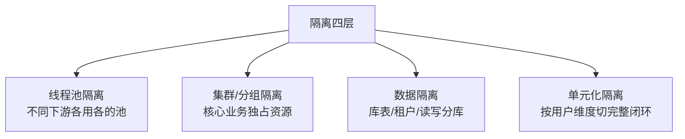

# 隔离设计：控制故障的爆炸半径

> 限流熔断管「流量异常」，隔离管「资源互不拖累」——核心思想来自船舶的舱壁设计：一个舱进水，船不沉。没有隔离的系统里，一个慢接口能吃光全部线程池，一个轻量功能能拖死核心交易。

## 一句话摘要

隔离 = 把共享资源按重要性/租户/负载特征切开，故障被限制在自己的「舱」里：线程池隔离（不同下游各用各的线程池）、集群/分组隔离（核心业务独占资源）、数据隔离（库表分租户）、单元化隔离（按用户维度切完整闭环）——隔离的粒度越细，爆炸半径越小，但资源碎片化和管理成本越高，粒度选择本身就是架构取舍。

## 本文核心

**核心机制一句话**：隔离 = 把共享资源按重要性/租户/负载特征预先切开，让故障只能影响自己的「舱」——爆炸半径从全局缩小到局部。

**机制链**：盘点共享面（线程池/库/集群）→ 按「故障影响」定隔离边界 → 隔离参数靠压测校准（池大小 = 下游 P99 × 目标 QPS + 冗余）→ 每个边界配水位监控。

**失效点/边界**：拆服务没拆资源 = 假隔离；池大小拍脑袋 = 隔离失效头号原因；新依赖引入新共享面，盘点必须周期重做。

## 一、背景：共享资源的「一损俱损」

默认部署形态里，多少东西是共享的？一个进程里的线程池、一台机器上的多个服务、一个数据库上的多张表、一个集群上的多个业务。共享带来利用率，也埋下传染链：

- **线程池共享**：推荐服务响应慢 → 调推荐的全部线程阻塞 → 同线程池里的下单接口没线程可用 → **交易挂了，根因在推荐**
- **集群共享**：营销系统的一次全量重试打满共享 K8s 集群的 CPU → 网关被调度不到资源 → 全站抖动
- **数据库共享**：一张没走索引的大表慢查询 → 连接池占满 → 同库的订单表读不到连接

这三条链的共同点：**故障的资源是共享的，所以故障是共享的**。隔离的本质是给每个重要性等级一个「故障不至于越过」的边界。

## 二、核心：四层隔离

**① 线程池/信号量隔离**（进程内，粒度最细）：调用每个下游各配独立线程池（或信号量计数）——推荐服务的池 20 线程耗尽，交易服务的池 200 线程毫发无伤。代价：线程数膨胀、上下文切换开销。信号量隔离（计数不建线程）更轻，适合纯内存快速调用；有线程池才有的「超时放弃阻塞线程」能力，适合慢 IO。

**② 集群/分组隔离**（部署层）：核心业务与一般业务物理分开——交易集群与营销集群不共用机器；同一服务再分「核心分组/非核心分组」，大促时优先保障核心分组的容量。这是「用资源换稳定」最直接的形态。

**③ 数据隔离**：核心库与一般库分开（交易库不与日志库混布）；多租户场景按租户分库/分 schema——一个租户的大查询不能拖全平台（衔接限流篇的租户维度限流，两个手段组合使用）。

**④ 单元化隔离**（粒度最粗，架构级）：把「用户维度完整闭环」（接入+计算+数据）切成单元（如按用户尾号分 10 个单元），故障被锁在单元内——爆炸半径理论最小，代价是数据同步、全局路由、跨单元调用的复杂度，是金融级多活的地基。

## 三、机制：隔离粒度的取舍

**隔离粒度是利用率与爆炸半径的取舍**：切得越细，故障越传不开，但资源碎片越多（每个池都要留冗余）、配置管理越复杂。实践纪律：

- **按「故障影响」而不是「技术方便」决定隔离边界**——影响支付的依赖，无论多小都值得独立隔离；纯展示接口，共享池可以接受
- **隔离阈值靠压测校准**：线程池大小 = 该下游 P99 延迟 × 目标 QPS + 冗余，拍脑袋的池大小是隔离失效的第一原因（池太小误伤自己，太大等于没隔离）
- **隔离要可观测**：每个池/分组的水位要有监控——「交易池 80% 满」应该是告警，而不是等到打满才发现

## 四、实践：典型场景与起步路径

**典型场景**：

- **交易系统**：调风控、调库存、调营销三个下游各配独立线程池 + 各自熔断（与上篇组合使用）
- **网关**：核心 API 与 open API 分组部署，开放接口被刷不伤内部
- **多租户 SaaS**：大客户独占数据库实例，小客户共享库 + 租户级限流
- **消息队列**：核心 topic 与日志 topic 分集群/分隔离组，日志洪峰不延迟交易消息

> 💡 实战提示：存量系统第一步不是加隔离，是画「共享资源清单」——把线程池、数据库、缓存、消息集群列出来，标出「核心依赖与一般依赖共用」的项，这张表就是隔离工作的 backlog。

**起步路径**（存量系统怎么开始）：① 先盘点共享资源清单（谁和谁共用线程池/库/集群）② 按「故障影响」标出核心依赖 ③ 对「核心依赖与一般依赖共享」的资源优先做隔离 ④ 每个隔离边界配水位监控——**从「最大的共享面」开始切，而不是从最细的粒度开始切**。

## 与熔断限流的区别和配合

| 机制 | 手段 | 时机 |
|---|---|---|
| 限流 | 拒绝超额请求 | 流量异常时 |
| 熔断 | 快速失败 + 切降级 | 下游故障时 |
| **隔离** | **资源预先切分** | **平时就生效（静态防线）** |

隔离是「平时就生效的静态防线」，限流熔断是「事到临头的动态防线」——隔离做好了，熔断的触发频率自然下降（故障传不出那个池）。

## 常见误区

- **误区一：上了微服务就等于隔离了**。服务拆开了，但如果 10 个服务共用一个线程池模型、一个数据库、一个集群，故障照样全局传染——拆服务 ≠ 隔离
- **误区二：线程池越大越安全**。池超过 CPU 核数的合理倍数后只有排队没有并发，且大池 = 故障时更多线程被拖住；池的大小由下游延迟和目标吞吐算出来
- **误区三：隔离做完就一劳永逸**。新的依赖、新的共享资源（新加的缓存、新接的消息集群）会不断引入新的共享面——隔离盘点要随架构演进周期性重做

## 自测三问

1. **线程池隔离和信号量隔离怎么选？**
   - 慢 IO/需要超时放弃的下游用线程池（有独立线程可放弃）；纯内存快调用用信号量（无切换开销）。

2. **隔离粒度怎么定？**
   - 按「故障影响」定：能影响核心收入/核心体验的依赖独立隔离；影响面小的可共享。粒度是利用率与爆炸半径的取舍。

3. **为什么单元化的爆炸半径最小却很少用？**
   - 它要求按用户维度切完整闭环（路由+数据+状态），改造与数据同步成本极高——金融级多活才值得，普通系统粗粒度隔离收益比更高。

## 5W 速记卡

| W | 一句话 |
|---|---|
| What | 按重要性/租户/负载切分共享资源的静态防线 |
| Why | 控制爆炸半径——一个舱进水，船不沉 |
| Where | 线程池/集群分组/数据层/单元化四层 |
| When | 平时即生效；新依赖接入时重新评估隔离边界 |
| Who | 架构定边界，各服务 owner 管自己的池与分组 |

## 你们可能会问

**Q1：线程池隔离设多大？**
估算式：池大小 ≈ 目标 QPS × 下游 P99 延迟（秒）+ 20% 冗余——公式只是起点，必须压测校准。

**Q2：核心和非核心怎么划？**
两个问题定核心：挂了影响资金吗？挂了影响主流程吗？——都是的核心依赖独立隔离，都否的长尾轻装共享。

## 开放问题

- **隔离边界的自动化**：资源盘点靠人工表格，架构一演进就过期——从流量拓扑自动发现「共享面」并推荐隔离边界，还缺少成熟的工具链
- **Serverless 时代的隔离**：函数级粒度天然隔离了线程池问题，但冷启动与共享运行时的隔离新形态仍在演进

## 核心带走

**30 秒复述**：隔离 = 切开共享资源控制爆炸半径，四层从细到粗：线程池（下游各配池）→ 分组（核心独占）→ 数据（库表/租户）→ 单元化（用户闭环）。粒度 = 利用率与爆炸半径的取舍；池大小由「下游 P99 × 目标 QPS」压测校准。**失效边界**：拆了服务没拆资源 = 假隔离；池大小拍脑袋 = 隔离失效的头号原因。

## 📌 数据与事实声明

- 写于 2026-09-09；舱壁（Bulkhead）模式出自《Release It!》，线程池/信号量隔离为 Hystrix/Resilience4j 公开实现抽象
- 行业认知：单元化多活架构为大厂公开分享的金融级实践口径
- 免责：以各框架官方文档为准

## 📚 参考资料

| 类型 | 标题 | 来源 |
|---|---|---|
| 书 | 《Release It!》第 2 版（Bulkhead 模式） | 公开出版 |
| 官方文档 | Resilience4j Bulkhead | resilience4j.readme.io |
| 行业实践 | 单元化架构公开分享 | 公开报道 |
