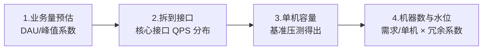

# 容量规划与压测：知道并验证系统的上限

> 「系统能扛多少 QPS」——答不出这个数字的系统，稳定性建设无从谈起：限流阈值没有依据、扩容没有时机、大促只能祈祷。容量规划给出理论值，压测给出实测值，两者对照就是容量真相。

## 一句话摘要

容量规划 = 从业务量推导资源需求（流量预估 → 单机容量 → 机器数 + 冗余水位）；压测 = 用真实流量形态验证推导（功能压测找单点 → 全链路压测找瓶颈 → 容量水位常态化观测）；两者的纪律是「**压出来的数字才是数字，推算的只是假设**」——限流阈值、扩容时机、降级预案全部建立在压测结果之上。

## 本文核心

**核心机制一句话**：容量 = 业务预估推导 + 压测实测验证的「系统上限数字」——限流阈值、扩容时机、冗余系数全部依赖它。

**机制链**：业务量预估 → 接口级拆分 → 单机基准压测 → 机器数与水位线（<50% 健康/60% 扩容/70% 告警）→ 压测三级迭代（单接口→混合→全链路）。

**失效边界**：数据不等比推算是幻觉；只压单接口测不出混合竞争；压测一次会过期——容量是需要保鲜的数字。

## 一、背景：容量问题的两种死法

- **没做容量规划**：大促流量 3 倍，系统 1.5 倍就崩——事后加机器，黄金时段已经过去
- **做了压测但压错了**：只压了单接口（生产是混合流量，缓存命中率完全不同）；只压了 10 分钟（内存泄漏要 2 小时才显形）；压测环境 1/10 规模按比例推算（连接池、锁竞争不是线性关系）——**压测的分数打了折，灾难就打了满分**

容量问题在流量低的时候完全隐形，所有指标都健康——直到流量过线的那一刻，从「一切正常」直接跳到「全线崩溃」，中间没有过渡。这就是容量必须「事前主动测量」而不是「事后被动发现」的原因。

## 二、核心：容量规划四步

**① 业务量预估**：日常峰值 × 增长系数 × 活动系数。大促预估的经典公式：日活 × 活动参与率 × 集中时段占比——但要用「历史大促的真实曲线」校准，拍脑袋的参与率是容量误判的第一来源。

**② 拆到接口**：总流量按接口占比拆分（浏览 70%、下单 20%、支付 10% 这类分布），核心接口单独算——容量规划的最小单位是接口，不是系统。

**③ 单机容量**：单机基准压测得出（该接口单机极限 QPS）。注意单机容量会随代码、配置、依赖变化漂移——每次大版本后重新基准压测。

**④ 机器数与水位**：机器数 = 峰值 QPS / 单机容量 × 冗余系数。冗余系数的取舍：1.5 是常规（容一台机器故障 + 流量误差），大促核心链路 2-3 倍。**水位 = 当前流量 / 总容量**——健康水位 < 50%，超过 60% 开始扩容流程，70% 是告警线。水位管理的演进方向是从「人工看水位」到「HPA 自动扩缩容」，但自动化的前提仍是压测给出的准确单机容量。

## 三、机制：压测的三级形态

**单接口压测**：拿一个接口打满，得出单机极限。工具成本低（JMeter/wrk/wrk2），但结果偏乐观——真实流量是混合的，缓存命中、资源竞争都和单接口压测不同。

**混合流量压测**：按生产流量比例混合压多个接口，观察互相影响（浏览接口的高峰会挤占下单的缓存）。适合测试环境验证架构假设。

**全链路压测**：在生产环境（或等比环境）以真实流量形态全链路施压。技术前提：**流量染色**（压测请求打标记，写数据到影子表，不污染生产数据）、**影子资源**（影子库/影子 topic）。这是大厂大促的标准动作，也是全链路监控能力的总验收——压测一次，把链路里的每个薄弱点都照出来。

**压测要观测的不只是 QPS**：QPS 到顶时看——P99 延迟拐点（先于 QPS 拐点出现）、错误率、线程池/连接池水位、GC 频率、下游依赖的水位。**瓶颈从来不是平均分布的：找到第一个到顶的资源，它就是当前容量上限**——扩容后瓶颈会迁移到下一个资源，压测-扩容-再压测是迭代过程。

## 四、实践：典型场景与起步路径

**典型场景**：

- **大促容量保障**：提前 1-2 个月做业务量预估 → 全链路压测 2-3 轮 → 扩容到目标水位 → 限流阈值按压测结果更新
- **新系统上线**：基准压测得出单机容量，接入容量水位监控
- **例行验证**：每季度全链路压测一次——代码和依赖的演进会让容量悄悄漂移

**起步路径**：单接口基准压测（每个核心接口得出单机容量）→ 接入容量水位监控 → 有条件后演进混合压测 → 全链路压测放最后（流量染色基础设施投入大）。

> 💡 实战提示：压测环境的数据量要和生产等比——1 万条数据的测试库什么查询都快，生产千万级数据的慢查询一个都测不出来。数据等比，压测结果才有意义。

## 与限流、扩容的区别和配合

| 机制 | 输入 | 输出 |
|---|---|---|
| 压测 | 真实流量形态 | 单机容量/瓶颈定位 |
| 容量规划 | 业务预估 + 单机容量 | 机器数与水位线 |
| 限流 | 压测结果 | 阈值 = 崩溃容量的 80% |
| 扩容 | 水位告警 | 容量回到安全区 |

限流篇的「阈值 = 压测崩溃容量 80%」在这里闭环：**没有压测，限流就是无源之水**。

## 常见误区

- **误区一：压测 QPS 达标 = 容量达标**。QPS 达标但 P99 翻倍，说明已到拐点；容量看的是「QPS 达标且延迟可接受」的交点
- **误区二：按比例推算大压测环境**。连接池、锁、缓存命中都不是线性关系，1/10 环境推 10 倍容量是危险的幻觉
- **误区三：压测一次终身有效**。代码演进、依赖升级、数据增长都在让容量漂移——容量是会过期的数字，例行压测才能保鲜

## 自测三问

1. **压测时先看什么指标？**
   - P99 延迟拐点先于 QPS 拐点出现；QPS 达标但 P99 翻倍 = 已过安全区。同时盯线程池/连接池/GC——第一个到顶的资源就是瓶颈。

2. **全链路压测的技术前提是什么？**
   - 流量染色（压测标记贯穿全链路）+ 影子资源（影子库/影子 topic），保证压测不污染生产数据。

3. **冗余系数怎么定？**
   - 常规 1.5 倍（容一台故障 + 流量误差）；大促核心链路 2-3 倍。冗余的成本与故障代价做取舍。

## 5W 速记卡

| W | 一句话 |
|---|---|
| What | 业务量推导 + 压测验证的系统容量管理 |
| Why | 上限必须事前知道——容量问题在过线前完全隐形 |
| Where | 核心接口、大促链路、每次大版本后 |
| When | 上线前基准压测，大促前全链路，每季度例行验证 |
| Who | SRE 主导压测，业务方给量级预估，架构师看瓶颈决策 |

## 你们可能会问

**Q1：压测数据怎么不污染生产？**
流量染色（压测请求全程带标记）+ 影子存储（影子库/影子 topic 承接压测写入）——染色贯穿全链路是技术核心。

**Q2：水位多少该报警？**
健康 <50%，60% 启动扩容评估，70% 告警——阈值按「扩容所需时长」反推：扩容要 1 小时，告警线就留 1 小时余量。

## 开放问题

- **常态化的全链路压测**：流量染色与影子链路的维护成本高——「每次发版自动压测」在多数团队还是理想态
- **成本与容量的联合优化**：容量冗余 = 云账单；如何在 SLO 约束下自动最小化冗余（成本感知的弹性）是云原生时代的演进方向

## 核心带走

**30 秒复述**：容量规划四步（业务预估 → 接口拆分 → 单机基准 → 水位冗余），压测三级（单接口 → 混合 → 全链路）；压出来的数字才是数字——限流阈值、扩容时机、冗余系数全部依赖它。水位纪律：<50% 健康、60% 启动扩容、70% 告警。**失效边界**：数据不等比、只压单接口、压测一次不保鲜——三条都会把「测过的容量」变成幻觉。

## 📌 数据与事实声明

- 写于 2026-09-09；全链路压测/流量染色/影子表为大厂公开实践口径；水位管理阈值为行业经验值
- 免责：压测工具与具体水位阈值以团队实测与业务要求为准

## 📚 参考资料

| 类型 | 标题 | 来源 |
|---|---|---|
| 书 | 《SRE: Google 运维解密》Capacity Planning 章 | 公开出版 |
| 官方文档 | wrk2 / JMeter 压测工具 | github.com/giltene/wrk2 |
| 行业实践 | 大厂全链路压测公开分享 | 公开报道 |
