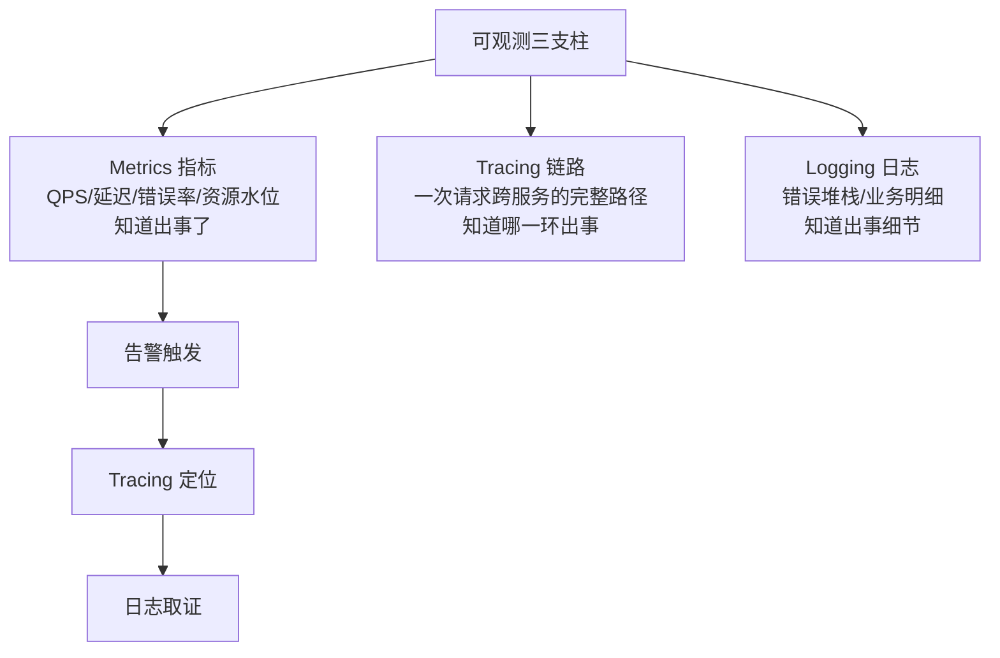
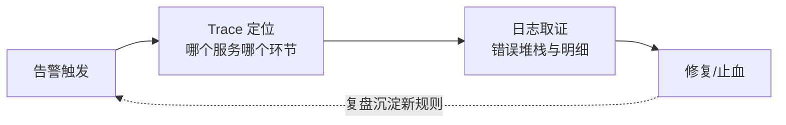

# 监控与告警：让系统的问题被先看见

> MTTR 的第一段是 MTTD（发现时间）——监控告警的全部意义是把「用户打电话来才知道坏了」压缩成「告警先响」。但告警泛滥同样是故障：100 条告警里没人能分清哪条是真问题。监控建设的终极矛盾是「不漏报」与「不骚扰」，本篇讲怎么用分层监控与告警纪律解它。

## 一句话摘要

可观测三支柱：**指标**（Metrics，知道出事了）、**链路**（Tracing，知道哪一环出事）、**日志**（Logging，知道出事的细节）——监控分层（系统层/应用层/业务层）决定覆盖面，告警纪律（分级/去重/收敛/可行动）决定有效性；判断标准只有一条：**每条告警都必须「可行动」——收到的人知道该做什么**，不能行动的告警是噪音，噪音多了真信号就被淹死。

## 本文核心

**核心机制一句话**：可观测 = 指标（发现）→ 链路（定位）→ 日志（取证）三支柱协作，配四层监控（系统/中间件/应用/业务）与告警四纪律（分级/可行动/收敛/审计）——把 MTTD 压到分钟级以内。

**机制链**：SLO 定监控对象与告警阈值 → 指标触发告警 → Tracing 定位环节 → 日志取证 → 复盘沉淀新告警规则。

**失效边界**：只装指标 = 知道坏了不知道为什么；告警不可行动 = 噪音淹没真信号；缺业务层监控 = 服务活着业务病了看不见。

## 一、背景：从「用户发现」到「监控先知」

MTTD（发现时间）的演进：没有监控的系统，故障由客服/用户发现——MTTD 以小时计，且带口碑代价；有指标监控，系统级故障分钟级发现；有业务监控，**体验劣化（服务还活着但成功率降了）也能秒级告警**。演进的方向是把发现时点不断前移。

监控不等于「装个 Prometheus」：装了监控没定告警 = 数据在但没有眼睛；定了告警不分级 = 所有告警一样响，值班员疲劳后真告警也被忽略（告警疲劳是行业级痛点）。**监控体系 = 数据采集 + 分层面板 + 告警纪律**三件套。

## 二、核心：可观测三支柱与监控分层

三支柱是协作关系：指标告警发现异常 → 用 Trace 定位到具体服务的具体调用 → 下钻日志看根因。**只装指标的监控是「知道坏了」；三支柱齐全才是「知道为什么坏」**。

**监控分层**（自下而上）：

| 层 | 监控什么 | 举例 |
|---|---|---|
| 系统层 | CPU/内存/磁盘/网络 | 节点资源水位 |
| 中间件层 | 连接池/队列堆积/缓存命中率 | DB 连接池 80% |
| 应用层 | QPS/P99/错误率/JVM | 接口 P99 突增 |
| **业务层** | 下单量/支付成功率/对账差异 | **支付成功率骤降**（系统层全绿但业务故障——只有业务监控能发现） |

业务层监控是最容易被忽略也最有价值的一层：系统指标全绿但支付成功率从 99% 掉到 90%——这类「服务活着但业务病了」的故障，只有业务指标能发现。

## 三、机制：告警纪律

告警泛滥的治理，四条纪律：

1. **分级**：P0（页哨电话，核心链路不可用）/ P1（IM 强提醒，SLO 受威胁）/ P2（工单，需要关注）——**分级对应响应时效**，P0 必须 5 分钟内有人响应
2. **可行动**：每条告警必须附带「含义 + 排查入口 + 处置动作」；不能行动的（「CPU 高」却没有上下文）先治理再上线
3. **收敛**：同类告警去重（同一故障只报一次，聚合计数）、依赖收敛（底层故障只报根因告警，抑制连锁告警）
4. **定期审计**：每月统计「告警数 vs 真故障数」——误报率超过 50% 就是治理信号。**告警的价值 = 漏报的代价 − 骚扰的成本**，这个账要定期算

**告警规则从哪来**：从 SLO 倒推（错误预算的燃烧速率告警——burn rate 高于正常 N 倍才报，是 SRE 推荐的告警模型）；从故障复盘倒推（每次故障后问「什么指标能更早发现它」，把答案做成告警）——**告警规则库是故障经验沉淀的最好载体**。

监控告警在架构上下游的位置：它是「运行时状态 → 人/自动化决策」的信息通道——上游是所有基础设施与服务的运行数据，下游是值班响应、自动扩缩容、自动回滚这些决策动作。通道断了（监控盲区），下游所有稳定性动作都成了无源之水。

## 四、实践：典型场景与起步路径

**典型场景**：

- **大促保障**：告警分级重排（大促期间 P0 阈值收紧）、值班表轮转、告警升级链（15 分钟无人响应自动升级）
- **发布守护**：发布后自动对比发布前后的核心指标（自动回滚的触发依据）
- **容量联动**：水位告警（70%）触发扩容流程——监控与容量篇的闭环

> 💡 实战提示：新告警上线先跑「静默观察期」——只记录不通知，观察一周触发次数与准确性，确认可行动再放开通知。直接上线的告警如果误报率高，会让值班员条件性忽略整类告警。

**起步路径**：核心接口的成功率/P99 指标 + P0/P1 两级告警 → 加业务层监控（支付成功率类）→ 引入 Tracing（定位效率）→ 告警审计与收敛（治理噪音）。

## 与故障演练的区别

监控回答「坏了能不能看见」，混沌演练回答「坏了会怎么样」——演练的验收标准就是「注入的故障，监控告警先发现还是人先发现」，两者是出题人与阅卷人的关系（第 8 篇展开）。

## 与稳定性体系其他环节的关系

监控是稳定性体系的「神经系统」：SLO（第 1 篇）定义了监控什么和告警阈值怎么定；限流/熔断（2/3 篇）的触发事件要靠监控暴露；压测（第 6 篇）的瓶颈判断依赖监控数据；混沌演练（第 8 篇）的效果要靠「监控能不能发现注入的故障」来验收——**演练的第一验收标准就是：注入的故障，监控先发现了还是人先发现了**。

## 常见误区

- **误区一：监控项越多越安全**。未消费的指标是成本，未治理的告警是噪音源——覆盖核心链路 + 可行动告警，比一万条无主指标有价值
- **误区二：告警发给越多的人越保险**。群发 = 没有人负责；每条告警要有明确的 owner 和升级链
- **误区三：只监控系统层**。系统全绿但业务已病（配置错误、依赖降级）的故障只能靠业务监控发现——业务指标是监控体系的天花板
- **误区四：告警阈值一次定好**。流量形态在变，阈值要随 SLO 调整和误报审计持续演进——告警规则是活的

## 自测三问

1. **可观测三支柱怎么协作？**
   - 指标发现异常（告警触发）→ Tracing 定位到具体环节 → 日志取证根因。只有指标 = 知道坏了不知道为什么。

2. **为什么业务层监控最有价值又最容易缺？**
   - 「系统全绿但业务病了」（配置错误、依赖静默降级）只有业务指标能发现——但它需要业务方定义指标，技术团队自然不会主动建。

3. **告警噪音怎么治理？**
   - 四条纪律：分级（对应响应时效）/ 可行动（附带处置入口）/ 收敛（去重与根因抑制）/ 定期审计（误报率 > 50% 即治理信号）。

## 5W 速记卡

| W | 一句话 |
|---|---|
| What | 三支柱可观测 + 分层监控 + 告警纪律 |
| Why | MTTD 归零是 MTTR 优化的第一段；不漏报且不骚扰 |
| Where | 系统层 → 中间件 → 应用 → 业务层全覆盖 |
| When | 建设起步先核心指标告警，体系成熟后走向业务监控 |
| Who | SRE 建平台，业务方定业务指标，值班人消费告警 |

## 你们可能会问

**Q1：监控用什么工具栈？**
指标 Prometheus + Grafana、链路 OpenTelemetry/SkyWalking、日志 ELK/Loki 是主流组合——但工具是载体，分层覆盖与告警纪律才是体系。

**Q2：告警发群里没人看怎么办？**
这是分级失效的信号——P0 用页哨（电话/短信），群消息只放 P1/P2。渠道强度必须匹配分级的响应承诺。

## 开放问题

- **AI 告警治理**：告警收敛与根因分析靠规则写不完，AIOps 的异常检测/告警聚类在头部团队已有实践，但误报治理的通用方案仍未成熟
- **业务指标的平台化**：业务监控高度依赖业务定义，如何让业务方自助接入指标而不变成数据团队的瓶颈，各家方案不一

## 核心带走

**30 秒复述**：可观测三支柱（指标发现/链路定位/日志取证）+ 监控四层（系统/中间件/应用/**业务**——业务层是天花板）+ 告警四纪律（分级/可行动/收敛/定期审计）。告警规则的两个来源：SLO 燃烧率倒推 + 故障复盘倒推。**失效边界**：告警不可行动 = 噪音制造机；缺业务层监控 = 服务活着业务病了看不见。

## 📌 数据与事实声明

- 写于 2026-09-09；三支柱与 burn rate 告警模型源自 Google SRE 书与 PROMETHEUS 官方实践（公开口径）
- 行业认知：告警疲劳与误报治理为行业级痛点（公开 SRE 报告共性）
- 免责：具体工具（Prometheus/Grafana/SkyWalking 等）用法以官方文档为准

## 📚 参考资料

| 类型 | 标题 | 来源 |
|---|---|---|
| 书 | 《SRE: Google 运维解密》Monitoring 章 | 公开出版 |
| 官方文档 | Prometheus Alerting Rules | prometheus.io/docs |
| 书 | 《Distributed Systems Observability》 | 公开出版（O'Reilly 免费电子书） |
