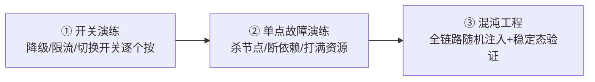
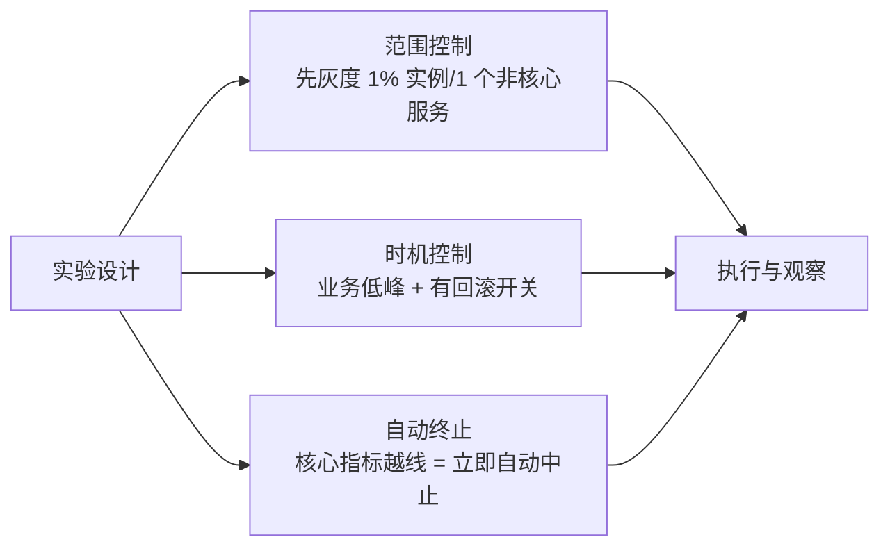

# 混沌工程与故障演练：主动验证稳定性预案

> 预案没演练过 = 没有。限流阈值是拍的、降级开关没按过、主从切换没跑过——真故障来临时，这些「预案」自己就是风险。混沌工程的思路是把故障主动注入，在可控的时间、可控的范围里验证：系统能不能扛、预案管不管用、人会不会处置。

## 一句话摘要

故障演练从「脚本化预演」演进到「混沌工程」（科学实验方法论：稳定态假设 → 注入故障 → 观察验证）：**从单个组件的开关演练，到全链路故障注入**——验收标准只有一条：注入的故障，是监控告警先发现、预案自动接管，还是用户先发现、人肉救火。每一次演练暴露的弱点，都是真故障到来前最后的免费修复机会。

## 本文核心

**核心机制一句话**：混沌工程 = 稳定态假设 + 可控故障注入 + 观察验证——主动制造故障，让弱点在真故障到来之前免费暴露。

**机制链**：预案三假（没按过的开关/没压过的阈值/没练过的人）→ 三层演练（开关→单点→混沌注入）→ 爆炸半径三道保险（范围/时机/自动终止）→ 弱点清单 → 修复 → 回归。

**失效边界**：无自动终止的注入是事故不是实验；一次性演练的结论半年作废；只考系统不考人的演练漏掉最大变数。

## 一、背景：预案的三种「假」

复盘报告里高频出现的三句话，对应预案的三种假：

1. **预案是假的**：降级开关在配置中心里躺着，从没人按过——真按下去发现降级逻辑有 Bug，或者开关根本没接到代码里
2. **阈值是假的**：限流阈值写了 2000，压测只到过 1500——多出来的容量是纸面上的
3. **人是生的**：应急 SOP 写了三页，值班同学第一次打开它是故障发生时——照着 SOP 操作时发现 SOP 本身过时了

这三种假的共同解药只有一个：**在真故障之前，让预案在可控条件下被真实执行一遍**。故障演练（预案预演）与混沌工程（系统性故障注入）就是这个动作的工程化。

## 二、核心：演练的三个层次

**① 开关演练（起步必做）**：把系统里所有的「稳定性开关」（降级开关、限流配置、屏蔽开关）逐个真实操作一遍，验证三件事——开关真的连着代码、降级逻辑本身没 Bug、操作的人会操作。成本最低，收益立竿见影。

**② 单点故障演练**：主动注入单点故障——杀一个实例（验证自动摘流与自愈）、断一个依赖（验证熔断与降级）、打满资源（验证容量与限流）。每类故障验证一条防护线，练的是「单点故障的影响面是否符合预期」。

**③ 混沌工程**（进阶）：科学实验方法论——**定义稳定态指标（SLO 类）→ 提出假设（挂掉 X，系统仍满足稳定态）→ 注入故障 → 观察 → 推翻或证实假设**。与脚本化演练的区别：演练验证「已知风险有预案」，混沌工程发现「未知风险没预案」——在生产环境随机注入时，炸出来的往往是从没想过的问题（比如某依赖的双活其实是假双活）。

## 三、机制：混沌实验的爆炸半径控制

混沌工程最大的风险是「演练引发真故障」。爆炸半径控制是第一设计原则：

**三道保险**：范围上从最小开始（1 个实例、非核心服务、测试环境先行）；时机上低峰期 + 实验窗口外自动停止；**核心指标自动熔断实验**——错误率/SLO 一越线，注入工具自动撤销全部故障。没有自动终止的混沌实验等于玩火。

演练频率与业务风险的权衡：常态演练（季度）换来预案保鲜，但每次演练都有成本与风险——大促前加密、平稳期减少，这个节奏权衡本身也是演练体系的一部分。

**演练的完整闭环**：注入故障 → 验证「监控是否先发现」（告警验收）→ 验证「预案是否自动接管」（限流/熔断/切换验收）→ 记录差距 → 修复 → 回归演练。**每一次演练的产出物是「弱点清单 + 修复项」**——没有产出物的演练是表演。

> 💡 实战提示：第一次混沌注入从「杀一个非核心服务的实例」开始——预期行为明确（流量自动摘除）、爆炸半径最小，一次实验验证监控/摘流/自愈三条线。

## 四、实践：典型场景与起步路径

**典型场景**：

- **大促前**：全链路演练——按大促预案清单逐项注入（依赖挂、容量打满、主从切换），每个预案「真按一遍」
- **值班体系验收**：新值班同学上岗前的故障注入考试——模拟故障，看发现、定位、处置是否符合 SOP
- **架构验证**：多活/主备架构上线后，真实切一次流量、断一次机房——「容灾没切过 = 没有容灾」是行业共识

**起步路径与何时用**：开关演练全量做（成本最低）→ 单点故障演练覆盖核心链路 → 混沌注入从测试环境到生产灰度 → 演练常态化（每季度例行，而不是等大促）。何时用哪层：开关演练随时可做；单点演练在架构变更后必做；混沌注入留给体系成熟后的进阶阶段——层次与成熟度匹配，不要一步登天。

## 与监控、应急的区别

| 环节 | 角色 | 关系 |
|---|---|---|
| 监控（第 7 篇） | 出题的验收官 | 演练注入的故障，监控先发现才算合格 |
| **演练/混沌** | **出题人 + 考官** | **主动制造故障，验证防线与人** |
| 应急（第 9 篇） | 考生 | 演练检验 SOP 与人的处置能力 |

三者的闭环：演练暴露弱点 → 修复预案/监控 → 再演练验证 → 沉淀进应急 SOP。

## 你们可能会问

**Q1：生产注入故障出了真事故算谁的？**
实验设计阶段就定「自动终止条件 + 影响承诺」并走审批——按三道保险执行的实验暴露的是预案弱点（演练目的所在）；跳过保险流程才是责任事故。

**Q2：小团队没有混沌平台做得了吗？**
做得了——开关演练 + 单点故障演练用脚本就能做；混沌平台只是「随机注入 + 稳定态自动判定」的产品化，手工演练起步已覆盖八成价值。

## 常见误区

- **误区一：混沌工程 = 随机搞坏生产**。随机是注入策略的随机，不是无控制——范围/时机/自动终止三道保险是前提，跳过它们的是事故不是实验
- **误区二：演练一次就够**。系统在演进，预案在过时——演练必须常态化（季度级），一次性演练的结论半年后就失效
- **误区三：只在测试环境演练**。测试环境验证代码逻辑；容量、隔离、切换这些「环境相关」的预案只有生产等比环境才验得出来——生产演练靠爆炸半径控制保安全
- **误区四：演练只考系统不考人**。故障处置的最终执行者是人——演练要把「值班同学按 SOP 处置」包含在内，SOP 过时、权限缺失、流程卡点都是真实弱点

## 自测三问

1. **混沌工程与脚本化演练的区别？**
   - 演练验证「已知风险有预案」；混沌用实验方法论（假设→注入→观察）发现「未知风险没预案」——前者是验收，后者是探索。

2. **混沌实验的第一设计原则是什么？**
   - 爆炸半径控制：最小范围起步、低峰期执行、核心指标越线自动终止——没有自动终止的实验是玩火。

3. **演练的产出物是什么？**
   - 弱点清单 + 修复项 + 回归验证记录——没有产出物的演练是表演。

## 5W 速记卡

| W | 一句话 |
|---|---|
| What | 主动注入故障，验证预案/防线/人的三层能力 |
| Why | 预案没演练过 = 没有；弱点在真故障前免费暴露 |
| Where | 从测试环境到生产灰度，核心链路全覆盖 |
| When | 大促前必做 + 每季度例行；架构变更后加验 |
| Who | SRE 主导注入，值班/业务参与处置，复盘归档弱点 |

## 开放问题

- **混沌平台的产品化**：故障注入工具（ChaosBlade/Chaos Mesh 等）已开源成熟，但「实验设计 - 爆炸半径策略 - 自动终止」的平台化封装，各团队仍自建为主
- **生产环境注入的合规边界**：金融等强监管场景，生产注入的可接受范围与审批流程仍在探索

## 核心带走

**30 秒复述**：演练三层次（开关演练 → 单点故障注入 → 混沌工程），混沌 = 稳定态假设 + 故障注入 + 观察（发现「未知风险没预案」）。第一设计原则是爆炸半径控制（范围/时机/自动终止三道保险），产出物是弱点清单。**失效边界**：没有自动终止的注入是玩火；一次性演练的结论半年作废。

## 📌 数据与事实声明

- 写于 2026-09-09；混沌工程方法论源自 Netflix Chaos Engineering 原则（公开，principlesofchaos.org）
- 行业认知：「容灾没切过 = 没有容灾」「预案未演练为复盘高频结论」为公开复盘共性
- 免责：注入工具（Chaos Mesh/ChaosBlade/Litmus）用法以官方文档为准

## 📚 参考资料

| 类型 | 标题 | 来源 |
|---|---|---|
| 书 | 《混沌工程：复杂系统不确定性应对》 | 公开出版 |
| 原则 | Principles of Chaos Engineering | principlesofchaos.org |
| 官方文档 | Chaos Mesh / ChaosBlade | chaos-mesh.org / chaosblade.io |
