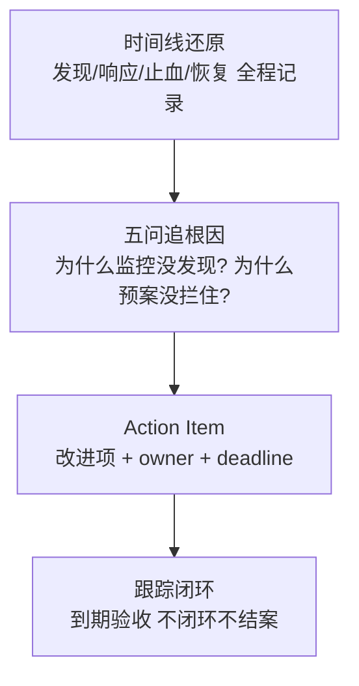

# 应急响应与故障复盘：把每次故障变成资产

> 故障来了的两件事：**止血要快**（应急响应），**下次不再犯**（故障复盘）。止血拼的是预案与纪律，复盘拼的是文化与追责边界——「定责文化」下的复盘永远得到假原因，只有「无责复盘」才能挖到系统性根因。故障本身不可怕，同样的故障犯两次才是事故。

## 一句话摘要

应急响应 = 分级预案 + 明确角色（指挥/处置/沟通分离）+ 止血优先于定位（先恢复服务再查根因，重启/回滚/降级三板斧）；故障复盘 = 无责文化下的时间线还原 + 五问追根因 + Action Item 跟踪闭环——**复盘的产出不是文档，是已落地的改进项**；两者共同把 MTTR 压到最短、把同类故障复发率打到最低。

## 本文核心

**核心机制一句话**：应急靠「分级 + 角色分离 + 止血三板斧」对抗混乱压 MTTR，复盘靠「无责文化 + 系统性根因 + Action 闭环」降复发率。

**机制链**：定级定责 → 指挥/处置/沟通到位 → 止血（重启/回滚/降级，先可逆低风险）→ 恢复确认 → 24-48h 复盘（时间线/影响/根因链/Action）→ 周会跟踪闭环。

**失效边界**：定责文化挖出假根因；止血时先找根因延长故障；Action 不跟踪 = 复盘归零。

## 一、背景：故障时刻的两难与纪律

故障响应最大的敌人是混乱：多人在群里七嘴八舌、一个人既定位又改配置又答复业务、没有决策者导致「改不改」讨论十分钟。**应急响应的纪律就是为了对抗混乱**——预案平时写好，故障时照着执行：

- **止血优先于定位**：先恢复服务（重启/回滚/切流/降级三板斧），再查根因——「带着问题运行」好过「停下来找真相」。定位可以事后复盘，业务中断每一分钟都是真实损失
- **角色分离**：指挥（统一决策，不再亲自上手）、处置（执行命令的工程师）、沟通（向业务/客户通报）——一人多角是小型故障常态，但 P0 故障必须三人分离
- **信息节奏**：固定频率通报（如每 15 分钟一条进展），哪怕「仍在定位」——沉默会引发业务的恐慌性升级

## 二、核心：应急响应 SOP

**故障分级决定响应规格**：P0（核心链路不可用，全员响应 + 高层同步）、P1（部分受损，值班处置）、P2（有损但可排队）。分级标准平时定好（可用性/影响用户数/资金风险三维度），故障时对号入座——现场讨论「这算不算 P0」本身就是浪费时间。

**止血三板斧的顺序哲学**：重启（清状态，最快）→ 回滚（回到上一个已知好版本）→ 降级/切流（绕开故障组件）。**先做可逆的、低风险的**：回滚比热修安全，切流比重启精准。定位与止血分离的另一面是：止血动作也要记录时间线——它是复盘的核心素材。

## 三、机制：无责复盘与 Action Item 闭环

复盘的文化地基是**无责（Blameless）**：目标是「系统性根因」而不是「谁的锅」。定责文化下，当事人会隐瞒细节、根因停留在「操作失误」——但「人操作失误」永远不是根因，**「为什么系统能让一次失误引发 P0」才是根因**（Chernobyl 式追问）。

**复盘文档四要素**：时间线（精确到分钟）、影响面（时长/用户数/资金）、根因链（直接原因 → 系统性原因）、Action Items（每条有 owner 和 deadline）。

**Action Item 闭环是复盘的命门**：行业公开复盘的共性缺陷是「改进项写在文档里，三个月没人跟进，同类故障复发」。纪律：复盘会当场认领、每周过进度、**下一个同类故障复盘先查上次 Action Item 完成情况**——让「上次的改进项没做完」也成为被复盘的问题。

**复盘的沉淀出口**：根因 → 新增/收紧告警（衔接监控篇）；预案缺陷 → 更新 SOP + 加入演练清单（衔接混沌篇）；架构弱点 → 进入技术债清单。**复盘是稳定性体系的发动机：每次故障都该让体系进化一点。**

## 四、实践：典型场景与起步路径

**典型场景**：

- **P0 故障响应**：值班发现告警 → 5 分钟内拉起应急群（指挥/处置/沟通到位）→ 三板斧止血 → 恢复确认 → 24 小时内出复盘初稿
- **发布引发的故障**：第一时间回滚（发布会是高频根因），回滚争议时间 = 延长故障
- **跨团队故障**：指挥统一对外（避免多团队各自口径），依赖方的处置进度纳入统一时间线

> 💡 实战提示：应急群纪律一条就够——「只发事实与命令，不发情绪与猜测」；猜测放复盘，混乱中的错误猜测会误导止血方向。

**起步路径**：定分级标准与值班表 → 写核心链路的止血 SOP（三板斧模板化）→ 故障模板固化（时间线/影响/根因/Action）→ 无责文化由高层带头（第一次复盘就用行动证明「追责不在这里」）。

## 与混沌演练的区别

演练是「考前的模拟考」（主动、可控、常态化），应急是「真考试」（突发、混乱、真损失）——演练的价值就是让真考试时人人像做过一遍。每场真故障复盘后，都要问：「这个场景能不能加进下一次演练清单？」

## 你们可能会问

**Q1：止血的回滚会丢数据吗？**
代码回滚丢的是「回滚窗口内的新写入行为」而非数据本身；数据回滚是危险动作需专项演练——P0 先代码回滚，数据订正走事后流程。

**Q2：复盘会开多久、谁必须到？**
P0 复盘 60-90 分钟：全相关方 + 指挥者必到，时间线材料会前发——没材料的复盘会变成现场考古。

## 常见误区

- **误区一：止血时坚持先找根因**。定位是为了复盘，不是为了止血——「先恢复再定位」是 P0 纪律，边恢复边记录的时间线足够复盘用
- **误区二：复盘 = 写检讨**。检讨文化挖出的是「操作失误」，无责复盘挖出的是「系统为什么允许这个失误造成 P0」——追问方向完全不同
- **误区三：复盘会开完就结束**。没有 Action Item 跟踪闭环的复盘是仪式——改进项不落地，复盘产出为零
- **误区四：故障透明会让团队丢脸**。公开的故障复盘（脱敏后）恰恰是组织学习最快的素材；掩盖的故障会在别处以更大代价复发

## 自测三问

1. **P0 故障第一动作是什么？**
   - 按预案止血（重启/回滚/降级），同时拉起应急群定角色——定位放第二，业务中断每分钟都是真实损失。

2. **为什么复盘必须无责？**
   - 定责让当事人隐瞒细节，根因停在「人的失误」；无责才能追问「系统为什么允许失误造成 P0」，挖到可改进的系统性原因。

3. **复盘的产出物是什么？**
   - 不是文档，是带 owner 和 deadline 的 Action Item 清单 + 跟踪闭环——不落地的复盘产出为零。

## 5W 速记卡

| W | 一句话 |
|---|---|
| What | 分级应急 SOP + 无责复盘与改进闭环 |
| Why | 止血压 MTTR，复盘降复发率——故障变资产 |
| Where | 值班体系 + 每一次故障之后 |
| When | 故障即启动；复盘 24-48 小时内完成初稿 |
| Who | 指挥/处置/沟通分离；复盘全相关方参加 |

## 开放问题

- **AI 辅助应急**：故障时自动聚合告警/变更/trace 给出「可能根因 Top3」，业界在试但准确率仍依赖预案库质量——AI 当助手已可用，当指挥官还早
- **复盘知识库的检索**：复盘文档堆积后，新故障时检索不到历史相似案例——故障案例的结构化与相似度检索仍在演进

## 核心带走

**30 秒复述**：应急 = 分级预案 + 角色（指挥/处置/沟通）分离 + 止血三板斧（重启/回滚/降级，先可逆低风险）；复盘 = 无责文化 + 时间线还原 + 五问系统性根因 + Action Item 跟踪闭环。**失效边界**：定责文化挖出假根因；改进项不跟踪 = 复盘归零；止血时先找根因 = 延长故障。

## 📌 数据与事实声明

- 写于 2026-09-09；无责复盘（Blameless Postmortem）为 Google SRE 与 Etsy 兄弟团队公开方法论；MTBF/MTTR 口径同第 1 篇
- 行业认知：改进项不闭环、定责文化致根因肤浅，为公开复盘报告的高频自我批评
- 免责：分级标准与 SOP 模板以各团队实际业务为准

## 📚 参考资料

| 类型 | 标题 | 来源 |
|---|---|---|
| 书 | 《SRE: Google 运维解密》Emergency Management / Postmortem 章 | 公开出版 |
| 文章 | Blameless PostMortem and a Just Culture | Etsy Code as Craft（公开） |
| 书 | 《The Field Guide to Understanding Human Error》James Reason | 公开出版 |
