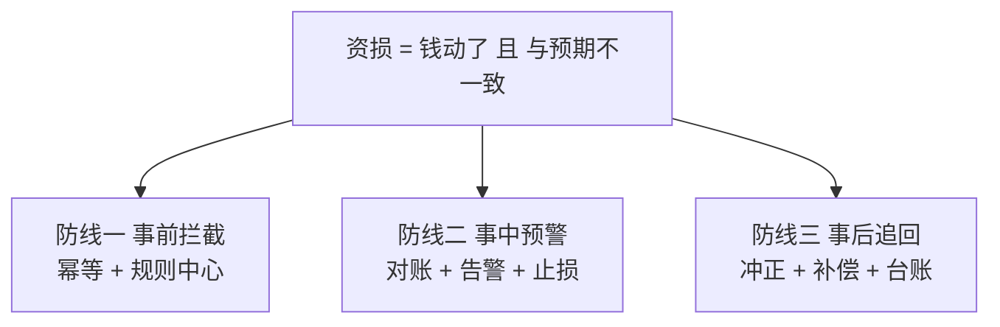

# 从零开始认识防资损系列导读

> 资损是资金密集型系统的「P0 事故」——服务挂了损失可用性，资损直接丢钱且往往是复利式的（错误账滚进对账、进报表、进监管报送）。这个系列按 ADR-0012 工程级深度标准建设：每个机制给参数表、代码、步骤，全部结论带 10w/千万/亿级三档分档。

## 一句话摘要

防资损 = **两维度 × 三道防线 × 一张矩阵**：资金类（操作失误：多放/少放/重复放）与计算类（逻辑错误：利率算错/分账搞反/还款计划错）两维度；事前拦截、事中预警止损、事后追回三道防线；底座是**全量业务场景 × 防线的资损矩阵**——每个场景都有前置规则、监控、对账、止损四层覆盖，覆盖不到的场景就是定时炸弹。

## 系列地图（L1-L4）

| 层 | 系列 | 篇目 |
|---|---|---|
| 入门层 | 本层（从零开始认识防资损系列） | 0 导读 / 1 什么是资损 / 2 资损场景全景与矩阵 / 3 事前拦截 / 4 事中预警 / 5 事后追回 / 6 对账体系入门 / 7 方法论总结 |
| 特性层 | 深入理解资损防控机制系列 | 1 准实时对账引擎 / 2 资损规则中心 / 3 监控大盘与告警分级 / 4 止损与应急冻结 |
| 专题层 | 资损防控亿级实战 | 1 亿级交易对账性能（量级三档） / 2 资损预案演练与红蓝对抗 / 3 资损 vs 可用性的取舍 |
| 整合层 | 从零实现对账系统（Demo） | 工程级 9 段：步骤/代码/验证/回退 |

## 量级三档（系列总纲）

| 档 | 防控形态 | 核心手段 |
|---|---|---|
| **10w（日交易 10 万笔级）** | 人肉 + 离线对账 | T+1 报表核对、DB 查询脚本、出问题电话止损 |
| **千万（日千万笔级）** | 准实时对账 + 规则中心 | 分钟级对账窗口、规则引擎拦截、告警分级 |
| **亿级（日亿笔级）** | 全链路资损矩阵 + 自动止损 | 流水级旁路核对、自动熔断冻结、资损演练常态化 |

全系列的架构主线：三道防线（事前/事中/事后）贯穿四层——入门层建概念、特性层钻机制、专题层打亿级实战、整合层落 Demo；每篇都带 10w/千万/亿级三档分档（量级三档总纲见上表）与工程级细节（参数/代码/步骤）。

防资损体系的演进史就是三道防线的自动化演变史：从 T+1 报表人肉核对，到准实时对账与规则中心，再到亿级流水核对与自动止损——每一次形态跃迁都由量级跨档驱动，系列各篇会反复回看这条演进线。

## 怎么读

- 支付/信贷/跨境业务开发者：按 1-7 顺序，重点 3-5（三道防线是日常打交道最多的）
- 稳定性/SRE：跳读 4（预警）、6（对账体系）、特性层全部
- 架构师：0 → 2（矩阵方法论）→ 专题层 3（取舍）→ 整合层 Demo

## 📌 数据与事实声明

- 系列结构依据 ADR-0012 工程级深度标准（方向=子目录 L1-L4）；三档形态为业界通行模式归纳（行业认知）。

- 稳定性主系列（事前-事中-事后三段论的资损专项纵深）
- biz 分类（支付/信贷业务场景是资损规则的来源）
