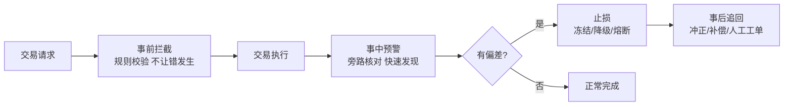
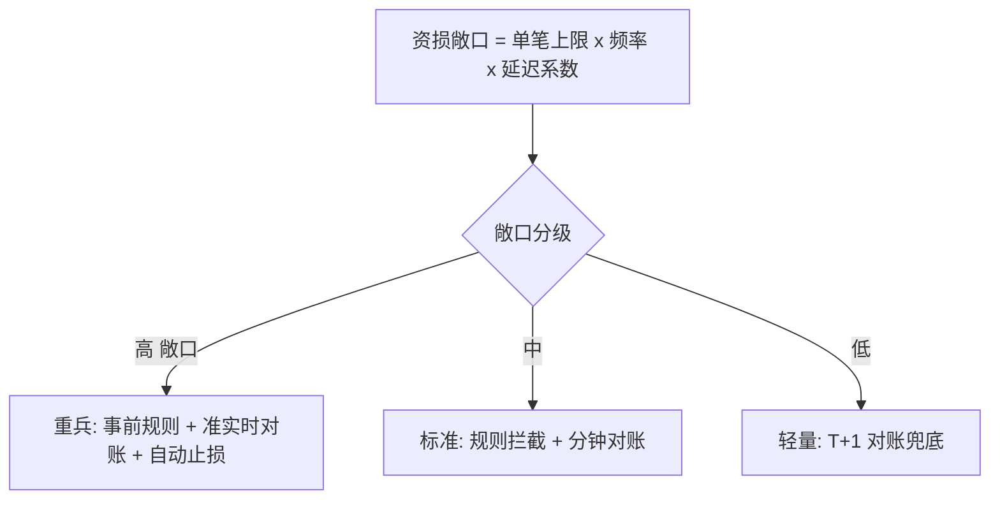

# 什么是资损：定义、分类与三道防线总览

> 「服务挂了」损失的是可用性，「资损」丢的是钱——而且往往是复利式的：一笔错账滚进对账、滚进报表、滚进监管报送，越晚发现越难追。这一篇把「什么算资损」的边界、两大分类、三道防线的总览架构讲清，全部结论带 10w/千万/亿级三档分档。

## 一句话摘要

资损 = **系统行为导致的、与业务预期不一致的资金偏差**——两个判定要件：①钱动了（或应动未动）②与正确答案不一致。分两大类：**资金类**（操作失误：多放款/少扣款/重复放行/重复退款）与**计算类**（逻辑错误：利率算错/分账搞反/汇率用错/还款计划生成错）。防控架构是**三道防线**：事前拦截（不让错发生）、事中预警止损（错了快速知道并止血）、事后追回（已发生的把钱要回来/补回来）。

## 🎯 本文核心

**核心机制一句话**：防资损 = 对「每一笔资金变动都有预期答案」这件事，建立事前拦截、事中预警、事后追回的三道防线，并用资损矩阵保证全场景覆盖。

**机制链**：定义预期（账务规则）→ 事前校验（拦截不合规操作）→ 事中旁路核对（发现偏差）→ 告警止损（冻结扩散）→ 事后追回（修正账务）。上下游：上游是业务规则（什么是「对」），下游是财务对账与监管报送——防资损系统是这条链的守门人，模块边界必须清晰：它不产生账务，只校验与守护账务。

## 典型使用场景（分类即场景）

**资金类（操作失误，占资损事故的大头——行业认知约 70%+）**：

| 场景 | 错误形态 | 典型根因 |
|---|---|---|
| 放款 | 多放/重复放/放给错人 | 重试无幂等、状态机穿透、路由错账户 |
| 扣款/退款 | 少扣/多扣/重复退款 | 超时重试幂等缺失、回调乱序 |
| 转账/分账 | 重复转账/分账对象搞反 | 消息重复消费、上下游金额字段单位不一致（分 vs 元） |

**计算类（逻辑错误，单笔小但批量面大）**：

| 场景 | 错误形态 | 典型根因 |
|---|---|---|
| 计息/费率 | 利率算错、费率生效日错 | 配置发布未灰度、时区/日期边界 |
| 分摊/清分 | 分账比例错、尾差处理错 | 精度截断规则不一致 |
| 汇率 | 用错买入价/卖出价、汇率快照过期 | 汇率源切换未同步 |

## 三道防线总览（每道给 10w/千万/亿级三档形态）

**事前拦截**（校验规则：金额上下限、频次、黑名单、状态机合法性）：

| 档 | 形态 | 关键参数（示例） |
|---|---|---|
| 10w | 代码里硬编码 if 校验 | 规则几十条，改规则要发版 |
| 千万 | **规则中心**（配置化 + 灰度发布） | 规则百条级，变更生效分钟级，灰度按流量比例 |
| 亿级 | 规则中心 + 多维实时决策（风控式） | 规则千条级，决策 RT 预算 ≤ 50ms（行业认知），规则冲突检测自动化 |

**事中预警**（旁路核对：拿「应收」与「实收」比）：

| 档 | 形态 | 发现时效 |
|---|---|---|
| 10w | T+1 离线报表人肉核 | 次日 |
| 千万 | 准实时对账（分钟级窗口） | 分钟级（详见篇 4/6） |
| 亿级 | 流水级旁路核对 + 实时大盘 | 秒级～分钟级，自动止损联动 |

**事后追回**：冲正交易/反向补偿/客服工单/司法追偿——各档形态差异主要在**自动化率**：10w 靠人工，千万半自动（工单系统），亿级自动冲正 + 人工兜底（自动冲正本身有二次资损风险，必须带审批与限额，特性层篇 4 展开）。

## 💡 实战提示

- 💡 判定「是不是资损」别只看金额方向：**少放款（少付）也是资损**——用户资产受损 = 客诉 + 监管 + 品牌三重损失，方向对称地防。
- 💡 单位不一致（分/元）是资损事故的万年老梗：跨服务金额字段必须在接口契约里强类型化（如统一 `long cents`），code review 一票否决项。

## 与「对账」「风控」的区别（跨域辨析）

- 与**对账**的区别：对账是事中/事后核对的一种手段（防线二的主武器），防资损是目标域——对账之外还有事前规则拦截与止损追回；
- 与**风控**的区别：风控防「外部人作恶」（欺诈/盗刷），防资损防「系统自己出错」——两者常共用规则引擎与决策链路，但规则来源、误杀代价、评审流程完全不同（模块边界：可共基础设施，不共规则集）；
- 与**稳定性**的区别：稳定性保「系统正常响应」，防资损保「响应的钱是对的」——服务正常但算错钱，稳定性满分、资损满分（反面意义）。

## 常见误区

- ❌「我们量小，不需要防资损」——资损事故率与量无关、与变更频率正相关；10w 档的正确形态是「轻量但完整」：T+1 对账脚本 + 上线双人复核，成本一天；
- ❌「上了对账系统就安全了」——对账只能发现「两边不一致」的错误，**两边一起错（同源错误）对不出来**：账务与交易同用一个错利率，对平了也是错的——需要业务校验规则（防线一）兜底；
- ❌「资损是财务的事」——财务看得见「账不平」，看不见「系统为什么错」；防资损的规则、拦截、修复都长在工程侧；
- ❌「事后能追回就不用事前防」——追回率从来不是 100%（用户已消费/提现即无法冲正），行业认知：追回成本是拦截成本的 10 倍以上，且伴随客诉与监管风险。

## 代价与边界

防资损的每道防线都有成本：事前拦截的代价是**误杀率**（合法交易被拦，直接损失转化率）；事中对账的代价是**存储与计算**（全量流水核对，亿级档要专门的对账引擎，见特性层）；事后追回的代价是**客诉与人工**。取舍总纲：**按场景的资损敞口（单笔上限 × 频率）分配防线强度**——敞口大的场景（放款/退款）重兵把守，敞口小的（查询类）不设防。

## 演进与取舍（跨周期视角）

防资损体系的演进史就是三道防线的自动化史：早期全靠 T+1 报表 + 人肉电话止损 → 准实时对账 + 工单化 → 流水级核对 + 自动冻结。每一次演进的动因都是**量级跨档**：日 10 万笔的人肉模式，到日千万笔时对账窗口追不上交易增速，被迫上准实时——**量级跨档是防资损架构演进的第一驱动力**，这也是本系列所有机制篇都带三档分档的原因。

## 你们可能会问

**Q1：资损敞口怎么量化？**
敞口 = 单笔最大错误金额 × 潜在错误频率 × 发现延迟系数。行业认知做法：按场景列「最大错账金额」（如放款接口单笔上限）× 历史变更频率，得出 Top 场景清单——矩阵建设的第一步（篇 2 展开）。

**Q2：为什么重复放款这么常见？**
重试链路里幂等缺失：超时重试（调用方重试 + 网关重试 + 消息重试）三层各自为政，任何一层没做幂等键就可能双放。防重复放款的正解是**幂等键贯穿全链路**（篇 3 详解 + 代码）。

**Q2.5（追问）：为什么防线二是「旁路」核对而不是在主链路里校验？**
设计思想：主链路校验会拉长交易 RT 且校验系统故障会拖垮交易（可用性与正确性互相拖累）；旁路设计让核对系统挂了交易照跑（损失的是发现时效），**故障域隔离**是三道防线架构的第一设计决策——为什么这么设计？因为防资损系统的首要约束是「绝不能成为交易的依赖」。

**Q3：量小的时候哪道防线性价比最高？**
事中 T+1 对账——一个 SQL 脚本 + 一封告警邮件，成本最低、覆盖最全（兜住所有事前没拦住的）；10w 档先建它，再逐步前移到事前。

## 开放问题

- 资损的「预期答案」本身存在配置错误时，防线全部失效（同源错误的极端形态）——预期答案的「元校验」（规则自身的回归测试/影子验证）该做到什么强度，行业尚无标准答案；
- 自动止损的授权边界（多大金额、什么置信度可以机器自动冻结）是风控/资损/业务三方博弈的开放问题。

## 决策

**决策**：何时建防资损体系——只要动钱的系统第一天就要建「轻量版」（T+1 对账 + 关键接口幂等）；何时升级档位——日交易量跨 100 万笔 / 变更频率上升（周发布 → 日发布）/ 接入新资金场景，三条件任一触发即评审升档。取舍原则：防线强度跟资损敞口走，不跟公司规模走。

## 自测三问

1. 资损的两个判定要件与两大分类？（钱动了 + 与预期不一致；资金类/计算类）
2. 三道防线分别是什么、各管什么时效？（事前拦截不让发生 / 事中预警分钟级发现 / 事后追回兜底）
3. 为什么两边一起错对账对不出来？（同源错误——对账只能发现不一致，不能发现共同错误，需防线一兜底）

## 5W 速记卡

| 问题 | 答案 |
|---|---|
| What | 资金偏差的判定、分类与三道防线 |
| Why | 服务挂了损失可用性，资损直接丢钱且复利式恶化 |
| 分类 | 资金类（操作失误 70%+）/ 计算类（逻辑错误） |
| 三档 | 10w 人肉+T+1 / 千万 准实时+规则中心 / 亿级 矩阵+自动止损 |
| 边界 | 防线强度跟敞口走；对账防不了同源错误 |

## 🎯 核心带走

**核心带走**：资损 = 钱动了 + 与预期不一致；两维度（资金/计算）× 三防线（拦截/预警/追回）× 一矩阵（全场景覆盖）；三档形态从人肉到自动止损。**失效点**——幂等缺失的重复放款、单位不一致、同源错误对不出来、追回率幻想。金句带走：

> **稳定性丢的是可用性，资损丢的是钱——前者用 9 个 9 修，后者用一辈子赔偿。**

> **防线的强度跟着敞口走：单笔上限 × 频率大的场景重兵把守，其余不铺浪费。**

## 📌 数据与事实声明

- 「资金类占 70%+」「追回成本 10 倍」「决策 RT ≤ 50ms」为行业认知量级（公开分享与经验的归纳，非统计报告）；三档形态为业界通行模式的归纳。

## 📚 参考资料

- 本仓库 stability 系列主篇（三段论与资损专项的关系）
- 支付机构公开技术分享：资损防控体系（行业认知来源）
- 关联：篇 2 资损矩阵 / 篇 3 事前拦截 / 特性层对账引擎
