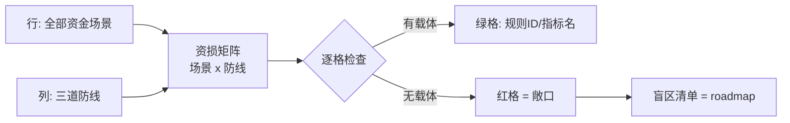
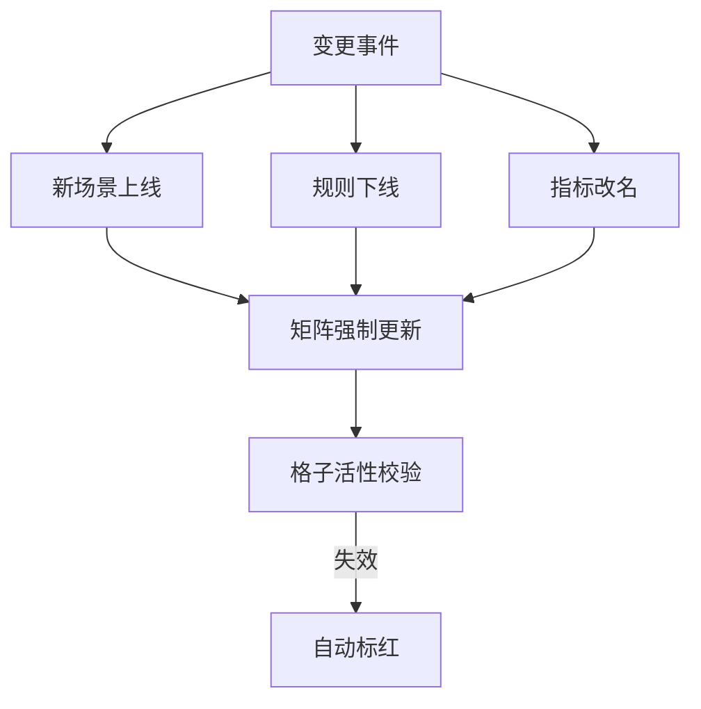

# 资损场景全景与资损矩阵：每个场景都要有防线覆盖

> 「防资损做得好不好」不是一个感觉题，是一道覆盖题：**把全部资金场景列出来，逐格回答「这条防线接得住吗」**——接不住的格子就是定时炸弹。资损矩阵是防资损体系的底座设计，这一篇讲它的建模方法与落地模板。

## 一句话摘要

资损矩阵 = **业务场景 × 资损类型 × 防线的二维覆盖表**：行是全部资金场景（放款/扣款/退款/计息/分账/汇率…），列是三道防线，每格填「靠什么覆盖」（规则 ID / 对账指标 / 冲正手段）或标红「无覆盖」。矩阵的两个用途：**建设时找盲区**（红格清单即 roadmap）、**变更时做影响评估**（新场景上线前必须入矩阵）。

## 🎯 本文核心

**核心机制一句话**：资损矩阵把「防资损」从经验驱动变成覆盖驱动——全场景清单 × 逐格防线的核对表，红格 = 未防控的资损敞口。

**机制链**：场景盘点（枚举全部资金动账点）→ 类型标注（资金类/计算类）→ 逐格布防（三防线各格填覆盖手段）→ 红格治理（盲区清单进 roadmap）→ 变更联动（新场景先入矩阵再上线）。上下游：上游是业务架构（动账点清单的来源），下游是规则中心与对账指标（格子里填的东西的真实载体）。

## 典型使用场景（矩阵怎么建：四步）

**Step 1：枚举动账点**。扫全链路找「金额变化的地方」：下单支付、退款、提现、放款、还款、计息、分账、调价、营销补贴、赔偿打款……工程化手段：全局搜索账户余额表的所有写入方（`UPDATE ... SET balance` 的调用方清单）+ 资金流水量表核对，双口径取并集。

**Step 2：逐点标类型与敞口**。每行标注：资金类/计算类、单笔最大错账金额、变更频率——敞口 = 上限 × 频率，决定防线强度。

**Step 3：逐格填防线**。每个场景 × 三道防线各填什么：

| 场景 | 资金类敞口 | 事前拦截 | 事中预警 | 事后追回 |
|---|---|---|---|---|
| 放款 | 高（单笔上限 50 万） | 幂等键 + 限额规则 R-101 + 状态机校验 | 放款流水 vs 借据 准实时对账（分钟窗口） | 冲正 + 提前结清工单 |
| 退款 | 高 | 退款幂等 + 原单金额上限校验 | 退款笔数金额 日切核对 | 反向扣款协议 + 客服工单 |
| 计息 | 中（单笔小批量面大） | 利率配置双人复核 + 影子计算 | 计息抽样 100% 复算（日批） | 差额补退 |
| 营销补贴 | 中 | 预算硬顶 + 领取频次规则 | 补贴发放 vs 预算 实时比对 | 活动下线 + 追回 |
| 汇率换汇 | 高 | 汇率快照有效期校验 | 换汇价格 vs 牌价 偏差告警 | 差错台账 + 做市商冲抵 |

**Step 4：红格治理**。任何一格空着 → 进盲区清单，排期布防；**新场景上线的前置检查项就是「入矩阵」**——没有矩阵行的场景不允许上生产。

## 💡 实战提示

- 💡 矩阵不是一次建成的：第一版只求「行全」（场景列全），格子允许填「待建设」——**诚实的红格好过虚假的全绿**。
- 💡 矩阵要随组织演进：每季度评审一次（新场景/规则变更/对账指标变更三事件强制触发更新），谁拥有矩阵 = 谁拥有资损 roadmap，通常归稳定性或风控团队，但**每个格子的覆盖手段由业务研发团队自认领**。

## 与其他覆盖模型的区别（跨域辨析）

- 与**测试覆盖**的区别：测试覆盖问「代码分支测了吗」，资损矩阵问「资金场景防线接住了吗」——测试覆盖 protect 代码正确性，矩阵 protect 业务正确性，两者互补不可替代；
- 与**风险清单（risk register）**的区别：风险清单是「可能发生什么」的定性列表，资损矩阵是「怎么防、防住了没」的定量作战图——矩阵每格必须有具体载体（规则 ID/指标名），不接受「已关注」这种空话。

## 常见误区

- ❌「矩阵建完就完了」——矩阵是活文档：规则下线、指标改名、场景下架都让格子悄悄变红；无变更联动机制的矩阵三个月后就是废纸；
- ❌「只列成功路径的场景」——资损最爱藏在**异常分支**：超时重试、部分失败、回调乱序、对账差错处理本身——场景枚举必须含异常流（枚举手段见 Step 1）；
- ❌「格子填了就等于有覆盖」——格子里的规则 ID 可能没生效（规则中心配置错了）、指标可能断流（对账任务挂了）——**格子要定期演练验证**（专题层红蓝对抗篇展开），填格子≠接得住；
- ❌「矩阵只有稳定性团队看得懂」——业务语言建行（场景名用业务术语），工程语言填格——矩阵是业务与工程的共同作战图，只有一方看得懂就会脱节。

## 代价与边界

矩阵的维护成本随场景数线性增长（百场景级需要专人 + 自动化校验）——**量级三档的矩阵形态**：10w 档一张 Excel（几十行）+ 月度人审；千万档配置化管理（矩阵入库，规则/指标 ID 强关联，变更走工单）+ 季度评审；亿级档矩阵平台化（与规则中心/对账系统联动自动校验格子活性，断流自动标红）——**矩阵自身的「活性监控」在亿级档是刚需**：一张没人知道失效了的矩阵比没有更危险。

## 演进视角

矩阵形态随量级的演变与三道防线同步：从「Excel 人肉维护」到「配置化关联」再到「平台化活性校验」——演进的分界点同样是量级跨档（日交易量与变更频率），且**矩阵成熟度通常落后防线成熟度一个身位**：先有零散防线、再有矩阵盘点、最后平台化——这个次序不可跳过（没有防线先建矩阵，格子里全是空的）。

## 你们可能会问

**Q1：场景枚举怎么保证不漏？**
双口径取并集：代码口径（余额表全部写入方 + 资金字段的全局搜索）+ 资金口径（账务侧的科目变动清单）——代码扫得出「程序化的动账」，资金口径兜住「历史遗留/人工调账」，两者交集外的新增点必须逐一甄别。

**Q2（追问）：为什么新场景上线必须先入矩阵，而不是上线后补？**
设计思想：矩阵的本质是**上线门槛**（gating）而非事后台账——事后补的矩阵永远在追变更，门槛化的矩阵让资损评审进入发布流程（与安全评审/容量评审并列），成本前置且不可绕过。为什么这么做？因为资损事故的返工成本（追回+客诉+监管）比上线前布防高一个数量级（篇 1 的取舍结论在这里制度化）。

**Q3：矩阵颗粒度多细合适？**
行到「业务场景 × 资金动作」粒度（放款-正常放款 / 放款-冲正，分开建行），不到代码接口粒度——太粗漏异常分支，太细维护不动。经验口径：中型支付平台 50-200 行（行业认知）。

## 开放问题

- 矩阵的「格子活性」自动校验（规则真的在生效吗/指标真的在流动吗）做到什么深度算够？主动探测（影子交易打一遍）成本高但真，被动探测（心跳与断流监控）便宜但会漏——混合比例是开放问题。

## 决策

**决策**：何时建矩阵——动账场景超过 10 个或团队超过 3 个业务线时（再晚红格治理成本指数上升）；何时平台化——场景破百或多团队共建时。怎么选归属：谁对资金正确性负最终责任，矩阵归谁——通常是稳定性/风控团队持有框架，业务团队认领格子。

## 自测三问

1. 资损矩阵的两个维度与红格含义？（场景×防线；红格=无覆盖的敞口）
2. 场景枚举的双口径是什么？（代码口径扫写入方 + 资金口径科目变动，取并集）
3. 为什么新场景必须先入矩阵？（矩阵是上线门槛不是事后台账——成本前置且不可绕过）

## 5W 速记卡

| 问题 | 答案 |
|---|---|
| What | 场景×类型×防线的二维覆盖表 |
| Why | 防资损从经验驱动变覆盖驱动，红格即 roadmap |
| 四步 | 枚举动账点 → 标类型敞口 → 逐格布防 → 红格治理 |
| 三档 | 10w Excel / 千万配置化 / 亿级平台化活性校验 |
| 边界 | 填格子≠接得住，要演练验证 |

## 🎯 核心带走

**核心带走**：资损矩阵 = 全场景 × 三防线的覆盖作战图——行全、格实、红格治理、变更联动四件事缺一不可；矩阵是上线门槛不是事后台账。**失效点**——只列成功路径、格子填了没验证、无变更联动、单方语言建表。金句带走：

> **没有进矩阵的场景，就是还没定价的敞口——资损矩阵是资金系统的「完税证明」。**

> **诚实的红格好过虚假的全绿——矩阵的价值在暴露盲区，不在汇报好看。**

## 📌 数据与事实声明

- 矩阵方法与三道防线为业界通行模式归纳（公开技术分享）；「50-200 行」「敞口公式」为行业认知经验值；场景示例为通用化构造，不含真实公司数据。

## 📚 参考资料

- 篇 1《什么是资损》（分类与三防线基础）
- 特性层《资损规则中心》《对账引擎》（格子里填的载体的机制实现）
- 本仓库稳定性主篇（矩阵在「事前防线」中的位置）
