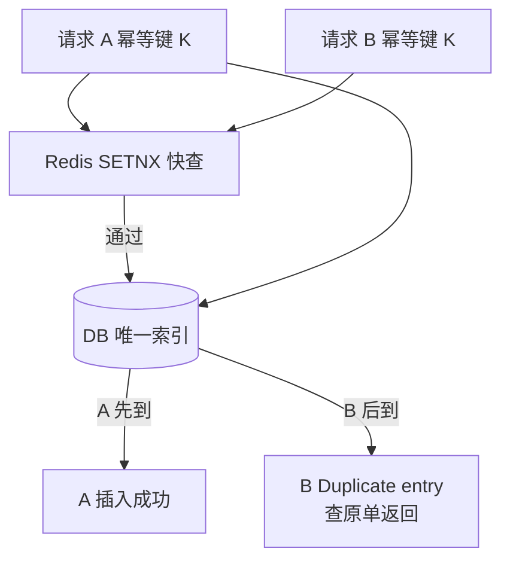
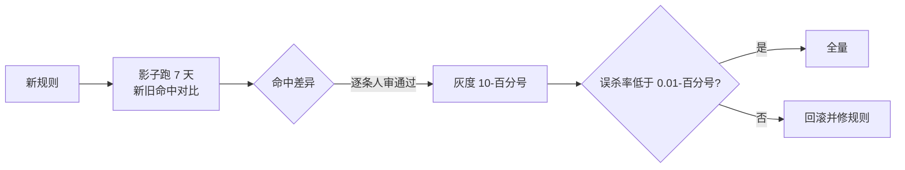

# 事前拦截：幂等键与规则中心的落地方案

> 事前拦截是三道防线里唯一「不让损失发生」的一道——它由两件武器构成：**幂等键**（同一笔操作只执行一次）与**规则中心**（不合规的操作直接拒绝）。这一篇给到参数怎么配、代码怎么写、接入步骤怎么走。

## 一句话摘要

事前拦截的两件武器：**幂等键**解决「重复执行」（重试链路里的重复放款/重复退款），**规则中心**解决「越界执行」（超限额/黑名单/状态机非法跳转）。幂等键的正确姿势是「**业务唯一键 + 数据库唯一索引兜底**」——应用层查重只是优化，唯一索引才是最后防线。

## 🎯 本文核心

**核心机制一句话**：事前拦截 = 幂等（同一请求一次生效）+ 规则（请求必须合法），两者都在主链路前置执行——宁可错拒（可重试），不可错放（资损）。

**机制链**：请求带业务幂等键 → 查重（Redis 快查 + DB 唯一索引兜底）→ 规则中心决策（限额/名单/状态机）→ 通过则执行。这条链是交易主链路的守门段，上下游边界清晰：幂等与规则属于「请求合法性」，账务正确性由防线二核对——守门段不替账务做对的事，只拦住明显不对的请求。

## 典型使用场景

```sql
-- 幂等键的最后防线：唯一索引（表设计）
CREATE TABLE loan_order (
  id BIGINT PRIMARY KEY,
  request_id VARCHAR(64) NOT NULL COMMENT '幂等键=请求方业务单号',
  amount_cent BIGINT NOT NULL COMMENT '金额统一分',
  status VARCHAR(16) NOT NULL,
  UNIQUE KEY uk_request_id (request_id)      -- 重复请求直接 Duplicate entry
);
```

```java
// 幂等键处理的标准三步（应用层）
public Result loan(LoanRequest req) {
    try {
        return loanMapper.insert(req);                    // 1. 直接插入（唯一索引拦截）
    } catch (DuplicateKeyException e) {
        return Result.of("处理中/已处理",                  // 2. 命中重复 → 查原单返回
                loanMapper.selectByRequestId(req.getRequestId()));
    }
    // 3. 不做「先查后插」——查与插之间的并发窗口正是重复放款的来源
}
```

**关键参数表**（幂等与拦截的三档配置）：

| 参数 | 默认/说明 | 10w 档推荐 | 千万档推荐 | 亿级档推荐 |
|---|---|---|---|---|
| 幂等键来源 | 请求方业务单号 | 单号即键 | 单号+场景码 | 单号+场景码+子操作 |
| Redis 查重 TTL | — | 24h | 48h | 72h（对账完成前必须保留） |
| 规则执行 RT 预算 | — | 100ms 内 | ≤50ms | ≤20ms（本地缓存规则） |
| 规则变更生效 | 即时全量 | 即时 | 灰度 10%→100% | 灰度 + 影子对比 + 自动回滚 |



## 机制：为什么唯一索引是最后防线

「先 SELECT 再 INSERT」的查重存在**并发窗口**：两个相同请求同时查（都查到「不存在」）→ 同时插入 → 双放。唯一索引由数据库在写入时点原子判重，**并发窗口为零**——这就是「查重只是优化、索引才是防线」的原理。Redis SETNX 查重可以挡在索引前减负，但 Redis 过期/主从切换都可能漏——**Redis 是加速器，DB 唯一索引是裁判**，两者职责不可互换。

规则中心的机制同理要分「决策点」与「配置源」：决策在本地缓存（RT 达标），配置在中心（变更可控）——配置推送延迟窗口内的规则新旧不一致，靠**灰度比例**控制爆炸半径（千万档起步必须灰度，亿级档加影子对比：新规则跑一遍但不生效，对比命中差异）。

## 💡 实战提示

- 💡 幂等键必须是「业务唯一键」（请求方单号），不是 UUID——重试时 UUID 每次新生成，等于没做幂等；单号才是把「同一次业务意图」串起来的线。
- 💡 规则中心改规则前先跑「影子对比」：新旧规则对近 7 天流量各跑一遍，命中差异逐条人审——规则误杀的代价是交易损失，规则漏放的代价是资损，两种错误都要在上线前看见。

## 与其他拦截手段的区别（跨域辨析）

- 与**网关限流**的区别：限流拦「量」（保护系统），事前拦截拦「非法请求」（保护钱）——限流放过的请求仍要过规则，两者串联不替代；
- 与**风控拦截**的区别：风控判「请求者可不可信」（外部人），资损规则判「请求本身合不合法」（系统行为）——共用决策设施，规则集分治（篇 1 边界结论的落点）。



## 常见误区

- ❌ 「先查后插就是幂等」——并发窗口挡不住同时到达的重复请求，唯一索引才是防线；
- ❌ 「加了 Redis SETNX 就安全」——TTL 过期、主从切换丢键都会漏放，它只是减负层；
- ❌ 「规则越多越安全」——规则冲突与叠加误杀呈指数增长，规则集要有冲突检测与定期瘦身（千条级规则无冲突检测 = 事故预备）；
- ❌ 「幂等键只加在入口」——重试链路的**每一跳**（调用方/网关/MQ 消费）都要透传同一业务键，中间任何一跳自造键都会重新引入重复。

## 代价与边界

事前拦截的直接代价是**误杀**（合法请求被拒 = 交易损失）与**RT 占用**（规则决策在主链路上，预算见参数表）。边界：幂等只防「同一意图的重复」，不防「不同意图的错误」（两笔真实存在的不同放款请求，各自合法地放错钱）——后者要靠规则与防线二。事前拦截的全部规则都是**已知错误的模式化**——未知错误模式拦不住，这就是必须有防线二（发现）的原因。

## 接入步骤（新交易接口的事前拦截清单）

1. **前置**：确认业务单号生成规则（全局唯一且重试不变）；金额字段统一单位（分）；
2. **表设计**：幂等键唯一索引 + 状态机字段（禁止非法跳转由状态机约束）；
3. **代码**：按「直接插入 + DuplicateKey 查原单」模式实现（见上文代码），重试链路全跳透传业务单号；
4. **规则接入**：限额/名单/频次规则在规则中心登记（规则 ID + 影子跑 7 天 → 灰度 10% → 全量）；
5. **验证点**：并发重放同一请求 100 次，确认仅一笔生效；规则误杀率 < 0.01%（行业认知基准）后全量；
6. **回退**：规则中心支持单规则秒级禁用（开关化），代码级拦截回退需发版——**规则尽量配置化，就是为了回退不依赖发版**。

## 演进视角

拦截手段的演变：硬编码 if（改动靠发版）→ 配置化规则中心（分钟生效）→ 决策引擎化（多维实时决策 + 影子对比）——每一步演变都在缩短「发现错误规则 → 修正」的周期，亿级档的最后形态是「规则即数据、变更即灰度、对比即验证」。

## 你们可能会问

**Q1：幂等键应该存多久？**
至少覆盖「最长重试窗口 + 对账周期」——TTL 短于对账周期，窗口内重复请求会绕过查重直达账务；推荐值见参数表（72h = 3 天对账安全余量）。

**Q2（追问）：规则中心的规则冲突怎么检测？**
静态层面：规则编译期做条件交集检测（两条规则对同一请求可同时命中且动作矛盾即报）；动态层面：影子环境全量回放近 N 天流量，命中数突变的规则单独评审——静态保结构、动态保行为。

**Q3（再追问）：为什么规则变更必须灰度而不允许直接全量？**
规则是「错的判定标准」——它自己错了就把合法交易全拦了（一次费率规则全量误发，拦截率从 0.01% 跳到 30%，交易直接腰斩的行业案例不少见）。灰度 10% 的爆炸半径 = 最多损失 10% 流量的转化，这是可承受的试错成本。

## 开放问题

- 规则的「影子对比」对计算类资损（如计息逻辑变更）只能对比命中数，无法对比正确性——规则正确性的机器验证（性质测试/形式化校验）能做到什么程度，是开放问题。

## 决策

**决策**：何时引入规则中心——规则超过 30 条或变更频率超过月 2 次（硬编码的发版成本开始压倒建设成本）；何时上影子对比——规则量破百或涉及资金计算类规则。怎么选幂等方案：有 DB 唯一索引场景一律「插入兜底」；纯异步链路（MQ）用「消费端幂等表」同构实现。

## 自测三问

1. 为什么「先查后插」不防重复？（并发窗口——两请求同时查都不存在，同时插入）
2. 幂等键为什么必须用业务单号不能用 UUID？（重试时 UUID 变化，无法串起同一业务意图）
3. 规则变更为什么必须灰度？（规则自己可能错——灰度控制误杀的爆炸半径）

## 5W 速记卡

| 问题 | 答案 |
|---|---|
| What | 幂等键（唯一索引兜底）+ 规则中心（灰度决策） |
| Why | 唯一「不让损失发生」的防线 |
| 参数 | Redis TTL 72h / 规则 RT ≤50ms / 灰度 10% 起步 |
| 步骤 | 表设计 → 代码三步 → 规则影子 7 天 → 灰度全量 |
| 边界 | 防重复不防不同意图错误；Redis 是加速器 DB 是裁判 |

## 🎯 核心带走

**核心带走**：幂等 = 业务单号 + 唯一索引兜底（查重只是优化）；规则 = 配置化 + 灰度 + 影子对比；重试链路每一跳透传同一业务键。**失效点**——UUID 当幂等键、Redis 当裁判、规则全量直发、中间一跳自造键。金句带走：

> **幂等的最后防线是数据库的唯一索引，不是任何语言的 if——并发窗口里，只有原子判重不说谎。**

> **规则的每一次变更都是一次可能的资损——灰度不是流程要求，是数学上的爆炸半径控制。**

## 📌 数据与事实声明

- 幂等实现模式、规则中心灰度机制为业界通行实践（公开技术分享归纳）；RT 预算、TTL、误杀率基准为行业认知量级；「拦截率跳变」案例为行业化用叙事。

## 📚 参考资料

- 篇 1《什么是资损》（三道防线定位）、篇 2《资损矩阵》（规则 ID 是格子的载体）
- 特性层篇 2《资损规则中心》（决策引擎的实现机制）
- 本仓库 distributed-id 系列（单号生成规则）
