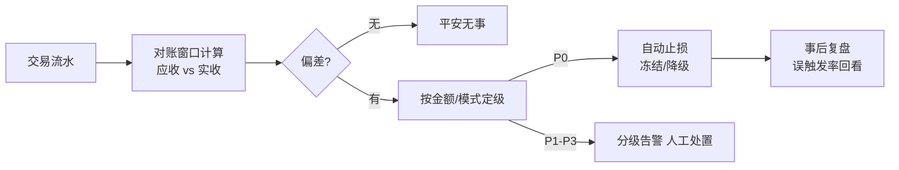
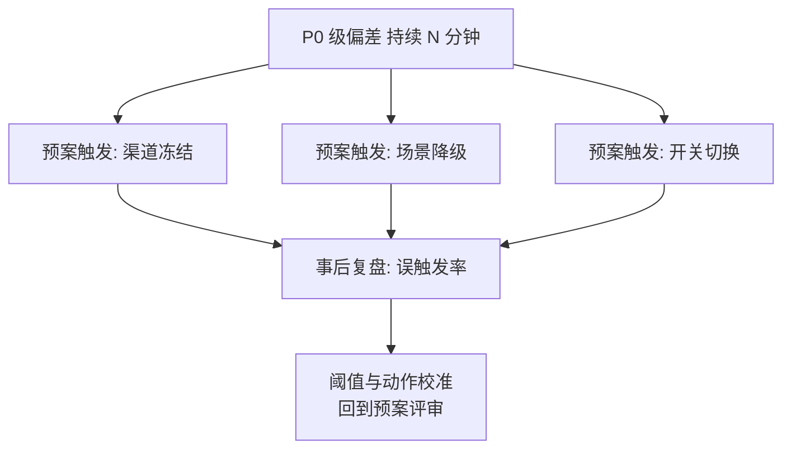

# 事中预警：对账发现与告警止损的联动

> 防线二回答两个问题：**错了吗（发现）**和**怎么办（止损）**——发现的时效决定损失的规模，止损的速度决定损失是否扩散。这一篇讲「对账发现 → 告警分级 → 止损动作」的联动链路，参数与三档配置全给。

## 一句话摘要

事中预警 = **对账发现（应收 vs 实收的偏差计算）+ 告警分级（按金额与置信度分级通知）+ 止损动作（冻结/降级/熔断的预案化执行）**三段联动。设计的第一原则：**发现和止损都不依赖人**——人是链路里最慢的环节，亿级档的止损必须预案化自动触发，人工只做审批与复盘。

## 🎯 本文核心

**核心机制一句话**：预警链路 = 偏差检测（对账）→ 分级告警（P0 资损级到 P3 提示级）→ 预案执行（止损动作与触发条件预先绑定）。

**机制链**：交易流水 → 对账窗口计算偏差 → 偏差分类（单边/金额不符/状态不符）→ 按偏差的金额级与模式定级 → 告警 + 预案触发 → 止损 → 人工确认与复盘。上下游：上游是防线一的漏网请求，下游是防线三的追回——预警链路的 SLA 决定「资损敞口 × 发现延迟」这个乘积的大小。

## 典型使用场景（偏差的三种形态与处置）

| 偏差形态 | 例子 | 置信度 | 默认动作 |
|---|---|---|---|
| **单边**（一方有一方无） | 支付成功但账务无流水 | 高（几乎必是错） | P0 告警 + 自动冻结该渠道/场景 |
| **金额不符** | 应收 100 实收 99.99 | 高 | P0/P1（按累计金额）+ 暂停对应规则 |
| **状态不符** | 应成功实失败 | 中（可能是延迟） | P1 + 延迟复核（15 分钟后再比对） |

**告警分级参数表**：

| 级别 | 判定标准 | 通知方式 | 响应时效 |
|---|---|---|---|
| P0 | 累计偏差 > 阈值（如 1 万元）或单边率 > 0.01% | 电话 + 自动止损执行 | 立即（自动化） |
| P1 | 单笔大额偏差 / 置信度中 | IM 群 + 值班响应 | 5 分钟 |
| P2 | 小额零星偏差 | IM 群 | 当日 |
| P3 | 对账系统自身异常 | 邮件 | 次日 |

## 机制：为什么发现必须「旁路」，止损必须「预案化」

**旁路发现**（篇 1 的设计决策落地）：对账引擎读的是流水副本（binlog/MQ），主链路零侵入——对账系统宕机的后果是「发现延迟」而非「交易失败」，故障域隔离。

**预案化止损**：止损动作（渠道冻结/场景降级/开关切换）与触发条件（P0 级偏差持续 N 分钟）**预先绑定并演练过**——事故时按预案自动执行，人工审批事后补。为什么不等人审批：亿级档每分钟偏差可达数十万级（行业认知量级），审批链路的分钟级延迟 = 直接放大损失；预案误触发的代价（错误冻结渠道 minutes）远小于延迟止损的代价。**止损的每次自动触发都强制事后复盘**——误触发率进预案的健康指标。

## 💡 实战提示

- 💡 告警必须带「处置链接」（工单/冻结开关/对账明细直链）——凌晨三点的 P0 告警，多一次「找入口」就多一分钟损失；
- 💡 「延迟复核」是状态不符类的降噪关键：先等 15 分钟再报 P1，能砍掉一半以上的延迟型误报（跨系统状态同步天然有时差）。

## 与防线一、防线三的区别（跨域辨析）

- 与**事前拦截**的区别：拦截在请求前置拒（错误不进账），预警在发生后报（错误已进账）——防线二的全部价值在于「早发现」，发现的每一分钟都在放大敞口；
- 与**事后追回**的区别：追回处理「已定型的错误账」，预警的止损处理「正在扩散的错误」——止损越快，进入追回池的量越小。

## 常见误区

- ❌ 「告警发了就算预警做了」——告警没人响应等于没发；分级必须绑定响应 SLA 与升级机制（P1 五分钟无响应自动升 P0）；
- ❌ 「止损动作临场决定」——临场决策在事故压力下必然又慢又错；预案库（场景 × 触发条件 × 动作）要日常演练（专题层红蓝对抗）；
- ❌ 「对账指标越多越好」——无差异基线的指标是告警噪音源；每个指标要有预期偏差率与静默规则，**告警的敌人是狼来了**；
- ❌ 「自动止损很危险所以不做」——不做自动止损的危险更大；用「白名单场景逐步放开 + 误触发率监控」管理风险，而不是放弃自动化。

## 代价与边界

预警链路的成本：对账窗口的存储与计算（亿级档是专门引擎，特性层篇 1 展开）、告警系统的运维、预案的演练成本。边界：预警只能发现「有比对基准的偏差」——基准本身错了（应收算错）发现不了（篇 1 同源错误结论在防线二的投影）；止损的边界是「止损动作本身有副作用」（冻结渠道伤及无辜交易），预案要限定爆炸半径（按渠道/场景/商户粒度冻结，不做全站级一键冻结）。

## 接入步骤（新场景接入预警链路）

1. **前置**：场景已在资损矩阵登记（篇 2），确认「应收」与「实收」两套流水的生成方与时效；
2. **指标定义**：为场景定义偏差指标（笔数偏差率/金额偏差率）+ 预期基线 + 分级阈值（参考参数表，按敞口校准）；
3. **告警接入**：分级路由（P0 电话、P1 IM）+ 处置链接必填；
4. **预案绑定**：P0 级偏差绑定止损预案（冻结粒度到渠道/场景），预案先演练后启用；
5. **验证点**：注入测试偏差（灰度环境模拟单边 10 笔），验证「发现 → 分级 → 告警 → 止损」全链路 < 5 分钟；
6. **回退**：自动止损按场景开关化，误触发即关并复盘。

## 演进视角

预警的演变：T+1 报表人眼扫 → 定时任务 + 邮件 → 准实时对账 + 分级告警 → 流水级核对 + 预案化自动止损。每次演进的动因都是「发现延迟」与「敞口增速」的赛跑——量级跨档（日单量上千万）时，人肉响应必然出局，自动化从「可选项」变成「及格线」。

## 你们可能会问

**Q1：对账窗口设多长？**
窗口 = 「平衡发现时效与数据就绪率」：窗口太短，流水未到齐（误报单边）；太长，发现延迟大。千万档常见 5-15 分钟窗口 + 滚动重试未达批次（参数见特性层篇 1 的引擎详解）。

**Q2（追问）：偏差阈值怎么定才不狼来了？**
阈值 = 基线偏差率 × 安全系数，且随数据滚动校准——上线首周用「只告警不处置」的影子模式收集真实偏差分布，再定 P0/P1 阈值。拍脑袋阈值是告警狼来了的第一来源。

**Q3（再追问）：为什么 P0 就直接自动止损，不先人工确认？**
「P0 判定标准」本身已是人工预先审批过的决策（阈值与动作在预案评审时确认）——自动止损不是机器临场决策，是**人的决策提前到预案期**。不理解这一点就会把自动化误解为失控。

## 开放问题

- 偏差「置信度」的模型化（哪些偏差模式可以自动判为延迟型、哪些必须 P0）目前靠规则枚举，机器学习分类的误判成本在资损场景如何量化，尚无成熟公开实践。

## 决策

**决策**：何时从「人肉预警」升级「自动止损」——日交易量过千万，或单场景敞口（单笔上限 × 频率）让分钟级延迟损失超过误冻结损失时。怎么选首个自动止损场景：选「偏差置信度高 + 止损副作用小」的场景（如单渠道偏差冻结该渠道）先行试点，跑出误触发率数据再扩大。

## 自测三问

1. 偏差三形态与默认动作？（单边高置信自动冻结 / 金额不符暂停规则 / 状态不符延迟复核）
2. 为什么发现必须旁路？（故障域隔离——对账挂了只损失时效不损失交易）
3. 自动止损的决策是谁做的？（预案期的人——阈值与动作预先审批，机器只是执行）

## 5W 速记卡

| 问题 | 答案 |
|---|---|
| What | 对账发现 + 分级告警 + 预案化止损的联动链 |
| Why | 发现时效 = 敞口 × 延迟的乘积项 |
| 分级 | P0 电话+自动止损 / P1 五分钟 / P2 当日 |
| 纪律 | 告警带处置链接；止损预案先演练 |
| 边界 | 防不了同源错误；冻结粒度控制爆炸半径 |

## 🎯 核心带走

**核心带走**：预警链路三段（偏差检测 → 分级告警 → 预案止损）——发现靠旁路对账、分级靠金额与置信度、止损靠预案化自动执行。**失效点**——告警无响应 SLA、阈值拍脑袋、临场决策、全站级一键冻结。金句带走：

> **预警链路的每一分钟延迟，都在给资损敞口乘一个更大的系数——人是链路里最慢的环节，预案是把人的决策提前。**

> **自动止损不是机器接管决策，是把决策从凌晨三点挪到从容的评审会——预案期定好，事故期只按按钮。**

## 📌 数据与事实声明

- 告警分级、预案化止损、影子模式校准为业界通行实践（公开分享归纳）；「亿级档分钟偏差数十万」「P0 阈值 1 万元」等为行业认知示例值，随业务敞口校准。

## 📚 参考资料

- 特性层篇 1《准实时对账引擎》（发现段的机制实现）
- 专题层《资损预案演练与红蓝对抗》（预案的验证方法）
- 本仓库稳定性系列（止损与熔断降级的关系）
