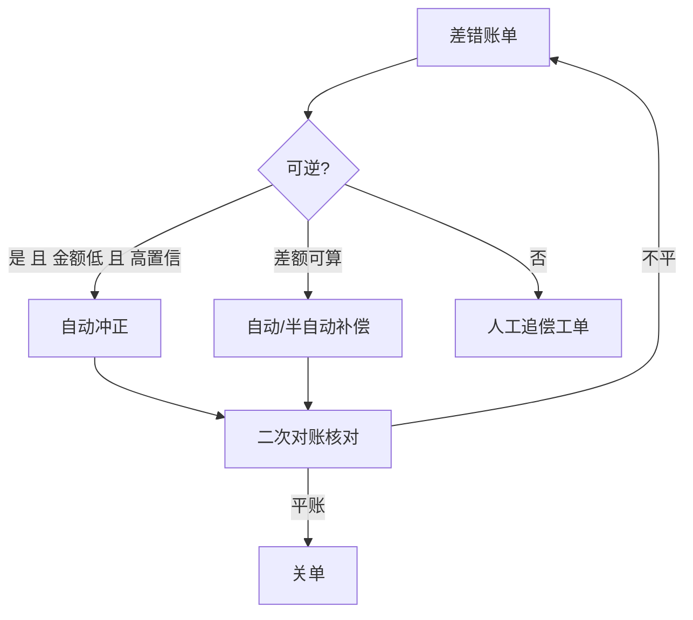
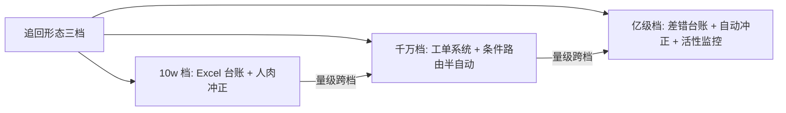

# 事后追回：冲正、补偿与追回的边界

> 防线三是兜底——但它不是「想办法把钱要回来」这么简单：**每一笔追回本身也是一次资金操作，做错就是二次资损**。这一篇讲追回的手段分层（冲正/补偿/人工）、自动化的授权边界、以及「追回率永远不是 100%」的现实主义账本。

## 一句话摘要

事后追回的三层手段：**冲正**（原交易的反向操作，实时性最高、适用面最窄——只能冲「原样可逆」的交易）、**补偿**（差额补退/补扣，处理「可计算的错误」）、**人工追偿**（工单/法务，处理无法自动化的尾量）。自动化的授权边界由**金额上限 + 置信度 + 可逆性**三条件共同决定，任一不满足就转人工。

## 🎯 本文核心

**核心机制一句话**：追回手段按「可逆性 × 可计算性」分层——原样可逆走冲正、差额可算走补偿、都不可走人工；自动化授权 = 三条件门槛（金额 ≤ 上限、置信度达标、操作可逆）。

**机制链**：差错账单（来自防线二）→ 分类（可逆性/可计算性/金额/置信度）→ 路由到冲正/补偿/人工 → 执行与二次核对 → 追回台账闭环。上下游：上游是防线二的偏差清单，下游是财务差错科目与对账闭环——**追回台账本身要进对账**，否则追回环节自己变成新的差错源。

## 典型使用场景（三层手段的适用矩阵）

| 手段 | 适用条件 | 例子 | 时效 |
|---|---|---|---|
| **冲正** | 原交易原样可逆、状态未终态 | 重复放款的原路冲回 | 实时（分钟级） |
| **补偿** | 错误可精确计算 | 多扣 9.9 元差额退回；少放款差额补放 | 小时～日 |
| **人工追偿** | 涉及外部方/用户已消费/金额超授权 | 用户已提现的多放款追偿 | 周～月 |

**自动化授权参数表**：

| 条件 | 阈值示例（行业认知量级） | 不满足时 |
|---|---|---|
| 单笔金额 | ≤ 1000 元自动 / 以上双人审批 | 转审批工单 |
| 置信度 | 对账偏差模式置信度 ≥ 0.99 | 转人工甄别 |
| 可逆性 | 原交易状态可冲正 | 转补偿或人工 |
| 用户侧状态 | 资金未消费/未提现 | 转协商追偿 |

## 机制：为什么追回必须是「二次核对过的操作」

冲正/补偿的本质是**再发一笔资金交易**——它同样可能重复、失败、算错（防线一二防的错误，追回操作自己都会犯）。所以追回链路的三条铁律：

1. **追回操作自身要幂等**：差错单号即追回幂等键，重试不双冲；
2. **追回后二次核对**：冲正完成 ≠ 账平——冲正后立即再进对账验证（冲正金额与原差错匹配、账户终态正确）；
3. **追回台账闭环**：每笔差错从发现到追回完成全状态留痕（发现 → 定性 → 路由 → 执行 → 核对 → 关单），关单条件是「对账确认平账」而非「执行了冲正」。

**追问：为什么不追求全自动追回？**——自动化授权的三条件门槛之外还有**业务副作用**：冲正一笔用户已消费的放款会引发客诉与舆情，自动执行的「技术正确」可能造成「业务灾难」。全自动的上限由「技术可逆」与「业务可逆」的交集决定，交集之外永远留人工。

## 💡 实战提示

- 💡 追回的时效窗口要管理用户预期：跨日差额补偿涉及利息/收益重算，行业惯例 T+1~T+3 到账并主动通知——**主动赔付的通知文案让客诉率下降一个量级**（行业认知）。
- 💡 冲正接口必须与原交易同一幂等域设计（差错单号键），并且**限额独立评审**——自动冲正的限额放开是最容易被遗忘的审计项。

## 与「止损」的区别（跨域辨析）

- **止损**（防线二尾部）是「阻止继续错」——冻结渠道/降级场景，不做资金操作；
- **追回**（防线三）是「修正已发生的错」——每笔都是资金操作。止损要快（分钟），追回要稳（核对闭环）；止损的 KPI 是时效，追回的 KPI 是**追回率与二次差错率**的双重指标——只考核追回率会诱发野蛮冲正。

## 常见误区

- ❌ 「冲正了就平账了」——冲正后必须二次对账：冲正单与差错单匹配、账户终态正确，缺一步就是新差错；
- ❌ 「自动化率越高越好」——授权边界外的自动化 = 二次资损工厂；自动化率与二次差错率要一起看；
- ❌ 「追回台账可选」——监管与审计要求差错全生命周期可追溯（金融场景为硬性要求），台账缺失在检查中是整改项；
- ❌ 「追回只是技术问题」——跨日计息、用户已用款、心理账户（用户感知）都是业务问题；追回方案的评审必须有业务/客服参与。

## 代价与边界

追回的成本结构：**执行成本**（开发冲正/补偿能力）+ **人工成本**（工单甄别与外呼）+ **体验成本**（用户被打扰/信任受损）+ **资金成本**（追不回的核销）。边界：追回的天花板是「资金去向」——钱进了外部账户且已消费，技术侧无解，只剩协商与法务；这决定了事前拦截的价值不可替代（篇 1 的 10 倍成本结论）。

**三档的分档数字支撑**（行业认知量级）：10w 档月差错个位数，Excel 足够；千万档月差错百笔级，人工甄别吃掉一个全职人力——工单化触发；亿级档日差错可能上百笔，自动路由 + 冲正是唯一能追平发现速度的形态。

## 接入步骤（差错追回链路的最小可用建设）

1. **前置**：防线二的偏差清单已结构化（差错单号/场景/金额/置信度）；
2. **台账建设**：差错台账表（状态机：发现 → 定性 → 路由 → 执行 → 核对 → 关单），每状态留痕操作人与时间；
3. **路由规则**：按「可逆性/可计算性/金额/置信度」四条件路由（参数表），路由规则配置化；
4. **冲正/补偿能力**：复用原交易的支付通道与幂等设计（差错单号做键），限额单独评审；
5. **验证点**：演练一笔模拟差错走完「发现 → 自动冲正 → 二次对账 → 关单」全链路；追回台账与总账对平；
6. **回退**：自动路由可切「全人工」模式（开关化），追回能力故障不影响主交易。

## 演进视角

追回的演变：纯人工 Excel 登记差错 → 工单系统半自动 → 差错台账 + 条件路由 + 自动冲正。演进的每一档都在把「人工甄别」前移为「机器路由」，但**人工永远保留在授权边界外**——自动化程度的进步不改变「追回操作本身是资金操作」的风险本质。

## 你们可能会问

**Q1：追回率怎么定目标？**
分场景定：内部差错（同系统两账户间）追回率应接近 100%；流出场景（用户已提现）按行业认知 30%-70% 区间设定并单列——混在一个总指标里会掩盖结构性问题。

**Q2（追问）：为什么冲正要单独限额评审，不是跟着原交易限额走？**
冲正的资金流向与原交易相反，风控视角是「出金方向」——原交易限额管的是「放多少」，冲正限额管的是「自动收回多少」，两者风险性质不同；自动冲正限额失控等于无人审批的批量出金。

**Q3（再追问）：差错长期追不回怎么关单？**
设「核销」状态：满足条件（金额低于阈值 / 法务结论 / 账龄超限）后走核销审批，财务科目转损益——关单标准是财务口径不是技术口径，核销单依然全留痕。

## 开放问题

- 跨机构差错（与外部通道互有对错）的自动抵扣与净额结算，涉及多方对账协议标准化——行业层面的差错结算互联是长期开放问题。

## 决策

**决策**：何时建差错台账——第一笔资金类差错出现时（手工 Excel 起步）；何时自动化——月差错量 > 100 笔或人工甄别耗时超过一个全职人力（行业认知量级）。怎么选首批自动化手段：冲正先行（可逆性最明确），补偿次之（涉及计算规则），追偿最后（依赖外部协作）。

## 自测三问

1. 三层追回手段的适用条件？（原样可逆冲正 / 差额可算补偿 / 其余人工）
2. 自动化授权的三个条件？（金额上限 / 置信度 / 可逆性）
3. 追回关单的标准是什么？（对账确认平账 + 财务口径核销——不是执行了冲正就算完）

## 5W 速记卡

| 问题 | 答案 |
|---|---|
| What | 冲正/补偿/人工三层追回 + 差错台账闭环 |
| Why | 兜住防线一二的漏网，但追回本身是资金操作 |
| 铁律 | 追回幂等 / 二次核对 / 台账全留痕 |
| 授权 | 金额 + 置信度 + 可逆性三门槛 |
| 边界 | 追回率天花板 = 资金去向；技术无解走协商法务 |

## 🎯 核心带走

**核心带走**：追回按「可逆性 × 可计算性」分层路由，自动化授权三门槛，台账闭环 + 二次对账是铁律。**失效点**——冲正不做二次核对、自动化越权、台账缺失、只考核追回率。金句带走：

> **每一笔追回都是一笔新的资金交易——防线三没有豁免权，它要过防线一和防线二的所有检查。**

> **追回率的另一半是二次差错率——野蛮冲正的账，最后都记在客诉和监管上。**

## 📌 数据与事实声明

- 三层手段、授权三条件、台账状态机为业界通行实践归纳（公开分享）；追回率区间、人工量级阈值为行业认知；「10 倍成本」沿用篇 1 的认知标注。

## 📚 参考资料

- 篇 4《事中预警》（差错账单的来源）
- 特性层篇 4《止损与应急冻结》（止损与追回的分工）
- 财务差错处理与核销的通用会计惯例（公开资料）
