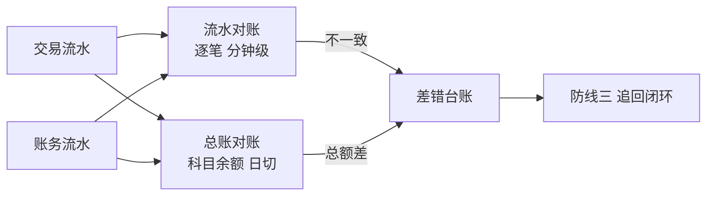
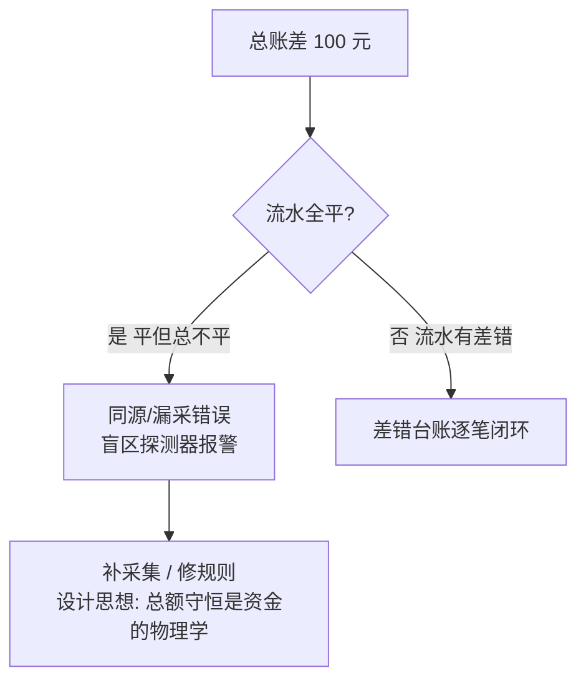

# 对账体系入门：流水、总账与差错的三层核对

> 对账是防线二的主武器，但它不是一个动作而是一套体系：**流水对账查「每笔对不对」，总账对账查「加起来对不对」，差错管理查「发现之后怎么办」**。三层各有各的对象、频率与工具，混为一谈就会建出「看着很全、漏得很准」的对账系统。

## 一句话摘要

对账体系三层架构：**流水对账**（交易系统 vs 账务系统的逐笔核对，分钟/小时级）、**总账对账**（科目余额与汇总数的核对，日切级）、**差错管理**（不一致记录的全生命周期闭环）。三层的关系是漏斗：流水层抓单笔错误 → 总账层兜累计错误 → 差错管理闭环处理——**任何一层缺失都会形成发现盲区**。

## 🎯 本文核心

**核心机制一句话**：对账体系 = 「逐笔核对抓个案 + 总额核对兜系统 + 差错闭环防流失」的三层漏斗，每层有自己的频率、容差与闭环标准。

**机制链**：两套流水采集（业务侧 + 账务侧）→ 流水核对（键匹配 + 金额状态比对）→ 不一致进差错 → 汇总核对（科目余额试算平衡）→ 差错台账（篇 5 的闭环）。上下游：上游是全量交易与账务流水（采集完整性是对账的生命线——**漏采的流水永远对不出来**），下游是防线二的告警与防线三的追回。

## 典型使用场景（三层各管什么）

| 层 | 核对对象 | 频率 | 抓什么错 |
|---|---|---|---|
| **流水对账** | 逐笔交易（单号键匹配） | 分钟～小时 | 单边/金额不符/状态不符 |
| **总账对账** | 科目余额、汇总数 | 日切 | 累计错误、漏采、批量计算错 |
| **差错管理** | 不一致记录 | 实时流转 | ——（闭环速度） |

**流水对账的匹配三要素**：单号（关联键）、金额（分单位精确比对）、状态（成功/失败映射）——三要素全对才算平；任何一要素不一致进差错。**总账对账的试算平衡公式**：期初余额 + 本期借方 − 本期贷方 = 期末余额，科目间勾稽（如「放款本金科目 = 借据明细汇总」）。

## 机制：为什么两层都要有

流水对账的盲区：**采集层漏了**（某类流水没接入对账）或**两边同错**（同源错误）——逐笔核对发现不了「系统性少了一类流水」。

总账对账的兜底逻辑：科目余额是**资金变动的守恒校验**（钱不会凭空出现/消失），漏采一类流水会让科目余额与明细汇总差一个总数——**总额差 = 盲区探测器**。行业惯例：日切总账试算 + 「明细汇总 = 科目余额」的勾稽校验，是流水层的最后保险。

## 💡 实战提示

- 💡 对账的生命线是采集完整性：新交易类型上线时「接入对账」要作为发布清单项——**没进对账的流水 = 对账盲区**，这是新场景资损的第一入口。
- 💡 日切对账必须处理「跨日切流水」：23:59:59 的交易在 00:00:01 落账，两天的对账文件里都可能有它——统一以「账务落账日」归属 + 次日重跑容错，否则切日差错永远清不完。

为什么总账层必须存在？——设计思想：资金满足守恒（不凭空生灭），科目余额是守恒律的表达式；流水层核对「路径正确性」，总账层核对「守恒正确性」，两层在机制上不可互相替代。

## 与其他核对手段的区别（跨域辨析）

- 与**监控指标**的区别：监控看「量级异常」（成功率掉了），对账看「逐笔正确性」（笔笔要平）——成功率 100% 不代表账平（金额全错但笔笔成功），两者互补；
- 与**审计**的区别：审计是抽样 + 追溯（事后定性），对账是全量 + 实时（事中发现）——对账结果同时是审计的证据链输入。

## 常见误区

- ❌ 「对上了就没事」——对账只能证明「两边一致」，不能证明「两边都对」（同源错误）；对账体系必须与事前规则（防线一）共存；
- ❌ 「差错处理是客服的事」——差错的技术定性（延迟型 vs 真实差错）是工程责任，差错积压是系统健康度指标（积压率要进大盘）；
- ❌ 「对账频率越高越好」——高频对账放大上游延迟型误报（数据未到齐），配置滚动重试与静默窗口（特性层篇 1 的窗口机制）比一味加频更有效；
- ❌ 「容差可以吸收小差异」——金额容差（如 ±0.01 元自动放行）必须有台账记录并设总量上限——容差的累计数本身就是资损敞口。

## 代价与边界

对账体系的成本：全量流水的存储（亿级档日增流水 TB 级，行业认知）、核对计算资源、差错运营人力。边界：对账只能核对「有双方流水的交易」——单边系统内部错误（如纯计算错，无第二方可比）要靠**复算类对账**（同数据不同实现再算一遍比对，如计息抽样复算）补充，这是对账体系里最容易被遗漏的第三形态。

## 接入步骤（新场景接入对账体系）

1. **前置**：场景已入资损矩阵（篇 2）；确认两侧流水都有唯一单号且金额单位一致；
2. **采集接入**：两侧流水进对账数据源（binlog/MQ 双通道），接入完整性监控（两侧笔数比对，差率阈值告警）；
3. **核对配置**：定义匹配键 + 比对字段 + 容差策略（默认零容差 + 台账记录）；
4. **差错路由**：不一致记录进差错台账（按防线三的路由规则分发）；
5. **验证点**：灰度环境注入三类模拟偏差（单边/金额不符/状态不符），验证全链路发现 < 对账窗口 × 2；
6. **回退**：对账任务故障不影响交易（旁路架构保证），回退即关闭该场景核对任务并告警。

## 演进视角

对账的形态演变：SQL 脚本 + Excel（10w 档）→ 定时任务 + 对账文件交换（千万档：文件对账，T+1 半日频）→ 实时流水核对引擎（亿级档：binlog 直采 + 流式核对，特性层篇 1 详解）。**文件对账 → 流水对账**的分界点是「发现时效要求」：当日发现（千万档）必须流水级，隔日发现（10w 档）文件够用。

## 你们可能会问

**Q1：对账先对哪一层，流水还是总账？**
先总账后流水是排障顺序（总额差先确认有错，再下钻流水定位）；建设顺序相反——先流水后总账（流水是原子能力，总账是汇总能力）。两者都建后并行运行，互为盲区保险。

**Q2（追问）：两边流水都是我们自己系统产生的，为什么还会不一致？**
因为产生流水的**路径不同**：交易系统在「业务成功」时记流水，账务系统在「账务处理成功」时记流水——中间隔着消息投递、重试、状态机推进，任何一环丢/重/乱序都会造成不一致。对账核对的就是这条异步链路的正确性。

**Q3（再追问）：容差设多少合理？**
默认零容差——金额是离散精确值，「差一分钱」也是错（可能是单位/精度 bug 的信号）；确有合理小数尾差的场景（分摊类）用「尾差归集科目」记账对平，而不是对账容差放行。**容差掩盖 bug，台账暴露 bug。**

## 开放问题

- 复算类对账（同输入双实现比对）的实现成本高（要维护两套计算逻辑），「用形式化验证替代双实现」在计息/清分这类确定性计算上是否成熟到生产可用，值得跟踪。

## 决策

**决策**：何时从文件对账升级流水对账——发现时效要求从「次日」提到「当日/分钟」（量级跨档或资损敞口升级）；何时建差错台账——差错量月超 50 笔或人工登记开始遗漏。怎么选采集通道：binlog 直采（低延迟强一致要求）vs MQ 订阅（解耦优先）——两者都上做双保险是亿级档标配。

## 自测三问

1. 三层对账各抓什么错？（流水抓单笔 / 总账兜累计与漏采 / 差错管闭环）
2. 为什么总账层不可省？（总额差是盲区探测器——漏采类错误流水层发现不了）
3. 金额容差的正确姿势？（默认零容差；合理尾差走归集科目，容差记录台账设上限）

## 5W 速记卡

| 问题 | 答案 |
|---|---|
| What | 流水/总账/差错三层核对体系 |
| Why | 单层必有盲区——漏采与同源错误需要分层兜底 |
| 匹配三要素 | 单号/金额/状态全对才平 |
| 接入 | 采集完整性监控是生命线 |
| 边界 | 防不了同源错误；单边错误靠复算类对账 |

## 🎯 核心带走

**核心带走**：三层漏斗（流水逐笔 / 总账兜底 / 差错闭环），采集完整性是生命线，切日与容差是两大坑。**失效点**——新场景不接对账、容差放行无台账、跨日切流水无归属规则、只建流水不做总账。金句带走：

> **对账对的是「两边一致」，不是「两边正确」——同源错误的最后防线，永远在规则与复算。**

> **没接入对账的流水，就是没接线的保险丝——新场景上线清单里，接入对账与功能测试同级。**

## 📌 数据与事实声明

- 三层对账结构、试算平衡公式、切日处理为会计与支付对账的通行实践（公开资料）；「TB 级日增流水」为行业认知量级。

## 📚 参考资料

- 特性层篇 1《准实时对账引擎》（流水核对层的引擎实现）
- 篇 5《事后追回》（差错台账的闭环机制）
- 会计学基础：试算平衡与科目勾稽（公开教材）
