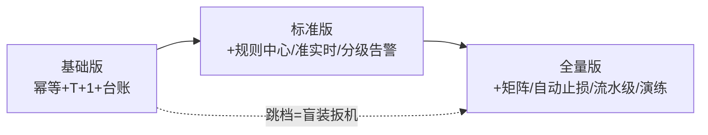
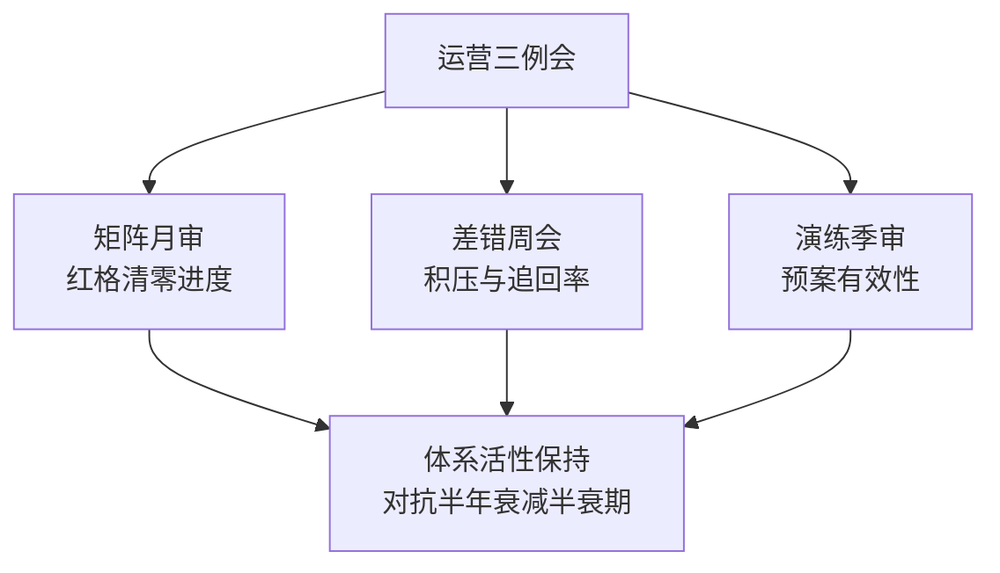

# 防资损方法论总结：从单点到体系的路线图

> 系列入门层收束：把「定义—矩阵—三道防线—对账体系」收成一张路线图——**你现在在哪一档、下一步建什么、怎么判断建成没**。这一篇是全系列的导航与自检清单。

## 一句话摘要

防资损体系的成熟度分三档（基础版 / 标准版 / 全量版），每档有明确的**构成清单与验收标准**：基础版 = 幂等 + T+1 对账 + 差错台账；标准版 = + 规则中心 + 准实时对账 + 分级告警 + 工单化追回；全量版 = + 资损矩阵 + 自动止损 + 流水级核对 + 演练常态化。**建设顺序不可跳档**——没有基础版的台账直接上自动止损，等于给不可信的差错清单装自动扳机。

## 🎯 本文核心

**核心机制一句话**：防资损建设 = 按「敞口 × 量级」选档，按「防线一 → 二 → 三」顺序补齐，按「矩阵红格」找下一步——路线由清单驱动，不由感觉驱动。

**机制链**：盘点敞口（篇 2 矩阵）→ 建基础版（拦得住 + 核得出 + 记得下）→ 量级跨档升标准版 → 再跨档升全量版 → 演练与复盘反哺。上下游：上游是业务量级与变更频率（档位的决定变量），下游是特性层（各机制的实现细节）与专题层（亿级实战）。

## 典型使用场景：三档成熟度自查表

| 能力项 | 基础版（10w 档） | 标准版（千万档） | 全量版（亿级档） |
|---|---|---|---|
| 幂等 | 关键接口唯一索引 | 全动账接口 + Redis 前置 | 全链路透传 + 演练验证 |
| 规则拦截 | 代码内 if（<30 条） | 规则中心 + 灰度 | 决策引擎 + 影子对比 |
| 对账 | T+1 SQL 脚本 | 准实时（分钟窗口） | 流水级 + 总账勾稽 + 复算 |
| 告警 | 邮件 | 分级 + SLA 升级机制 | P0 自动止损联动 |
| 追回 | Excel 台账人工 | 工单化 + 条件路由 | 差错台账 + 自动冲正（授权内） |
| 矩阵 | Excel 月审 | 配置化 + 季度评审 | 平台化活性校验 |
| 演练 | 无 | 半年度注入演练 | 常态化红蓝对抗 |

**验收标准示例（标准版）**：注入模拟偏差 10 分钟内被发现；P0 告警 5 分钟内有响应记录；全部动账接口幂等演练通过；矩阵无未排期红格。

## 机制：为什么不可跳档

每一档都依赖前一档的产出物：自动止损的扳机是差错清单（无台账 = 不可信扳机）；规则中心的规则来自矩阵红格（无矩阵 = 规则瞎建）；准实时对账的指标要人工对账期校准基线（无脚本对账史 = 无基线）。**跳档建设的隐性成本**：自动止损误触发一次的损失，往往超过前面所有「省下的」基础建设成本——演进史（篇 1）反复验证这个次序。

💡 实战提示：判断「该不该升档」的三个信号——日交易量跨百万、变更频率到日发、发现时效要求进分钟级。任一触发即启动升档评审，两个以上触发 = 必须升。

## 与稳定性体系的关系（跨域收束）

防资损是稳定性主系列的**专项纵深**（主系列「事前-事中-事后」三段论的资损投影）：三道防线与三段一一对应（事前拦截 ≈ 事前预防、事中预警 ≈ 1-5-10 响应、事后追回 ≈ 复盘闭环），但决策变量不同——稳定性按「影响用户面」决策，防资损按「资金敞口」决策。两套体系共用基础设施（告警/预案/演练），决策轴分开。

## 与「事后补救」的区别（为什么叫体系）

零散的资损处理（出了事冲正一笔）与防资损体系的区别在三点：事前有规则（不是全靠事后）、过程有台账（不是口口相传）、建设有路线（不是哪里痛堵哪里）——单点补救是游击战，体系是阵地战；从游击到阵地战的转折点就是「矩阵」的建立（篇 2）。

## 常见误区

- ❌ 「买了个对账产品就是有防资损了」——对账只是防线二的一层；幂等与规则（防线一）缺位时，对账只会源源不断产出追不回的差错；
- ❌ 「体系建成就可以降级维护」——防资损是**随业务变化持续对抗**的活体系：新场景、新规则、新通道都在制造新敞口；「降级维护」的体系在半年内悄然失效（矩阵不更新、规则过期）；
- ❌ 「用事故数量衡量体系好坏」——事故少可能只是运气（敞口期未暴露）；正确的度量是**过程指标**：矩阵覆盖率、对账及时率、告警响应 SLA 达成率、演练通过率；
- ❌ 「全套都建才是负责」——10w 档硬上全量版是过度建设；**与敞口匹配的最小完整体系**才是工程判断（篇 1 的取舍结论在建设层的落点）。

## 代价与边界

体系的成本结构：建设成本（各机制开发）+ 运营成本（差错运营/演练/评审的人力）+ 机会成本（防线误杀的业务损失）。边界：防资损体系的边界是「系统内资金正确性」——线下欺诈、内外勾结（人在系统外作恶）超出其防御域，那是风控与审计的地界。

## 演进视角

防资损在业界的演进从「财务对账电算化」到「技术资损防控体系」用了约二十年：驱动力量依次是交易量级（对账撑不住）、监管要求（留痕与报送）、事故复盘（每一起公开资损事件都在为行业补一块拼图）。**未来五年的方向**是自动化率的持续提升（自动止损扩面、规则影子验证普及）与「预期答案」的元校验（规则自身的正确性验证）——后者是篇 1 开放问题的行业级课题。

**为什么运营是体系的一半（设计思想）**：防资损体系的所有构件（规则/指标/矩阵）都是「对当下业务正确」的快照——业务变更让快照持续过期，运营例会就是快照的刷新机制。为什么这么设计而不是「自动刷新」？因为红格治理与规则修正是带判断的业务决策，自动化的部分（活性监控/断流标红）只能发现过期，不能替人决定怎么补。

## 你们可能会问

**Q1：先建哪道防线的哪个件？**
最优起步组合：幂等（唯一索引）+ T+1 对账脚本 + 差错 Excel 台账——三件套成本约一人周（行业认知），覆盖「拦得住常见错 + 核得出大问题 + 记得下每笔账」。

**Q2（追问）：体系建成后的运营节奏是什么？**
三个例会：矩阵月审（红格清零进度）、差错周会（积压与追回率）、演练季审（预案有效性）——**没有运营节奏的体系衰减半衰期约半年**（行业认知）。

**Q3（再追问）：怎么向管理层证明投入值得？**
用「敞口 × 概率 × 追回缺口」的期望损失模型对照建设成本——例如日千万笔档的一次未及时发现的单边错误，期望损失即可覆盖标准版建设的大半；同时呈现过程指标（覆盖率/时效达标率）作为「体系活着」的证据。

## 开放问题

- 防资损体系的「混沌化」（主动注入资金类故障验证防线）与稳定性混沌工程的方法论差异（资金故障不能真打生产），安全的资金故障注入形态是行业开放课题（专题层红蓝对抗篇讨论）。

## 决策

**决策**：何时启动防资损建设——动钱系统上线第一天建三件套；何时启动矩阵——动账场景超 10 个；何时升档——三个升档信号（量级/变更频率/时效要求）任一触发。怎么选建设顺序：防线一幂等 → 防线二对账 → 台账 → 规则中心 → 准实时 → 矩阵 → 自动止损——**这条顺序在绝大多数业务里都被验证为最短路径**（行业认知）。

## 自测三问

1. 三档成熟度的构成与验收？（基础三件套 / 标准+规则中心准实时 / 全量+矩阵自动止损；验收看清单与注入演练）
2. 为什么不可跳档？（每档依赖前档产出物——台账不可信则自动止损是盲装扳机）
3. 体系好坏的正确度量？（过程指标：覆盖率/及时率/SLA 达成率/演练通过率——不是事故数）

## 5W 速记卡

| 问题 | 答案 |
|---|---|
| What | 三档成熟度路线图与建设顺序 |
| Why | 敞口 × 量级决定档位，清单驱动建设 |
| 最短路径 | 幂等 → 对账 → 台账 → 规则 → 准实时 → 矩阵 → 自动止损 |
| 运营 | 矩阵月审 / 差错周会 / 演练季审 |
| 边界 | 系统内资金正确性；随业务持续对抗不降级 |

## 🎯 核心带走

**核心带走**：防资损 = 按档建设（基础/标准/全量）+ 顺序建设（幂等起步不可跳档）+ 持续运营（三个例会防衰减）。**失效点**——跳档装扳机、建成即降级维护、用事故数当 KPI、与敞口不匹配的过度建设。金句带走：

> **防资损体系不是一次工程，是一场随业务长大的持续对抗——建成只是起点，运营才是防线。**

> **最短路径只有一条：先拦得住、再核得出、再追得回、最后才自动化——顺序反了，自动化就是把扳机交给盲人。**

## 📌 数据与事实声明

- 三档成熟度、建设顺序、运营节奏为业界实践与行业认知的归纳；「半年度衰减」「一人周成本」为经验认知值；无引用未公开内部数据。

## 📚 参考资料

- 本系列篇 1-6（各机制的入门详解）
- 特性层《深入理解资损防控机制系列》（对账引擎/规则中心/监控大盘/止损冻结的实现）
- 专题层《资损防控亿级实战》（量级三档的实战深化）
