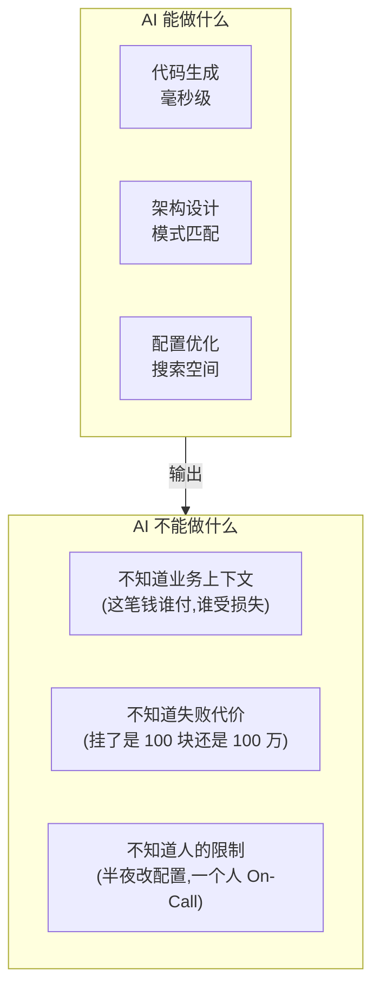
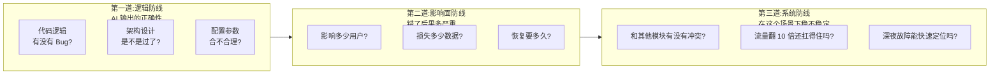
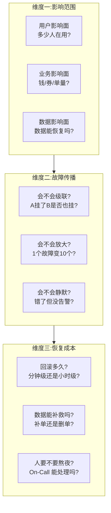
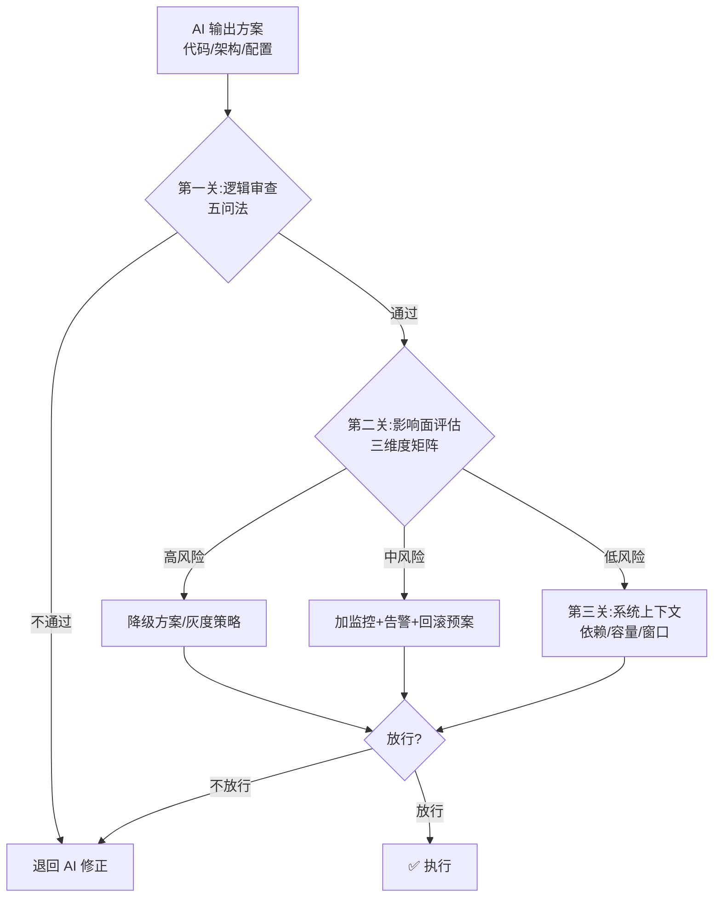
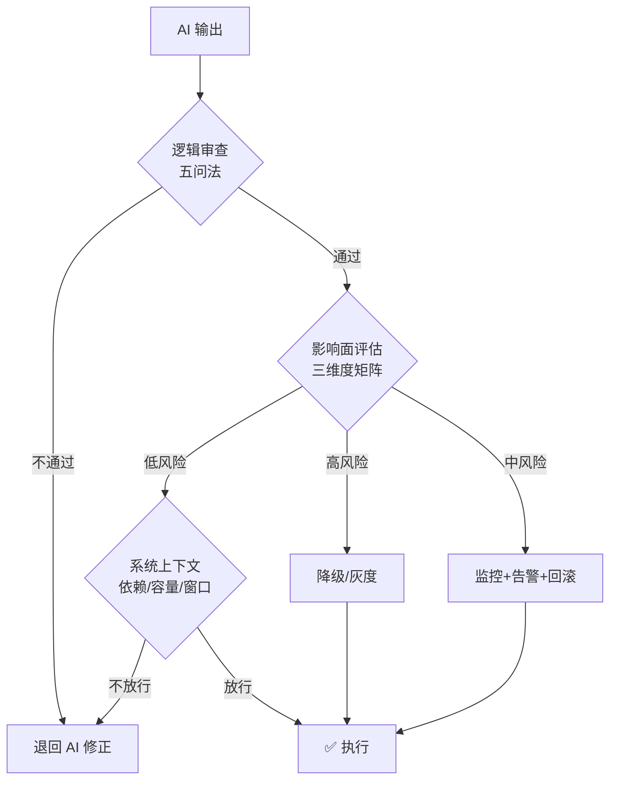

---
title: "AI 时代的风险评估与决策：人不该退场的三个理由"
type: overview
tags: [稳定性, AI治理, 风险评估, 决策, 架构, 人机协作]
date: 2026-09-18
wordCount: 6800
readMinutes: 20
---\n
# AI 时代的风险评估与决策：人不该退场的三个理由

> AI 写代码、画架构、配任务、做变更——速度远超人类。但 AI 没有"风险嗅觉"，不知道哪些事一旦出错就是事故。**人的核心能力从「写」变成了「审」：识别风险 → 评估影响面 → 决策是否放行**。本篇给出这个能力的具体框架。

## 一句话摘要

AI 时代的架构决策 = **AI 出方案 + 人做决策**。人不需要会写每一行代码，但必须能识别三类风险——**逻辑风险**（AI 是不是错了）、**影响面风险**（错了会丢多少人）、**系统风险**（这个决策在其他场景会怎么样）。

## 二、为什么人不能退场

### 2.1 AI 的三个先天缺陷



**三个缺陷对应的风险**：

| AI 缺陷 | 风险类型 | 真实案例 |
|---------|----------|----------|
| 不知业务上下文 | 逻辑风险 | AI 生成的扣减库存代码，并发下超卖 |
| 不知失败代价 | 影响面风险 | AI 推荐的索引优化，写入量放大 10 倍拖垮 DB |
| 不知人的限制 | 系统风险 | AI 配置的自动扩缩容，凌晨 3 点误扩 200 台 |

### 2.2 人必须守的三道防线



## 三、风险识别框架

### 3.1 逻辑风险：AI 是不是错了

AI 生成的代码/配置/架构，判断对错用**五问法**：

| # | 问题 | 命中即停 |
|---|------|----------|
| 1 | **边界条件**：空值/并发/超时，AI 考虑了吗？ | 没考虑 = 高风险 |
| 2 | **状态流转**：有没有漏掉的状态？ | 漏状态 = 必然 Bug |
| 3 | **数据一致性**：写操作有事务吗？ | 无事务 = 资损风险 |
| 4 | **错误处理**：失败后怎么回滚/补偿？ | 无补偿 = 数据不一致 |
| 5 | **可观测性**：挂了能知道吗？ | 无日志/监控 = 故障发现慢 |

**案例**：AI 生成的"优惠券发放"接口，五问发现：
- 边界：并发发券没去重 → 超发
- 状态：发券失败没重试状态 → 无法补偿
- 数据：发券和库存扣减不在同一事务 → 超发后无法回滚
- 错误：无降级策略 → 整个活动挂掉
- 观测：发券日志只记录成功 → 故障后无法排查

### 3.2 影响面风险：错了会怎样

逻辑风险回答"是不是错"，影响面风险回答"错多严重"。评估影响面用**三维度矩阵**：



**影响面评估表**（每个 AI 生成的变更必须填）：

| 变更项 | 影响范围 | 故障传播 | 恢复成本 | 风险等级 |
|--------|----------|----------|----------|----------|
| 优惠券发放接口 | 全量用户 | 级联（库存+券） | 小时级（对账+补发） | 🔴 高 |
| 缓存过期时间调大 | 读请求 | 不传播 | 分钟级（改回即可） | 🟡 中 |
| 索引字段新增 | 写入链路 | 不传播 | 分钟级（删索引） | 🟢 低 |

### 3.3 系统风险：放这个行还是不行

单点风险看完了，还要看**系统级风险**——这个决策在整体架构中稳不稳定。用**上下文三问**：

1. **依赖变了没有**：这个变更依赖的组件，它稳定吗？（AI 不会查上游组件的稳定性）
2. **容量还够吗**：这个变更加上流量增长，容量撑得住吗？（AI 不看你的容量台账）
3. **发布窗口合适吗**：现在是上线的好时机吗？（AI 不看业务日历和大促节奏）

## 四、决策流程

### 4.1 三步决策法



**每关过一关，打勾。三个全过才能放行。**

### 4.2 决策记录模板

每个 AI 生成的变更，决策人必须留痕：

```
## 决策记录：{变更名}
- AI 输出时间：{时间}
- 逻辑审查（五问）：{通过/不通过，哪一问未通过}
- 影响面评估：{范围/传播/恢复}
- 系统上下文：{依赖/容量/窗口}
- 决策：{放行/不放行}
- 理由：{一句话}
- 监控：{上线后盯什么指标}
- 回滚：{怎么回}
```

### 4.3 决策流程图



## 五、常见陷阱

| 陷阱 | 表现 | 怎么识别 |
|------|----------|----------|
| **"AI 都说好了"** | 不审查直接放行 | 看决策记录是否为空 |
| **"这应该没问题"** | 凭直觉不填影响面矩阵 | 影响面三列是否空白 |
| **"测试过了"** | 测试没覆盖边界条件 | 五问法第 1 问是否通过 |
| **"小改动没事"** | 小变更引发级联故障 | 系统上下文第 1 问依赖是否稳定 |
| **"晚上上线"** | 故障时没人响应 | 发布窗口是否在看业务日历 |

## 六、能力保持

AI 时代人不写代码了，但**风险评估能力必须练**。三个保持动作：

1. **每周审一次 AI 输出**：不看代码，看 AI 的逻辑漏洞——练"五问法"肌肉记忆
2. **每月做一次故障复盘**：AI 时代故障可能来自 AI 的盲区——练"影响面评估"直觉
3. **每季度做一次架构审视**：AI 累积的技术债会隐藏——练"系统风险"视角

**核心认知**：AI 是加速器，不是替代器。AI 让「写代码」变快，但「审代码」的责任更重了——因为你无法靠人肉逐行 review 来保证质量，你必须靠框架、靠检查清单、靠决策记录。

## 📌 数据与事实声明

- 写于 2026-09-18，基于 AI 辅助编码的业界实践（Copilot/Claude Code/Codex）
- 五问法是代码审查的通用框架，无特定来源
- 影响面矩阵为作者基于金融信贷场景的抽象，具体指标需按业务调整
- 事故案例为匿名化复述，不涉及具体公司/系统

## 📚 参考资料

- Google SRE：Error Budget 与变更管理
- 《Site Reliability Engineering》Ch. 15: Postmortem Culture
- OpenAI/Anthropic：AI Coding Agent 安全实践文档（公开版）