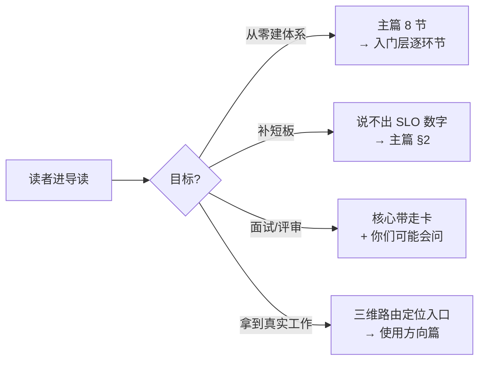
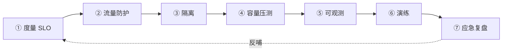
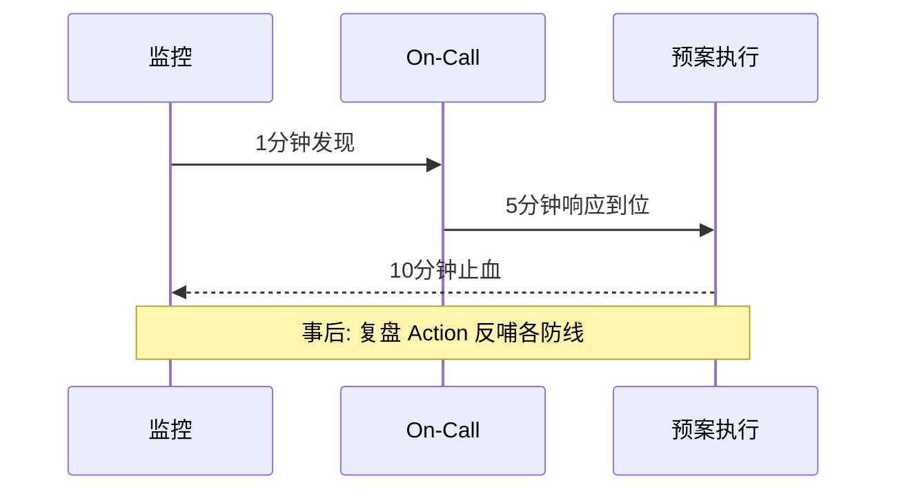
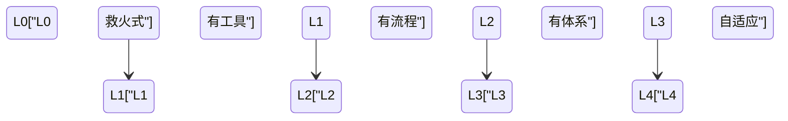

# 从零开始亿级项目稳定性（整合层·全景级）

> **一句话**：稳定性 = 事前(四大防线) → 事中(1-5-10) → 事后(复盘反哺 TOP10)，以 SLO 为纲七环节流水线推进，分级投入(核心链路重兵/长尾轻装)。

## 阅读路径

- **从零建体系**：按导读 → 主篇 → 篇目顺序读
- **补短板**：直接跳到薄弱环节——没压测报告 → 读主篇第 5 节；预案没演练过 → 读第 7 节
- **面试/架构评审**：主篇"核心带走卡" + "你们可能会问"可直接当评审 checklist

## 系列地图

| 层 | 回答的问题 | 篇目 |
|---|---|---|
| 入门层 | 每个环节是什么、为什么、最小实践 | 1_什么是系统稳定性 → 10_方法论总结（11 篇） |
| 特性层 | 每个环节的深挖——算法/状态机/源码 | 限流算法 / 熔断器 / 混沌工程（3 篇已落盘） |
| 专题层 | 行业级专题——大促/单元化/混沌平台 | 大促稳定性 / 单元化多活 / 混沌平台（3 篇已落盘） |
| **整合层** | **体系怎么串/怎么验证/怎么决策/怎么用** | **本文（0_导读）+ 主篇 + 对账 Demo + AI 时代风险评估 + 使用方向场景路由（5 篇已落盘）** |

四层的深度分工一句话：入门层懂「是什么」，特性层穿透到「怎么实现」——同一机制往源码里再穿一层；专题层看「怎么组合」；整合层回答「怎么串成体系、怎么验证有效、怎么跨周期演进」。跨周期经验看这个分层设计：机制层（入门+特性）的生命周期以年计，形态层（专题+整合）以季度计——分层维护，改形态不动机制。从更长的周期回看，工具与平台会被替换，但「度量先行、分级投入、复盘反哺」这些决策原则穿越技术周期——这正是整合层敢写「5 年后怎么看」的底气。

## 怎么读

- 先读主篇（8 节）——全景级深度；再回入门层各环节——每篇"核心带走卡"是主篇的展开
- 特性层是入门层的**源码级深挖**；专题层是**行业级组合拳**；对账 Demo 是防资损主线的**可运行验证**——注入一笔假差错、10 分钟内告警，防线建成以验证通过为准，不是部署完成
- 主篇"七环节流水线"对应入门层 1-10 篇的每个环节

## ⚡ 系列速查卡

| 机制 | 一句话结论（为什么这样设计） | 哪里会坏 | 篇目 |
|---|---|---|---|
| SLO/错误预算 | 把"稳定"变成可度量的数字——预算用完自动刹车 | SLO 拍脑袋定，达成不了也不改 | 主篇 §2 |
| 限流/熔断/降级 | 入口控流 + 快速失败 + 主动放弃——保核心链路 | 阈值拍脑袋 / 熔断误触发 | 主篇 §3 |
| 隔离 | 故障爆炸半径受限——隔离了应用没隔离数据层 | 线程池隔离不彻底 | 主篇 §3 |
| 容量规划 | 知道天花板才敢接流量——全链路压测 | 只压单接口不压全链路 | 主篇 §3 |
| 可观测 | metrics/log/trace 三支柱——1 分钟定位 | 告警风暴 vs 告警沉默 | 主篇 §3 |
| 混沌工程 | 主动暴露弱点——不演练的预案等于没有 | 实验设计不当引入故障 | 主篇 §3 |
| 应急 SOP | 1 分钟发现/5 分钟响应/10 分钟止血 | 复盘变追责会 | 主篇 §3/§4 |
| 对账/防资损 | 旁路核对——差异即差错，验证套件即规格 | 采集不幂等 / 差错没人闭环 | 对账 Demo |

速查卡的每一行都值得机制穿透一层问下去：为什么熔断要半开（防二次击穿）、为什么对账必须旁路（观察者不能有写路径）——答案在特性层与 Demo 篇。同一机制在三个量级的取舍不同：10w 档文件对账就够、千万档要双通道分片、亿级档必须流式分层——**量级演进没有终局配置，每档有每档的最优形态**；阈值类参数都有保质期，业务节奏变了就漂移，这是 Trade-off 跨期的典型表现。

## 七环节与 1-5-10（导读预览）

建设视角的七环节流水线——复盘反哺让流水线成为闭环：

作战视角的 1-5-10 时序——每阶段有量化承诺而非「尽快」：

## 成熟度自查（导读版）

对号入座后翻主篇 §4 看每级的「关键动作」——下一优先动作永远只有一个，补最短的那块板。

## 维护说明

- 前置阅读：分布式系统设计系列入门层（高并发/高可用两篇）
- 阅读顺序：入门层 → 特性层 → 专题层 → 整合层（本文层）
- 边界：讲应用与架构层稳定性，基础设施层只在容量与演练篇涉及

## 数据与事实声明

- 写于 2026-09-11、更新于 2026-09-23（特性层/专题层落盘后刷新系列地图）；1-5-10 与事前/事中/事后划分为行业认知量级（公开复盘报告共性），非精确数据
- 各层篇目数与落盘状态以本目录 index.md 为准；姊妹仓库 interview 仓库存有话术版速查卡（原理版即本系列）
