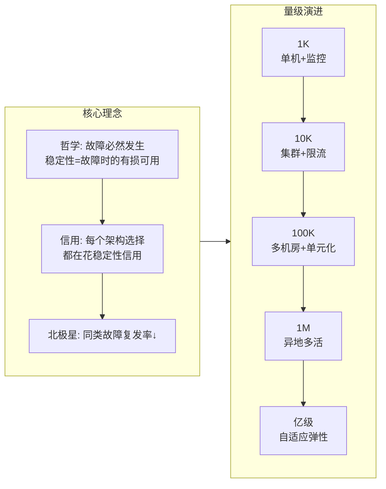
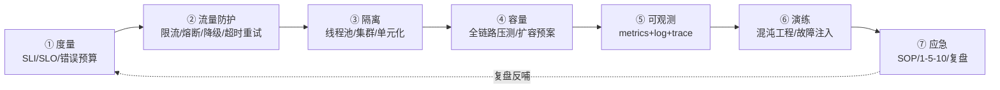
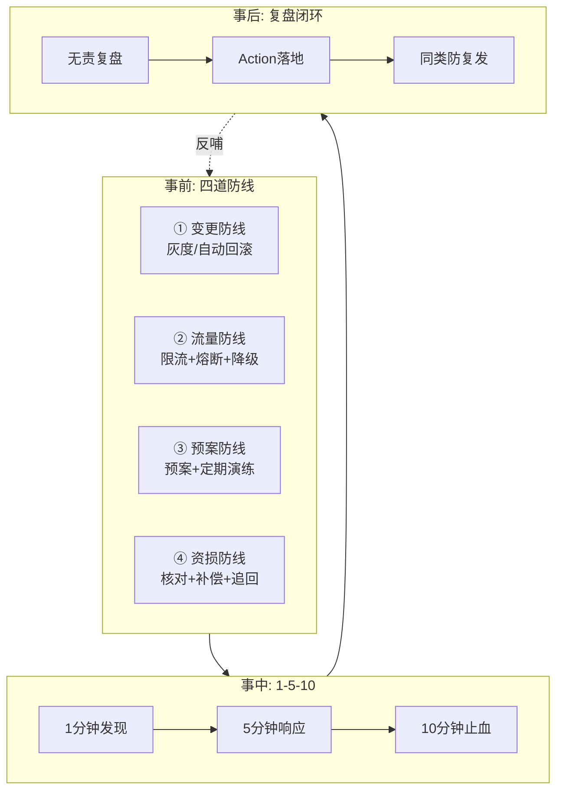
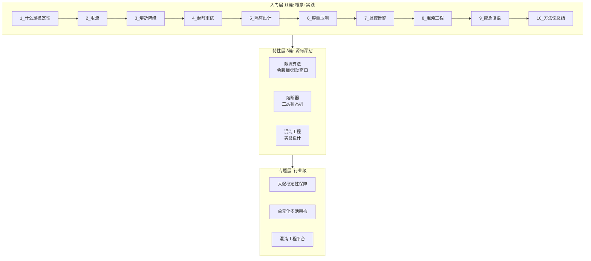
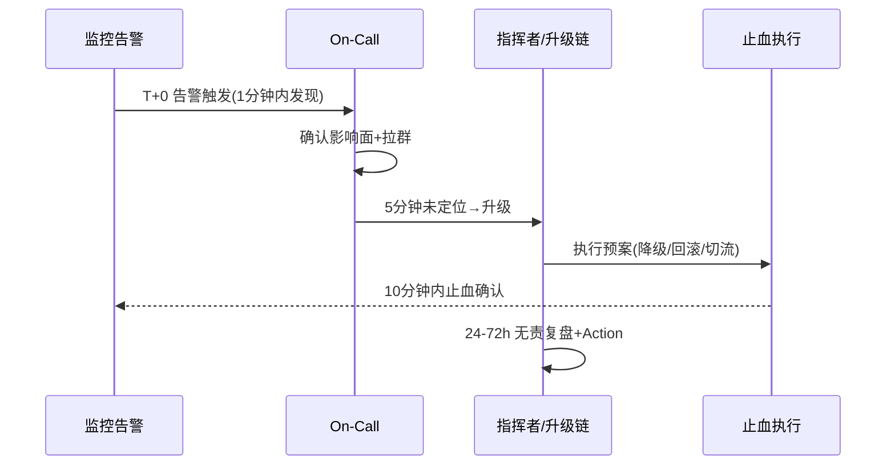
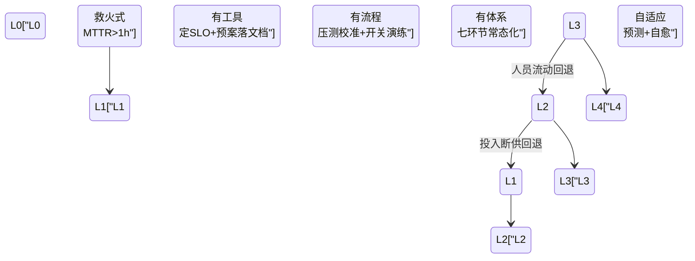

# 从零开始亿级项目稳定性（整合层·全景级）

> **一句话**：稳定性 = 事前(四大防线) → 事中(1-5-10) → 事后(复盘反哺 TOP10)，以 SLO 为纲七环节流水线推进，分级投入(核心链路重兵/长尾轻装)。

## 体系化脑图:从零建设亿级服务稳定性

### 图1: 核心理念 + 量级演进



### 图2: 七环节流水线（建设视角）



### 图3: 事前四道防线 + 作战时间轴



### 图4: 三层系列全景（入门→特性→专题）



## 二、建设视角: 七环节流水线详解

### ① 度量 —— 把稳定变成数字

| 概念                   | 定义                                                                | 面试高频               |
| ---------------------- | ------------------------------------------------------------------- | ---------------------- |
| **SLI**          | Service Level Indicator，4 个黄金信号（延迟、流量、错误率、饱和度） | RED 方法论             |
| **SLO**          | Service Level Objective，SLI 要达到的目标（如 99.95%）              | 怎么定？参考历史 P99   |
| **错误预算**     | 允许不可用的额度（如每月 43 分钟）                                  | 用完了怎么办？自动刹车 |
| **成熟度 L0-L4** | L0 救火 → L1 有工具 → L2 有流程 → L3 有体系 → L4 自适应         | 你在几级？             |

**核心带走**: 没有 SLO 的稳定性是玄学——所有告警都是 P0 等于没有 P0。

### ② 流量防护 —— 动态防线

| 机制               | 一句话                       | 关键参数          | 哪里会坏       |
| ------------------ | ---------------------------- | ----------------- | -------------- |
| **限流**     | 令牌桶允许突发+平滑消费      | 令牌速率/桶容量   | 阈值拍脑袋     |
| **熔断**     | 三态状态机——半开防二次击穿 | 错误率阈值/窗口   | 恢复太快误判   |
| **降级**     | 主动放弃非核心保核心         | 降级开关/兜底策略 | 降级开关没按过 |
| **超时重试** | 指数退避+抖动防惊群          | 初始超时/退避因子 | 重试放大风暴   |

**特性层深挖**: `1_令牌桶与滑动窗口-深度.md` / `1_熔断器状态机-深度.md`

### ③ 隔离 —— 控制爆炸半径

| 维度               | 隔离方式                           | 失效场景             |
| ------------------ | ---------------------------------- | -------------------- |
| **线程隔离** | 线程池隔离（池大小/队列/拒绝策略） | 池满拒绝策略不当     |
| **集群隔离** | 按业务分组，独立部署               | 共享 DB 连接池       |
| **单元化**   | 按用户/地域切分，流量分区          | 单元间数据不一致     |
| **数据层**   | 读写分离/分库分表                  | 隔离了应用没隔离数据 |

**核心带走**: 隔离了应用没隔离数据层 = 半套隔离。

### ④ 容量 —— 压出来的数字才是数字

```
容量规划三板斧:
├── 基准线: 单机 QPS/RT/错误率 → 确定单节点上限
├── 全链路压测: 模拟真实流量 + 影子库 → 端到端瓶颈定位
└── 扩容预案: 弹性伸缩策略 + 机器预热 → 峰值前扩容到位
```

**常见坑**: 只压单接口不压全链路 → 上线后第三方瓶颈爆掉。

### ⑤ 可观测 —— 1 分钟能定位到模块

| 支柱              | 核心指标                                      | 规范                 | 常见坑         |
| ----------------- | --------------------------------------------- | -------------------- | -------------- |
| **Metrics** | RED(速率/错误/时长) / USE(利用率/饱和度/错误) | 4 个黄金信号         | 指标维度爆炸   |
| **Log**     | 结构化日志 + 关联ID                           | traceId 贯穿全链路   | 日志格式不统一 |
| **Trace**   | 分布式追踪(Span/Context)                      | OpenTelemetry 标准   | 采样率过高     |
| **告警**    | 分级(P0-P3) + 降噪                            | 告警风暴 vs 告警沉默 | 值班疲劳       |

### ⑥ 演练 —— 主动暴露弱点

| 方法                 | 层次          | 频率 | 工具                |
| -------------------- | ------------- | ---- | ------------------- |
| **开关演练**   | 单点故障模拟  | 每月 | 手动摘除            |
| **单点故障**   | 实例/节点下线 | 每周 | Chaos Mesh          |
| **混沌工程**   | 多故障组合    | 季度 | Litmus / Chaos Mesh |
| **全链路故障** | 机房级切换    | 年度 | 联合演练            |

**核心带走**: 不演练的预案 = 没有预案。

### ⑦ 应急 —— 1-5-10 量化承诺

| 阶段           | 时间       | 动作            | 关键          |
| -------------- | ---------- | --------------- | ------------- |
| **发现** | 1 分钟     | 告警覆盖度      | 监控无死角    |
| **响应** | 5 分钟     | On-Call 到位    | 值班表+升级链 |
| **止血** | 10 分钟    | 一键回滚/降级   | 预案可执行    |
| **复盘** | 24-72 小时 | 无责复盘+Action | 同类防复发    |

**核心带走**: 复盘变追责会 = 下次事故还会重演。

1-5-10 的作战时序——每个阶段有明确的角色接力与升级（escalation）路径，超时未达标自动升级到下一层指挥者：



## 三、作战视角: 事前-事中-事后

```
┌─────────────────────────────────────────────────────────────┐
│  事前: 四道防线                                              │
│  ┌──────────┐ ┌──────────┐ ┌──────────┐ ┌──────────┐      │
│  │变更防线  │ │流量防线  │ │预案防线  │ │资损防线  │      │
│  │灰度/回滚│ │限流/熔断│ │预案/演练│ │核对/补偿│      │
│  └────┬─────┘ └────┬─────┘ └────┬─────┘ └────┬─────┘      │
│       └────────────┴────────────┴────────────┘              │
└───────────────────────────┬─────────────────────────────────┘
                            │ 故障发生
                            ▼
┌─────────────────────────────────────────────────────────────┐
│  事中: 1-5-10 量化承诺                                       │
│  1 分钟发现 → 5 分钟响应 → 10 分钟止血                        │
│  关键: 分阶段有量化承诺，不是「尽快」                          │
└───────────────────────────┬─────────────────────────────────┘
                            │ 止血完成
                            ▼
┌─────────────────────────────────────────────────────────────┐
│  事后: 复盘闭环                                              │
│  无责复盘 → Action 指人限期 → 落地验证 → 同类防复发            │
│  反哺: 告警规则/预案/SLO 校准回流                            │
└─────────────────────────────────────────────────────────────┘
```

**核心带走**: 事前花 1 块钱防御，事中花 10 块钱止血，事后花 100 块钱挽回。

## 四、成熟度模型 L0-L4

| 级别                | 特征                             | 关键动作                             | 指标         |
| ------------------- | -------------------------------- | ------------------------------------ | ------------ |
| **L0 救火式** | 故障靠用户发现，处置靠临场发挥   | 定核心 SLI + 两级告警 + 止血 SOP     | MTTR > 1h    |
| **L1 有工具** | 核心指标有告警，但无 SLO、无预案 | 定 SLO + 错误预算 + 预案落文档       | MTTR ~ 30min |
| **L2 有流程** | 限流/熔断/降级上线，但阈值没压测 | 基准压测校准 + 开关演练全量          | MTTR ~ 15min |
| **L3 有体系** | 七环节齐备且常态化               | 全链路压测常态化 + 混沌工程 + 单元化 | MTTR < 5min  |
| **L4 自适应** | AI 预测 + 自动弹性 + 自愈        | 容量预测 + 自动伸缩 + 故障自愈       | MTTR ≈ 0    |

**自查**: 你现在在哪一级？→ 下一优先动作是什么？

成熟度跃迁不是线性爬坡——多数组织卡在 L1→L2（有工具到有流程，靠的是组织共识而非技术），跃迁失败最常见的形态是「跳级」：L1 直接上 L3 的混沌工程，预案没演练过、阈值没压测过，演练本身变成事故源。状态视图下每一级的退出条件都写死在前一级的交付物里：



## 五、分级投入: 核心链路重兵 / 长尾轻装

```
资源分配原则:
├── 核心链路(P0): 全链路压测 + 7×24 监控 + 自动降级 + 秒级切换
│   投入权重: 60-70% 稳定性预算
├── 重要链路(P1): 限流 + 熔断 + 分钟级告警 + 手动降级
│   投入权重: 20-30% 稳定性预算
└── 长尾链路(P2/P3): 基本监控 + 事后恢复
    投入权重: 5-10% 稳定性预算
    原则: 长尾链路故障 = 优雅降级/快速重启，不投入重兵
```

**核心带走**: 均匀投入 = 浪费。稳定性信用要花在刀刃上。

## 六、跨系列对照

| 维度           | 入门层         | 特性层           | 整合层（本文）     |
| -------------- | -------------- | ---------------- | ------------------ |
| **定位** | 概念+最小实践  | 源码+机制深挖    | 体系串+决策        |
| **篇数** | 11 篇          | 3 篇已落盘       | 1 篇主篇           |
| **深度** | 知道是什么     | 知道怎么实现     | 知道怎么用         |
| **核心** | 核心带走卡     | 机制链+Trade-off | 体系化脑图         |
| **读者** | 新手上手       | 工程师深挖       | 架构师/Tech Lead   |
| **问答** | 是什么、为什么 | 怎么实现、源码   | 怎么串联、怎么决策 |

## 七、量级演进路径

| 阶段             | QPS 量级 | 架构特征          | 稳定性重点               |
| ---------------- | -------- | ----------------- | ------------------------ |
| **起步**   | 1K       | 单机 + 基础监控   | 手动开关 + 止血 SOP      |
| **增长**   | 10K      | 集群 + LB + 限流  | 阈值校准 + 预案文档      |
| **规模化** | 100K     | 多机房 + 单元化   | 全链路压测 + 演练        |
| **亿级**   | 1M+      | 异地多活 + 自适应 | 混沌工程常态化 + AI 运维 |

## 八、核心带走卡

- **一句话**: 稳定性 = 事前(四大防线) → 事中(1-5-10) → 事后(复盘反哺 TOP10)
- **机制链**: 度量(SLO) → 防护(限流/熔断/降级) → 隔离(爆炸半径) → 容量(全链路压测) → 可观测 → 演练 → 应急(SOP+复盘反哺)
- **作战轴**: 事前四防线 → 事中1-5-10 → 事后复盘闭环 → 反哺事前
- **北极星**: 同类故障复发率 ↓（不是「上了多少工具」）
- **分级投入**: 核心链路重兵 / 长尾轻装
- **成熟度**: L0 救火 → L4 自适应，对号入座
- **信用**: 每个架构选择都在花稳定性信用 —— 事前1元 vs 事中10元 vs 事后100元
- **30 秒复述**: 先定 SLO → 七环节流水线 → 事前四防线 → 事中 1-5-10 → 事后复盘反哺 → 分级投入 → 从 L0 走到 L4

## 九、你们可能会问（面试追问预埋）

### Q1: SLO 怎么定？拍脑袋吗？

> 基于历史 P99/P95 表现 + 业务可接受的不可用时间。流程: 观测现状 → 定目标 → 错误预算 → 达标/未达标处置。SLO 不是一成不变的——业务增长后要重新校准。

### Q2: 限流和熔断什么区别？

> 限流是**预防性**的（流量还没到阈值就拦截），熔断是**反应性**的（下游已经超时/错误率飙升才断开）。限流保护系统不过载，熔断保护系统不被打死。

### Q3: 熔断的半开状态为什么重要？

> 避免二次击穿。直接从 OPEN 到 CLOSED 会瞬间涌入大量流量打到恢复中的服务，半开状态先放少量流量试探，确认恢复再完全关闭。

### Q4: 全链路压测怎么做到的？

> 影子库 + 流量染色。生产环境搭一套影子链路，用影子流量压测，数据写入影子库不影响生产。最终端到端瓶颈定位。

### Q5: 复盘如何避免变追责会？

> 无责复盘三原则: 1) 只问流程不问人 2) Action 必须指人限期 3) 同类故障防复发验证。Root Cause 不是个人，是系统性缺陷。

### Q6: 混沌工程会不会把系统搞崩？

> 不会。混沌工程在小流量/非核心时段进行，有完备的回滚预案和终止条件。先单点→再组合→最后机房级，逐步加压。

### Q7: 稳定性投入怎么衡量 ROI？

> 不能用「省了多少故障」算 ROI（那会鼓励不投入）。应该用「每 1 元稳定性投入避免了多少事后 100 元损失」——事前 1 元 vs 事中 10 元 vs 事后 100 元是行业经验公式。

### Q8: 单元化和微服务什么区别？

> 微服务是**架构风格**（业务拆分），单元化是**部署策略**（故障隔离）。微服务不一定单元化，单元化可以不用微服务。单元化的核心是「故障不扩散到其他单元」。

## 十、维护说明

- 前置阅读: 分布式系统设计系列入门层（高并发/高可用两篇）
- 下篇衔接: 入门层 → 特性层 → 专题层 → 整合层
- 边界: 讲应用与架构层稳定性，基础设施层只在容量与演练篇涉及
- 关联仓库: interview 仓库「稳定性体系速查卡」为话术版，本文为原理版

---

## 数据与事实声明

- 写于 2026-09-11；SLO/错误预算方法论源自 Google SRE 书（公开出版，行业共识口径）
- 1-5-10 量化承诺为行业认知量级，国内大厂公开复盘报告共性——非精确数据
- Chaos Mesh 7,885 star / LitmusChaos 5,609 star: 2026-09-11 gh CLI 实测
- 行业认知: 变更占线上故障 40%+（公开复盘报告共性），事前 1 元 vs 事中 10 元 vs 事后 100 元（行业经验公式）
- 免责: 具体工具（Prometheus/Sentinel/Hystrix/Chaos Mesh 等）版本与用法以官方文档为准

## 参考资料

| 类型     | 标题                                  | 来源                                           |
| -------- | ------------------------------------- | ---------------------------------------------- |
| 书       | 《SRE: Google 运维解密》              | 公开出版                                       |
| 书       | 《SRE 工作手册》                      | 公开出版                                       |
| 书       | 《网站可靠性工程》                    | 公开出版                                       |
| 官方文档 | The Twelve-Factor App（吞吐与无状态） | 12factor.net                                   |
| 官方文档 | OpenTelemetry 标准                    | opentelemetry.io                               |
| 开源     | Chaos Mesh                            | github.com/chaos-mesh/chaos-mesh (7,885 stars) |
| 开源     | LitmusChaos                           | github.com/litmuschaos/litmus (5,609 stars)    |
| 开源     | Sentinel                              | github.com/alibaba/Sentinel                    |
| 行业复盘 | 各大厂故障复盘公开报告                | 公开报道                                       |
| 姊妹仓库 | interview 仓库「稳定性体系速查卡」    | 话术版+追问预埋                                |
