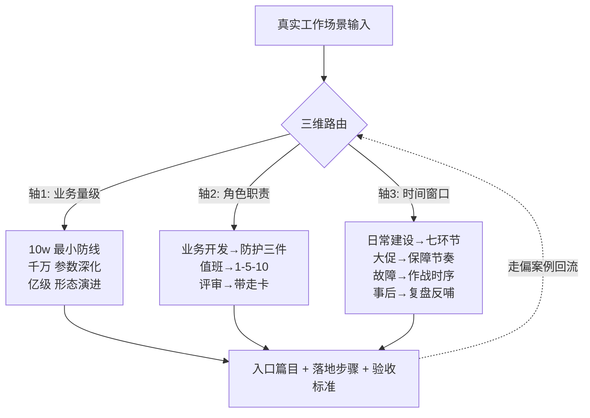
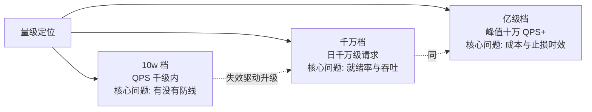
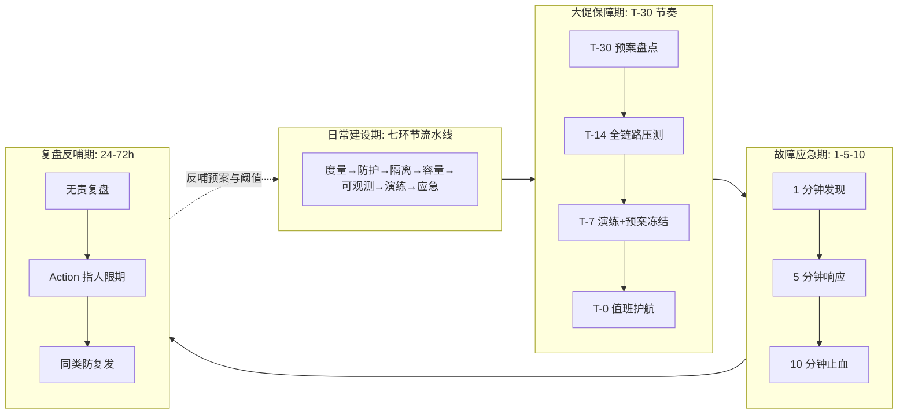
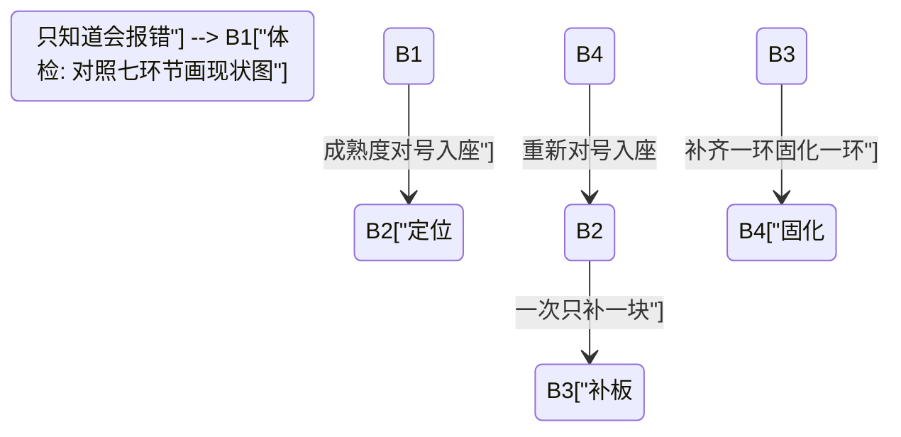
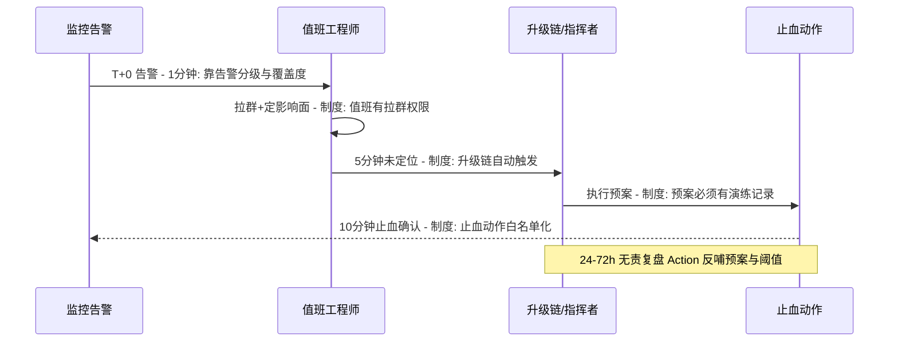

# 稳定性体系使用方向：场景路由与落地路径

> 本系列前四篇回答了「体系是什么」（导读+主篇）、「怎么验证」（对账 Demo）、「AI 时代怎么决策」（AI 篇）。本篇回答最后一个问题：**拿到真实工作时，这些内容按什么方向用**——给定量级、角色、时间窗口，路由到具体篇目的具体小节，给出落地步骤与验收标准。整合层是体系的总装车间，本篇是总装车间的出库单。

## 一句话摘要

稳定性的使用方向 = 「业务量级 × 角色职责 × 时间窗口」三维路由：**同一份体系知识，10w 档取最小防线、千万档取参数深化、亿级档取形态演进；业务开发取防护三件、值班取 1-5-10、评审取带走卡；日常建设走流水线、大促走保障节奏、故障走作战时序、事后走复盘反哺**。每个方向都有明确的入口篇目、落地步骤和验收标准——查得到、照着做、验得了。

## 🎯 本文核心

**核心机制一句话**：使用方向的本质是把「体系知识」翻译成「场景动作」——翻译规则是三维路由，翻译产物是「入口篇目 + 落地步骤 + 验收标准」三件套。没有路由的知识是图书馆，有路由的知识才是工具箱。

**机制链**：场景输入（量级/角色/窗口）→ 三维路由定位 → 篇目+小节入口 → 按步骤落地 → 验收标准判定 → 偏差回流（走偏案例反哺路由表）。上下游：上游是本系列四篇知识资产，下游是真实的排期表、值班表、评审会。

**设计思想**：为什么路由表本身要成文——知识复用的失效模式不是「没写」，而是「写了但不知道什么时候读」。四篇内容每篇几千字，现场翻阅的成本高于记忆任何口诀；路由表把「何时读哪篇哪节」压缩成一次查表，把体系的使用成本从分钟级压到秒级。这与对账 Demo 的设计同构：**核对器不生产流水，它只做匹配**——路由篇不生产知识，它只做场景与知识的匹配。

## 一、三维路由总览

### 1.1 轴一：业务量级——先问系统多大，再谈用什么

量级错配是使用方向的第一大坑：10w 档的系统照抄亿级档配置，运维成本吃掉团队一半人力；亿级档系统沿用千万档防线，一次流量尖峰击穿全部薄弱环节。往机制里穿透一层：量级改变的不是「用哪些机制」，而是**每个机制的参数与形态**——限流的阈值来源（拍脑袋→压测→自适应）、对账的窗口（T+1→分钟级→流式）、演练的频率（年度→月度→常态化）。

卡在两档之间的中间态（比如几十万级流量的业务）另有一层取舍——**这一档的核心问题是颗粒度，而不是形态**：把千万档的参数调细（窗口缩短、告警分级加细）即可，不必引入亿级档的架构形态；形态迁移必须由成本曲线倒逼，不由「想显得先进」驱动。

### 1.2 轴二：角色职责——不同人翻不同篇

| 角色 | 你的关注点 | 入口篇目与小节 | 一句话 checklist |
|---|---|---|---|
| 业务开发 | 我的接口别拖垮别人 | 主篇 §3 流量防护 + 入门层 2/3/4 | 限流熔断超时三件配齐、阈值有压测来源 |
| 稳定性负责人 | 体系不缺环节 | 主篇 §2 七环节 + §4 成熟度 | 七环节流水线逐环节打勾、短板有补齐排期 |
| 值班工程师 | 快速止血不背锅 | 主篇 §7 应急 + §3 作战时间轴 | 1-5-10 有预案、预案演练过、复盘无责化 |
| 评审参与者 | 判断方案稳不稳 | 主篇 §8 带走卡 + §9 你们可能会问 | 带走卡八条当评审清单逐条过 |
| 新接手者 | 快速建立全景 | 导读 → 主篇 → 对应业务篇 | 半天内读完导读+主篇、画出自己系统的七环节现状图 |
| AI 协作决策者 | 审 AI 的输出 | AI 篇三道防线全篇 | 逻辑五问、影响面三维度、系统上下文三问 |

### 1.3 轴三：时间窗口——什么时候用什么

四个窗口的边界要显式切换：大促保障期的变更冻结、值班升级预案，必须在窗口开始日生效、结束日解除——**常态规则与作战规则混用是保障期事故的常见根源**（平时不开的降级开关大促后忘开、平时开的限流大促前被放大无人记录）。

## 二、量级三档的使用方向（量级思考三件套）

### 10w 档：从无到有，最小防线闭环

**约束来源**：工程资源极少（往往兼职维护）、业务处于验证期、故障容忍度相对高（丢几分钟请求不致命，丢客户信任才致命）。
**这一档的核心问题是有没有防线，而不是防线多先进**——T+1 文件对账、手动扩容、单机限流都完全成立，先把「出事了有人知道、知道后能止血」跑通。
**思考方式**：清单式——对照七环节流水线逐项打勾，缺哪环补哪环，不追求任何环节的深度。

最小防线配置（每项都是这一档的最优解，不是妥协解）：

| 环节 | 最小配置 | 为什么够用 |
|---|---|---|
| 度量 | 核心接口错误率+耗时两个告警 | 先保证「有人知道」 |
| 防护 | 网关层全局限流一个阈值 | 单层限流足够挡住突发 |
| 容量 | 单接口基准压测一次 | 知道单机上限就能算集群容量 |
| 可观测 | 日志关键字告警 | 结构化 trace 的建设成本此档不划算 |
| 演练 | 手动摘节点一次 | 验证摘机不雪崩即可 |
| 对账 | T+1 文件核对脚本 | 防资损的底线版 |
| 应急 | 一页纸 SOP（重启/回滚/扩容） | 止血动作少，一页纸够 |

**自下而上收尾**：这一档痛过的失效——告警没人看（告警疲劳萌芽）、对账脚本没人维护——触发升级：告警分级与对账自动化，即向千万档出发的信号。

### 千万档：参数深化，把「有」变「准」

**约束来源**：数据量让单线程核对超窗、流量让单层限流粒度不够、团队有了专职稳定性角色。
**这一档的核心问题是就绪率与吞吐，而不是机制创新**——双通道采集、分片核对、分级告警全是已验证手段的参数化组合。
**思考方式**：参数化——把主篇 §3 各机制的参数逐个从「拍脑袋」升级为「压测来源」，建立参数台账。

关键配置项的分档参数清单（名称/默认值/分档推荐值/为什么）：

| 参数（配置项） | 默认值 | 千万档推荐值 | 亿级档推荐值 | 为什么这样分档 |
|---|---|---|---|---|
| 限流阈值来源 | 手工估算 | 全链路压测校准 | 压测+自适应动态调整 | 阈值误差随流量放大 |
| 告警分级 | 单级 | P0-P3 四级 | 四级+自动止损联动 | 分级是降噪的前提 |
| 对账窗口 | T+1 | 10-15 分钟 | 5 分钟/流式 | 就绪率决定窗口下限 |
| 演练频率 | 年度 | 月度开关演练 | 季度混沌+月度开关 | 预案失效率随时间上升 |
| 复盘时限 | 按心情 | 72h 内 | 24h 内出报告 | 级联链路复杂度决定遗忘速度 |

**自下而上收尾**：这一档痛过的失效——分区表维护成本、历史数据查不动、压测环境与生产漂移——触发向亿级档的形态演进。

### 亿级档：形态演进，成本曲线倒逼架构

**约束来源**：落库与核对的成本曲线反转、资损敞口要求分钟级止损、机房级故障纳入常态化假设。
**这一档的核心问题是成本与止损时效，而不是准确率**——准确率机制与前两档同构，变的是形态：流式对账、分层存储、单元化隔离、自动止损联动。
**思考方式**：架构式——机制与形态分离，逐项评估形态替换的触发条件，不为演进而演进。

**自下而上收尾**：这一档的失效（流式状态过大、冷查询慢、单元间数据倾斜）反过来定义下一代机制——量级演进没有终局，只有当前档位的最优形态；跨周期经验看，三档之间会反复横跳（业务收缩时亿级档主动降回千万档形态是健康信号，不是倒退）。

## 三、六场景落地路径

### 场景 A：新业务从零建防线

**目标**：新服务上线前，稳定性与功能同步交付，而不是上线后补课。
**路径**（步骤级）：
1. **前置**：定业务量级档位（轴一）——问业务方峰值 QPS 预期与可接受不可用时长；
2. 按 §2 对应档位的最小配置表逐项落地，每项有负责人与完成日期；
3. **验证**：上线前跑一遍「防线自查」——限流阈值压测报告、降级开关演练记录、SOP 一页纸，三样齐了才准上线；
4. **回退**：任何防线组件上线引发业务问题，先降级为手动模式而非直接拆除——防线可以降级，不能裸奔。

**常见走偏**：把「监控大盘很漂亮」当「防线建成」——监控是观测不是防护，走偏的判据是问一句「现在把下游依赖停掉，你的服务会怎样」，答不上来就是没建成。

### 场景 B：接手遗留系统补稳定性

**目标**：不推倒重来，用成熟度模型定位现状，补最短的那块板。

**路径**：先用两周画出现状的七环节图（哪环有、哪环空、哪环形同虚设）→ 对号入座成熟度级别 → 优先补「度量」或「应急」（这两环决定能不能止血，其他环决定会不会出事）→ 每补一环跑一次验收。
**常见走偏**：进场先重构——遗留系统的稳定性欠债要用防线偿还，重构解决的是代码债，两笔债别混着还；跨周期经验看，先建防线后重构的团队活下来了，反过来的往往死在重构途中的一次大促。

### 场景 C：大促/活动保障

**目标**：活动峰值流量下核心链路可用，非核心链路优雅降级。
**路径**：T-30 盘点预案与容量台账 → T-14 全链路压测（影子链路，数据隔离验证要穿透到存储层——影子表写错库等于没压测）→ T-7 预案冻结+开关演练（每个降级开关真实按一遍）→ T-0 值班护航（作战规则生效）→ T+1 解除作战规则、复盘流量与预案命中率。
**常见走偏**：压测只压接口不压全链路——第三方瓶颈在 T-0 当晚爆掉；降级开关从没按过，真降级时不敢按。

### 场景 D：值班应急（1-5-10 落地到值班制度）

1-5-10 不是口号，是值班制度的三个硬指标，每个指标有制度承接：

**常见走偏**：三个「制度缺位」——值班没有升级链（5 分钟升级变成 30 分钟私聊）、预案没演练过（止血动作不敢执行）、复盘开成追责会（下次所有人选择隐瞒）。1-5-10 失效几乎从不失效在技术上，失效在制度上。

### 场景 E：防资损对账落地（Demo → 生产）

**目标**：资金链路有旁路核对防线，差错有闭环。
**路径**：机制学习入口在特性层篇 1《准实时对账引擎》→ 动手验证用整合层对账 Demo（五断言全绿才算部署成功）→ 生产化按 Demo 篇三档 roadmap 逐档演进。
**验收**（Demo 验证点）：注入一笔带 DRILL 前缀的假差错 → 2 倍窗口内差错表出现记录 → webhook 收到告警 → 差错带演练标记可回收。**防线建成的标志是验证通过，不是部署完成**。
**常见走偏**：先接真实数据后跑验证套件——出了问题分不清是数据脏还是代码错；采集不幂等直接上生产——重复采集制造假差错风暴，值班信任度一夜归零。

### 场景 F：AI 能力引入的风险评估

**目标**：AI 参与代码/配置/架构产出时，人守住放行关。
**路径**：AI 篇三道防线顺序执行——逻辑五问（边界/状态/事务/错误处理/可观测）→ 影响面三维度（范围/传播/恢复成本，每个变更填矩阵）→ 系统上下文三问（依赖稳不稳/容量够不够/窗口合不合适）。
**跨系统架构提醒**：AI 产出的变更尤其容易在跨系统边界出事——它看不到两侧系统的时钟差异、状态枚举差异、写入路径差异（对账 Demo 篇的三个翻车场景几乎都是跨系统边界问题），影响面评估时**跨系统依赖单独标红**。
**常见走偏**：「AI 都说好了」直接放行；影响面矩阵空着不填。识别方法：查决策记录——AI 篇的留痕模板填了才是审过。

## 四、使用反模式（反方案分析）

**为什么不做一张万能 checklist？** 反方案是「一页纸 checklist 包打天下」。10w 档确实可以一页纸，但千万档参数化之后、亿级档形态化之后，一张表要么稀疏到无操作价值，要么膨胀到没人读。三维路由保留的是 checklist 的精神（逐项打勾），牺牲的是「一页纸」的形态——因为**场景的复杂度是客观的，压缩过度必然丢维度**。

**为什么不照抄高档配置？** 照抄是使用方向里最诱人的捷径——直接拿亿级档的形态清单来落地。三个代价：运维成本远超团队承载、防线组件没人会用（降级开关存在但没人敢按）、跨周期看形成「高端防线负债」——业务收缩时拆不动。照抄高档配置而未经历低档失效 = 不会运维高档系统，这条在对账 roadmap 成立，在全体系同样成立。

**为什么使用指南不能替代体系本身？** 路由表是索引不是内容——场景 E 路由到对账 Demo 篇，落地时还是要把五模块的机制读完才能改对参数。指南的价值是**把找东西的成本压到秒级**，不是把学东西的成本压到零。反方案「只读路由篇不读正文」的结局是：每个动作都做了，每个参数都不知道为什么——下一个变更来了就改错。

## 五、多视角圆桌：谁用着最疼（探讨感）

**业务开发的视角**：最疼的是「我只想写业务，为什么要懂限流」——回答是三维路由把你的使用面压到了主篇 §3 一节：三件套怎么配、阈值哪来，十分钟读完。体系的使用成本应该被路由表消化，而不是摊派给每个人读全套。

**值班工程师的视角**：最疼的是预案文档和真实系统对不上——预案写着「切换到备节点」，备节点半年没登录过。所以场景 D 的制度承接里有一条硬性的：预案演练记录是预案有效性的唯一证据，没有演练记录的预案按不存在处理。

**稳定性负责人的视角**：最疼的是向业务方解释「为什么要花人力建防线」——ROI 说不清。行业经验公式（事前 1 元 vs 事中 10 元 vs 事后 100 元）是唯一的通用说服工具，配合场景 C 的预案命中率数据，比讲 SLA 概念有效得多。

**AI 协作决策者的视角**：最疼的是三道防线的审查速度跟不上 AI 的产出速度——于是审查被压缩成扫一眼。答案不是加速审查，是**分级放行**：影响面矩阵里 🟢 低风险的走快速通道，🔴 高风险的必须全流程——把审查预算花在高风险变更上。

## 六、你们可能会问（追问链）

**Q1：三个轴冲突了怎么办？我是小团队但要保障大促（量级低×窗口是大促）。**
轴的优先级是时间窗口 > 量级 > 角色——作战期规则覆盖常态规则。小团队保障大促的路径：保障期临时升级防护（压测、预案、值班三件事按千万档标准做），保障期结束解除——**档位可以临时借，机制不能凭空造**。追问：临时升级的成本谁出？——这就是 T-30 盘点要向业务方报预算的原因，保障成本是活动的直接成本，和流量费同一性质。

**Q2：怎么判断我该按哪一档走？QPS 数字我不确定。**
量级不是精确 QPS，是约束感受：改个配置要不要排期、挂 10 分钟能不能接受、有没有人 7×24 盯着——三个问题的答案组合直接对应档位。追问：卡在两档之间怎么办？——按低档建设、按高档做预案（防线按千万档配，应急预案按亿级档写），建设成本取低、风险兜底取高。

**Q3：使用指南本身会不会过时？**
会，而且应该过时——路由表指向的篇目更新后，路由不用改（入口没变）；三维路由的框架本身跨周期稳定（量级、角色、窗口是组织的常量，不是技术的变量）。跨周期经验：本系列机制层三年未变，形态层已演进两轮，路由框架零变更——**越靠近场景的抽象，生命周期越长**。

**Q4：场景之间叠加怎么办？我在接手遗留系统，同时大促要来了。**
场景可以并行但注意力不能并行——用时间窗口轴切片：T-30 之前做场景 B（遗留系统体检，顺便产出大促要用的容量台账），T-30 起全力转场景 C，场景 B 的补板动作冻结到保障期结束。追问：冻结期间遗留系统出事怎么办？——场景 B 第一步本来就是先补「应急」环，保证冻结期出事能止血——这就是为什么优先补度量和应急而不是重构。

**Q5：怎么衡量这套体系「用得好不好」？**
三个结果指标：同类故障复发率（北极星，主篇 §2）、预案命中率（场景 C/T-1 复盘）、平均止血时长（场景 D 的 10 分钟达成率）。追问：过程指标呢（防线覆盖率、演练次数）？——过程指标是领先指标，用于排期管理；结果指标是验收指标，用于判断方向。用过程指标汇报、用结果指标决策，混用会让体系变成「为覆盖率而建设」。

## 七、开放问题（思考）

- **路由表的维护机制**：三维路由表本身由谁维护、多久校准一次？路由失效（指向的篇目重构后入口变了）比知识过时更隐蔽——是否值得为路由表建一个「点击-命中」的反馈回路，是知识库工程的开放题。
- **AI 参与路由**：AI 篇解决了「审 AI 的产出」，但「AI 帮人路由」（输入场景描述，AI 推荐篇目与步骤）还缺一层评估——推荐错了比不推荐更糟，误路由的代价如何度量是开放题。

## 八、Trade-off 与演进

- **路由粒度：粗（三档）vs 细（五档十档）**——粒度越细路由越准、维护越贵、边界越模糊；三档是维护成本与路由精度的平衡点，档内再按参数微调；
- **指南形态：文档 vs 工具**——把路由表做成 CLI/页面可以查得更快，但 loses 与正文篇目的共同演化能力（文档改一行，工具要发版）；跨期看，文档版先跑、量起来了再工具化，与对账「先落库后流式」的取舍同构；
- **5 年后回看**：量级档位的分界线会持续上移（今天的亿级档形态成为明天的千万档默认），但三维路由的框架不变——**量级、角色、时间窗口是组织的常量**；跨周期经验给我们的底气是：这套使用方向的设计目标从来不是「永远正确」，而是「失效时可观测」（走偏案例回流机制），能自我修正的指南不需要预测未来。

## 九、实战提示

- 💡 路由之前先定位量级——三个约束感受问题（改配置要不要排期/挂 10 分钟行不行/有没有人 7×24 盯）比 QPS 数字更快收敛档位。
- 💡 每个场景落地后把「走偏点」写回本篇对应小节——路由表的价值随走偏案例的积累而上升，这与复盘反哺是同一个机制在知识层的投影。
- 💡 大促保障期的规则切换（变更冻结/值班升级/预案生效）写在日历上而不是记忆里——作战规则与常态规则的边界必须显式。

## 十、核心带走

**30 秒复述**：使用方向 = 三维路由（量级定防线深浅、角色定入口篇目、窗口定作战节奏）+ 三件套产出（入口篇目/落地步骤/验收标准）+ 走偏回流。金句带走：

> **路由表不生产知识，它只做场景与知识的匹配——核对器不生产流水，只做匹配；好的索引和好的核对器是同一种东西：把「找不到」变成「秒级定位」。**

> **量级决定防线深浅，时间窗口决定作战节奏，角色决定入口篇目——三者错配任何一个，体系就从资产变成负债。**

## 📌 数据与事实声明

- 写于 2026-09-23；三维路由框架与六场景路径为本文对本系列四篇的使用归纳；量级分档参数为业界形态归纳（行业认知），具体取值以各自系统压测与实测为准
- 事前 1 元/事中 10 元/事后 100 元为行业经验公式（非精确统计）；1-5-10 为行业认知量级（公开复盘报告共性）
- 本文路由的篇目：本目录导读/主篇/对账 Demo 篇/AI 风险评估篇 + 特性层篇 1 + 入门层全系列

## 📚 参考资料

- 本系列：导读-全景 / 从零开始亿级项目稳定性（主篇）/ 从零实现对账系统 Demo / AI 时代的风险评估与决策
- 特性层：准实时对账引擎（场景 E 机制正源）
- 《SRE: Google 运维解密》（错误预算与变更冻结的行业正源）
- 姊妹仓库 interview 仓库存有话术版速查卡（稳定性体系速查卡-PKG回填）
