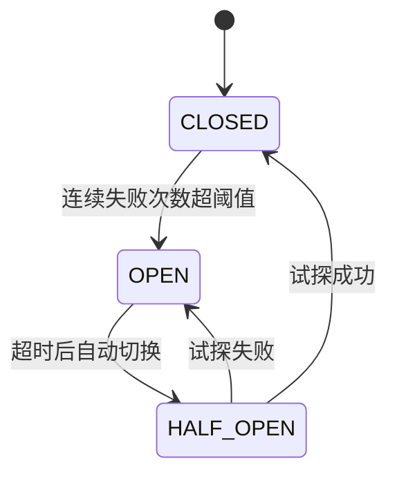

# 深入理解熔断器：闭合→打开→半开状态机

> 入门层讲了「熔断是什么」，本篇讲「熔断器状态机怎么实现」——为什么三态设计，半开状态如何防止雪崩，Hystrix/Dubbo/Sentinel 熔断器的实现差异。

## 一句话摘要

熔断器的本质是**快速失败 + 自动恢复**的状态机。闭合→打开→半开三态：正常时闭合放行，连续失败时打开快速拒绝，过一段时间后半开试探恢复。半开状态是熔断器最精妙的设计——它防止了「故障恢复后瞬间全量流量打回来」的二次击穿。

## 🎯 本文核心

**核心机制一句话**：熔断 = 状态机（闭合→打开→半开三态）——闭合放行，打开快速拒绝，半开试探恢复。

**机制链（3 个节点）**：

失败计数 → 阈值判断 → 状态切换 → 半开试探 → 恢复/再次打开

## 为什么需要熔断

没有熔断时，调用方会持续向已故障的下游发请求：

```
正常：请求 → 下游处理 → 响应
故障：请求 → 下游超时 → 请求排队 → 线程池耗尽 → 连锁崩溃
```

**熔断的作用**：当下游故障时，快速拒绝请求，给下游恢复时间，防止调用方被拖垮。

## 三态状态机



### 闭合（CLOSED）

- 正常状态，请求正常通过
- 内部维护失败计数器
- 失败次数超阈值 → 切换到 OPEN

### 打开（OPEN）

- 所有请求直接拒绝（快速失败）
- 不等待后端响应
- 经过超时时间 → 切换到 HALF_OPEN

### 半开（HALF_OPEN）

- 允许少量试探流量通过
- 成功 → 认为恢复 → CLOSED
- 失败 → 再次打开 → OPEN

> 💡 **tips**：半开状态是熔断器最精妙的设计——没有半开，恢复后瞬间全量流量会再次击穿下游。

## 关键参数设计

| 参数 | 含义 | 金融场景取值 | 为什么 |
|---|---|---|---|
| failureThreshold | 失败次数阈值 | 5 次/5 秒 | 防止偶发错误误触发 |
| slowCallThreshold | 慢调用比例 | P99 延迟的 2 倍 | 慢调用也是故障信号 |
| timeout | 打开→半开等待 | 10-30 秒 | 给下游恢复时间 |
| halfOpenMaxCalls | 半开试探流量 | 1-3 个请求 | 试探不压垮 |
| ringBufferSize | 滑动窗口大小 | 100 次 | 统计样本够大 |

## 熔断器 vs 限流器

| 维度 | 熔断器 | 限流器 |
|---|---|---|
| 触发条件 | 下游故障（超时/错误率） | 入口流量超阈值 |
| 动作 | 拒绝请求但不排队 | 拒绝或排队 |
| 恢复 | 自动（半开试探） | 阈值动态调整 |
| 目标 | 保护调用方不被拖垮 | 保护下游不被压满 |
| 位置 | 调用方 | 入口 |

## 分布式熔断

单机熔断不够——多实例需要共享状态。方案：

1. **本地熔断 + 集中监控**：每个实例独立熔断 + 集中监控告警
2. **集中式熔断**：Redis 共享状态（复杂度高，不推荐）
3. **混合**：本地快速决策 + 集中状态同步

> 💡 **tips**：熔断器状态机建议本地实现——分布式状态同步会引入新的故障点。

## 各框架实现对比

| 框架 | 状态机 | 慢调用 | 异常比例 | 热点 |
|---|---|---|---|---|
| Hystrix | 经典三态 | ✅ | ✅ | ✅ |
| Sentinel | 三态 + 排队 | ✅ | ✅ | ✅ |
| Dubbo | 简化三态 | ❌ | ✅ | ❌ |
| Spring Cloud Gateway | 简化 | ✅ | ✅ | ❌ |

## 常见误区

1. **"熔断后自动恢复"** —— 半开状态需要试探流量，直接闭合可能再次击穿
2. **"熔断 = 限流"** —— 熔断处理下游故障，限流控制入口流量——互补不替代
3. **"失败一次就熔断"** —— 需要连续 N 次失败才触发，防止偶发错误误触发
4. **"熔断时间设越短越好"** —— 太短的下游还没恢复就再次被探，浪费恢复机会

## 你们可能会问

**Q1：为什么不用 Redis 锁做熔断？**
Redis 锁主从切换丢锁，金融场景丢不起——熔断用状态机（本地状态 + 定时器），不需要分布式锁。

**Q2：半开状态怎么设计？**
允许 1-3 个试探流量，成功则恢复闭合，失败则再次打开。试探间隔 = 超时时间。

**Q3：熔断和降级的区别？**
熔断 = 自动拒绝故障下游（状态机），降级 = 主动返回兜底数据（人工配置）——互补关系。

**Q4：熔断后多久恢复？**
超时时间 + 试探成功才恢复。不是固定时间，要看下游实际恢复情况。

**Q5：Sentinel 和 Hystrix 怎么选？**
Sentinel 是阿里开源（支持集群限流 + 热点参数），Hystrix 已停更。新项目建议 Sentinel。

---

## 核心带走卡

- **一句话**：熔断 = 三态状态机（闭合→打开→半开）——半开防二次击穿
- **机制链**：失败计数 → 阈值判断 → 打开（快速拒绝）→ 等待 → 半开（试探）→ 恢复/再次打开
- **哪里会坏**：半开直接闭合（二次击穿）/ 阈值误触发 / 超时太短
- **边界**：本文讲熔断器状态机，与限流/降级的联动见主篇 §3
- **30 秒复述**：熔断 = 三态状态机 + 半开防二次击穿 + 本地状态机 + 与限流降级互补

---

## 📌 数据与事实声明

- 写于 2026-09-11；熔断器状态机源自 Martin Fowler 经典论文 + 各种中间件源码（公开口径）
- Hystrix 已停更（2018），Sentinel 为当前推荐
- 行业认知：半开试探是熔断器防二次击穿的核心机制（公开口径），非精确数据
- 免责：具体工具（Hystrix/Sentinel/Dubbo）版本与用法以官方文档为准

## 📚 参考资料

| 类型 | 标题 | 来源 |
|---|---|---|
| 论文 | Circuit Breaker Pattern | martinfowler.com |
| 官方 | Sentinel 熔断源码 | github.com/alibaba/Sentinel |
| 官方 | Hystrix Wiki | github.com/Netflix/Hystrix |
| 书 | 《Release It!》第 2 版 | 公开出版 |
| 行业 | 各大厂熔断实践公开复盘 | 公开报道 |
