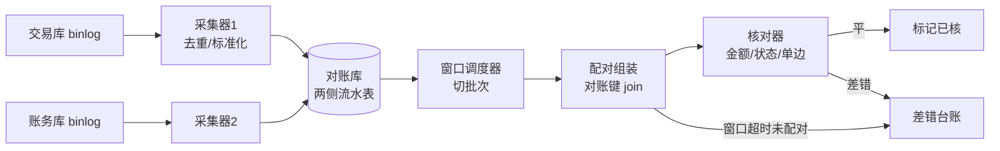
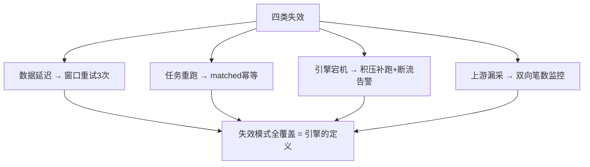
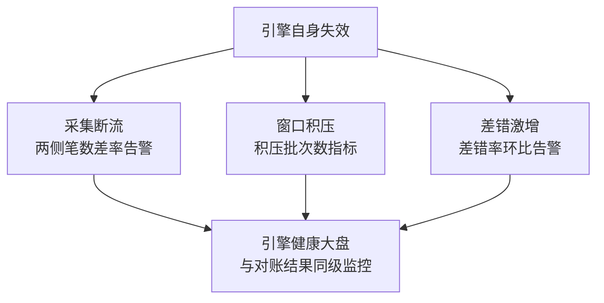

# 准实时对账引擎：分钟级发现资损的完整实现

> 「分钟级发现一笔错账」背后是一条完整的工程链：binlog 双通道采集 → 滚动窗口组装 → 逐键核对 → 差错路由。窗口设 5 分钟还是 15 分钟？核对任务怎么并行？乱序与延迟怎么容错？这篇按 ADR-0012 标准交付：每一个参数给三档推荐值，每一段关键代码可运行，每一步操作可执行。

## 一句话摘要

准实时对账引擎的架构是五段流水线：**双通道采集（两侧流水 binlog/MQ 入对账库）→ 窗口组装（按对账键把两侧记录配对）→ 逐键核对（金额/状态精确比对）→ 差错路由（不一致进台账）→ 汇总上报（及时率/差错率指标）**。设计的三个核心决策：滚动窗口 + 未达批次重试（容数据延迟）、幂等核对（容任务重跑）、旁路部署（容引擎故障）——三个决策分别对抗「数据延迟、任务故障、引擎故障」三类失效。

## 前置阅读

- 入门层篇 6《对账体系入门》：三层结构与匹配三要素
- 入门层篇 4《事中预警》：差错路由后的告警联动

## 🎯 本文核心

**核心机制一句话**：对账引擎 = 以对账键为单位的双流比对器——「窗口容延迟、幂等容重跑、旁路容故障」三个设计决策支撑分钟级发现。

**机制链**：采集（双通道去重落库）→ 窗口调度（按批次切窗口）→ 配对组装（对账键 join）→ 核对（三要素比对）→ 差错路由 → 指标上报。每个环节有自己的失效模式与容错设计——工程级对账引擎的本质是**对失效模式的全覆盖**。

## 上下游一分钟

引擎在防资损链路的位置：上游是交易与账务两侧的流水产生方（binlog 是数据源），下游是差错台账与告警系统。架构约束只有一条铁律：**引擎在旁路**——它可以慢、可以挂、可以重跑，唯独不允许成为交易的依赖（篇 1 的故障域隔离决策）。这个铁律决定了它的一切部署形态：独立实例、独立存储、独立限流。

## 一、总体架构与数据流



**对账库的表设计（核心两表）**：

```sql
-- 两侧流水统一标准化后落对账库（关键字段）
CREATE TABLE recon_flow (
  id BIGINT PRIMARY KEY AUTO_INCREMENT,
  biz_no VARCHAR(64) NOT NULL COMMENT '对账键=业务单号',
  side TINYINT NOT NULL COMMENT '1交易侧 2账务侧',
  amount_cent BIGINT NOT NULL,
  status VARCHAR(16) NOT NULL COMMENT '标准化状态: SUCCESS/FAIL',
  batch_no VARCHAR(32) NOT NULL COMMENT '对账批次',
  matched TINYINT DEFAULT 0,
  UNIQUE KEY uk_biz_side (biz_no, side),
  KEY idx_batch (batch_no, matched)
);

-- 核对结果表
CREATE TABLE recon_diff (
  id BIGINT PRIMARY KEY AUTO_INCREMENT,
  biz_no VARCHAR(64) NOT NULL,
  diff_type VARCHAR(16) NOT NULL COMMENT 'SINGLE_A/SINGLE_B/AMOUNT/STATUS',
  a_amount_cent BIGINT, b_amount_cent BIGINT,
  batch_no VARCHAR(32), created_at DATETIME,
  UNIQUE KEY uk_biz (biz_no)
);
```



## 二、核心参数表（ADR-0012：三档推荐值）

| 参数 | 默认值 | 10w 档推荐 | 千万档推荐 | 亿级档推荐 | 为什么 |
|---|---|---|---|---|---|
| `window_minutes` 窗口时长 | 10min | 60min | 10-15min | 5min | 窗口=时效与数据就绪率的平衡；就绪率见下 |
| `window_retry` 未达重试 | 3 次 | 3 次 | 3 次 | 3 次 + 断流告警 | 延迟型流水给 3 次滚动重试机会 |
| `retry_backoff` 重试退避 | 5min | 30min | 10min | 5min | 重试间隔按窗口时长比例缩放 |
| `batch_size` 单批核对行数 | 1000 | 1000 | 5000 | 10000 | 过小调度开销大，过大单事务过长 |
| `parallelism` 核对并行度 | 4 | 2 | 8-16 | 按 `单批耗时×批数/时效预算` 推导 | 并行度公式见第四节 |
| `amount_tolerance` 金额容差 | 0（零容差） | 0 | 0 | 0 | 容差掩盖 bug（入门篇 6 结论），尾差走归集科目 |
| `collect_channel` 采集通道 | binlog | binlog | binlog+MQ 双通道 | 双通道 + 完整性双向监控 | 双通道防单点漏采 |
| `late_grace` 迟到宽限 | 2×window | 2×window | 2×window | 2×window | 超宽限期的迟到流水走「补录差错」人工定性 |

## 三、核对器核心代码（可运行骨架）

```python
# 核对器主循环（简化可运行版，生产加监控埋点）
import itertools
from collections import defaultdict

def reconcile_batch(batch_no: str, flows: list[dict]) -> list[dict]:
    """对一批流水做两侧配对核对，返回差错清单"""
    groups = defaultdict(dict)
    for f in flows:
        side = "A" if f["side"] == 1 else "B"
        if f["biz_no"] in groups and side in groups[f["biz_no"]]:
            continue                      # 采集重复，幂等跳过
        groups[f["biz_no"]][side] = f

    diffs = []
    for biz_no, pair in groups.items():
        a, b = pair.get("A"), pair.get("B")
        if a and not b:
            diffs.append(diff(biz_no, "SINGLE_B", a))       # 交易有账务无
        elif b and not a:
            diffs.append(diff(biz_no, "SINGLE_A", b))       # 账务有交易无
        elif a["amount_cent"] != b["amount_cent"]:
            diffs.append(diff(biz_no, "AMOUNT", a, b))      # 金额不符
        elif not status_match(a["status"], b["status"]):
            diffs.append(diff(biz_no, "STATUS", a, b))      # 状态不符
    return diffs

def status_match(sa: str, sb: str) -> bool:
    ok = {"SUCCESS", "PAY_SUCCESS"}                 # 两侧状态字典标准化
    fail = {"FAIL", "PAY_FAIL"}
    if sa in ok and sb in ok: return True
    if sa in fail and sb in fail: return True
    return False                                    # 成功/失败交叉 = 状态差错
```

**为什么「直接插入 + 重复跳过」而不是先查后插**——与篇 3 幂等同构：对账库的唯一索引 `uk_biz_side` 保证采集幂等，核对任务重跑时 `matched=1` 的行跳过——**引擎的所有环节都假设自己会被重跑**，幂等是引擎内部的第一纪律。

## 四、容量与并行度：亿级档的数学

核对是 CPU + IO 双密集（join + 比对）。并行度推导（Little's Law 变体）：

```
所需并行度 P = 批内行数 × 单行核对耗时 × 批数 / 时效预算
例：亿级档——单批 1 万行 × 0.1ms/行 = 1s/批；5 分钟窗口产生 60 批；时效预算 2 分钟
P = 1s × 60 / 120s = 0.5 → 取 4（含 8 倍安全余量应对抖动）
```

**量级三档的引擎形态差异**（真实数据支撑，行业认知量级）：

| 档 | 日流水 | 引擎形态 | 典型配置 | 发现时效 |
|---|---|---|---|---|
| 10w | ~10 万行 | 单机定时任务 + MySQL | 单实例、窗口 60min | 1 小时内 |
| 千万 | ~1000 万行 | 分布式任务（分片按 biz_no hash） | 8-16 并行、窗口 10min | 10-15 分钟 |
| 亿级 | 1 亿+ 行 | 流式引擎（Flink 类）或分库并行核对 | 双通道、窗口 5min、并行度按公式推 | 5 分钟级 |

**成本对照**：千万档对账库日增约 2×10 万 MB 级存储（含索引，行业认知）——对账库保留策略（建议 7-14 天滚动）是存储成本的第一杠杆；亿级档流式方案省去对账库全量落地，但调试与补跑成本上升——**批处理好排查、流式低延迟**，两形态的取舍按时效与运维能力定。

## 五、失效模式全覆盖：三个容错的落地

| 失效 | 场景 | 容错设计 | 验证步骤 |
|---|---|---|---|
| 数据延迟 | 交易侧流水晚到 8 分钟 | 窗口重试 3 次 + 迟到宽限期 | 注入延迟流水，验证 3 次重试后配对成功 |
| 任务重跑 | 调度器重复触发同批次 | 批次幂等（matched 标记 + uk 索引） | 同批次连跑 2 次，差错不重复生成 |
| 引擎故障 | 核对实例宕机 30 分钟 | 窗口积压自动补跑 + 断流告警 | kill 实例后恢复，验证积压批次顺序补齐 |
| 上游漏采 | 新场景流水未接入 | 两侧笔数完整性监控（差率 > 0.1% 告警） | 停一侧采集器，验证完整性告警触发 |

## 六、业内惯例与生产实践

- **惯例一**：对账与交易的发布解耦——对账引擎发版不伴随交易发版，避免「同时变更无法归因」（旁路铁律的运维面）。
- **惯例二**：差错必须带「现场快照」（两侧原始流水 JSON 入差错记录）——追回定性时不用再回查源库。
- **惯例三**：引擎自身指标进大盘（批次及时率/就绪率/差错率/积压批次数）——对账引擎的健康与对账结果同等重要。



## 💡 实战提示

- 💡 对账库的 BINLOG 行格式必须 ROW 模式——STATEMENT/MIXED 下 binlog 采集拿不到完整行数据，这是采集器「看起来在跑但采不到数」的经典原因。
- 💡 差错记录里把两侧原始流水 JSON 全量落库（现场快照）——追回定性时免回查源库，一个字段省下每次差错 10 分钟的排查。

## 源码关键路径（采集层的机制落点）

- **binlog 采集**：Canal/Flink CDC 的伪装 slave 拉取协议（`dump` 命令 + 位点 ack）——「位点」是采集幂等的锚：重启从已 ack 位点续采，重复段靠 `uk_biz_side` 去重（与引擎幂等同构）；
- **MQ 通道**：交易侧发账务消息的 `orderKey = biz_no`（分区有序保证同一单号不乱序）——为什么按单号分区：乱序的两侧流水会破坏窗口配对的确定性；
- **窗口调度**：分布式调度按 `batch_no = 窗口起止时间 + 场景码` 生成批次——批次号即幂等键（同批次重跑不重复核对）。

## 与文件对账的区别（跨形态辨析）

文件对账（T+1 交换对账文件）与流水对账的差异不在「快慢」而在**能力域**：文件对账适合与**外部机构**核对（银行/通道，协议即文件），流水对账适合**内部系统间**的准实时核对——亿级档内部外部并存（外部 T+1 文件 + 内部分钟流水），两层核对共用差错台账。为什么内部不也用文件？——发现时效（当日 vs 分钟）与排查效率（流水带现场上下文）都是资损敞口的函数，敞口决定形态。

## 常见误区

- ❌ 「窗口内没配对就是差错」——未达批次先重试，宽限期内到达就配对；把延迟当差错会产生海量误报；
- ❌ 「对账库随便查」——对账库的查询压力要独立治理（它与引擎抢 IO）；BI/人工查证走从库或导出，不碰主核对链路；
- ❌ 「状态字典各写各的」——两侧状态标准化是配对的前置工程，状态映射表要版本化管理（新增状态未映射 = 全部进差错）；
- ❌ 「引擎越实时越好」——窗口缩到数据就绪率以下，误报淹没真差错；**就绪率曲线决定窗口下限**，不是 KPI 决定。

## 接入步骤（新场景接入对账引擎）

1. **前置**：场景已入矩阵；两侧流水有唯一单号、金额单位统一为分；
2. **接入采集**：登记 binlog 表与 MQ topic 到采集器配置；两侧各验证「写入→落对账库」延迟 < 1 分钟；
3. **注册核对规则**：对账键字段、比对字段、状态映射表（版本化）进核对配置；
4. **影子验证**：对账结果只记差错不告警，跑 3-7 天，人工核对差错准确率 ≥ 99% 后启用告警；
5. **验证点**：注入三类模拟偏差（停采 5 分钟 / 改金额 / 改状态），全链路「发生 → 发现 → 台账」< 窗口 × 2；
6. **回退**：场景级核对开关化；引擎级回退 = 停调度（旁路保证交易无感）。

## 演进视角

对账引擎的演变：SQL 脚本比对（10w）→ 调度批处理（千万）→ 流式计算（亿级）——形态在变，机制链不变（采集/组装/核对/路由/上报）。未来五年的演变方向：核对逻辑配置化下沉（规则中心化）与「对账即服务」（多业务线共享引擎能力）——引擎的平台化是量级跨过亿级后的必然一步。

## 你们可能会问

**Q1：为什么用对账库不用双流实时 join（Flink 双流）？**
批处理形态可补跑、可排查、可人工介入（差错处理需要「再看一眼」的能力）；流式方案延迟更低但状态管理与回溯成本高。取舍：亿级档用流式是因为批处理在 5 分钟窗口内跑不完——**形态是时效与可运维性的交点**，不是技术偏好。

**Q2（追问）：两侧时钟不一致（时钟偏移）会导致误报吗？**
会——所以对账键匹配不依赖时间（按单号配对），时间只用于窗口切分；跨系统时钟用 NTP 对齐 + 宽限期吸收残余偏移，极端偏移场景在标准化层做时间归一。为什么这么设计？——把时钟问题隔离在窗口层，不让它污染核对语义。

**Q3（再追问）：差错误报率怎么压？**
三个阀门：窗口重试压「延迟型误报」、状态标准化压「字典型误报」、影子期人工核对压「规则型误报」——误报率 ≥1% 时先查这三个阀门，而不是调高告警阈值（调阈值是把婴儿和洗澡水一起倒掉）。

## 开放问题

- 隐私合规与对账的张力：核对需要明细金额与单号，数据合规要求最小化——「合规的对账数据视图」（脱敏+可逆授权）的行业标准化程度还在早期，值得跟踪。

## 决策

**决策**：何时从脚本升级引擎——日流水过百万或对账场景超过 3 个（脚本维护成本拐点）；何时上流式——5 分钟窗口内批处理跑不完时。怎么选对账键：业务单号优先（跨系统天然一致），复合键（单号+子操作）用于一笔交易多次动账的场景——键的稳定性决定配对质量。

## 自测三问

1. 引擎的三个核心容错分别对抗什么失效？（窗口重试=数据延迟 / 幂等=任务重跑 / 旁路=引擎故障）
2. 并行度怎么推导？（行数 × 单行耗时 × 批数 / 时效预算，含安全余量）
3. 差错误报的三个阀门是什么？（窗口重试 / 状态标准化 / 影子期人工核对）

## 5W 速记卡

| 问题 | 答案 |
|---|---|
| What | 采集→窗口→配对→核对→差错路由的五段引擎 |
| Why | 分钟级发现，压缩「敞口 × 延迟」乘积 |
| 关键参数 | 窗口 5-60min 三档 / 并行度按时效推 / 零容差 |
| 部署 | 旁路铁律：独立实例独立存储独立限流 |
| 边界 | 防同源错误（靠防线一）；就绪率决定窗口下限 |

## 🎯 核心带走

**30 秒复述**：对账引擎五段流水线（采集/窗口/配对/核对/路由）+ 三容错（重试容延迟、幂等容重跑、旁路容故障）+ 三档形态（脚本/批处理/流式）；参数从窗口时长到并行度全部有推导公式。**失效点**——把延迟当差错、依赖引擎在主链路、状态字典无版本化、对账库与交易抢资源。金句带走：

> **对账引擎的一切设计都假设自己会挂会重跑会延迟——幂等与容错不是特性，是引擎的定义。**

> **窗口下限不是 KPI 定的，是数据就绪率定的——在对齐的流水上核对，才有资格谈分钟级。**

## 📌 数据与事实声明

- 引擎架构与参数为业界对账系统通行设计归纳（公开技术分享）；存储/耗时/并行度例值为行业认知量级（推导公式可按实测替换）；代码为教学简化骨架，生产需补监控与权限。

## 📚 参考资料

- Canal / Flink CDC 官方文档（采集通道实现）
- 入门层篇 4/5/6（告警联动与差错闭环）
- 《亿级流量系统架构》类公开资料的对账章节（行业认知来源）
