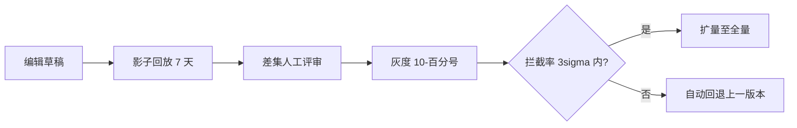
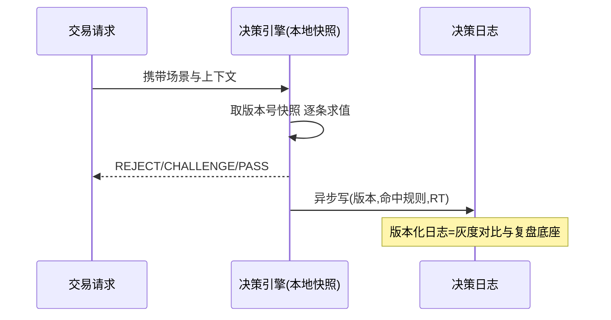
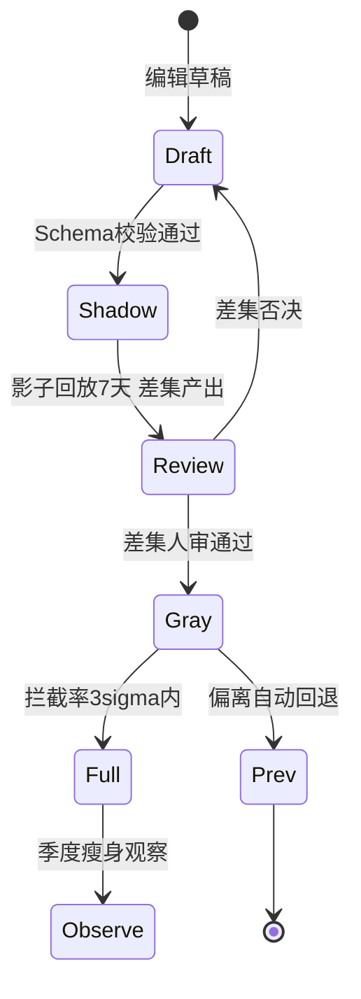

# 资损规则中心：决策引擎与灰度影子机制

> 规则中心是事前拦截的「大脑」：百千条规则在 50ms 内完成决策，规则变更要灰度、要影子对比、要秒级回退——它同时是一个决策引擎、一个发布系统、一个风控级的变更管理平台。这一篇按 ADR-0012 交付引擎架构、参数表、决策代码与变更流程。

## 一句话摘要

规则中心 = **规则模型（条件+动作+优先级）+ 决策引擎（本地缓存规则集 + 逐条求值）+ 变更机制（草稿 → 影子对比 → 灰度 → 全量 → 可回退）**。架构的第一决策是「决策在本地、配置在中心」——规则随代码发布（本地缓存秒级 RT），配置随推送变更（分钟级生效），两者分离才同时满足「快」与「灵活」。

## 前置阅读

- 入门层篇 3《事前拦截》：幂等与规则的定位

## 🎯 本文核心

**核心机制一句话**：规则中心 = 把「什么请求该拦」从代码里抽出来变成可配置、可灰度、可回滚的数据——引擎只负责求值，规则负责表达业务。

**机制链**：请求 → 取本地规则集快照（版本号）→ 按优先级逐条求值 → 命中即执行动作（拒绝/验证/放行+记录）→ 决策日志上报。变更链：规则编辑 → 影子环境对历史流量回放对比 → 灰度比例发布 → 全量 → （异常）秒级回退到上一版本。上下游：上游是资损矩阵（规则从红格来），下游是决策日志（规则效果的证据链）。

## 上下游一分钟

规则中心在交易链路的位置：位于幂等校验之后、账务执行之前——它消耗的每一毫秒都直接加在交易 RT 上，这决定了「本地决策」的架构必然性。向上它被资损矩阵驱动（每个红格产生一批规则需求），向下它依赖配置推送通道与决策日志存储。模块边界：规则中心只判「请求合法性」，不算账、不改状态——它是过滤器不是执行器。

## 一、规则模型：三种原语覆盖全部拦截需求

```json
{
  "ruleId": "R-101",
  "scene": "LOAN",
  "priority": 100,
  "condition": {
    "all": [
      {"field": "amount_cent", "op": "GT", "value": 50000000},
      {"field": "user_level", "op": "IN", "value": ["C", "D"]}
    ]
  },
  "action": "REJECT",
  "message": "单笔放款超限",
  "shadow": false,
  "version": 7
}
```

三种动作原语：**REJECT**（拒绝，事前拦截的主形态）、**CHALLENGE**（二次验证：短信/人脸，支付场景高频）、**PASS_LOG**（放行但记决策日志——规则观测期用 shadow 形态跑）。条件原语：字段 + 操作符 + 值，组合用 all/any 树——**为什么不上脚本语言（Aviator/QLExpress 类）**：表达式引擎表达力更强但带来注入与性能风险，结构化 JSON 规则可校验、可静态分析、可做冲突检测——交易拦截场景的表达力需求用嵌套条件已够（复杂决策属于风控引擎的领地，模块边界）。

## 二、决策引擎核心代码

```python
# 决策引擎核心（本地求值，简化可运行版）
import time

class DecisionEngine:
    def __init__(self):
        self._rules = []           # 已按 priority 降序的规则集快照
        self._version = 0

    def load_rules(self, rules, version):
        self._rules = sorted(rules, key=lambda r: -r["priority"])
        self._version = version    # 原子换引用——决策线程无锁读到完整新快照

    def decide(self, scene: str, ctx: dict) -> tuple:
        t0 = time.monotonic()
        hit = None
        for r in self._rules:
            if r["scene"] != scene:
                continue
            if self._match(r["condition"], ctx):
                hit = r
                if r["action"] != "PASS_LOG":
                    break          # 非观测规则：首个命中即决策（优先级序）
        rt_ms = (time.monotonic() - t0) * 1000
        return (hit["action"] if hit else "PASS", hit, rt_ms)

    def _match(self, cond, ctx) -> bool:
        if "all" in cond:
            return all(self._match(c, ctx) for c in cond["all"])
        if "any" in cond:
            return any(self._match(c, ctx) for c in cond["any"])
        v = ctx.get(cond["field"])
        op = cond["op"]
        return {"GT": v > cond["value"], "LT": v < cond["value"],
                "EQ": v == cond["value"], "IN": v in cond["value"]}[op]
```

**机制要点**：① 规则集是**不可变快照**（换引用而非原地改）——决策线程无锁、无半更新状态；② 求值按优先级短路——高优先级规则（拦截类）先跑，命中即停，RT 与命中位置正相关；③ 每次决策记录 `(版本号, 命中规则, RT)`——决策日志是灰度对比与误杀复盘的数据底座。

## 三、核心参数表（ADR-0012 三档推荐）

| 参数 | 默认值 | 10w 档 | 千万档 | 亿级档 | 为什么 |
|---|---|---|---|---|---|
| 规则集本地刷新 | 60s | 60s | 30s | 10s + 推送主动失效 | 刷新周期=变更生效上限；亿级档推送主动失效（秒级） |
| 单场景规则数上限 | 200 | 50 | 200 | 500（需冲突检测） | 求值 RT 与规则数线性相关 |
| 决策 RT 预算 | 50ms | 100ms | 50ms | 20ms | 亿级档规则集常驻本地缓存 + 预编译条件 |
| 灰度起始比例 | 10% | 全量（规则少） | 10% | 5% + 分城市/渠道 | 爆炸半径 = 灰度比例 × 流量 |
| 影子回放天数 | 7 天 | — | 7 天 | 14 天 | 覆盖周内波峰波谷，节假日类规则要跨月 |
| 决策日志采样 | 全量 | 全量 | 全量 | 命中全量 + 未命中 1% 采样 | 命中记录是追责证据；未命中采样供规则优化 |
| 冲突检测 | 编译期 | 编译期 | 编译期 + 影子 | 编译期 + 影子 + 线上命中突降熔断 | 三层递进防规则互搏 |

## 四、变更流程：影子 → 灰度 → 回退（步骤级）

1. **前置**：变更人有规则中心写权限；目标场景的资损矩阵行存在（规则必须有矩阵格子归属）；
2. **编辑草稿**：新建版本号（不覆盖线上版本），规则 DSL 走 JSON Schema 校验（结构错误进不了测试）；
3. **影子回放**：新规则集对**近 7 天真实流量**回放，输出对比报告（新旧命中差集逐条列出，附请求上下文）；
4. **人工评审**：差集逐条过——每一条「新拦截」要回答「该不该拦」，每一条「漏放」要回答「为什么以前拦现在不拦」；
5. **灰度发布**：按 `hash(用户/渠道) % 100 < 灰度比例` 命中新版本，起始 10%，观察命中突降熔断指标（拦截率较基线偏离 > 3σ 自动回退）；
6. **验证点**：灰度期拦截率与影子回放预测偏差 < 20%（偏离 = 回放样本失真，要查）；决策 RT P99 仍在预算内；
7. **回退**：版本切换是原子操作（换快照引用），回退 = 推送上一版本号，**秒级生效**——这是「规则即数据」架构的红利。



## 五、事故推演：一次全量直发的事故

行业化用案例：运营为拦截营销补贴套利，写了一条「同设备 24h 领取 > 3 次拒绝」的规则，跳过影子直接全量——**真机换机用户**（换手机登录）设备指纹变了但用户 ID 没变，规则没排除「已实名老用户」，上线 20 分钟拦截 12% 的正常续借请求，客诉涌入。复盘 Action：① 规则上线强制走影子+灰度（流程卡点）；② 规则模板库沉淀（同类场景从模板改，减少从零写规则的结构错误）；③ 拦截率熔断指标上线（偏离 3σ 自动回退）。**每一条都指回变更机制的缺口**——规则中心的核心资产不是引擎，是变更纪律。

## 与风控决策引擎的区别（跨域辨析）

共用设施（规则求值/灰度/决策日志），分治三处：**规则来源**（资损规则来自矩阵红格与事故复盘；风控规则来自对抗情报与模型）、**误杀代价**（资损误杀损失交易，风控误杀可能放过坏人——代价函数不同）、**变更节奏**（资损规则月级演进，风控规则天级对抗）。为什么分治而不是一套规则？——混治会让「对抗性调整」污染「正确性规则」的稳定性评审。

## 源码关键路径

- **条件编译**：规则加载时把 JSON 条树编译为闭包链（`field → getter + comparator`）——亿级档 RT 预算 20ms 靠预编译（解释执行 JSON 树比闭包链慢 3-5 倍，行业认知）；
- **快照切换**：配置中心推送（如 Nacos listener）→ 引擎 `load_rules` 原子换引用——推送通道的「配置 MD5 校验」防半包；
- **决策日志**：异步批量落库（Disruptor/内存队列刷盘），同步写日志会吃掉 RT 预算。





## 💡 实战提示

- 💡 规则编辑器直接内置「测试请求」按钮：填一条样例上下文即时看命中结果——写规则的人 90% 的结构错误在第一次自测就能发现。
- 💡 决策日志的「命中规则」字段存规则 ID 数组而非名称——规则改名不改 ID，历史日志永远可解释。

## 常见误区

- ❌ 「规则引擎要用最强大的表达式语言」——拦截场景的结构化条件够用；表达力换来的注入面与性能税不值；
- ❌ 「灰度按机器比例」——按机器灰度时同一用户忽新忽旧（决策不一致体验差），必须按用户/渠道维度灰度；
- ❌ 「影子对比只看命中数」——命中数相同但命中集合不同（换了一拦截对象）更危险；对比必须到**请求级差集**；
- ❌ 「规则可以随时下线」——下线 = 放开一类拦截，等同一次全量变更，同样走灰度；「删除规则」与「新增规则」是同等级变更。

## 代价与边界

规则中心的成本：平台建设（编辑/评审/推送/对比四模块）+ 规则运营人力（评审与瘦身）+ 决策日志存储（全量命中日志是存储大户，按命中量估算）。边界：规则中心只能表达「可结构化的判定」——模型类判定（评分卡/ML 分数）走风控引擎，决策结果可以作为一个「字段」进入资损规则（组合而非混合）。

## 业内惯例与生产实践

- **惯例一**：规则模板库（限额/频次/名单/状态机四类模板）——新规则从模板派生，结构错误在模板层消灭；
- **惯例二**：规则的「双签制」——创建人与评审人不得同一人，资金类规则双人评审（业内资金平台通行）；
- **惯例三**：规则瘦身季度制——90 天零命中的规则自动转「观察态」，两个季度零命中建议下线（下线走变更流程）。

## 你们可能会问

**Q1：决策日志全量会不会撑爆存储？**
按命中量估算：千万档日命中约万级（拦截率万分之一），单条 1KB，年存储 GB 级——**命中的昂贵的是查询场景不是存储**；未命中采样率控制才是存储阀门。

**Q2（追问）：为什么规则冲突检测编译期做不全，还要影子层？**
静态检测只能发现「条件可同时命中且动作矛盾」的结构冲突；语义冲突（两条规则各自正确、叠加后误杀）只有真实流量回放能暴露——静态保结构、动态保行为，与验证领域「类型检查 vs 集成测试」的关系同构。

**Q3（再追问）：回退上一版本时，上一版本期间产生的决策怎么办？**
决策日志带版本号——回退后可按版本重放定性（灰度期间被新版本拦截的请求是否需要补偿），版本化决策日志是「变更可追溯」的落点。

## 开放问题

- 规则与矩阵的「自动对账」（每个矩阵红格是否有规则覆盖、每条规则是否归属格子）目前靠人工维护关联——两者联动自动化（矩阵平台化后）是工程开放题。

## 决策

**决策**：何时从代码 if 升级规则中心——规则过 30 条或变更频率月 2 次以上；何时上影子回放——规则量破百或涉及资金计算类。怎么选动作形态：能用 CHALLENGE（二次验证）就不用 REJECT——拦截的可逆性越高，误杀的代价越小。

## 自测三问

1. 「决策在本地、配置在中心」解决了什么矛盾？（RT 快 vs 变更灵活——发布分离两者兼得）
2. 影子回放的输出是什么形态？（请求级差集——只看命中数会漏「换对象」型变更）
3. 为什么灰度按用户不按机器？（同用户决策一致性；机器灰度造成体验摇摆）

## 5W 速记卡

| 问题 | 答案 |
|---|---|
| What | 规则模型 + 本地决策引擎 + 影子灰度变更链 |
| Why | 拦截规则要灵活变更且变更不能出事故 |
| 关键参数 | 刷新 10-60s / RT 20-100ms / 灰度 5-10% 起 |
| 变更纪律 | 影子 7 天 → 差集人审 → 灰度 → 3σ 回退 |
| 边界 | 结构化判定；模型判定归风控引擎 |

## 🎯 核心带走

**30 秒复述**：规则中心 = 不可变快照 + 本地求值 + 优先级短路；变更链「草稿 → 影子 7 天 → 差集人审 → 灰度 10% → 3σ 熔断回退」；决策日志带版本号是追溯与复盘的底座。**失效点**——全量直发、机器维度灰度、命中数对比、规则随意下线。金句带走：

> **规则中心的引擎一周就能写完，变更纪律要练一年——资损规则事故 nine 成死在变更，不是死在求值。**

> **规则的每一条都是一次「预先生效的拦截决定」——所以它的发布纪律，必须比对代码更严。**

## 📌 数据与事实声明

- 引擎架构（快照/优先级/影子灰度）为业界决策引擎通行设计归纳；RT/规则数/灰度参数为行业认知量级；事故叙事为行业化用。

## 📚 参考资料

- Aviator/QLExpress 文档（表达式引擎取舍的对照面）
- 入门层篇 2/3（矩阵与拦截定位）
- 特性层篇 4《止损与应急冻结》（REJECT 之外的执行面手段）
