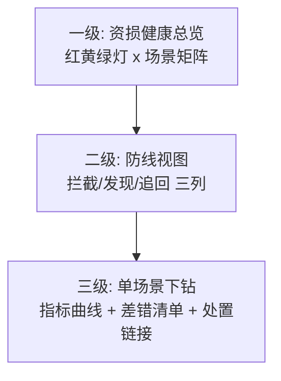

# 资损监控大盘与告警分级：让资损状态一眼可见

> 对账引擎产出数据，规则中心拦截请求——但「现在资损状态健康吗」这个问题需要一面墙来回答。资损大盘不是把指标画上去就完了：**指标选错，大盘就是装饰品**；告警分错级，P0 淹没在噪音里。这一篇讲指标体系的三层设计、告警分级的量化标准、大盘的信息架构。

## 一句话摘要

资损可观测 = **三层指标（结果层：偏差金额与差错量 / 过程层：对账及时率与规则命中率 / 基础层：引擎与采集健康）+ 四级告警（P0 自动止损联动 → P3 邮件）+ 一块按「场景 → 防线 → 指标」下钻的大盘**。设计的第一原则：结果层回答「有没有在丢钱」，过程层回答「防线活着吗」，基础层回答「防线二自身健康吗」——三层缺一层，要么看不见丢钱、要么看不见防线失效。

## 前置阅读

- 特性层篇 1《准实时对账引擎》（指标的数据来源）
- 入门层篇 4《事中预警》（告警分级的业务定义）

## 🎯 本文核心

**核心机制一句话**：资损大盘 = 「丢钱了吗 → 防线活着吗 → 为什么不健康」的三层下钻结构，每层指标绑定明确的告警级别与处置预案。

**机制链**：对账引擎/规则中心/差错台账产出原始事件 → 指标计算层聚合（分钟级）→ 大盘分层展示 → 阈值与基线触发分级告警 → 处置链接直达预案。上下游：上游是三个防线组件的埋点，下游是值班响应与复盘——大盘的信息架构要按「处置者的思考路径」组织，不是按系统拓扑组织。

## 上下游一分钟

资损可观测在防资损体系的位置：它是防线二「发现」能力的仪表盘化 + 所有防线健康度的集中视图。向上服务两类读者（值班工程师处置告警 / 管理层看资损趋势），向下采集三个组件的指标流。模块边界：大盘不产生数据、不做处置（处置走预案系统）——它是「状态呈现 + 判断辅助」，把「发现」的最后一步（人看一眼）的效率最大化。

## 一、指标体系：三层三十个指标（核心二十个）

**结果层（有没有丢钱——管理层与 P0/P1 告警的来源）**：

| 指标 | 定义 | 三档基线（行业认知量级） |
|---|---|---|
| 偏差笔数/金额（按场景） | 对账窗口内不一致的笔数与金额 | 10w 档：日个位笔 / 千万档：万分率 < 0.01% / 亿级档：< 0.005% |
| 单边率 | 单边笔数 / 总笔数 | > 0.01% 即 P0 |
| 差错积压量 | 未关单差错数 | > 场景日均差错 × 3 告警 |
| 累计未追回金额 | 已定性未追回的差错金额 | 按敞口设上限（如 ≤ 月敞口 5%） |
| 资损事件数 | P0 级偏差事件 | 目标 0；每起必复盘 |

**过程层（防线活着吗——防线的产出效率）**：

| 指标 | 定义 | 健康线 |
|---|---|---|
| 对账及时率 | 窗口批次在时效预算内完成的比例 | ≥ 99%（低于说明引擎容量或上游延迟出问题） |
| 数据就绪率 | 窗口切分时两侧流水到齐比例 | ≥ 99.5%（决定窗口下限的元指标） |
| 规则拦截率（按规则） | 单规则命中 / 总请求 | 突变 3σ 告警（规则失效或误杀的信号） |
| 规则误杀率 | 申诉成功的拦截 / 总拦截 | < 0.01% |
| 差错闭环时长 | 差错从发现到关单的中位时长 | P0 类 < 24h，P2 类 < 7 天 |
| 追回率 / 二次差错率 | 追回成功的差错占比 / 追回引发的新差错 | 追回率分场景；二次差错率目标 0 |

**基础层（防线二自己健康吗）**：

| 指标 | 定义 | 健康线 |
|---|---|---|
| 采集延迟 | 交易发生 → 落对账库 | < 1 分钟 |
| 两侧笔数差率 | 采集完整性双向比对 | < 0.1% |
| 窗口积压批次数 | 未按时核对的批次 | 0（> 0 即容量或故障信号） |
| 引擎决策/核对 RT | P99 | < 窗口时效预算的 50% |

**下钻逻辑就是排障路径**：结果层异常 → 查过程层哪道防线漏了 → 再下钻基础层哪个组件病了——大盘的信息架构按这条路径组织（页面分层即排障分层）。

## 二、告警分级：量化标准与自动联动

| 级别 | 量化触发（示例） | 通知 | 自动联动 |
|---|---|---|---|
| **P0** | 单边率 > 0.01% 持续 2 窗口 / 累计偏差 > 敞口阈值 / 对账全链断流 | 电话 + IM 群 | **自动触发止损预案**（篇 4 的冻结动作） |
| **P1** | 及时率 < 99% / 单规则拦截率 3σ 突变 / 单笔大额偏差 | IM + 值班 5 分钟 SLA | 无（人工判断） |
| **P2** | 差错积压超基线 3 倍 / P2 类差错时效超期 | IM 群 | 无 |
| **P3** | 引擎 RT 上升 / 存储水位 70% | 邮件日报 | 无 |

**告警的三个反噪音机制**：① **静默窗口**（同一偏差模式的重复告警收敛为一条 + 计数）；② **影子期校准**（新指标先只记录不告警 1-2 周，用真实分布定阈值——入门篇 4 的结论在监控层的落地）；③ **升级机制**（P1 超 SLA 未响应自动升 P0）——三个机制共同保证「P0 响铃必是真事」。

## 三、大盘信息架构（页面级设计）

- **一级页**（管理层 + 值班首屏）：场景矩阵式红黄绿灯（复用资损矩阵的行结构），绿=指标在基线内、黄=接近阈值、红=已触发告警——**颜色与资损矩阵的行列结构一致**，两个视图共享同一套场景定义；
- **二级页**（值班定位）：三列防线布局，每列是过程层指标 + 最近告警；
- **三级页**（排障）：单场景全部指标曲线 + 差错清单（直链差错台账）+ 预案按钮（授权内可一键冻结）。

💡 实战提示：三级页的「预案按钮」只放已演练过的预案——大盘上的按钮是预案的入口不是预案本身，没演练过的动作不许上按钮。

## 四、接入步骤（新场景接入监控大盘）

1. **前置**：场景对账已接入引擎（篇 1）——没有数据源的指标是装饰品；
2. **定义指标**：按三层清单选配（结果层必选，过程层按防线覆盖选，基础层通用）；
3. **影子校准**：指标先「只记录不告警」运行 1-2 周，按真实分布定 P1/P2 阈值（P0 阈值按敞口直接定）；
4. **告警路由**：分级绑定通知渠道与响应 SLA，处置链接配置（差错清单/预案按钮）；
5. **验证点**：注入模拟偏差，验证「指标出现 → 分级正确 → 通知到达 → 处置链接可用」全链路；静默窗口与升级机制各验证一次；
6. **回退**：指标与告警可按场景禁用（大盘回退不影响引擎运行）。

## 五、事故推演：被噪音淹没的 P0

行业化用案例：某平台对账告警不分级全进一个群，日均 300 条偏差提醒（多数为延迟型未达重试前的「预差错」）；某天真实单边差错混在 300 条里无人识别，2 小时后被客服工单「倒逼」发现——资损发现时效被告警噪音拖回人肉时代。复盘 Action：① 告警分级改造（预差错与确认差错分流）；② 静默窗口与升级机制上线；③ 「P0 响铃必真」进值班 KPI——**告警系统的第一 KPI 不是覆盖率而是信噪比**，狼来了的告警系统等于没有告警。

## 与稳定性监控的区别（跨域辨析）

共用采集与告警设施，分治三处：**指标对象**（稳定性看成功率/RT/容量，资损看偏差/差错/追回）、**P0 判定**（稳定性 P0 = 服务不可用，资损 P0 = 资金偏差——两者可能独立发生）、**处置路径**（稳定性扩容回滚，资损冻结止损）。为什么不合并一套告警？——值班技能与响应预案完全不同，混群会互相稀释响应质量；共用通道、分群路由是业内通行形态。

## 源码关键路径

- **指标计算**：对账引擎批次完成时输出结构化结果事件 → 指标层按场景聚合（Prometheus counter/histogram 命名：`recon_diff_total{scene=,type=}`）；
- **阈值评估**：告警规则引擎对时序做「持续 N 窗口超阈值」判定（防毛刺误报），3σ 突变类用环比窗口计算；
- **大盘数据**：一级页读聚合指标（分钟粒度），三级页差错清单直差错台账 API——大盘只读，所有写操作走预案系统。

## 常见误区

- ❌ 「大盘 = 图表集」——无下钻逻辑的图表墙在事故时提供不了排障路径；信息架构按处置思考路径组织才是大盘；
- ❌ 「P0 阈值定得越敏感越好」——敏感的 P0 = 频繁误触发自动止损（冻结副作用），P0 的阈值标准是「响铃必真」，不是「绝不漏报」——漏报由 P1 层 + 影子校准兜住；
- ❌ 「只监控资金类场景」——计算类资损（计息/分账）偏差笔均小但面大，且发现窗口天然更晚（日批），监控缺位时这类资损的暴露周期以月计；
- ❌ 「告警响应 SLA 不考核」——SLA 不进值班考核就只是文档；升级机制（超时自动升级）+ 响应记录回溯是 SLA 落地的两件套。

## 代价与边界

成本：指标存储（分钟级聚合，亿级档场景数百个 × 指标数十个，滚动保留 90 天）、大盘开发、阈值校准的影子期人力。边界：大盘呈现「已接入监控的偏差」——未接入场景、同源错误、基准本身错误都不可见；**大盘的全绿不等于无资损**，它等于「可见范围内无资损」——这句话要写在大盘页脚（对管理层的预期管理）。

大盘形态的演变与对账引擎同步（入门篇 6 的三档演进）：每一次时效升级都倒逼告警从「人找问题」进化为「问题找人」——**监控的演进史就是发现延迟的压缩史**，这一脉络在专题层亿级实战篇继续展开。

## 业内惯例与生产实践

- **惯例一**：资损大盘与稳定性大盘分屏不分平台（同一监控系统，独立 Dashboard 与告警路由）；
- **惯例二**：每次 P0 资损复盘必产出「一个新指标或一个阈值修订」——大盘是复盘结论的沉淀地（复盘产出的指标进大盘才算闭环）；
- **惯例三**：季度大盘瘦身——零告警且零查阅的指标下线（指标也有维护成本，装饰性指标污染注意力）。

## 你们可能会问

**Q1：P0 的「持续 2 窗口」为什么不是单窗口即触发？**
单窗口超阈值可能是批量延迟的重试风暴（数据晚到造成的瞬时单边假象）；持续 2 窗口过滤毛刺——代价是发现延迟翻倍（窗口 × 2），这个延迟与误触发止损的成本相权后的取舍，参数按场景敞口校准。

**Q2（追问）：结果层指标突增但过程层全绿，怎么解释？**
说明「防线按预期运行但拦不住这类错」——要么是新错误模式（规则/对账规则没覆盖），要么是基准错误（应收算错）——这指向防线一规则缺口或账务规则 review，而不是引擎故障；**三层下钻的判读本身就是排障知识**，要沉淀进值班手册。

**Q3（再追问）：管理层要「资损总额大屏」合理吗？**
合理但要配「口径注释」：总额是「已发现偏差」不是「实际损失」（还有未发现敞口与已追回部分）——不给口径的总额大屏会制造错误的安全感或错误的恐慌。

## 开放问题

- 偏差基线的动态化（大促日基线天然抬升，静态阈值节假日误报潮）——按日历/流量的动态基线（类似稳定性领域的动态阈值）在资损场景的落地案例还少，值得关注。

## 决策

**决策**：何时建资损大盘——对账引擎接入场景 ≥ 3 个或产生第一起 P0 后（有数据可看、有教训可沉淀）；何时上 P0 自动联动——该场景止损预案演练通过后。怎么选一级页结构：场景数 < 20 用矩阵红绿灯，> 20 加场景分组（按业务线折叠）。

## 自测三问

1. 三层指标各回答什么问题？（丢钱了吗 / 防线活着吗 / 组件健康吗）
2. P0 的反噪音三机制？（静默窗口 / 影子期校准 / SLA 升级机制）
3. 大盘全绿意味着什么？（可见范围内无资损——不等于无资损，预期管理写进页脚）

## 5W 速记卡

| 问题 | 答案 |
|---|---|
| What | 三层指标 + 四级告警 + 三级下钻大盘 |
| Why | 发现的最后一步（人看）的效率最大化 |
| 分级 | P0 电话+自动止损 / P1 五分钟 / P2 当日 / P3 日报 |
| 下钻 | 结果异常 → 过程定位 → 基础根因 |
| 边界 | 只见已接入偏差；告警第一 KPI 是信噪比 |

## 🎯 核心带走

**30 秒复述**：三层指标（结果/过程/基础）按排障路径下钻；四级告警量化触发、P0 联动自动止损、反噪音三机制保「响铃必真」；大盘按处置者思路组织、预案按钮只放演练过的动作。**失效点**——无下钻的图表墙、敏感过头的 P0、缺计算类监控、SLA 不考核。金句带走：

> **告警系统的第一 KPI 是信噪比——狼来了的告警，等于给资损开了VIP通道。**

> **大盘全绿只证明「可见范围内无资损」——这句话写不进代码，但必须写进页脚和人心。**

## 📌 数据与事实声明

- 三层指标体系与告警分级为业界监控实践在资损域的归纳；基线数值（0.01%/99%/0.1%）为行业认知量级，随场景校准；事故叙事为行业化用。

## 📚 参考资料

- Prometheus 告警规则与 Alertmanager 路由（技术实现层）
- 入门层篇 4《事中预警》（分级的业务定义）、特性层篇 1（数据源）
- 专题层《可观测性与服务大盘深度》（兄弟专题，稳定性侧对照）
